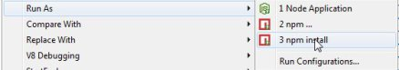
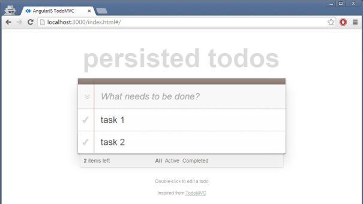

TODO list exemple – full Javascript avec AngularJS NodeJS Express
======
 

 
Ce tutoriel est le dev d’une simple TODO list de type client-serveur (front-end + back-end). Le but est d’utiliser une stack technique complète en JavaScript pour comparer avec d’autres technologies.
 
# Environnement
 
[eclipse](https://www.eclipse.org/downloads/)
[nodeclipse](http://www.nodeclipse.org/)
En DEV : un IDE eclipse avec le plugin nodeclipse d’installé via le menu marketplace d’eclipse. Avoir aussi un NodeJS et son npm Express.
 
[todomvc.com](http://todomvc.com/)
[angularjs](http://todomvc.com/examples/angularjs/#/)
En RUN : le front-end se base sur le site todomvc.com via l’exemple angularjs. Le back-end en plus est un NodeJS avec le serveur REST HTTP de Express.
 
La structure (classique) est composé d’un MVC coté front et d’un service REST coté back :
 
* Front Model View Controler
* Back Service Repository
 
# Code
 
[github ici](https://github.com/damienfremont/blog/tree/master/20141214-todoapp-javascript)

 
Récupérer le code à partir de github ici.
 

 
La partie back se présente avec un fichier de conf, une app et des routes :
 
package.json (conf)
 
Faire un clique droit sur le fichier package.json pour lancer une commande Run As Npm Install. Afin d’installer les dépendances nécessaires dans le projet eclipse.
 
```javascript
{
  &amp;amp;quot;name&amp;amp;quot;: &amp;amp;quot;20141214-todoapp-javascript&amp;amp;quot;,
  &amp;amp;quot;version&amp;amp;quot;: &amp;amp;quot;0.0.1&amp;amp;quot;,
  &amp;amp;quot;private&amp;amp;quot;: true,
  &amp;amp;quot;scripts&amp;amp;quot;: {
    &amp;amp;quot;start&amp;amp;quot;: &amp;amp;quot;node app.js&amp;amp;quot;
  },
  &amp;amp;quot;dependencies&amp;amp;quot;: {
    &amp;amp;quot;express&amp;amp;quot;: &amp;amp;quot;3.2.6&amp;amp;quot;,
    &amp;amp;quot;jade&amp;amp;quot;: &amp;amp;quot;*&amp;amp;quot;
  }
}
```
 

 

 
app.js
 
C’est le point central du server. Il contient les dépendances, la config et le démarrage.
 
```javascript
/**
 * Module dependencies.
 */
 
var express = require('express')
 , todoRepository = require('./routes/todoRepository')
 , todoService = require('./routes/todoService')
 , http = require('http')
 , path = require('path');
 
var app = express();
 
// all environments
app.set('port', process.env.PORT || 3000);
app.use(express.logger('dev'));
app.use(express.bodyParser());
app.use(express.methodOverride());
app.use(app.router);
app.use(express.static(path.join(__dirname, 'public')));
 
// development only
if ('development' == app.get('env')) {
 app.use(express.errorHandler());
}
 
// rest server
app.get('/api/todos', todoService.list);
app.put('/api/todos', todoService.save);
 
// start
http.createServer(app).listen(app.get('port'), function(){
 console.log('Express server listening on port ' + app.get('port'));
});
```
 
todoService.js
Contient le service et l’accès au données suite aux appels REST.
 
```javascript
var repository = require('./todoRepository');
 
exports.list = function(req, res) {
    res.send(repository.findAll());
};
 
exports.save = function(req, res) {
    console.log(req.body);
    res.send(repository.updateAll(req.body));
};
```
 
# Demo
 

 
Lancer le server
 

 
Vérifier les logs
 
[http://localhost:3000/api/todos](http://localhost:3000/api/todos)

 
Tester sur L’URL du back
http://localhost:3000/api/todos
 
[http://localhost:3000/index.html#/](http://localhost:3000/index.html#/)

 
Tester sur L’URL du front
http://localhost:3000/index.html#/
 
Jouer avec l’application.
Le client doit envoyer des requetes PUT et GET au serveur. Serveur qui trace tout dans la console.
 

 

 

 

 
PS : en cas d’erreur lors de npm install, tenter la commande
npm install -g express
 

 

 
# Sources
 
[https://github.com/damienfremont/blog/tree/master/20141214-todoapp-javascript](https://github.com/damienfremont/blog/tree/master/20141214-todoapp-javascript)
https://github.com/damienfremont/blog/tree/master/20141214-todoapp-javascript
 
# References
 
[http://todomvc.com/architecture-examples/angularjs](http://todomvc.com/architecture-examples/angularjs)
http://todomvc.com/architecture-examples/angularjs
 
[http://docs.angularjs.org/tutorial/step_11](http://docs.angularjs.org/tutorial/step_11)
[http://docs.angularjs.org/api/ngResource.$resource](http://docs.angularjs.org/api/ngResource.$resource)
http://docs.angularjs.org/tutorial/step_11
http://docs.angularjs.org/api/ngResource.$resource
 
[http://openclassrooms.com/courses/des-applications-ultra-rapides-avec-node-js](http://openclassrooms.com/courses/des-applications-ultra-rapides-avec-node-js)
http://openclassrooms.com/courses/des-applications-ultra-rapides-avec-node-js
 
 
## Origin
[https://damienfremont.com/2014/12/15/todo-list-exemple-full-javascript-avec-angularjs-nodejs-express/](https://damienfremont.com/2014/12/15/todo-list-exemple-full-javascript-avec-angularjs-nodejs-express/)
 
