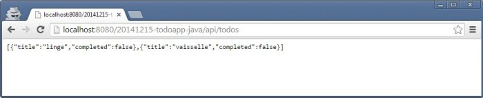

TODO list exemple – full Java avec GWT Tomcat Jersey
======
 

 
[todoapp js](http://damienfremont.com/2014/12/15/todo-list-exemple-full-javascript-avec-angularjs-nodejs-express/)
Ce tutoriel est la suite de todoapp js, mais en java cette fois-ci. C’est le dev d’une simple TODO list de type client-serveur (front-end + back-end). Le but est d’utiliser une stack technique complète en Java pour comparer avec d’autres technologies.
 
# Environnement
 
[eclipse](https://www.eclipse.org/downloads/)
[Maven](http://maven.apache.org/download.cgi)
[tomcat7](http://tomcat.apache.org/download-70.cgi)
[plugin GWT](https://developers.google.com/eclipse/docs/getting_started#installing)
En DEV : un IDE eclipse JavaEE + Maven et un tomcat7, ensuite installer le plugin GWT, manuellement ou via le marketplace d’eclipse.
 

 

 
[todomvc.com](http://todomvc.com/)
[exemple en GWT](http://todomvc.com/examples/gwt/)
En RUN : le front-end se base sur le site todomvc.com avec l’exemple en GWT. Le back-end est un Tomcat avec une servlet REST HTTP Jersey (JAX-RS).
 

 

 
La structure (classique) est composé d’un MVC coté front et d’un service REST coté back :
 
* Front Model View Controler
* Back Service Repository
 
# Code
 
[github source](https://github.com/damienfremont/blog/tree/master/20141215-todoapp-java)
Récupérer le code à partir de github source puis builder le projet.
 

 

 

 

 
Le plus obscure est la pom.xml, il permet de jonglet avec : les incompatibilité de compilation (la partie serveur compilée en Java et la partie cliente GWT compilée en Java puis Javascript et certaines librairies sont en commun comme asm), les dossiers target (la partie Java/Maven/Eclipse/Tomcat attend les fichiers générés dans target et la partie GWT le fait dans src/main/webapp).
 
```xml
<project xmlns="http://maven.apache.org/POM/4.0.0" xmlns:xsi="http://www.w3.org/2001/XMLSchema-instance"
    xsi:schemaLocation="http://maven.apache.org/POM/4.0.0 http://maven.apache.org/xsd/maven-4.0.0.xsd">
    <modelVersion>4.0.0</modelVersion>
    <groupId>com.dfremont.blog</groupId>
    <artifactId>20141215-todoapp-java</artifactId>
    <version>0.0.1-SNAPSHOT</version>
    <packaging>war</packaging>
    <properties>
        <project.build.sourceEncoding>UTF-8</project.build.sourceEncoding>
        <jdk.version>1.6</jdk.version>
        <jersey.version>1.8</jersey.version>
        <gwt.version>2.7.0</gwt.version>
        <webappDirectory>${project.build.directory}/${project.build.finalName}</webappDirectory>
    </properties>
    <dependencies>
 
        <dependency>
            <groupId>com.google.gwt</groupId>
            <artifactId>gwt-servlet</artifactId>
            <version>${gwt.version}</version>
            <scope>runtime</scope>
        </dependency>
        <dependency>
            <groupId>com.google.gwt</groupId>
            <artifactId>gwt-user</artifactId>
            <version>${gwt.version}</version>
            <scope>provided</scope>
        </dependency>
 
        <dependency>
            <artifactId>asm</artifactId>
            <groupId>asm</groupId>
            <version>3.1</version>
            <scope>runtime</scope>
        </dependency>
        <dependency>
            <groupId>com.sun.jersey</groupId>
            <artifactId>jersey-server</artifactId>
            <version>${jersey.version}</version>
            <exclusions>
                <exclusion>
                    <artifactId>asm</artifactId>
                    <groupId>asm</groupId>
                </exclusion>
            </exclusions>
        </dependency>
        <dependency>
            <groupId>com.sun.jersey</groupId>
            <artifactId>jersey-json</artifactId>
            <version>${jersey.version}</version>
        </dependency>
 
    </dependencies>
    <build>
        <resources>
            <resource>
                <directory>src/main/java</directory>
                <includes>
                    <include>src/main/java/com/todo/**/*.java</include>
                    <include>**/*.gwt.xml</include>
                </includes>
            </resource>
        </resources>
        <plugins>
            <plugin>
                <groupId>org.apache.maven.plugins</groupId>
                <artifactId>maven-compiler-plugin</artifactId>
                <version>3.0</version>
                <configuration>
                    <source>${jdk.version}</source>
                    <target>${jdk.version}</target>
                </configuration>
            </plugin>
            <plugin>
                <groupId>org.codehaus.mojo</groupId>
                <artifactId>gwt-maven-plugin</artifactId>
                <version>${gwt.version}</version>
                <executions>
                    <execution>
                        <configuration>
                            <module>com.todo.GwtToDo</module>
                            <runTarget>index.html</runTarget>
                            <hostedWebapp>src/main/webapp</hostedWebapp>
                            <warSourceDirectory>src/main/webapp</warSourceDirectory>
                            <outputDirectory>src/main/webapp</outputDirectory>
                        </configuration>
                        <goals>
                            <goal>compile</goal>
                        </goals>
                    </execution>
                </executions>
            </plugin>
            <plugin>
                <artifactId>maven-clean-plugin</artifactId>
                <version>2.6</version>
                <executions>
                    <execution>
                        <id>Deleting all unnecessary files before lint analysis</id>
                        <goals>
                            <goal>clean</goal>
                        </goals>
                    </execution>
                </executions>
                <configuration>
                    <excludeDefaultDirectories>true</excludeDefaultDirectories>
                    <filesets>
                        <fileset>
                            <directory>src/main/webapp/gwttodo</directory>
                            <followSymlinks>false</followSymlinks>
                        </fileset>
                        <fileset>
                            <directory>src/main/gwt-unitCache</directory>
                            <followSymlinks>false</followSymlinks>
                        </fileset>
                    </filesets>
                    <verbose>true</verbose>
                </configuration>
            </plugin>
        </plugins>
    </build>
</project>
```
 
Coté serveur, c’est du REST en Jersey (classique …et simple).
 
TodoService.java
 
```java
package com.dfremont.blog;
 
import javax.ws.rs.Consumes;
import javax.ws.rs.GET;
import javax.ws.rs.PUT;
import javax.ws.rs.Path;
import javax.ws.rs.Produces;
import javax.ws.rs.core.MediaType;
import javax.ws.rs.core.Response;
 
@Path("/todos")
public class TodoService {
 
    private TodoRepository dao = new TodoRepository();
 
    @GET
    @Produces(MediaType.APPLICATION_JSON)
    public Response readTodos() {
        // log
        System.out.println("@GET todos");
        try {
            // find
            TodoModel[] todos = dao.findAll();
            // success
            return Response.status(200).entity(todos).build();
        } catch (Exception e) {
            // error
            return Response.status(500).build();
        }
    }
 
    @PUT
    @Consumes(MediaType.APPLICATION_JSON)
    public Response updateTodos(TodoModel[] updatedTodos) {
        // log
        System.out.println("@PUT todos");
        try {
            // update
            dao.updateAll(updatedTodos);
            // success
            return Response.status(201).entity("Track saved").build();
        } catch (Exception e) {
            // error
            return Response.status(500).build();
        }
    }
 
}
```
 
web.xml
 
```xml
<?xml version="1.0" encoding="UTF-8"?>
<web-app xmlns:xsi="http://www.w3.org/2001/XMLSchema-instance"
    xmlns="http://java.sun.com/xml/ns/javaee" xmlns:web="http://java.sun.com/xml/ns/javaee/web-app_2_5.xsd"
    xsi:schemaLocation="http://java.sun.com/xml/ns/javaee http://java.sun.com/xml/ns/javaee/web-app_2_5.xsd"
    id="WebApp_ID" version="2.5">
    <servlet>
        <servlet-name>Jersey REST Service</servlet-name>
        <servlet-class>com.sun.jersey.spi.container.servlet.ServletContainer</servlet-class>
        <init-param>
            <param-name>com.sun.jersey.config.property.packages</param-name>
 
            <!-- Your rest package -->
            <param-value>com.dfremont.blog</param-value>
 
        </init-param>
        <init-param>
            <param-name>com.sun.jersey.api.json.POJOMappingFeature</param-name>
            <param-value>true</param-value>
        </init-param>
        <load-on-startup>1</load-on-startup>
    </servlet>
    <servlet-mapping>
        <servlet-name>Jersey REST Service</servlet-name>
        <url-pattern>/api/*</url-pattern>
    </servlet-mapping>
</web-app>
```
 

 
Coté client, c’est du GWT (classique …et compliqué pour rien. Voir le source sur github ou todomvc.
 
# Demo
 
Lancer le serveur.
 
[http://localhost:8080/20141215-todoapp-java/api/todos](http://localhost:8080/20141215-todoapp-java/api/todos)
Tester sur L’URL du back. http://localhost:8080/20141215-todoapp-java/api/todos
 

 

 
# 
 
# 
 
[http://localhost:8080/20141215-todoapp-java/](http://localhost:8080/20141215-todoapp-java/)
Tester sur L’URL du front. http://localhost:8080/20141215-todoapp-java/
 

 

 
Jouer avec l’application.
 
Le client doit envoyer des requetes PUT et GET au serveur. Serveur qui trace tout dans la console.
 
# Sources
 
[http://github.com/damienfremont/blog/tree/master/20141215-todoapp-java](http://github.com/damienfremont/blog/tree/master/20141215-todoapp-java)
http://github.com/damienfremont/blog/tree/master/20141215-todoapp-java
 
# References
 
[http://www.vogella.com/articles/REST/article.html](http://www.vogella.com/articles/REST/article.html)
http://www.vogella.com/articles/REST/article.html
 
[http://www.mkyong.com/webservices/jax-rs/json-example-with-jersey-jackson/](http://www.mkyong.com/webservices/jax-rs/json-example-with-jersey-jackson/)
http://www.mkyong.com/webservices/jax-rs/json-example-with-jersey-jackson/
 
[http://mojo.codehaus.org/gwt-maven-plugin/user-guide/project.html](http://mojo.codehaus.org/gwt-maven-plugin/user-guide/project.html)
http://mojo.codehaus.org/gwt-maven-plugin/user-guide/project.html
 
[http://mojo.codehaus.org/gwt-maven-plugin/user-guide/compile.html](http://mojo.codehaus.org/gwt-maven-plugin/user-guide/compile.html)
http://mojo.codehaus.org/gwt-maven-plugin/user-guide/compile.html
 
 
[https://damienfremont.com/2014/12/17/todo-list-exemple-full-java-avec-gwt-tomcat-jersey/](https://damienfremont.com/2014/12/17/todo-list-exemple-full-java-avec-gwt-tomcat-jersey/)
 
