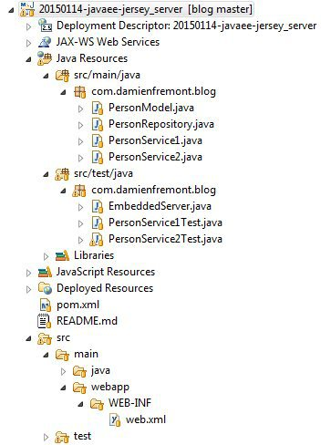
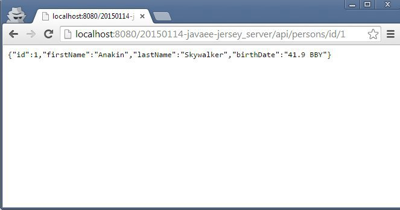

Comment créer et tester un server HTTP REST en JAX-RS JavaEE sous Tomcat ?
======
 

 
Ce tutoriel couvre l’implémentation d’un server HTTP REST exposant du CRUD sur un simple objet. Ainsi que ses tests avec l’intégration d’un Tomcat dans JUnit et l’écriture de tests en BDD avec RestAssured. Il se fera en 2 partie : un dev/test de base, puis un dev/test gérant la validation de données et les codes d’erreur.
 

 
# Environnement
 
Eclipse, Jersey-Server, Tomcat et RestAssured. RestAssured propose un formalise BDD (Behavior Driven Development), plus proche de l’écriture d’un cas d’utilisation que d’un test unitaire. Ce choix rend le code plus maintenable et évite les solution “maison” qui dérivent trop.
 
# Source code
 

 

 
PersonModel.java
 
```java
public class PersonModel implements Serializable {
 
    private static final long serialVersionUID = 6879685199191377814L;
 
    private Integer id;
    private String firstName;
    private String lastName;
    private String birthDate;
 
    public PersonModel() {
    }
 
    public PersonModel(String firstName, String lastName, String birthDate) {
        super();
        this.firstName = firstName;
        this.lastName = lastName;
        this.birthDate = birthDate;
    }
 
    public PersonModel(Integer id, String firstName, String lastName,
            String birthDate) {
        this(firstName, lastName, birthDate);
        this.id = id;
    }
 
    public Integer getId() {
        return id;
    }
 
    public void setId(Integer id) {
        this.id = id;
    }
...
```
 
PersonRepository
 
```java
public class PersonRepository {
 
    /* DATAS */
 
    private static Map<Integer, PersonModel> datas = null;
 
    public PersonRepository() {
        datas = new HashMap<>();
        datas.put(1, new PersonModel(1, "Anakin", "Skywalker", "41.9 BBY"));
        datas.put(2, new PersonModel(2, "Luke", "Skywalker", "19 BBY"));
        datas.put(3, new PersonModel(3, "Leia", "Organa Solo", "19 BBY"));
    }
 
    /* CRUD METHODS */
 
    public PersonModel create(PersonModel entity) {
        int randomNum = new Random().nextInt();
        entity.setId(randomNum);
        datas.put(entity.getId(), entity);
        return entity;
    }
 
    public PersonModel read(Integer id) {
        return datas.get(id);
    }
 
    public List<PersonModel> readAll() {
        return new ArrayList<PersonModel>(datas.values());
    }
 
    public PersonModel update(PersonModel entity) {
        return datas.put(entity.getId(), entity);
    }
 
    public void delete(Integer id) {
        datas.remove(id);
    }
 
}
```
 
pom.xml
 
```xml
<project xmlns="http://maven.apache.org/POM/4.0.0" xmlns:xsi="http://www.w3.org/2001/XMLSchema-instance"
    xsi:schemaLocation="http://maven.apache.org/POM/4.0.0 http://maven.apache.org/xsd/maven-4.0.0.xsd">
    <modelVersion>4.0.0</modelVersion>
    <groupId>com.damienfremont.blog</groupId>
    <artifactId>20150114-javaee-jersey_server</artifactId>
    <version>0.0.1-SNAPSHOT</version>
    <packaging>war</packaging>
    <properties>
        <project.build.sourceEncoding>UTF-8</project.build.sourceEncoding>
        <jdk.version>1.7</jdk.version>
        <jersey.version>1.18.3</jersey.version>
        <jersey.test>2.14</jersey.test>
        <tomcat-version>8.0.15</tomcat-version>
    </properties>
    <dependencies>
 
        <!-- JERSEY SERVER -->
        <dependency>
            <groupId>com.sun.jersey</groupId>
            <artifactId>jersey-json</artifactId>
            <version>${jersey.version}</version>
        </dependency>
        <dependency>
            <groupId>com.sun.jersey</groupId>
            <artifactId>jersey-server</artifactId>
            <version>${jersey.version}</version>
        </dependency>
        <dependency>
            <groupId>com.sun.jersey</groupId>
            <artifactId>jersey-servlet</artifactId>
            <version>${jersey.version}</version>
        </dependency>
 
        <!-- TEST -->
        <dependency>
            <groupId>junit</groupId>
            <artifactId>junit</artifactId>
            <version>4.9</version>
            <scope>test</scope>
        </dependency>
        <dependency>
            <groupId>com.jayway.restassured</groupId>
            <artifactId>rest-assured</artifactId>
            <version>1.2.3</version>
        </dependency>
 
        <!-- TEST : EMBEDDED SERVER (TOMCAT) -->
        <dependency>
            <groupId>org.apache.tomcat.embed</groupId>
            <artifactId>tomcat-embed-core</artifactId>
            <version>${tomcat-version}</version>
            <scope>test</scope>
        </dependency>
        <dependency>
            <groupId>org.apache.tomcat.embed</groupId>
            <artifactId>tomcat-embed-logging-juli</artifactId>
            <version>${tomcat-version}</version>
            <scope>test</scope>
        </dependency>
        <dependency>
            <groupId>org.apache.tomcat.embed</groupId>
            <artifactId>tomcat-embed-jasper</artifactId>
            <version>${tomcat-version}</version>
            <scope>test</scope>
        </dependency>
        <dependency>
            <groupId>org.apache.tomcat</groupId>
            <artifactId>tomcat-jasper</artifactId>
            <version>${tomcat-version}</version>
            <scope>test</scope>
        </dependency>
        <dependency>
            <groupId>org.apache.tomcat</groupId>
            <artifactId>tomcat-jasper-el</artifactId>
            <version>${tomcat-version}</version>
            <scope>test</scope>
        </dependency>
        <dependency>
            <groupId>org.apache.tomcat</groupId>
            <artifactId>tomcat-jsp-api</artifactId>
            <version>${tomcat-version}</version>
            <scope>test</scope>
        </dependency>
 
    </dependencies>
    <build>
        <plugins>
            <plugin>
                <groupId>org.apache.maven.plugins</groupId>
                <artifactId>maven-compiler-plugin</artifactId>
                <version>3.2</version>
                <configuration>
                    <source>${jdk.version}</source>
                    <target>${jdk.version}</target>
                </configuration>
            </plugin>
        </plugins>
    </build>
</project>
```
 
# Source code du service (version simple)
 
Voici une version simple du service: on laisse faire jersey-server. La gestion précise des codes d’erreur et la validation des données viendra plus tard.
 
PersonService1 .java
 
```java
@Path("/persons")
public class PersonService1 {
 
    private PersonRepository dao = new PersonRepository();
 
    /* CRUD METHODS */
 
    @POST
    @Produces(MediaType.TEXT_PLAIN)
    public String createPerson(PersonModel person) {
        return String.valueOf( dao.create(person).getId());
    }
 
    @GET
    @Path("/id/{id}")
    @Produces(MediaType.APPLICATION_JSON)
    public PersonModel readPerson(@PathParam("id") Integer id) {
        return dao.read(id);
    }
 
    @GET
    @Produces(MediaType.APPLICATION_JSON)
    public List<PersonModel> readPersons() {
        return dao.readAll();
    }
 
    @POST
    @Path("/id/{id}")
    public void updatePerson(@PathParam("id") Integer id, PersonModel person) {
        dao.update(person);
    }
 
    @DELETE
    @Path("/id/{id}")
    public void deletePerson(@PathParam("id") Integer id) {
        dao.delete(id);
    }
}
```
 
# Demo / Test
 
Les tests pourront s’exécuter au choix vers un serveur Tomcat local ou embarqué dans le test (c’est plus rapide et moins répétitif).
 
Voici le test “à la main”. Il faut monter le projet dans un serveur Tomcat installé sur le poste de dev, à l’aide du plugin d’Eclipse par exemple. Puis tester avec votre navigateur web préféré ou SOAP-UI.
 

 

 

 

 

 

 
[http://zsoltfabok.com/blog/2012/08/embedded-web-services-for-testing/](http://zsoltfabok.com/blog/2012/08/embedded-web-services-for-testing/)
Voici le test automatisé. Il est réalisé à l’aide d’une classe EmbeddedServer qui “contient” Tomcat. Merci http://zsoltfabok.com/blog/2012/08/embedded-web-services-for-testing/.
 
Faire attention au port utilisé par le serveur. Par défaut 8080, qui en local peut entrer en conflit avec un server, ou qui sur un CI (Jenkins par exemple) peut entrer en conflit avec un autre test (voir un autre server également).
 
EmbeddedServer .java
 
```java
/*
 * FROM http://zsoltfabok.com/blog/2012/08/embedded-web-services-for-testing/
 */
public class EmbeddedServer implements Runnable {
 
    private Tomcat tomcat;
    private Thread serverThread;
 
    public EmbeddedServer(int port, String contextPath) throws ServletException {
        tomcat = new Tomcat();
        tomcat.setPort(port);
        tomcat.setBaseDir("target/tomcat");
        tomcat.addWebapp(contextPath,
                new File("src/main/webapp").getAbsolutePath());
        serverThread = new Thread(this);
 
    }
 
    public void start() {
        serverThread.start();
    }
 
    public void run() {
        try {
            tomcat.start();
        } catch (LifecycleException e) {
            throw new RuntimeException(e);
        }
        tomcat.getServer().await();
    }
 
    public void stop() {
        try {
            tomcat.stop();
            tomcat.destroy();
            deleteDirectory(new File("target/tomcat/"));
        } catch (LifecycleException e) {
            throw new RuntimeException(e);
        }
    }
 
    void deleteDirectory(File path) {
        if (path == null)
            return;
        if (path.exists()) {
            for (File f : path.listFiles()) {
                if (f.isDirectory()) {
                    deleteDirectory(f);
                    f.delete();
                } else {
                    f.delete();
                }
            }
            path.delete();
        }
    }
}
```
 
PersonService1Test.java
 
```java
public class PersonService1Test {
 
    /* EMBEDDED SERVER (TOMCAT) */
 
    private static EmbeddedServer server;
 
    @BeforeClass
    public static void startServer() throws ServletException {
        server = new EmbeddedServer(8080, "/20150114-javaee-jersey_server");
        server.start();
    }
 
    @AfterClass
    public static void stopServer() {
        server.stop();
    }
 
    /* TESTS */
 
    private static final String REST_API = "/20150114-javaee-jersey_server/api";
 
    @Test
    public void testPersonCreateSuccess() {
        expect()
            .statusCode(200)
            .body(notNullValue())
        .given()
            .contentType("application/json")
            .parameters(
                    "firstName", "Padme",
                    "lastName", "Amidala",
                    "birthDate", "46 BBY")
        .when()
            .post(REST_API + "/persons");
    }
 
    @Test
    public void testPersonGetSuccess() {
        expect()
            .statusCode(200)
            .body("id", equalTo(1))
            .body("firstName", equalTo("Anakin"))
            .body("lastName", equalTo("Skywalker"))
            .body("birthDate", equalTo("41.9 BBY")) //
        .when()
            .get(REST_API + "/persons/id/1");
    }
 
    @Test
    public void testPersonGetAllSuccess() {
        expect()
            .statusCode(200)
            .body("id", hasItems(1, 2, 3)) //
        .when()
            .get(REST_API + "/persons");
    }
 
    @Test
    public void testPersonPostUpdateSuccess() {
        expect()
            .statusCode(204)
        .given()
            .contentType("application/json")
            .parameters(
                    "firstName", "Anakin",
                    "lastName", "Skywalker",
                    "birthDate", "41.9 BBY")
        .when()
            .post(REST_API + "/persons/id/1");
    }
 
    @Test
    public void testPersonDeleteSuccess() {
        expect()
            .statusCode(204)
        .when()
            .delete(REST_API + "/persons/id/3");
    }
}
```
 

 

 
 
 

 
C’est quand même plus simple pour tous les jours !
 
# Source code du service (version avancée)
 
Voici une version avancée du service : on implémente certains comportements (validations, codes http).
 
PersonService2 .java
 
```java
@Path("/persons2")
public class PersonService2 {
 
    private PersonRepository dao = new PersonRepository();
 
    /* CRUD METHODS */
 
    @POST
    @Produces(MediaType.TEXT_PLAIN)
    public Response createPerson(PersonModel person) {
        // VALIDATION
        if (!(person != null
                && person.getFirstName() != null && person.getLastName() != null && person.getBirthDate() != null)) {
            return Response
                    .status(BAD_REQUEST)
                    .build();
        }
        // PROCESS
        PersonModel newEntity = dao.create(person);
        // RESULT
        return Response
                .status(CREATED)
                .entity("Location: /persons2/" + newEntity.getId())
                .build();
    }
 
    @GET
    @Path("/id/{id}")
    @Produces(MediaType.APPLICATION_JSON)
    public Response readPerson(@PathParam("id") Integer id) {
        // VALIDATION
        if (id == null)
            return Response
                    .status(Status.BAD_REQUEST)
                    .build();
        // PROCESS
        PersonModel entity = dao.read(id);
        // RESULT
        return Response
                .status(ACCEPTED)
                .entity(entity)
                .build();
    }
 
    @GET
    @Produces(MediaType.APPLICATION_JSON)
    public Response readPersons() {
        // PROCESS
        List<PersonModel> entities = dao.readAll();
        // RESULT
        return Response
                .status(ACCEPTED)
                .entity(entities)
                .build();
    }
 
    @POST
    @Path("/id/{id}")
    public Response updatePerson(@PathParam("id") Integer id, PersonModel person) {
        // VALIDATION
        if (!(person != null && id != null
                && person.getFirstName() != null && person.getLastName() != null && person.getBirthDate() != null)) {
            return Response
                    .status(BAD_REQUEST)
                    .build();
        }
        // PROCESS
        dao.update(person);
        // RESULT
        return Response
                .status(ACCEPTED)
                .build();
    }
 
    @DELETE
    @Path("/id/{id}")
    public Response deletePerson(@PathParam("id") Integer id) {
        // VALIDATION
        if (id == null)
            return Response
                    .status(BAD_REQUEST)
                    .build();
        // PROCESS
        dao.delete(id);
        // RESULT
        return Response
                .status(ACCEPTED)
                .build();
    }
}
```
 
# Demo / Test
 
PersonService2Test .java
 
```java
public class PersonService2Test {
 
    /* EMBEDDED SERVER (TOMCAT) */
 
    private static EmbeddedServer server;
 
    @BeforeClass
    public static void startServer() throws ServletException {
        server = new EmbeddedServer(8080, "/20150114-javaee-jersey_server");
        server.start();
    }
 
    @AfterClass
    public static void stopServer() {
        server.stop();
    }
 
    /* TESTS */
 
    private static final String REST_API = "/20150114-javaee-jersey_server/api";
 
    @Test
    public void testPersonCreateSuccess() {
        expect()
            .statusCode(201)
            .body(notNullValue())
        .given()
            .contentType("application/json")
            .parameters(
                    "firstName", "Padme",
                    "lastName", "Amidala",
                    "birthDate", "46 BBY")
        .when()
            .post(REST_API + "/persons2");
    }
 
    @Test
    public void testPersonCreateBadRequest() {
        expect()
            .statusCode(400)
        .given()
            .contentType("application/json")
            .parameters(
                    // missing firstname !!!
                    "lastName", "Amidala",
                    "birthDate", "46 BBY")
        .when()
            .post(REST_API + "/persons2");
    }
 
}
```
 

 

 
# Conclusion
 
Jersey-server reste pratique pour développer rapidement comme pour aller plus loin. RestAssured permet de tester encore plus facilement, tout en auto-documentant le code avec une approche BDD. Et Tomcat Embedded simplifie la maintenance en s’intégrant facilement avec JUnit.
 
Pour aller plus loin, il y a la possibilité de :
 
* utiliser une validation de données plus simple (JavaEE, BeanValidation, Guava ou ApacheCommon)
* remplacer le Repository par un mock (mockito) qui permettrait de : isoler le code simuler des pannes (test erreurs 500) vérifier les appels effectués aux couches basses de l’application
* mettre en place une injection de dépendance
 
# Troubleshooting
 
“Caused by: com.sun.jersey.api.MessageException: A message body writer for Java class …, and Java type class…, and MIME media type application/json was not found”
 
La dépendance à jersey-json est manquante. Ajouter au pom.xml
 
```xml
<dependency>
  <groupId>com.sun.jersey</groupId>
  <artifactId>jersey-json</artifactId>
  <version>1.18.3</version>
</dependency>
```
 
# Sources
 
[https://github.com/damienfremont/blog/tree/master/20150114-javaee-jersey_server](https://github.com/damienfremont/blog/tree/master/20150114-javaee-jersey_server)
https://github.com/damienfremont/blog/tree/master/20150114-javaee-jersey_server
 
# References
 
[https://jersey.java.net/](https://jersey.java.net/)
https://jersey.java.net/
 
[http://blog.xebia.fr/2014/03/17/post-vs-put-la-confusion/](http://blog.xebia.fr/2014/03/17/post-vs-put-la-confusion/)
http://blog.xebia.fr/2014/03/17/post-vs-put-la-confusion/
 
[http://www.mkyong.com/tutorials/jax-rs-tutorials/](http://www.mkyong.com/tutorials/jax-rs-tutorials/)
http://www.mkyong.com/tutorials/jax-rs-tutorials/
 
[https://code.google.com/p/rest-assured/wiki/Usage](https://code.google.com/p/rest-assured/wiki/Usage)
https://code.google.com/p/rest-assured/wiki/Usage
 
[http://www.hascode.com/2011/09/rest-assured-vs-jersey-test-framework-testing-your-restful-web-services/#Using_REST-assured](http://www.hascode.com/2011/09/rest-assured-vs-jersey-test-framework-testing-your-restful-web-services/#Using_REST-assured)
http://www.hascode.com/2011/09/rest-assured-vs-jersey-test-framework-testing-your-restful-web-services/#Using_REST-assured
 
[http://blog.fastconnect.fr/?p=1565](http://blog.fastconnect.fr/?p=1565)
http://blog.fastconnect.fr/?p=1565
 
 
[https://damienfremont.com/2015/01/15/comment-creer-et-tester-un-server-http-rest-en-jax-rs-javaee-sous-tomcat/](https://damienfremont.com/2015/01/15/comment-creer-et-tester-un-server-http-rest-en-jax-rs-javaee-sous-tomcat/)
 
