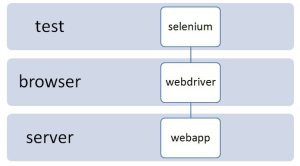
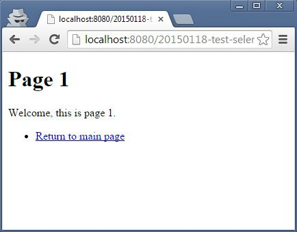
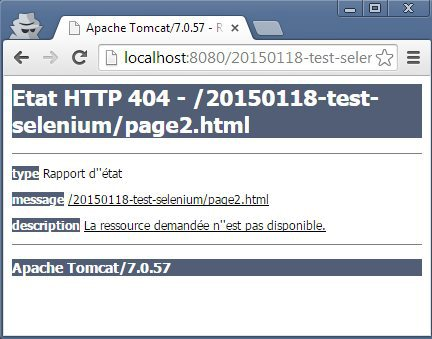
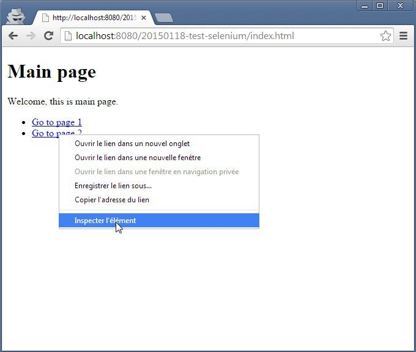
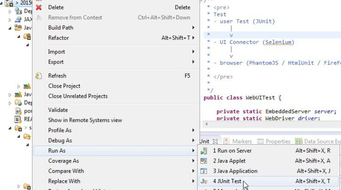
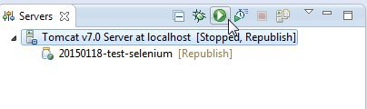

Tester une webapp avec Selenium Java, PhantomJS et un webserver embarqué ?
======
 

 
Vous avez besoin de tester en permanence votre webapp ? Mais ne disposez pas d’une infrastructure de test (preprod) ni d’une équipe de testeurs humains ? Ou vous aimeriez tester le front avec le même confort qu’un test unitaire. Ce tuto permet de lancer un mini environnement navigateur+webserver via JUnit et de tester votre interface web.
 

 
# Environnement
 
Les outils utilisés sont JUnit, Selenium et un environnement de base navigateur (Phantomjs) / server web (Tomcat).
 

 

 
Ici, le test lancé avec JUnit utilise Selenium. Selenium qui se connecte via un webdriver au navigateur web. Le navigateur web (phantomjs) envoie des requêtes au serveur web (tomcat).
 
Pourquoi PhantomJS ? Il y a plusieurs bonnes raisons :
 
* Indépendance : parce que l’on veux, comme toujours, des tests indépendants du système sur lequel ils sont exécutés. PhantomJS sera un navigateur téléchargé par le projet (même logique que Maven et les libs Java).
* Stabilité : téléchargé dans une version précise, il n’y a pas dépendance à une quelconque version installée (firefox v35, chrome v53, etc). Car oui, certains navigateurs comportent des bugs dans webdriver d’une version à l’autre.
* Rapidité : PhantomJS est un navigateur dit “headless” car il n’a pas d’interface graphique. Il est donc très léger et rapide.
 
Les tests UI s’exécutent ainsi avec le même niveau de confort qu’un test unitaire, automatisé et indépendant de toute intervention extérieure.
 
 
 
Pour ces tests, de simples pages web avec quelques liens suffisent.
 
Main page
 

 

 
Page 1
 

 

 
Page 2 (une 404, pour tester une erreur)
 

 

 
# Code
 

 

 
```xml
<project xmlns="http://maven.apache.org/POM/4.0.0" xmlns:xsi="http://www.w3.org/2001/XMLSchema-instance"
    xsi:schemaLocation="http://maven.apache.org/POM/4.0.0 http://maven.apache.org/xsd/maven-4.0.0.xsd">
    <modelVersion>4.0.0</modelVersion>
    <groupId>com.damienfremont.blog</groupId>
    <artifactId>20150118-test-selenium</artifactId>
    <version>0.0.1-SNAPSHOT</version>
    <packaging>war</packaging>
    <properties>
        <project.build.sourceEncoding>UTF-8</project.build.sourceEncoding>
        <jdk.version>1.7</jdk.version>
        <tomcat-version>8.0.15</tomcat-version>
    </properties>
    <dependencies>
 
        <!-- TEST -->
        <dependency>
            <groupId>junit</groupId>
            <artifactId>junit</artifactId>
            <version>4.11</version>
        </dependency>
        <dependency>
            <groupId>org.seleniumhq.selenium</groupId>
            <artifactId>selenium-java</artifactId>
            <version>2.44.0</version>
        </dependency>
         
        <!-- TEST: EMBEDDED PHANTOMJS WEBBROWSER -->
        <dependency>
            <groupId>com.codeborne</groupId>
            <artifactId>phantomjsdriver</artifactId>
            <version>1.2.1</version>
        </dependency>
        <dependency>
            <groupId>com.google.guava</groupId>
            <artifactId>guava</artifactId>
            <version>14.0.1</version>
        </dependency>
         
        <!-- TEST : EMBEDDED TOMCAT SERVER -->
        <dependency>
            <groupId>org.apache.tomcat.embed</groupId>
            <artifactId>tomcat-embed-core</artifactId>
            <version>${tomcat-version}</version>
            <scope>test</scope>
        </dependency>
        <dependency>
            <groupId>org.apache.tomcat.embed</groupId>
            <artifactId>tomcat-embed-logging-juli</artifactId>
            <version>${tomcat-version}</version>
            <scope>test</scope>
        </dependency>
        <dependency>
            <groupId>org.apache.tomcat.embed</groupId>
            <artifactId>tomcat-embed-jasper</artifactId>
            <version>${tomcat-version}</version>
            <scope>test</scope>
        </dependency>
        <dependency>
            <groupId>org.apache.tomcat</groupId>
            <artifactId>tomcat-jasper</artifactId>
            <version>${tomcat-version}</version>
            <scope>test</scope>
        </dependency>
        <dependency>
            <groupId>org.apache.tomcat</groupId>
            <artifactId>tomcat-jasper-el</artifactId>
            <version>${tomcat-version}</version>
            <scope>test</scope>
        </dependency>
        <dependency>
            <groupId>org.apache.tomcat</groupId>
            <artifactId>tomcat-jsp-api</artifactId>
            <version>${tomcat-version}</version>
            <scope>test</scope>
        </dependency>
 
    </dependencies>
    <build>
        <plugins>
            <plugin>
                <groupId>org.apache.maven.plugins</groupId>
                <artifactId>maven-compiler-plugin</artifactId>
                <version>3.2</version>
                <configuration>
                    <source>${jdk.version}</source>
                    <target>${jdk.version}</target>
                </configuration>
            </plugin>
        </plugins>
    </build>
</project>
```
 
WebUITest.java 1/2 : la partie utilitaire
 
```java
public class WebUITest {
 
    private static EmbeddedServer server;
    private static WebDriver driver;
    private static String baseUrl;
 
    @BeforeClass
    public static void startServer() throws ServletException {
 
        // INIT WEB SERVER (TOMCAT)
        server = new EmbeddedServer(8080, "/20150118-test-selenium");
        server.start();
 
        // INIT WEB BROWSER (SELENIUM + PHANTOMJS)
        driver = new PhantomJSDriver(
        new DesiredCapabilities(ImmutableMap.of( //
                PhantomJSDriverService.PHANTOMJS_EXECUTABLE_PATH_PROPERTY, //
                new PhantomJsDownloader().downloadAndExtract()
                        .getAbsolutePath())));
        baseUrl = "http://localhost:8080/20150118-test-selenium";
        driver.manage().timeouts().implicitlyWait(5, SECONDS);
    }
 
    @AfterClass
    public static void stopServer() {
        server.stop();
        driver.quit();
    }
...
```
 
WebUITest.java 2/2 : les tests
 

 
Les tests fonctionnent à base de sélection d’élèments dans le DOM de la page web. Du coup, il faut utiliser à font les cssSelector pour sélectionner (ID, c’est dépassé ne pas les utiliser évite de les maintenir et redonne du sens à votre structure html). Un cssSelector, c’est tout simplement la règle css qui décrit comment sélectionner un élément dans le DOM (comme “#container h1” dans un fichier *.css pour appliquer une couleur). Heureusement, pour écrire ces formules quand on est pas un pro du CSS, il y a les outils.
 
Exemple en utilisant le plugin de dev de votre navigateur (Chrome ici)
 

 

 

 

 
Autour de ces sélection d’éléments, Selenium propose des méthodes pour intéragir avec. Il y a des click(), des isDisplayed(), text(), etc.
 
Les tests nous donne donc :
 
```java
...
 
    @Test
    public void test_QUAND_acces_site_ETANT_DONNE_main_page_ALORS_afficher_main_page() {
 
        // QUAND
        driver.get(baseUrl);
 
        // ALORS
        assertTrue(driver.findElement(By.cssSelector(".container .title"))
                .isDisplayed());
        assertTrue(driver.findElement(By.cssSelector(".container .title"))
                .getText().contains("Main page"));
        assertTrue(driver.findElement(
                By.cssSelector(".container li:nth-child(1) .goto.btn"))
                .isDisplayed());
        assertTrue(driver.findElement(
                By.cssSelector(".container li:nth-child(2) .goto.btn"))
                .isDisplayed());
    }
 
    @Test
    public void test_QUAND_navigue_vers_page_1_ETANT_DONNE_main_page_ALORS_afficher_page_1() {
 
        // ETANT DONNE
        driver.get(baseUrl);
        assertTrue(driver.findElement(By.cssSelector(".container .title"))
                .getText().contains("Main page"));
 
        // QUAND
        driver.findElement(
                By.cssSelector(".container li:nth-child(1) .goto.btn")).click();
 
        // ALORS
        assertTrue(driver.getCurrentUrl().contains("page1"));
 
        assertTrue(driver.findElement(By.cssSelector(".container .title"))
                .isDisplayed());
        assertTrue(driver.findElement(By.cssSelector(".container .title"))
                .getText().contains("Page 1"));
    }
 
    @Test
    public void test_QUAND_navigue_vers_page_2_ETANT_DONNE_page_2_cassee_ALORS_erreur_404() {
 
        // ETANT DONNE
        driver.get(baseUrl);
        assertTrue(driver.findElement(By.cssSelector(".container .title"))
                .getText().contains("Main page"));
 
        // QUAND
        driver.findElement(
                By.cssSelector(".container li:nth-child(2) .goto.btn")).click();
 
        // ALORS
        assertTrue(driver.getCurrentUrl().contains("page2"));
        assertTrue(driver.findElement(By.cssSelector("body"))
                .getText().contains("404"));
    }
 
}
```
 
PhantomJs n’étant pas disponible dans Maven, il faut le faire télécharger par le test JUnit (ça reste mieux que de le versionner dans votre projet sous GIT ou SVN). Un utilitaire est dispo sur le net : PhantomJsDownloader
 
```java
class PhantomJsDownloader {
 
    private final boolean isWindows;
    private final boolean isMac;
    private final boolean isLinux64;
 
    PhantomJsDownloader() {
        String osName = System.getProperty("os.name");
        isWindows = osName.startsWith("Windows");
        isMac = osName.startsWith("Mac OS X") || osName.startsWith("Darwin");
        isLinux64 = System.getProperty("sun.arch.data.model").equals("64");
    }
 
    public File downloadAndExtract() {
        File installDir = new File(".phantomjstest");
        String url;
        File phantomJsExe;
        if (isWindows) {
            url = "http://phantomjs.googlecode.com/files/phantomjs-1.9.2-windows.zip";
            phantomJsExe = new File(installDir,
                    "phantomjs-1.9.2-windows/phantomjs.exe");
        } else if (isMac) {
            url = "http://phantomjs.googlecode.com/files/phantomjs-1.9.2-macosx.zip";
            phantomJsExe = new File(installDir,
                    "phantomjs-1.9.2-macosx/bin/phantomjs");
        } else if (isLinux64) {
            url = "http://phantomjs.googlecode.com/files/phantomjs-1.9.2-linux-x86_64.tar.bz2";
            phantomJsExe = new File(installDir,
                    "phantomjs-1.9.2-linux-x86_64/bin/phantomjs");
        } else {
            url = "http://phantomjs.googlecode.com/files/phantomjs-1.9.2-linux-i686.tar.bz2";
            phantomJsExe = new File(installDir,
                    "phantomjs-1.9.2-linux-i686/bin/phantomjs");
        }
        extractExe(url, installDir, phantomJsExe);
        return phantomJsExe;
    }
 
    private void extractExe(String url, File phantomInstallDir,
            File phantomJsExe) {
        if (phantomJsExe.exists()) {
            return;
        }
        File targetZip = new File(phantomInstallDir, "phantomjs.zip");
        downloadZip(url, targetZip);
        try {
            if (isWindows) {
                unzip(targetZip, phantomInstallDir);
            } else if (isMac) {
                new ProcessBuilder()
                        .command("/usr/bin/unzip", "-qo", "phantomjs.zip")
                        .directory(phantomInstallDir).start().waitFor();
            } else {
                new ProcessBuilder().command("tar", "-xjvf", "phantomjs.zip")
                        .directory(phantomInstallDir).start().waitFor();
            }
        } catch (Exception e) {
            throw new IllegalStateException("Unable to unzip phantomjs from "
                    + targetZip.getAbsolutePath());
        }
    }
 
    private void downloadZip(String url, File targetZip) {
        if (targetZip.exists()) {
            return;
        }
        File zipTemp = new File(targetZip.getAbsolutePath() + ".temp");
        try {
            zipTemp.getParentFile().mkdirs();
            InputSupplier<InputStream> input = Resources
                    .newInputStreamSupplier(URI.create(url).toURL());
            OutputSupplier<FileOutputStream> ouput = Files
                    .newOutputStreamSupplier(zipTemp);
            ByteStreams.copy(input, ouput);
        } catch (IOException e) {
            String message = "Unable to download phantomjs from " + url;
            throw new IllegalStateException(message, e);
        }
        zipTemp.renameTo(targetZip);
    }
 
    private static void unzip(File zip, File toDir) throws IOException {
        try (final ZipFile zipFile = new ZipFile(zip);) {
            Enumeration<? extends ZipEntry> entries = zipFile.entries();
            while (entries.hasMoreElements()) {
                final ZipEntry entry = entries.nextElement();
                if (entry.isDirectory()) {
                    continue;
                }
                File to = new File(toDir, entry.getName());
                to.getParentFile().mkdirs();
                InputSupplier<InputStream> from = new InputSupplier<InputStream>() {
                    public InputStream getInput() throws IOException {
                        return zipFile.getInputStream(entry);
                    }
                };
                Files.copy(from, to);
            }
        }
    }
}
```
 
[http://grepcode.com/file/repo1.maven.org/maven2/net.code-story/simplelenium/1.21/net/codestory/simplelenium/driver/PhantomJsDownloader.java](http://grepcode.com/file/repo1.maven.org/maven2/net.code-story/simplelenium/1.21/net/codestory/simplelenium/driver/PhantomJsDownloader.java)
http://grepcode.com/file/repo1.maven.org/maven2/net.code-story/simplelenium/1.21/net/codestory/simplelenium/driver/PhantomJsDownloader.java
 
# Demo
 
Il y a 2 façons de procéder selon le besoin.
 
## 1. Utiliser le server tomcat embarqué dans les tests (pour tester dans une usine de dev, un Jenkins, etc)
 
…le plus simple, il suffit de lancer les tests du projet ou de la classe WebUITest.
 

 

 
## 2. Tester un server externe au test (pour tester vers le poste local, la preprod, etc)
 
…le moins simple, qui méritera une fonction de configuration / paramétrage si utilisé régulièrement (config de l’URL du server, login, password, etc)
 
Il faut désactiver le Tomcat embarqué avant de lancer les tests.
 
```java
public class WebUITest {
 
//  private static EmbeddedServer server;
    private static WebDriver driver;
    private static String baseUrl;
 
    @BeforeClass
    public static void startServer() throws ServletException {
 
        // INIT WEB SERVER (TOMCAT)
//      server = new EmbeddedServer(8080, "/20150118-test-selenium");
//      server.start();
 
        // INIT WEB BROWSER (SELENIUM + PHANTOMJS)
        driver = new PhantomJSDriver(
        new DesiredCapabilities(ImmutableMap.of( //
                PhantomJSDriverService.PHANTOMJS_EXECUTABLE_PATH_PROPERTY, //
                new PhantomJsDownloader().downloadAndExtract()
                        .getAbsolutePath())));
// URL A CHANGER SI BESOIN
        baseUrl = "http://localhost:8080/20150118-test-selenium";
        driver.manage().timeouts().implicitlyWait(5, SECONDS);
    }
 
    @AfterClass
    public static void stopServer() {
//      server.stop();
        driver.quit();
    }
```
 
Puis lancer votre propre server si besoin, puis les tests.
 

 

 
Dans les 2 cas, c’est la suite JUnit qui montrera le résultat.
 

 

 
# Conclusion
 
Ce type de test est très utile, voir indispensables pour la non régression et la productivité. Ils permettent même de concevoir votre UI en TDD.
 
* TDD : les tests UI ont le même effet sur le code que les test Unitaires. Ils le rendent plus maintenable en évitant de coder ce qui sort du besoin des tests, et le formate en le rendant plus lisible et mieux conçu.
* STABILITE : la protection contre la régression est importante et exécutée autant de fois que nécessaire (à chaque modification de code et livraison d’application).
* PRODUCTIVITE : ces tests interviennent dès la phase de dev, sont codés et exécutés TRES rapidement. La boucle de retour d’erreur est plus rapide car directement durant la phase de dev. Et il est possible par la suite de diminuer la charge d’une équipe de test.
 
Mais ils sont difficiles à comprendre et à maintenir. La faute au besoin de ce test de rester indépendant de toute plateforme et d’être automatisable (ajout de PhantomJS et de Tomcat).
 
Des solution à base de refactoring du code (Page pattern par exemple) ou carrément l’utilisation de frameworks plus haut niveau tel que FluentLenium améliorent beaucoup la productivité et la maintenance sur ce type de tests.
 
# Source code
 
[https://github.com/damienfremont/blog/tree/master/20150118-test-selenium](https://github.com/damienfremont/blog/tree/master/20150118-test-selenium)
https://github.com/damienfremont/blog/tree/master/20150118-test-selenium
 
# References
 
[http://atatorus.developpez.com/tutoriels/java/test-application-web-avec-selenium/](http://atatorus.developpez.com/tutoriels/java/test-application-web-avec-selenium/)
http://atatorus.developpez.com/tutoriels/java/test-application-web-avec-selenium/
 
 
[https://damienfremont.com/2015/01/18/tester-une-webapp-avec-selenium-java-phantomjs-et-un-webserver-embarque](https://damienfremont.com/2015/01/18/tester-une-webapp-avec-selenium-java-phantomjs-et-un-webserver-embarque)
 
