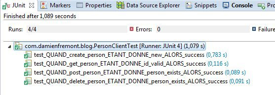

Créer et tester un client HTTP REST en JAX-RS JavaEE avec Jersey ?
======
 

 
Voici comment créer un client HTTP REST en Java appelant un simple service CRUD. La solution se base sur le standard JavaEE JAX-RS avec comme implémentation Jersey-client pour le mapping et RESTEasy pour l’exécution, testé par JUnit et Jadler qui émule un server REST.
 

 
# Environnement
 
Le client va appeler un service REST dont l’API est la suivante :
 
# Source
 

 

 
pom.xml (config Maven)
 
```xml
<project xmlns="http://maven.apache.org/POM/4.0.0" xmlns:xsi="http://www.w3.org/2001/XMLSchema-instance"
    xsi:schemaLocation="http://maven.apache.org/POM/4.0.0 http://maven.apache.org/xsd/maven-4.0.0.xsd">
    <modelVersion>4.0.0</modelVersion>
    <groupId>com.damienfremont.blog</groupId>
    <artifactId>20150117-javaee-jersey_client</artifactId>
    <version>0.0.1-SNAPSHOT</version>
    <packaging>jar</packaging>
    <properties>
        <project.build.sourceEncoding>UTF-8</project.build.sourceEncoding>
        <jdk.version>1.7</jdk.version>
        <jersey.version>1.18.3</jersey.version>
        <resteasy.version>2.3.1.GA</resteasy.version>
    </properties>
    <dependencies>
 
        <!-- JERSEY CLIENT -->
        <dependency>
            <groupId>com.sun.jersey</groupId>
            <artifactId>jersey-json</artifactId>
            <version>${jersey.version}</version>
        </dependency>
        <dependency>
            <groupId>com.sun.jersey</groupId>
            <artifactId>jersey-client</artifactId>
            <version>${jersey.version}</version>
        </dependency>
        <dependency>
            <groupId>org.jboss.resteasy</groupId>
            <artifactId>resteasy-jaxrs</artifactId>
            <version>${resteasy.version}</version>
        </dependency>
        <dependency>
            <groupId>org.jboss.resteasy</groupId>
            <artifactId>resteasy-jettison-provider</artifactId>
            <version>${resteasy.version}</version>
        </dependency>
 
        <!-- TEST -->
        <dependency>
            <groupId>junit</groupId>
            <artifactId>junit</artifactId>
            <version>4.9</version>
            <scope>test</scope>
        </dependency>
        <dependency>
            <groupId>org.easytesting</groupId>
            <artifactId>fest-assert-core</artifactId>
            <version>2.0M5</version>
            <scope>test</scope>
        </dependency>
        <dependency>
            <groupId>net.jadler</groupId>
            <artifactId>jadler-all</artifactId>
            <version>1.1.1</version>
            <scope>test</scope>
        </dependency>
        <dependency>
            <groupId>org.hamcrest</groupId>
            <artifactId>hamcrest-core</artifactId>
            <version>1.3</version>
        </dependency>
 
    </dependencies>
    <build>
        <plugins>
            <plugin>
                <groupId>org.apache.maven.plugins</groupId>
                <artifactId>maven-compiler-plugin</artifactId>
                <version>3.2</version>
                <configuration>
                    <source>${jdk.version}</source>
                    <target>${jdk.version}</target>
                </configuration>
            </plugin>
        </plugins>
    </build>
</project>
```
 
PersonModel.java (un simple POJO, annoté en JAX-RS )
 
```java
@XmlRootElement(name="person")
@JsonIgnoreProperties(ignoreUnknown = true)
public class PersonModel implements Serializable {
 
    private static final long serialVersionUID = 6879685199191377814L;
 
    private Integer id;
    private String firstName;
    private String lastName;
    private String birthDate;
 
    public Integer getId() {
        return id;
    }
 
    public void setId(Integer id) {
        this.id = id;
    }
 
    public String getFirstName() {
        return firstName;
    }
 
    public void setFirstName(String firstName) {
        this.firstName = firstName;
    }
 
    public String getLastName() {
        return lastName;
    }
 
    public void setLastName(String lastName) {
        this.lastName = lastName;
    }
 
    public String getBirthDate() {
        return birthDate;
    }
 
    public void setBirthDate(String birthDate) {
        this.birthDate = birthDate;
    }
 
}
```
 
Personservice.java (une simple interface décrivant l’API, annotée en JAX-RS aussi)
 
```java
@Path("persons")
public interface PersonService {
 
    @GET
    public void ping();
 
    @POST
    @Consumes(MediaType.APPLICATION_JSON)
    public String createPerson(PersonModel newPerson);
 
    @GET
    @Path("id/{id}")
    @Produces(MediaType.APPLICATION_JSON)
    public PersonModel readPerson(@PathParam("id") Integer id);
 
    @POST
    @Path("id/{id}")
    @Consumes(MediaType.APPLICATION_JSON)
    public String updatePerson(@PathParam("id") Integer id, PersonModel actualPerson);
 
    @DELETE
    @Path("id/{id}")
    public void deletePerson(@PathParam("id") Integer id);
}
```
 
# Demo
 
Pour commencer, voici un test de connexion de notre client vers l’API en émulant un server HTTP REST avec Jadler.
 
PersonClientTest .java
 
```java
public class PersonClientTest {
 
    PersonService client;
 
    @Before
    public void setUp() {
        // INIT MOCK
        initJadler();
        // INIT REST CLIENT
        client = ProxyFactory.create(//
                PersonService.class, //
                "http://localhost:" + Jadler.port() + "/api");
    }
 
    @After
    public void tearDown() {
        closeJadler();
    }
 
    @Test
    public void test_QUAND_create_person_ETANT_DONNE_new_ALORS_success() {
 
        // ETANT DONNE
        onRequest().havingMethodEqualTo("POST")
                .havingPathEqualTo("/api/persons").respond()
                .withBody("Location: /persons/id/6") //
                .withEncoding(Charset.forName("UTF-8")) //
                .withContentType("text/plain; charset=UTF-8") //
                .withStatus(204);
 
        PersonModel newPerson = new PersonModel();
        newPerson.setFirstName("Luke");
        newPerson.setLastName("Skylwalker");
        newPerson.setBirthDate("19 BBY");
 
        // QUAND
        client.createPerson(newPerson);
 
        // ALORS
        // nothing to assert
    }
 
    @Test
    public void test_QUAND_get_person_ETANT_DONNE_id_valid_ALORS_success() {
 
        // ETANT DONNE
        onRequest()
                .havingMethodEqualTo("GET")
                .havingPathEqualTo("/api/persons/id/1")
                .respond()
                .withBody(
                        "{person:{" //
                                + "\"id\":\"1\","
                                + "\"firstName\":\"Anakin\","
                                + "\"lastName\":\"Skylwalker\","
                                + "\"birthDate\":\"41.9 BBY\"" //
                                + "}}") //
                .withEncoding(Charset.forName("UTF-8")) //
                .withContentType("application/json; charset=UTF-8") //
                .withStatus(200);
 
        Integer arg = 1;
 
        // QUAND
        PersonModel response = client.readPerson(arg);
 
        // ALORS
        assertThat(response).isNotNull();
        assertThat(response.getId()).isNotNull();
        assertThat(response.getFirstName()).isEqualTo("Anakin");
        assertThat(response.getLastName()).isEqualTo("Skylwalker");
        assertThat(response.getBirthDate()).isEqualTo("41.9 BBY");
    }
 
    @Test
    public void test_QUAND_post_person_ETANT_DONNE_person_exists_ALORS_success() {
 
        // ETANT DONNE
        onRequest()
                .havingMethodEqualTo("POST")
                .havingPathEqualTo("/api/persons/id/1")
                .respond()
                .withStatus(200);
 
        Integer arg = 1;
        PersonModel newPerson = new PersonModel();
        newPerson.setId(1);
        newPerson.setFirstName("Anakin");
        newPerson.setLastName("Skylwalker");
        newPerson.setBirthDate("41.9 BBY");
 
        // QUAND
        client.updatePerson(arg, newPerson);
 
        // ALORS
        // nothing to assert
    }
 
    @Test
    public void test_QUAND_delete_person_ETANT_DONNE_person_exists_ALORS_success() {
 
        // ETANT DONNE
        onRequest()
                .havingMethodEqualTo("DELETE")
                .havingPathEqualTo("/api/persons/id/1")
                .respond()
                .withStatus(200);
 
        Integer arg = 1;
 
        // QUAND
        client.deletePerson(arg);
 
        // ALORS
        // nothing to assert
    }
}
```
 

 
C’est donc un test d’intégration du client que l’on peut lancer comme un simple test JUnit.
 
# Amélioration
 
Il est recommandé de configurer les TimeOuts sur votre client JAX-RS, pour éviter de bloquer votre application (ou un de vos threads si c’est un server).
 
Executor.java
 
```java
public class Executor extends ApacheHttpClient4Executor
{
 
    private static final int    connectionTimeoutMillis = 2000;
    private static final int    socketTimeoutMillis = 3000;
 
    public Executor()
    {
        super( initHttpClient() );
    }
 
    private static DefaultHttpClient initHttpClient()
    {
        DefaultHttpClient httpClient = new DefaultHttpClient();
        HttpParams params = httpClient.getParams();
        HttpConnectionParams.setConnectionTimeout( params, connectionTimeoutMillis );
        HttpConnectionParams.setSoTimeout( params, socketTimeoutMillis );
        return httpClient;
    }
}
```
 
Qui peut aussi se tester avec Jadler.
 
ExecutorTest.java
 
```java
public class ExecutorTest {
 
    PersonService client;
 
    @Before
    public void setUp() {
        // INIT MOCK
        initJadler();
        // INIT REST CLIENT
        client = ProxyFactory.create(//
                PersonService.class, //
                "http://localhost:" + Jadler.port() + "/api", new Executor());
    }
 
    @After
    public void tearDown() {
        closeJadler();
    }
 
    @Test
    public void test_QUAND_ping_ETANT_DONNE_system_ok_ALORS_success() {
 
        // ETANT DONNE
        onRequest().havingMethodEqualTo("GET")
                .havingPathEqualTo("/api/persons").respond()
                .withDelay(1, SECONDS);
 
        // QUAND
        client.ping();
    }
 
    @Test
    public void test_QUAND_ping_ETANT_DONNE_system_lag_ALORS_timeout() {
 
        // ETANT DONNE
        onRequest().havingMethodEqualTo("GET")
                .havingPathEqualTo("/api/persons").respond()
                .withDelay(50, SECONDS);
 
        // QUAND
        try {
            client.ping();
            fail("Expected Exception!");
        } catch (Exception e) {
 
            // ALORS
            assertThat(e.getMessage()).contains("Read timed out");
        }
    }
 
}
```
 

 

 
# Conclusion
 
Pour une fois, pas de réelle contre-partie :
 
* Le client est facile à coder car il n’y a même pas d’implémentation.
* Les tests sont auto-documentés et automatisé (indépendants, répétables, non-régression, etc).
 
Le plus intéressant étant que la maintenance en est grandement simplifié …le source ne contenant que du code “métier” (pas de code boilerplate) et le comportement est testé.
 
# Source code
 
[https://github.com/damienfremont/blog/tree/master/20150120-javaee-jersey_client](https://github.com/damienfremont/blog/tree/master/20150120-javaee-jersey_client)
https://github.com/damienfremont/blog/tree/master/20150120-javaee-jersey_client
 
# References
 
[http://www.mkyong.com/tutorials/jax-rs-tutorials/](http://www.mkyong.com/tutorials/jax-rs-tutorials/)
http://www.mkyong.com/tutorials/jax-rs-tutorials/
 
[http://www.mastertheboss.com/jboss-frameworks/resteasy/resteasy-tutorial](http://www.mastertheboss.com/jboss-frameworks/resteasy/resteasy-tutorial)
http://www.mastertheboss.com/jboss-frameworks/resteasy/resteasy-tutorial
 
 
[https://damienfremont.com/2015/01/20/creer-et-tester-un-client-http-rest-en-jax-rs-javaee-avec-jersey](https://damienfremont.com/2015/01/20/creer-et-tester-un-client-http-rest-en-jax-rs-javaee-avec-jersey)
 
