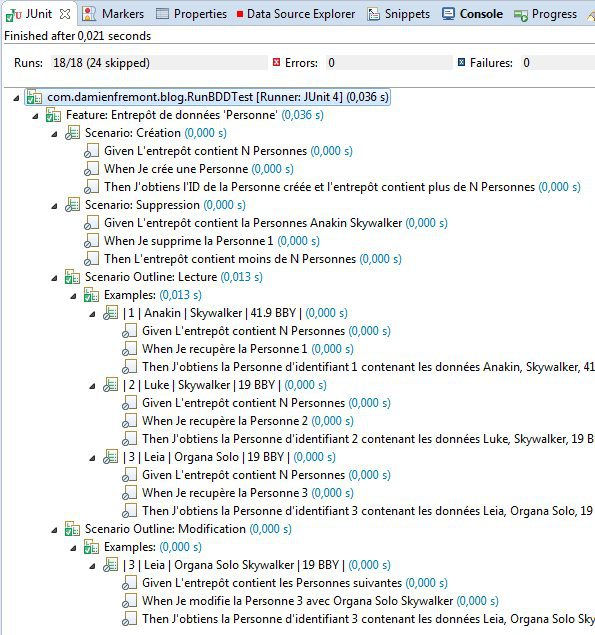

Tests BDD avec Cucumber Java
======
 

 
Ce tutorial explique comment écrire et coder des tests BDD (Behavior Driven Development) grâce à Cucumber pour Java, permettant des cas de test plus fonctionnels, maintenables par des MOA, afin de partager la responsabilité de la qualité et gagner en productivité.
 

 
# Environnement
 
Cucumber Java, c’est quoi ? C’est un outil qui permet de tester. Il automatise les tests d’acceptation par un formalise axé sur le style de développement BDD et sur un vocabulaire précis (Given, When, Then …Etant donnée, Quand, Alors …Arrange, Act, Assert).
 

 
[https://github.com/cucumber/cucumber/wiki/Feature-Introduction](https://github.com/cucumber/cucumber/wiki/Feature-Introduction)
https://github.com/cucumber/cucumber/wiki/Feature-Introduction
Le besoin se situe entre le TDD/TU et le test d’acceptance, au coeur du fonctionnel.
 

 

 
Installation de Cucumber…
 
[http://cukes.info/install-cucumber-jvm.html](http://cukes.info/install-cucumber-jvm.html)
http://cukes.info/install-cucumber-jvm.html
 
pom.xml (Maven)
 
```xml
<?xml version="1.0" encoding="UTF-8"?>
<project xmlns="http://maven.apache.org/POM/4.0.0" xmlns:xsi="http://www.w3.org/2001/XMLSchema-instance" xsi:schemaLocation="http://maven.apache.org/POM/4.0.0 http://maven.apache.org/xsd/maven-4.0.0.xsd">
    <modelVersion>4.0.0</modelVersion>
    <groupId>com.damienfremont.blog</groupId>
    <artifactId>20150129-test-cucumber_java</artifactId>
    <version>0.0.1-SNAPSHOT</version>
    <packaging>jar</packaging>
    <properties>
        <project.build.sourceEncoding>UTF-8</project.build.sourceEncoding>
        <jdk.version>1.7</jdk.version>
    </properties>
    <dependencies>
 
        <dependency>
            <groupId>junit</groupId>
            <artifactId>junit</artifactId>
            <version>4.12</version>
            <scope>test</scope>
        </dependency>
        <dependency>
            <groupId>org.assertj</groupId>
            <artifactId>assertj-core</artifactId>
            <version>1.7.1</version>
            <scope>test</scope>
        </dependency>
 
        <dependency>
            <groupId>info.cukes</groupId>
            <artifactId>cucumber-junit</artifactId>
            <version>1.2.2</version>
            <scope>test</scope>
        </dependency>
        <dependency>
            <groupId>info.cukes</groupId>
            <artifactId>cucumber-java</artifactId>
            <version>1.2.2</version>
            <scope>test</scope>
        </dependency>
 
    </dependencies>
    <build>
        <plugins>
            <plugin>
                <groupId>org.apache.maven.plugins</groupId>
                <artifactId>maven-compiler-plugin</artifactId>
                <configuration>
                    <source>${jdk.version}</source>
                    <target>${jdk.version}</target>
                </configuration>
            </plugin>
        </plugins>
    </build>
</project>
```
 
…et du plugin eclipse pour la coloration syntaxique et le formatage de votre texte (optionnal)
 
[http://cukes.info/cucumber-eclipse/](http://cukes.info/cucumber-eclipse/)
http://cukes.info/cucumber-eclipse/
 

 

 
# Code
 
Les tests vont porter sur un entrepôt de donnée (une simple DAO) autour de l’entité Personne.
 
Les étapes décrites sur le site de Cucumber sont reprises ici, mais pour du Java et avec un peu plus de Français.
 

 

 
[http://cukes.info/](http://cukes.info/)
http://cukes.info/
 
## 1. Describe behaviour in plain text
 
```
Feature: Entrepôt de données 'Personne'
 
  # EXEMPLE SIMPLE
  Scenario: Création
    Given L'entrepôt contient N Personnes
    When Je crée une Personne
    Then J'obtiens l'ID de la Personne créée et l'entrepôt contient plus de N Personnes
 
  # EXEMPLE SPECIFIQUE
  Scenario: Suppression
    Given L'entrepôt contient la Personnes Anakin Skywalker
    When Je supprime la Personne 1
    Then L'entrepôt contient moins de N Personnes
 
  # EXEMPLE AVEC SUBSTITUTION (SCENARIO OUTLINES + EXAMPLES)
  Scenario Outline: Lecture
    Given L'entrepôt contient N Personnes
    When Je recupère la Personne <id>
    Then J'obtiens la Personne d'identifiant <id> contenant les données <prenom>, <nom>, <naissance>
 
    Examples:
      | id | prenom | nom         | naissance |
      | 1  | Anakin | Skywalker   | 41.9 BBY  |
      | 2  | Luke   | Skywalker   | 19 BBY    |
      | 3  | Leia   | Organa Solo | 19 BBY    |
 
  # EXEMPLE AVEC DATA TABLES
  Scenario Outline: Modification
    Given L'entrepôt contient les Personnes suivantes
      | id | prenom | nom         | naissance |
      | 3  | Leia   | Organa Solo | 19 BBY    |
    When Je modifie la Personne <id> avec <nom>
    Then J'obtiens la Personne d'identifiant <id> contenant les données <prenom>, <nom>, <naissance>
 
    Examples:
      | id | prenom | nom                   | naissance |
      | 3  | Leia   | Organa Solo Skywalker | 19 BBY    |
```
 
[http://cukes.info/step-definitions.html](http://cukes.info/step-definitions.html)
Pour les détails de syntaxe, voir le site officiel.
http://cukes.info/step-definitions.html
 
## 2. Write a step definition in Java
 
Il faut absolument s’aider du feedback console de Cucumber (sinon c’est fastidieux et on rate quelques subtilités sur les caractères à échapper dans les annotations @Given, @When, @Then).
Pour cela il suffit de lancer vos scénarios et vous obtiendrez les squelettes de méthodes manquants.
 
RunBDDTest.java (le lanceur de tests)
 
```java
@RunWith(Cucumber.class)
public class RunBDDTest {
 
}
```
 

 

 

 

 
Sortie Console :
 
```
6 Scenarios ([33m6 undefined[0m)
18 Steps ([33m18 undefined[0m)
0m0.000s
 
You can implement missing steps with the snippets below:
 
@Given("^L'entrepôt contient N Personnes$")
public void l_entrepôt_contient_N_Personnes() throws Throwable {
    // Write code here that turns the phrase above into concrete actions
    throw new PendingException();
}
 
@When("^Je crée une Personne$")
public void je_crée_une_Personne() throws Throwable {
    // Write code here that turns the phrase above into concrete actions
    throw new PendingException();
}
 
...
```
 
ATTENTION : le code généré n’est pas optimisé, surtout pour les tags <Examples>.
Avec un step écrit comme ceci…
 
```
When Je modifie la Personne <id> avec <nom>
 
Examples:
  | numero | prenom | nom                   | dateDeNaissance |
  | 2      | Luke   | Maitre Jedi Skywalker | 19 BBY          |
  | 3      | Leia   | Organa Solo Skywalker | 19 BBY          |
```
 
…et pour cela de généré…
 
```java
@When("^Je modifie la Personne (\\d+) avec Organa Solo Skywalker$")
public void je_modifie_la_Personne_avec_Organa_Solo_Skywalker(int arg1) throws Throwable {
    // Write code here that turns the phrase above into concrete actions
    throw new PendingException();
}
 
@When("^Je modifie la Personne (\\d+) avec Maitre Jedi Skywalker$")
public void je_modifie_la_Personne_avec_Maitre_Jedi_Skywalker(int arg1) throws Throwable {
    // Write code here that turns the phrase above into concrete actions
    throw new PendingException();
}
```
 
…il est possible de seulement écrire ça (réutilisable) :
 
```java
@When("^Je modifie la Personne (\\d+) avec (.*)$")
public void je_modifie_la_Personne_avec_(int id, String nom) throws Throwable {
    // Write code here that turns the phrase above into concrete actions
    throw new PendingException();
}
```
 
Ce qui donne au final StepDefinitions.java
 
```java
public class StepDefinitions {
 
    // CE QUI EST A TESTER
 
    private PersonRepository personRepositoryToTest = new PersonRepository();
 
    // DONNEES COMMUNES ENTRE STEPS
 
    private long givenPersonSize;
    private PersonModel whenPersonId;
    private PersonModel whenPerson;
 
    // # EXEMPLE SIMPLE
 
    @Given("^L'entrepôt contient N Personnes$")
    public void l_entrepôt_contient_N_Personnes() throws Throwable {
        // L'entrepôt contient N Personnes
        givenPersonSize = personRepositoryToTest.count();
        assertThat(givenPersonSize).isPositive();
    }
 
    @When("^Je crée une Personne$")
    public void je_crée_une_Personne() throws Throwable {
        // Je crée une Personne
        PersonModel person = new PersonModel();
        whenPersonId = personRepositoryToTest.create(person);
    }
 
    @Then("^J'obtiens l'ID de la Personne créée et l'entrepôt contient plus de N Personnes$")
    public void j_obtiens_l_ID_de_la_Personne_créée_et_l_entrepôt_contient_plus_de_N_Personnes()
            throws Throwable {
        // J'obtiens l'ID de la Personne créée
        assertThat(whenPersonId).isNotNull();
        // l'entrepôt contient N+X Personnes
        long thenPersonCount = personRepositoryToTest.count();
        assertThat(thenPersonCount).isGreaterThan(givenPersonSize);
    }
 
    // # EXEMPLE SPECIFIQUE AVEC ARGUMENTS
 
    @Given("^L'entrepôt contient la Personnes Anakin Skywalker$")
    public void l_entrepôt_contient_la_Personnes_Anakin_Skywalker()
            throws Throwable {
        givenPersonSize = personRepositoryToTest.count();
        // L'entrepôt contient la Personnes Anakin Skywalker
        PersonModel p = personRepositoryToTest.read(1);
        assertThat(p.getPrenom()).isEqualTo("Anakin");
    }
 
    @When("^Je supprime la Personne (\\d+)$")
    public void je_supprime_la_Personne(int arg1) throws Throwable {
        // Je supprime la Personne
        personRepositoryToTest.delete(arg1);
    }
 
    @Then("^L'entrepôt contient moins de N Personnes$")
    public void l_entrepôt_contient_moins_de_N_Personnes() throws Throwable {
        // L'entrepôt contient N-X Personnes
        assertThat(personRepositoryToTest.count()).isLessThan(givenPersonSize);
    }
 
    // # EXEMPLE AVEC SUBSTITUTION (SCENARIO OUTLINES + EXAMPLES)
 
    @When("^Je recupère la Personne (\\d+)$")
    public void je_recupère_la_Personne(int arg1) throws Throwable {
        // Je recupère la Personne
        whenPerson = personRepositoryToTest.read(arg1);
    }
 
    @Then("^J'obtiens la Personne d'identifiant (\\d+) contenant les données (.*), (.*), (.*)$")
    public void j_obtiens_la_Personne_d_identifiant_contenant_les_données(
            int arg1, String prenom, String nom, String naissance)
            throws Throwable {
        // J'obtiens la Personne d'identifiant
        assertThat(whenPerson).isNotNull();
        assertThat(whenPerson.getId()).isEqualTo(arg1);
        // avec les données
        assertThat(whenPerson.getPrenom()).isEqualTo(prenom);
        assertThat(whenPerson.getNom()).isEqualTo(nom);
        assertThat(whenPerson.getNaissance()).isEqualTo(naissance);
    }
 
    // # EXEMPLE AVEC DATA TABLES
 
    @Given("^L'entrepôt contient les Personnes suivantes$")
    public void l_entrepôt_contient_les_Personnes_suivantes(DataTable expected)
            throws Throwable {
        givenPersonSize = personRepositoryToTest.count();
        // L'entrepôt contient les Personnes suivantes
        List<PersonModel> actual = personRepositoryToTest.readAll();
        for (final PersonModel exp : expected.asList(PersonModel.class)) {
            assertThat(actual).haveExactly(1, new Condition<PersonModel>() {
 
                @Override
                public boolean matches(PersonModel act) {
                    return act.getId().equals(exp.getId()) //
                            && act.getPrenom().equals(exp.getPrenom()) //
                            && act.getNom().equals(exp.getNom()) //
                            && act.getNaissance().equals(exp.getNaissance());
                }
            });
        }
    }
 
    @When("^Je modifie la Personne (\\d+) avec (.*)$")
    public void je_modifie_la_Personne_avec_(int id, String nom)
            throws Throwable {
        PersonModel p = personRepositoryToTest.read(id);
        p.setNom(nom);
        whenPerson = personRepositoryToTest.update(p);
    }
 
}
```
 
## 3. Run and watch it fail
 
RunBDDTest.java (le lanceur de tests)
 
```java
@RunWith(Cucumber.class)
public class RunBDDTest {
 
}
```
 

 

 

 

 
## 4. Write code to make the step pass
 
PersonModel.java
 
```java
public class PersonModel implements Serializable {
 
    private static final long serialVersionUID = 6879685199191377814L;
 
    private Integer id;
    private String prenom;
    private String nom;
    private String naissance;
 
    public PersonModel() {
    }
 
    public PersonModel(Integer id, String prenom, String nom, String naissance) {
        super();
        this.id = id;
        this.prenom = prenom;
        this.nom = nom;
        this.naissance = naissance;
    }
 
    public Integer getId() {
        return id;
    }
 
    public void setId(Integer id) {
        this.id = id;
    }
 
    public String getPrenom() {
        return prenom;
    }
 
    public void setPrenom(String prenom) {
        this.prenom = prenom;
    }
 
    public String getNom() {
        return nom;
    }
 
    public void setNom(String nom) {
        this.nom = nom;
    }
 
    public String getNaissance() {
        return naissance;
    }
 
    public void setNaissance(String naissance) {
        this.naissance = naissance;
    }
 
}
```
 
PersonRepository.java
 
```java
public class PersonRepository {
 
    /* DATAS */
 
    private static Map<Integer, PersonModel> datas = null;
 
    public PersonRepository() {
        datas = new HashMap<>();
        datas.put(1, new PersonModel(1, "Anakin", "Skywalker", "41.9 BBY"));
        datas.put(2, new PersonModel(2, "Luke", "Skywalker", "19 BBY"));
        datas.put(3, new PersonModel(3, "Leia", "Organa Solo", "19 BBY"));
    }
 
    public long count() {
        return datas.size();
    }
 
    /* CRUD METHODS */
 
    public PersonModel create(PersonModel entity) {
        int randomNum = new Random().nextInt();
        entity.setId(randomNum);
        datas.put(entity.getId(), entity);
        return entity;
    }
 
    public PersonModel read(Integer id) {
        return datas.get(id);
    }
 
    public List<PersonModel> readAll() {
        return new ArrayList<PersonModel>(datas.values());
    }
 
    public PersonModel update(PersonModel entity) {
        return datas.put(entity.getId(), entity);
    }
 
    public void delete(Integer id) {
        datas.remove(id);
    }
 
}
```
 
## 5. Run again and see the step pass
 

 

 
## 6. Repeat 2-5 until green like a cuke
 
(idem)
 
# Conclusion
 
Cucumber est un outils puissant, voir indispensable pour garantir une approche agile sur vos projet et leur bonne maintenance. Mais il faut garder à l’esprit que l’intérêt de ce genre de techno n’est clairement pas du coté des développeurs, mais des MOA. On n’écharpera pas aux commentaires du genre “c’est pas plus rapide à coder”, “ça me limite”.
 
Les plus :
 
* un document commun avec votre MOA, dont elle doit avoir la responsabilité
* gros gain de productivité sur les tests des cas aux limites d’un scénario
* analyse de la couverture de code par des plugins comme Emma qui fonctionne toujours
 
Les moins :
 
* un peu laborieux car travail très manuel (peu de compilation) mais la productivité est au rendez-vous
* Pas d’erreur si un step n’est pas trouvé, juste un skip du test.
* Pour un projet qui bouge beaucoup, Cucumber-JS ou Ruby semblent plus indiqués (voir problème de duplication de code ci-dessous sur un langage compilé comme Java), même si cela oblige à manipuler 2 contextes d’exécution (JS + la techno de votre projet, Java par exemple).
* Feedbacks un peu léger pour les débutants sur les erreurs de syntax dans un fichier feature. Et le plugin Cucumber-Eclipse n’apporte rien de plus à ce niveau là.
 
* Par contre le pendant Cucumber-Java est lourd à utiliser car il implique de la duplication de code par rapport à Cucumber-JS lors de l’étape de définition des steps.
 
Cucumber-Java (il faut taper un nom de méthode en plus)
 
```java
@Given("^I have entered (.*) into the calculator$")
public void i_have_entered_into_the_calculator() throws Throwable {
// express the regexp above with the code you wish you had
}
```
 
Cucumber-JS
 
```javascript
Given( /^I have entered (.*) into the calculator$/, function(callback) {
// express the regexp above with the code you wish you had
callback.pending();
});
```
 
Cucumber-RUBY
 
```ruby
Given /^I have entered (.*) into the calculator$/ do |arg1|
pending # express the regexp above with the code you wish you had
end
```
 
Attention, ce genre de test n’est pas fait pour des tests unitaires de briques logiciels. A privilégier plutôt pour des suites de tests fonctionnels, à rédiger en binôme avec vos responsables fonctionnels / MOA / PO.
 
# Pour aller plus loin
 
Il faudrait ajouter du reporting plus propre pour la MOA avec Maven Surefire Report Plugin ou une page de rapport de server de build type Bamboo ou Jenkins.
 
Et un éditeur tel que Gherkin ou sa version collaborative pour permettre à des non-devs d’écrirent ces scénarios.
 

 

 
[https://github.com/cucumber/gherkin-editor](https://github.com/cucumber/gherkin-editor)
https://github.com/cucumber/gherkin-editor
 
# Source
 
[https://github.com/damienfremont/blog/tree/master/20150129-test-cucumber_java](https://github.com/damienfremont/blog/tree/master/20150129-test-cucumber_java)
https://github.com/damienfremont/blog/tree/master/20150129-test-cucumber_java
 
# References
 
[http://cukes.info/](http://cukes.info/)
http://cukes.info/
 
[http://cukes.info/install-cucumber-jvm.html](http://cukes.info/install-cucumber-jvm.html)
http://cukes.info/install-cucumber-jvm.html
 
[http://cukes.info/step-definitions.html](http://cukes.info/step-definitions.html)
http://cukes.info/step-definitions.html
 
[http://www.goodercode.com/wp/using-cucumber-tests-with-maven-and-java/](http://www.goodercode.com/wp/using-cucumber-tests-with-maven-and-java/)
http://www.goodercode.com/wp/using-cucumber-tests-with-maven-and-java/
 
[https://thomassundberg.wordpress.com/2014/05/29/cucumber-jvm-hello-world/](https://thomassundberg.wordpress.com/2014/05/29/cucumber-jvm-hello-world/)
https://thomassundberg.wordpress.com/2014/05/29/cucumber-jvm-hello-world/
 
[http://cukes.info/cucumber-eclipse/](http://cukes.info/cucumber-eclipse/)
http://cukes.info/cucumber-eclipse/
 
 
[https://damienfremont.com/2015/01/29/tests-bdd-avec-cucumber-java/](https://damienfremont.com/2015/01/29/tests-bdd-avec-cucumber-java/)
 
