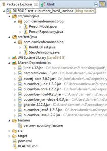

Tests BDD Cucumber simplifiés avec les lambdas Java8
======
 

 
Ce tutorial explique comment écrire et coder des tests BDD (Behavior Driven Development) grâce à Cucumber pour Java et se focalise sur l’apport des lambdas de Java8 pour cet outil. Notamment sur la simplicité d’écriture.
 

 
[Tests BDD avec Cucumber Java](http://damienfremont.com/2015/01/29/tests-bdd-avec-cucumber-java/)
Suite et reprise du post Tests BDD avec Cucumber Java.
 
# 
 
# Environnement
 

 

 
Le code pour lancer les scénarios de test reste le même.
RunBDDTest.java
 
```java
@RunWith(Cucumber.class)
public class RunBDDTest {
 
}
```
 
C’est lui qui va inspecter StepDefinitions.java.
 
# Code Java 8 (lambda)
 
StepDefinitions.java
 
```java
public class StepDefinitions implements En {
 
    // CE QUI EST A TESTER
 
    private PersonRepository personRepositoryToTest = new PersonRepository();
 
    // DONNEES COMMUNES ENTRE STEPS
 
    private long givenPersonSize;
    private PersonModel whenPersonId;
    private PersonModel whenPerson;
 
    public StepDefinitions() {
 
        // # EXEMPLE SIMPLE
 
        Given("^L'entrepot contient N Personnes$", () -> {
            givenPersonSize = personRepositoryToTest.count();
            assertThat(givenPersonSize).isPositive();
        });
 
        When("^Je cree une Personne$", () -> {
            PersonModel person = new PersonModel();
            whenPersonId = personRepositoryToTest.create(person);
        });
 
        Then("^J'obtiens l'ID de la Personne cree et l'entrepot contient plus de N Personnes$",
                () -> {
                    assertThat(whenPersonId).isNotNull();
                    long thenPersonCount = personRepositoryToTest.count();
                    assertThat(thenPersonCount).isGreaterThan(givenPersonSize);
                });
 
        // # EXEMPLE SPECIFIQUE AVEC ARGUMENTS
 
        Given("^L'entrepot contient la Personnes Anakin Skywalker$", () -> {
            givenPersonSize = personRepositoryToTest.count();
            PersonModel p = personRepositoryToTest.read(1);
            assertThat(p.getPrenom()).isEqualTo("Anakin");
        });
 
        When("^Je supprime la Personne (\\d+)$", (Integer id) -> {
            personRepositoryToTest.delete(id);
        });
 
        Then("^L'entrepot contient moins de N Personnes$",
                () -> {
                    assertThat(personRepositoryToTest.count()).isLessThan(
                            givenPersonSize);
                });
 
        // # EXEMPLE AVEC SUBSTITUTION (SCENARIO OUTLINES + EXAMPLES)
 
        When("^Je recupere la Personne (\\d+)$", (Integer id) -> {
            whenPerson = personRepositoryToTest.read(id);
        });
 
        Then("^J'obtiens la Personne d'identifiant (\\d+) contenant les donnees (.*), (.*), (.*)$",
                (Integer id, String prenom, String nom, String naissance) -> {
                    // J'obtiens la Personne d'identifiant
                    assertThat(whenPerson).isNotNull();
                    assertThat(whenPerson.getId()).isEqualTo(id);
                    // avec les donnees
                    assertThat(whenPerson.getPrenom()).isEqualTo(prenom);
                    assertThat(whenPerson.getNom()).isEqualTo(nom);
                    assertThat(whenPerson.getNaissance()).isEqualTo(naissance);
                });
    }
 
}
```
 
# Code Java 7 (methods, matchers)
 
StepDefinitions.java
 
```java
public class StepDefinitions {
 
    // CE QUI EST A TESTER
 
    private PersonRepository personRepositoryToTest = new PersonRepository();
 
    // DONNEES COMMUNES ENTRE STEPS
 
    private long givenPersonSize;
    private PersonModel whenPersonId;
    private PersonModel whenPerson;
 
    // # EXEMPLE SIMPLE
 
    @Given("^L'entrepôt contient N Personnes$")
    public void l_entrepôt_contient_N_Personnes() throws Throwable {
        // L'entrepôt contient N Personnes
        givenPersonSize = personRepositoryToTest.count();
        assertThat(givenPersonSize).isPositive();
    }
 
    @When("^Je crée une Personne$")
    public void je_crée_une_Personne() throws Throwable {
        // Je crée une Personne
        PersonModel person = new PersonModel();
        whenPersonId = personRepositoryToTest.create(person);
    }
 
    @Then("^J'obtiens l'ID de la Personne créée et l'entrepôt contient plus de N Personnes$")
    public void j_obtiens_l_ID_de_la_Personne_créée_et_l_entrepôt_contient_plus_de_N_Personnes()
            throws Throwable {
        // J'obtiens l'ID de la Personne créée
        assertThat(whenPersonId).isNotNull();
        // l'entrepôt contient N+X Personnes
        long thenPersonCount = personRepositoryToTest.count();
        assertThat(thenPersonCount).isGreaterThan(givenPersonSize);
    }
 
    // # EXEMPLE SPECIFIQUE AVEC ARGUMENTS
 
    @Given("^L'entrepôt contient la Personnes Anakin Skywalker$")
    public void l_entrepôt_contient_la_Personnes_Anakin_Skywalker()
            throws Throwable {
        givenPersonSize = personRepositoryToTest.count();
        // L'entrepôt contient la Personnes Anakin Skywalker
        PersonModel p = personRepositoryToTest.read(1);
        assertThat(p.getPrenom()).isEqualTo("Anakin");
    }
 
    @When("^Je supprime la Personne (\\d+)$")
    public void je_supprime_la_Personne(int arg1) throws Throwable {
        // Je supprime la Personne
        personRepositoryToTest.delete(arg1);
    }
 
    @Then("^L'entrepôt contient moins de N Personnes$")
    public void l_entrepôt_contient_moins_de_N_Personnes() throws Throwable {
        // L'entrepôt contient N-X Personnes
        assertThat(personRepositoryToTest.count()).isLessThan(givenPersonSize);
    }
 
    // # EXEMPLE AVEC SUBSTITUTION (SCENARIO OUTLINES + EXAMPLES)
 
    @When("^Je recupère la Personne (\\d+)$")
    public void je_recupère_la_Personne(int arg1) throws Throwable {
        // Je recupère la Personne
        whenPerson = personRepositoryToTest.read(arg1);
    }
 
    @Then("^J'obtiens la Personne d'identifiant (\\d+) contenant les données (.*), (.*), (.*)$")
    public void j_obtiens_la_Personne_d_identifiant_contenant_les_données(
            int arg1, String prenom, String nom, String naissance)
            throws Throwable {
        // J'obtiens la Personne d'identifiant
        assertThat(whenPerson).isNotNull();
        assertThat(whenPerson.getId()).isEqualTo(arg1);
        // avec les données
        assertThat(whenPerson.getPrenom()).isEqualTo(prenom);
        assertThat(whenPerson.getNom()).isEqualTo(nom);
        assertThat(whenPerson.getNaissance()).isEqualTo(naissance);
    }
 
    // # EXEMPLE AVEC DATA TABLES
 
    @Given("^L'entrepôt contient les Personnes suivantes$")
    public void l_entrepôt_contient_les_Personnes_suivantes(DataTable expected)
            throws Throwable {
        givenPersonSize = personRepositoryToTest.count();
        // L'entrepôt contient les Personnes suivantes
        List<PersonModel> actual = personRepositoryToTest.readAll();
        for (final PersonModel exp : expected.asList(PersonModel.class)) {
            assertThat(actual).haveExactly(1, new Condition<PersonModel>() {
 
                @Override
                public boolean matches(PersonModel act) {
                    return act.getId().equals(exp.getId()) //
                            && act.getPrenom().equals(exp.getPrenom()) //
                            && act.getNom().equals(exp.getNom()) //
                            && act.getNaissance().equals(exp.getNaissance());
                }
            });
        }
    }
 
    @When("^Je modifie la Personne (\\d+) avec (.*)$")
    public void je_modifie_la_Personne_avec_(int id, String nom)
            throws Throwable {
        PersonModel p = personRepositoryToTest.read(id);
        p.setNom(nom);
        whenPerson = personRepositoryToTest.update(p);
    }
 
}
```
 
# Dependency (Maven)
 
Il faut penser à passer à Cucumber-Java8 et AssertJ 3 pour bénéficier des apports de Java8.
 
pom.xml
 
```xml
<?xml version="1.0" encoding="UTF-8"?>
<project xmlns="http://maven.apache.org/POM/4.0.0" xmlns:xsi="http://www.w3.org/2001/XMLSchema-instance" xsi:schemaLocation="http://maven.apache.org/POM/4.0.0 http://maven.apache.org/xsd/maven-4.0.0.xsd">
    <modelVersion>4.0.0</modelVersion>
    <groupId>com.damienfremont.blog</groupId>
    <artifactId>20150419-test-cucumber_java8_lambda</artifactId>
    <version>0.0.1-SNAPSHOT</version>
    <packaging>jar</packaging>
    <properties>
        <jdk.version>1.8</jdk.version>
    </properties>
    <dependencies>
 
        <dependency>
            <groupId>junit</groupId>
            <artifactId>junit</artifactId>
            <version>4.12</version>
            <scope>test</scope>
        </dependency>
        <dependency>
            <groupId>org.assertj</groupId>
            <artifactId>assertj-core</artifactId>
            <version>3.0.0</version>
            <scope>test</scope>
        </dependency>
 
        <dependency>
            <groupId>info.cukes</groupId>
            <artifactId>cucumber-junit</artifactId>
            <version>1.2.2</version>
            <scope>test</scope>
        </dependency>
        <dependency>
            <groupId>info.cukes</groupId>
            <artifactId>cucumber-java8</artifactId>
            <version>1.2.2</version>
            <scope>test</scope>
        </dependency>
 
    </dependencies>
    <build>
        <plugins>
            <plugin>
                <groupId>org.apache.maven.plugins</groupId>
                <artifactId>maven-compiler-plugin</artifactId>
                <configuration>
                    <source>${jdk.version}</source>
                    <target>${jdk.version}</target>
                </configuration>
            </plugin>
        </plugins>
    </build>
</project>
```
 
# Conclusion
 
Cucumber devient enfin utilisable et productif en Java.
 
En Java7, chaque Step devait être une méthode annotée de @Given(…), @When(…) ou @Then(…). Les asserts reposaient sur les Matchers. Définir les Steps étaient pénible en Java7, à cause de la duplication de code entre l’annotation et le nom de méthode.
 
En Java8, l’écriture se rapproche de Groovy par exemple grâce aux lambda. La syntaxe est plus légère et robuste.
 
# Source
 
[https://github.com/DamienFremont/blog/tree/master/20150419-test-cucumber_java8_lambda](https://github.com/DamienFremont/blog/tree/master/20150419-test-cucumber_java8_lambda)
https://github.com/DamienFremont/blog/tree/master/20150419-test-cucumber_java8_lambda
 
# References
 
[https://cukes.info/docs/reference/jvm](https://cukes.info/docs/reference/jvm)
https://cukes.info/docs/reference/jvm
 
[https://rmannibucau.wordpress.com/2015/01/26/cukespace-or-bdd-arquillian-and-java-8/](https://rmannibucau.wordpress.com/2015/01/26/cukespace-or-bdd-arquillian-and-java-8/)
https://rmannibucau.wordpress.com/2015/01/26/cukespace-or-bdd-arquillian-and-java-8/
 
 
[https://damienfremont.com/2015/04/19/tests-bdd-cucumber-simplifies-avec-les-lambdas-java8/](https://damienfremont.com/2015/04/19/tests-bdd-cucumber-simplifies-avec-les-lambdas-java8/)
 
