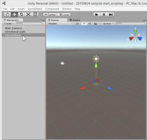
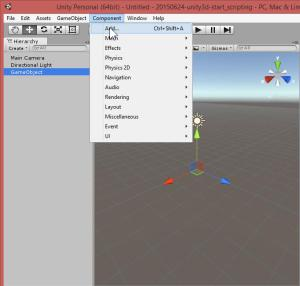
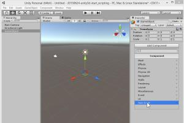
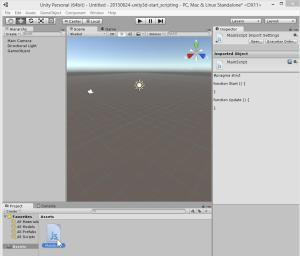
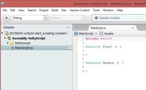
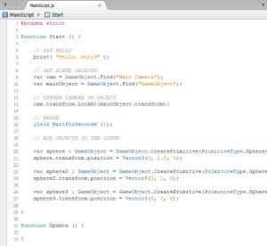
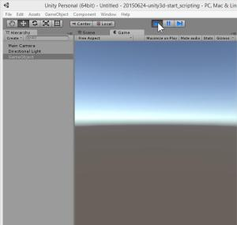
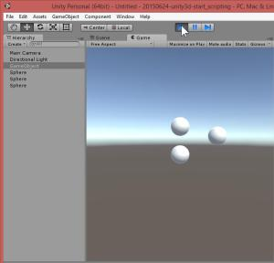

How to Unity3d : start with javascript scripting only
======
 

 
This tutorial is for those who choose to program rather than using the Unity3d IDE.
 
It covers multiple stages, from project creation to basic scripting.
 

 
# Step 1 : Prepare Environnement
 
You’ll need Unity3d. Get the free version here :
 
[https://unity3d.com/get-unity/](https://unity3d.com/get-unity/)
https://unity3d.com/get-unity/
 

 

 
# Step 2 : Create Project
 
So create a new project.
 

 

 
Choose a name for it.
 

 

 
# Step 3 : Create Main Scene and Game Object
 
Unity3d needs at least one scene and a game object, to attach scripts on. And because it’s binary file, this can only be made only by using Unity3d SDK.
 
At this point, unity3d is launched with an empty scene.
 

 

 
So create an empty game object.
 

 

 
# Step 4 : Link Script to Scene
 
JavaScript file needs to be attached to a game object.
 
So select the new game object.
 

 

 
Add a new component to it by clicking on component menu then add…
 

 

 
At this point, Inspector view displays a new component form. Choose new script.
 

 

 
Then type a name and choose a scripting language (Javascript here).
 

 

 
Then click on create.
 

 

 
Here is a new script ! When script is selected, the Inspector view display script content (source code).
 

 

 
# Step 5 : Start Scripting
 
Right click on the script file in the Asset view. Choose Open.
 

 

 
Then the MonoDevelop editor starts…
 

 

 
By default, a script has two function : start() and update(). Start function starts with the object, and so with the scene.
 

 

 
Add a little code to your script.
 
MainScript.js
 
```
#pragma strict
 
function Start () {
 
    // SAY HELLO
    print( "Hello, world" );
 
    // GET SCENE OBJECTS
    var cam = GameObject.Find("Main Camera");
    var mainObject = GameObject.Find("GameObject");
 
    // CENTER CAMERA ON OBJECT
    cam.transform.LookAt(mainObject.transform);
 
    // PAUSE
    yield WaitForSeconds (1);
 
    // ADD OBJECTS TO THE SCENE
 
    var sphere : GameObject = GameObject.CreatePrimitive(PrimitiveType.Sphere);
    sphere.transform.position = Vector3(0, 1.5, 0);
 
    var sphere2 : GameObject = GameObject.CreatePrimitive(PrimitiveType.Sphere);
    sphere2.transform.position = Vector3(2, 1, 0);
 
    var sphere3 : GameObject = GameObject.CreatePrimitive(PrimitiveType.Sphere);
    sphere3.transform.position = Vector3(0, 0, 0);
 
}
 
function Update () {
 
}
```
 
Save your Javascript file.
 

 

 
Save your Script
 
# Demo
 
Open your Unity3d SDK and click on Play button.
 

 

 
And wait for the demo to start…
 
Then wait 1 seconde.
 

 

 
The demo add three new spheres to the scene.
 

 

 
Then the demo print “Hello world” to the console.
 

 

 
(and don’t forget to save your scene for later!)
 

 

 
# Conclusion
 
From there, you can start to script an entire project, without even open Unity3d (only for building). It’s an easier way for building game were programming is a core aspect of the project. Like with procedural generation level or reusable components. Or for those who are not familiar with a 3d software like Unity3d IDE.
 
Tips : for a full scripting, remove default camera and light from the scene, and add them by scripting.
 
# Sources
 
[https://github.com/DamienFremont/blog/tree/master/20150624-unity3d-start_scripting](https://github.com/DamienFremont/blog/tree/master/20150624-unity3d-start_scripting)
https://github.com/DamienFremont/blog/tree/master/20150624-unity3d-start_scripting
 
# References
 
[http://docs.unity3d.com/Manual/CreatingAndUsingScripts.html](http://docs.unity3d.com/Manual/CreatingAndUsingScripts.html)
http://docs.unity3d.com/Manual/CreatingAndUsingScripts.html
 
[https://unity3d.com/learn/tutorials/modules/beginner/scripting/classes](https://unity3d.com/learn/tutorials/modules/beginner/scripting/classes)
https://unity3d.com/learn/tutorials/modules/beginner/scripting/classes
 
 
[https://damienfremont.com/2015/06/24/how-to-unity3d-start-with-javascript-scripting-only/](https://damienfremont.com/2015/06/24/how-to-unity3d-start-with-javascript-scripting-only/)
 
