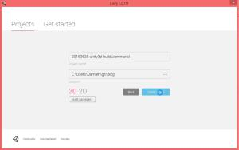
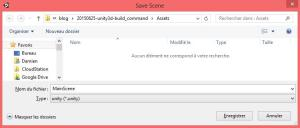
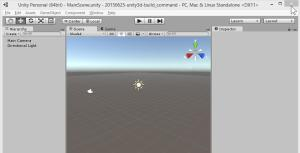
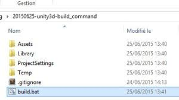
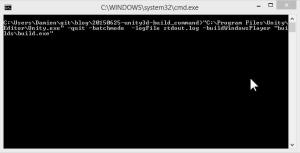
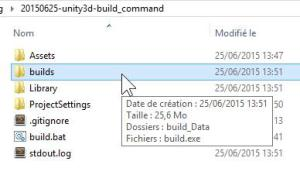
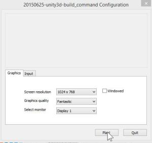
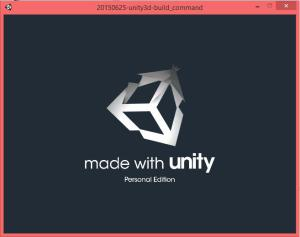
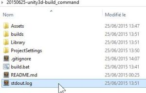

How to Unity3d : command build without build pipeline
======
 

 
This tuturial explains how to build application without using the pro edition of Unity3d editor, wich integrates buildpipeline functionalities. Simply by using command line script.
 

 
Warning : This tutorial is not useful if you own the Pro Edition of Unity3d, wich already contains a buildpipeline system using Unity3d scriptting (Javascript or CSharp). In this case, go see :
 
[http://docs.unity3d.com/Manual/BuildPlayerPipeline.html](http://docs.unity3d.com/Manual/BuildPlayerPipeline.html)
http://docs.unity3d.com/Manual/BuildPlayerPipeline.html
 
# Step 1 : Create Project
 
So create a new project.
 

 

 

 

 
Save your project !
 

 

 
# Step 2 : Close Unity3d !
 
This an important step because Unity3d only allows a single running instance of Unity3d.
 

 

 
## Step 2 : Create Script
 
Create a new file named build.bat at the project root folder, next to Assets folder.
 

 

 
build.bat
 
```
"C:\Program Files\Unity\Editor\Unity.exe" -quit -batchmode  -logFile stdout.log -buildWindowsPlayer "builds\build.exe"
```
 
## Details :
 
execute unity3d in batchmode / command line :
 
```
"C:\Program Files\Unity\Editor\Unity.exe" -quit -batchmode
```
 
create a log file containning build console output :
 
```
-logFile stdout.log
```
 
build the gameproject for windows plateforme :
 
```
-buildWindowsPlayer "builds\build.exe"
```
 
# Demo
 
Launch build.bat via command line for console output result, or just click on build.bat.
 

 

 
A new window pops.
 

 

 
After a while (30 sec), the window closes itself. The build is finished !
 
Go open the newly created build folder.
 

 

 
It contains your game executable.
 
Click on build.exe
 

 

 
The game launcher appears. Click on Play!
 

 

 
Then your game launchs.
 

 

 

 

 
(it’s an empty scene here)
 
Build console output is in stdout.log file, next to build.bat file.
 

 

 

 

 
# Error (first use only)
 
Unity3d needs to link your project folder.
 
Then you need to open your project with Unity3d a first time before building it by command line. For duplicate or moved project folder, you’ll need to reopen the folder with unity3d.
 
# Conclusion
 
This approach is more developper friendly than the unity3d IDE. You can use your own text editor like SublimeText and build with an automatic task.
 
Unity3d web site is poorly documented on this usage.
 
# Sources
 
[https://github.com/DamienFremont/blog/tree/master/20150625-unity3d-build_command](https://github.com/DamienFremont/blog/tree/master/20150625-unity3d-build_command)
https://github.com/DamienFremont/blog/tree/master/20150625-unity3d-build_command
 
# References
 
[http://docs.unity3d.com/Manual/CommandLineArguments.html](http://docs.unity3d.com/Manual/CommandLineArguments.html)
http://docs.unity3d.com/Manual/CommandLineArguments.html
 
 
[https://damienfremont.com/2015/06/25/how-to-unity3d-command-build-without-build-pipeline/](https://damienfremont.com/2015/06/25/how-to-unity3d-command-build-without-build-pipeline/)
 
