Simple GNU C Compiler With NIX Shell on windows
======
 
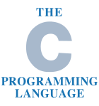
 
This tutorial is intended for developers who want to start developing in C on Windows, without having to use a heavy software like VisualStudio. And having a Linux like shell of course.
 

 
# How to
 
Download MinGW for Windows at:
 
[http://sourceforge.net/projects/mingw/files/latest/download?source=files](http://sourceforge.net/projects/mingw/files/latest/download?source=files)
http://sourceforge.net/projects/mingw/files/latest/download?source=files
 

 

 
Execute the MinGW installer
 

 

 
in admin mode
 
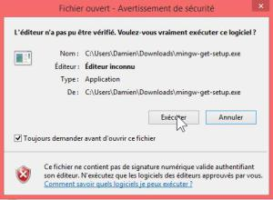
 

 
Follow the installer steps
 
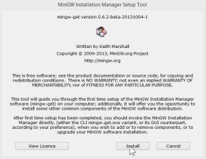
 

 

 

 

 

 
Then close the window
 

 

 
A new winows appears : the installer
 

 

 
select packages to install :
 
* dev-tools
* base (c compiler)
* g++ (c++ compiler)
* msys (NIX shell)
 
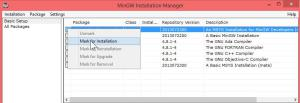
 

 
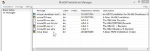
 

 
Then click on Installation menu, update catalogue
 

 

 
A new window appears with some gibberish text. Click on Review
 

 

 
Click on Apply
 

 

 
Then wait for the end of the download (30 secondes)
 

 

 
After, close the installer
 
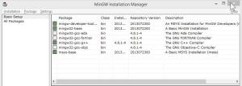
 

 
Explorer your C: harddrive. A new MinGW folder appears
 
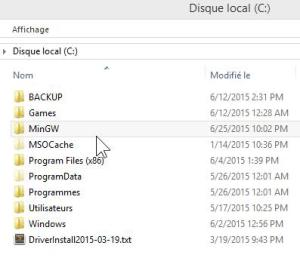
 

 
Click on C:\MinGW\msys\1.0\msys.bat
 
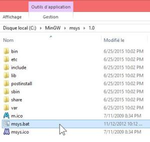
 

 
A new NIX shell appears.
 

 

 
Create a .profile file inside (on Windows it’s not possible to create a file starting with “.”, so copy a file from my github or create it with touch command with the NIX shell)
 
```
touch .profile
```
 

 

 
Close it. It’s just for the creation of the default user home folder.
 
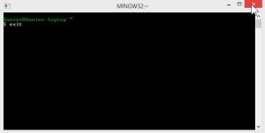
 

 
A new home folder appears at C:\MinGW\msys\1.0\home\
 
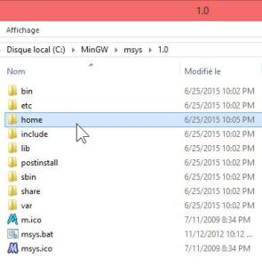
 

 
Open it. It contains your home folder (in my case: C:\MinGW\msys\1.0\home\Damien)
 
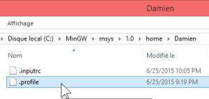
 

 
Open .profile with your text editor and add this :
 
.profile
 
```
# Cd to my windows home:
cd /c/Users/Damien
```
 

 

 
Save it. And start msys.bat again
 

 

 
At NIX shell, type the ls command.
 
```
 
```
 
The result is the content of your Windows user folder, instead of the NIX C:\MinGW\msys\1.0\home\***
 

 

 
Close this windows.
 
Then create a shortcut of msys.bat to your desktop or set it in your Windows path env.
 
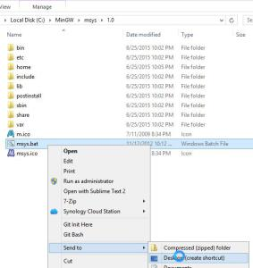
 

 
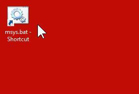
 

 
Your environnement is ready!
 
# Demo
 
Create a c source code file in your user folder with your text editor
 
test.c
 
```
#include <stdio.h>
 
int main(){
    printf("Hello World!");
    return(0);
}
```
 
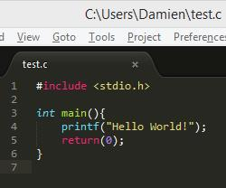
 

 

 

 
Launch msys.bat
 

 

 
A new NIX shell appears. Type the compile command gcc on your new source file.
 
```
gcc test.c
```
 

 

 
Execute the generated executable with :
a NIX command :
 
```
./a.exe
```
 
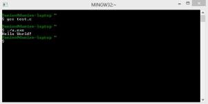
 

 
or a Windows click on the .exe
 
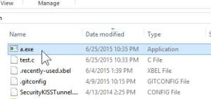
 

 
or a windows command line
 
```
a.exe
```
 

 

 
# Conclusion
 
MinGW is a simple and friendly tool for those who seek to program on a Linux like shell on Windows.
 
…BUT the MinGW documentation is very harsh with newbies, installer steps are very strange for a Windows user and the downloading package part required a lot of time (not easy in offline mode).
 
It’s not a turnkey solution, but it does the job.
 
# Source
 
[https://github.com/DamienFremont/blog/tree/master/20150625-c_compiler_win_shell](https://github.com/DamienFremont/blog/tree/master/20150625-c_compiler_win_shell)
https://github.com/DamienFremont/blog/tree/master/20150625-c_compiler_win_shell
 
# References
 
[https://assos.centrale-marseille.fr/ginfo/tutoriels/ma%C3%AEtrisez-la-compilation-cc-sous-windows](https://assos.centrale-marseille.fr/ginfo/tutoriels/ma%C3%AEtrisez-la-compilation-cc-sous-windows)
https://assos.centrale-marseille.fr/ginfo/tutoriels/ma%C3%AEtrisez-la-compilation-cc-sous-windows
 
[http://stackoverflow.com/questions/7000524/changing-mingw-startup-directory-or-creating-mingw-symlinks](http://stackoverflow.com/questions/7000524/changing-mingw-startup-directory-or-creating-mingw-symlinks)
http://stackoverflow.com/questions/7000524/changing-mingw-startup-directory-or-creating-mingw-symlinks
 
[http://stackoverflow.com/questions/7000524/changing-mingw-startup-directory-or-creating-mingw-symlinks](http://stackoverflow.com/questions/7000524/changing-mingw-startup-directory-or-creating-mingw-symlinks)
http://stackoverflow.com/questions/7000524/changing-mingw-startup-directory-or-creating-mingw-symlinks
 
 
## Origin
[https://damienfremont.com/2015/06/25/simple-gnu-c-compiler-with-nix-shell-on-windows/](https://damienfremont.com/2015/06/25/simple-gnu-c-compiler-with-nix-shell-on-windows/)
 
