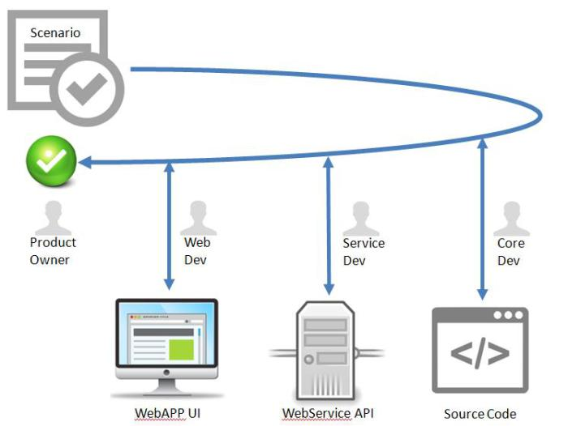
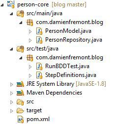
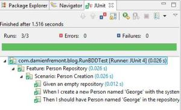
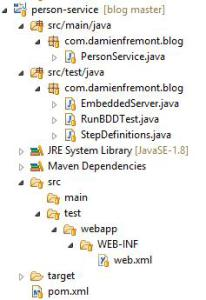
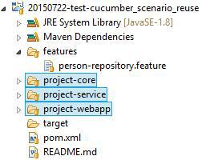
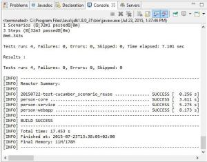

How to Cucumber Java : ReUse Same Scenario for Core, Service and Web UI Tests
======
 

 
An example of unified code to reuse the same functional test scenario. Over unit tests of the core component code, or exposed API and services, and finally the web application UI.
 
It’s useful for quality: non-regression test, continous integration, fast feedback, short loop, cost reduction, etc.
 

 
## Step 1 : Write a Generic Cucumber Scenario
 
person-repository.feature
 
```
Feature: Person Repository
 
  Scenario: Person Creation
    Given an empty repository
    When I create a new Person named 'George' with the system
    Then I should have Person named 'George' in the repository
```
 
## And give it to developers.
 

 

 
## Step 2 : Code a Unit Test for Core Component
 
RunBDDTest.java
 
```java
package com.damienfremont.blog;
 
import org.junit.runner.RunWith;
 
import cucumber.api.CucumberOptions;
import cucumber.api.junit.Cucumber;
 
@RunWith(Cucumber.class)
@CucumberOptions(strict = true, features = "../features")
public class RunBDDTest {
 
}
```
 
StepDefinitions.java
 
```java
package com.damienfremont.blog;
 
import static org.assertj.core.api.StrictAssertions.assertThat;
import cucumber.api.java8.En;
 
public class StepDefinitions implements En {
 
    static PersonRepository SYSTEM = new PersonRepository();
 
    public StepDefinitions() {
 
        Given("an empty repository",
            () ->
                assertThat( SYSTEM.count()).isEqualTo( 0 ));
 
        When("I create a new Person named '(.*)' with the system",
            (String name) ->
                SYSTEM.create( new PersonModel(name)));
 
        Then("I should have Person named '(.*)' in the repository",
            (String name) ->
                assertThat(SYSTEM.read(name)).isNotNull());
         
    }
}
```
 
## Step 3 : Code API Test with REST client
 
RunBDDTest.java
(the same as before)
 
EmbeddedServer.java
(see previous post)
 
StepDefinitions.java
 
```java
package com.damienfremont.blog;
 
import static com.jayway.restassured.RestAssured.expect;
import static org.hamcrest.Matchers.hasItems;
import static org.hamcrest.Matchers.hasSize;
import com.google.common.base.Throwables;
import cucumber.api.java8.En;
 
public class StepDefinitions implements En {
 
    private static EmbeddedServer SYSTEM;
     
    public StepDefinitions() {
 
        Given("an empty repository",
            () ->
                expect()
                    .statusCode(200)
                    .body("results", hasSize(0))
                .when()
                    .get("/server/api/person"));
 
        When("I create a new Person named '(.*)' with the system",
            (String name) ->
                expect()
                    .statusCode(200)
                .given()
                    .contentType("text/plain")
                    .content(name)
                .when()
                    .post("/server/api/person"));
 
        Then("I should have Person named '(.*)' in the repository",
            (String name) ->
                expect()
                    .statusCode(200)
                    .body("name", hasItems(name))
                .when()
                    .get("/server/api/person"));
         
        Before(
            ()-> {
                try {
                    SYSTEM = new EmbeddedServer(8080, "/server");
                    SYSTEM.start();
                } catch (Exception e) {
                    throw Throwables.propagate(e);
                }
        });
         
        After(
            ()-> {
                SYSTEM.stop();
            });
    }
}
```
 
## Step 4 : Code a Web UI Test with Selenium
 
RunBDDTest.java
(the same as before)
 
StepDefinitions.java
 
```java
package com.damienfremont.blog;
 
import static java.util.concurrent.TimeUnit.SECONDS;
import static org.junit.Assert.assertTrue;
import static org.openqa.selenium.phantomjs.PhantomJSDriverService.PHANTOMJS_EXECUTABLE_PATH_PROPERTY;
import org.openqa.selenium.By;
import org.openqa.selenium.WebDriver;
import org.openqa.selenium.phantomjs.PhantomJSDriver;
import org.openqa.selenium.remote.DesiredCapabilities;
import com.google.common.base.Throwables;
import com.google.common.collect.ImmutableMap;
 
import cucumber.api.java8.En;
 
public class StepDefinitions implements En {
 
    private static EmbeddedServer server;
    private static WebDriver driver;
     
    public StepDefinitions() {
 
        Given("an empty repository",
            () -> {
                driver.get("http://localhost:8080/server");
                assertTrue(driver.findElement(By.cssSelector(
                    "#message"))
                        .getText().contains("0 items"));
                assertTrue(driver.findElement(By.cssSelector(
                    "#items"))
                        .getText().isEmpty());
            });
 
        When("I create a new Person named '(.*)' with the system",
            (String name) ->{
                driver.get("http://localhost:8080/server");
                driver.findElement(By.cssSelector(
                    "#newItem"))
                        .sendKeys(name);               
                driver.findElement(By.cssSelector(
                    "#newButton"))
                        .click();
            });
 
        Then("I should have Person named '(.*)' in the repository",
            (String name) ->{
                driver.get("http://localhost:8080/server");
                assertTrue(driver.findElement(By.cssSelector(
                    "#message"))
                        .getText().contains("1 items"));
                assertTrue(driver.findElement(By.cssSelector(
                    "#items"))
                        .getText().contains(name));
            });
         
        Before(
            ()-> {
                // INIT WEB SERVER (TOMCAT)
                try {
                    server = new EmbeddedServer(8080, "/server");
                    server.start();
                } catch (Exception e) {
                    throw Throwables.propagate(e);
                }
                // INIT WEB BROWSER (SELENIUM + PHANTOMJS)
                driver = new PhantomJSDriver(
                new DesiredCapabilities(ImmutableMap.of( //
                        PHANTOMJS_EXECUTABLE_PATH_PROPERTY, //
                        new PhantomJsDownloader().downloadAndExtract()
                                .getAbsolutePath())));
                driver.manage().timeouts().implicitlyWait(5, SECONDS);
        });
         
        After(
            ()-> {
                server.stop();
            });
    }
}
```
 
# Demo
 
## Test Core Layer
 
Testing that core component:
 
```java
class PersonRepository {
    PersonModel create(PersonModel entity) ...
    List<PersonModel> readAll() ...
}
```
 

 
with this project:
 
And launching RunBDDTest.java with JUnit:
 
0.026 sec (test) + 0.2 sec (startup)
 

 

 
## Test Service Layer
 
Testing that service API:
 

 

 
with this project:
 

 

 
And launching RunBDDTest.java with JUnit:
 
0.210 sec (test) + 3 sec (startup)
 

 

 
## Test WebApp Layer
 
Testing that web UI:
 

 

 
with this project:
 

 

 
And launching RunBDDTest.java with JUnit:
 
0.628 sec (test) + 7 sec (startup)
 

 

 
## Project Layout Example
 
A common feature file and maven sub-projects
 

 
Maven pom.xml
 
```xml
<?xml version="1.0" encoding="UTF-8"?>
<project xmlns="http://maven.apache.org/POM/4.0.0" xmlns:xsi="http://www.w3.org/2001/XMLSchema-instance" xsi:schemaLocation="http://maven.apache.org/POM/4.0.0 http://maven.apache.org/xsd/maven-4.0.0.xsd">
    <modelVersion>4.0.0</modelVersion>
    <groupId>com.damienfremont.blog</groupId>
    <artifactId>20150722-test-cucumber_scenario_reuse</artifactId>
    <version>0.0.1-SNAPSHOT</version>
    <packaging>pom</packaging>
    <modules>
        <module>project-core</module>
        <module>project-service</module>
        <module>project-webapp</module>
    </modules>
    <dependencies>
        <dependency>
            <groupId>com.google.guava</groupId>
            <artifactId>guava</artifactId>
            <version>18.0</version>
        </dependency>
        <dependency>
            <groupId>junit</groupId>
            <artifactId>junit</artifactId>
            <version>4.12</version>
            <scope>test</scope>
        </dependency>
        <dependency>
            <groupId>org.assertj</groupId>
            <artifactId>assertj-core</artifactId>
            <version>3.1.0</version>
            <scope>test</scope>
        </dependency>
        <dependency>
            <groupId>info.cukes</groupId>
            <artifactId>cucumber-junit</artifactId>
            <version>1.2.3</version>
            <scope>test</scope>
        </dependency>
        <dependency>
            <groupId>info.cukes</groupId>
            <artifactId>cucumber-java8</artifactId>
            <version>1.2.3</version>
            <scope>test</scope>
        </dependency>
    </dependencies>
    <build>
        <plugins>
            <plugin>
                <groupId>org.apache.maven.plugins</groupId>
                <artifactId>maven-compiler-plugin</artifactId>
                <configuration>
                    <source>1.8</source>
                    <target>1.8</target>
                </configuration>
            </plugin>
        </plugins>
    </build>
</project>
```
 
And launching all tests with Maven:
 
17 sec
 

 

 
# Source
 
[https://github.com/DamienFremont/blog/tree/master/20150722-test-cucumber_scenario_reuse](https://github.com/DamienFremont/blog/tree/master/20150722-test-cucumber_scenario_reuse)
https://github.com/DamienFremont/blog/tree/master/20150722-test-cucumber_scenario_reuse
 
# References
 
[http://jlunaquiroga.blogspot.fr/2014/01/restful-web-services-with-jetty-and.html](http://jlunaquiroga.blogspot.fr/2014/01/restful-web-services-with-jetty-and.html)
http://jlunaquiroga.blogspot.fr/2014/01/restful-web-services-with-jetty-and.html
 
[http://zsoltfabok.com/blog/2012/08/embedded-web-services-for-testing/](http://zsoltfabok.com/blog/2012/08/embedded-web-services-for-testing/)
http://zsoltfabok.com/blog/2012/08/embedded-web-services-for-testing/
 
[https://github.com/tastejs/todomvc/tree/gh-pages/examples/vanillajs](https://github.com/tastejs/todomvc/tree/gh-pages/examples/vanillajs)
https://github.com/tastejs/todomvc/tree/gh-pages/examples/vanillajs
 
 
[https://damienfremont.com/2015/07/23/how-to-cucumber-java-reuse-same-scenario-for-core-service-and-web-ui-tests/ ](https://damienfremont.com/2015/07/23/how-to-cucumber-java-reuse-same-scenario-for-core-service-and-web-ui-tests/ )
 
