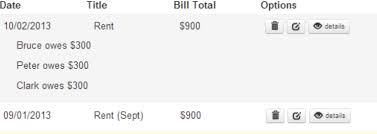

Comment agrandir / réduire les lignes d’un tableau avec Bootstrap
======
 

 
Comment faire des accordéons dans des lignes de tableau en Twitter Bootstrap ? Nous verrons qu’utiliser une table pour faire un tableau …n’est pas une si bonne idée !
 
# Objectif
 
Faire un tableau dont chaque ligne est cliquable pour afficher un sous-contenu masqué (partie gauche) et/ou pour naviguer avec des boutons cliquables (partie droite).
 

 

 
[composant collapse de bootstrap](http://getbootstrap.com/2.3.2/javascript.html#collapse)
[boutons stylés](http://getbootstrap.com/2.3.2/base-css.html#buttons)
Il faut donc intégrer le composant collapse de bootstrap  et des boutons stylés.
 
# Approche 1 avec table
 
## Etape 1 : table
 
[bootstrap nous propose pour un simple tableau](http://getbootstrap.com/2.3.2/base-css.html#tables)
Rien à dire, c’est la solution la plus logique, car c’est celle que bootstrap nous propose pour un simple tableau
 
```xml
<tr>
    <td>1</td>
    <td>Mark</td>
    <td>Otto</td>
    <td>@mdo</td>
</tr>
<tr>
    <td>2</td>
    <td>Jacob</td>
    <td>Thornton</td>
    <td>@fat</td>
</tr>
```
 

 

 
## Etape 2 : table + collapse
 
[variante sans accordion de la doc bootstra](http://getbootstrap.com/2.3.2/javascript.html#collapse)
Il faut utiliser la variante sans accordion de la doc bootstrap avec seulement data-target et collapse.
 
Problème : le collapse ne fonctionne pas pour une balise TR en target.
 
Solution : créer un DIV dans un sous-TR (facultatif : ajouter du CSS pour cacher le résidu permanent de margin/padding de la ligne cachée/collapsed) .
 
```xml
<tr class="accordion-toggle"  data-toggle="collapse" data-target="#collapseOne">
    <td>1</td>
    <td>Mark</td>
    <td>Otto</td>
    <td>@mdo</td>
</tr>
<tr>
    <td></td>
    <td colspan="3">
        <div id="collapseOne" class="collapse in">
            Details 1 <br/>
            Details 2 <br/>
            Details 3 <br/>
        </div>
    </td>
</tr>
```
 

 

 
## Etape 3 : table + collapse + buttons
 
Problème : un clique sur un bouton provoque un effet de bord d’expand/collapse de la ligne le contenant. C’est gênant quand on fait nouvel onglet sur un bouton car le détails s’affiche.
 
Solution : il faut empêcher l’expand/collapse de se déclencher en cas d’appui sur un bouton. Il faut donc assigner le click expand à chaque cellule td plutot que sur le tr.
 
Ça fonctionne, MAIS le Javascript rame au expand/collapse quand il y a plusieurs dizaines de lignes et sous-lignes sur la page ET il y a du code dupliqué.
 
```xml
<tr class="accordion-toggle"  >
    <td data-toggle="collapse" data-target="#collapseTwo">1</td>
    <td data-toggle="collapse" data-target="#collapseTwo">Mark</td>
    <td data-toggle="collapse" data-target="#collapseTwo">Otto</td>
    <td data-toggle="collapse" data-target="#collapseTwo">@mdo</td>
    <td><a class="btn btn-primary" href="https://www.google.com/"><i class="icon-search icon-white"></i></a></td>
</tr>
<tr>
    <td></td>
    <td colspan="4">
        <div id="collapseTwo" class="collapse in">
            - Details 1 <br/>
            - Details 2 <br/>
            - Details 3 <br/>
        </div>
    </td>
</tr>
```
 

 

 
# Approche 2 avec div
 
## Etape 1 : div
 
[système de grille sur lequel repose bootstrap](http://getbootstrap.com/2.3.2/scaffolding.html#gridSystem)
On utilise le système de grille sur lequel repose bootstrap.
 
Problème : les styles de table sont perdus.
 
Solution : (facultatif) Il faut refaire du CSS si l’on veut obtenir le même rendu que précédemment (row top border, cell width, header bold).
 
```xml
<div class="row-fluid" >
    <div class="span2">1</div>
    <div class="span2">Mark</div>
    <div class="span2">Otto</div>
    <div class="span2">@mdo</div>
</div>
```
 

 

 
## Etape 2 : div + collapse
 
(idem solution table+collapse)
 
Problème : le curseur ne change pas de forme lors du survole de la ligne cliquable (icone “main”).
 
Solution : (facultatif) utiliser un style perso ou re-utiliser la class accordion-toggle sur la div collapsable.
 
# Solution
 
```xml
<div class="row-fluid" data-toggle="collapse" data-target="#collapseTwo">
    <div class="span1">1</div>
    <div class="span3">Mark</div>
    <div class="span3">Otto</div>
    <div class="span3">@mdo</div>
</div>
<div id="collapseTwo" class="row-fluid collapse in">
    <div class="span1"></div>
    <div class="span9">
        Details 1 <br/>
        Details 2 <br/>
        Details 3 <br/>
    </div>
</div>
```
 

 

 
Etape 3 : div + collapse + buttons
 
(idem solution table+collapse+buttons)
 
Problème : L’ajout de boutons entre également en conflit avec le collapse/expand.
 
Solution : sortir le bouton de la div toggler.
 
```xml
<div class="row-fluid" >
    <div class="accordion-toggle" data-toggle="collapse" data-target="#collapseThree">
        <div class="span1">1</div>
        <div class="span3">Mark</div>
        <div class="span3">Otto</div>
        <div class="span3">@mdo</div>
    </div>
    <div class="span1">
        <button type="button" class="btn btn-primary"><i class="icon-search icon-white"></i></button>
    </div>
</div>
<div id="collapseThree" class="row-fluid collapse in">
    <div class="span1"></div>
    <div class="span9">
        Details 1 <br/>
        Details 2 <br/>
        Details 3 <br/>
    </div>
</div>
```
 
# 
 
# Conclusion
 
J’utilise actuellement la version avec DIV après avoir utilisé TABLE. Au final la page n’était plus assez réactive, le code dupliqué était source de bugs/maintenance et la solution technique avec TABLE n’était pas toujours compréhensible, même avec la doc de bootstrap à coté.
 
COLLAPSABLE TABLE
 
* Pro : style par defaut dans bootstrap, aimer les tables ?
* Con : solution de contournement, performances, duplication de code
 
COLLAPSABLE  DIV
 
* Pro : responsive, performant
* Con : styles curseur et tableau à redéfinir
 
# Sources
 
[http://github.com/damienfremont/blog/tree/master/20141216-bootstrap-collapsable_table](http://github.com/damienfremont/blog/tree/master/20141216-bootstrap-collapsable_table)
http://github.com/damienfremont/blog/tree/master/20141216-bootstrap-collapsable_table
 
# References
 
[http://getbootstrap.com/2.3.2/](http://getbootstrap.com/2.3.2/)
http://getbootstrap.com/2.3.2/
 
[http://getbootstrap.com/2.3.2/base-css.html](http://getbootstrap.com/2.3.2/base-css.html)
http://getbootstrap.com/2.3.2/base-css.html
 
[http://getbootstrap.com/2.3.2/javascript.html](http://getbootstrap.com/2.3.2/javascript.html)
http://getbootstrap.com/2.3.2/javascript.html
 
[http://getbootstrap.com/2.3.2/scaffolding.html](http://getbootstrap.com/2.3.2/scaffolding.html)
http://getbootstrap.com/2.3.2/scaffolding.html
 
[http://getbootstrap.com/2.3.2/components.html](http://getbootstrap.com/2.3.2/components.html)
http://getbootstrap.com/2.3.2/components.html
 
 
[https://damienfremont.com/2015/07/28/comment-agrandir-reduire-les-lignes-dun-tableau-avec-bootstrap/ ](https://damienfremont.com/2015/07/28/comment-agrandir-reduire-les-lignes-dun-tableau-avec-bootstrap/ )
 
