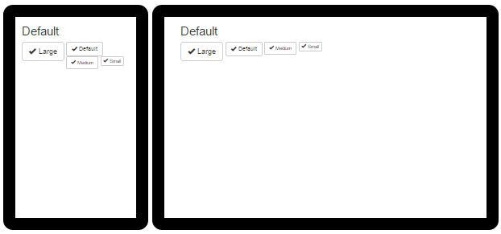
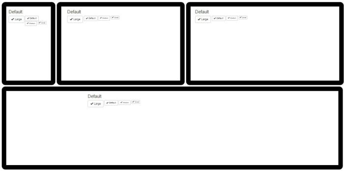
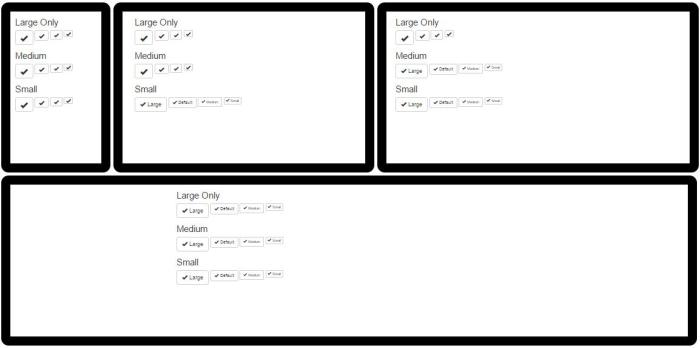

Responsive Button with Bootstrap : Toggable Text
======
 

 
The default Bootstrap buttons is not responsive. When the device is too small, the grid is responsive and change the layout, but the buttons stay the same. This tutorial show how to toggle the text from a button when the device required it.
 
# 
 

 
# 
 
# 
 
The solution will be tested on different devices/resolutions: mobile, tablet, laptop, desktop
 

 

 
with this behaviour:
 
# 
 
# Default Buttons
 
The default buttons Text is not responsive. On smaller device, it will break the layout because of the buttons size.
 
## Demo
 

 

 
## Source
 
html
 
```xml
<div class="btn-toolbar" role="toolbar">
  <button type="button" class="btn btn-default btn-lg">
    <span class="glyphicon glyphicon-ok" aria-hidden="true"></span>
    Large
  </button>
  <button type="button" class="btn btn-default">
    <span class="glyphicon glyphicon-ok" aria-hidden="true"></span>
    Default
  </button>
  <button type="button" class="btn btn-default btn-sm">
    <span class="glyphicon glyphicon-ok" aria-hidden="true"></span>
    Medium
  </button>
  <button type="button" class="btn btn-default btn-xs">
    <span class="glyphicon glyphicon-ok" aria-hidden="true"></span>
    Small
  </button>
</div>
```
 
# Responsive Buttons
 
Responsive buttons needs to repond the same way as the grid. On smaller device, text is expected to disappeared on targeted buttons. Button icon must stay the same.
 

 

 
## Demo
 
## 
 
JSFiddle here
 
[http://jsfiddle.net/damien_fremont/nLxcws7q/](http://jsfiddle.net/damien_fremont/nLxcws7q/)
http://jsfiddle.net/damien_fremont/nLxcws7q/
 
## Source
 
The hack is just a little more CSS with a new set of Class named like those of the Grid system : btn-xs-text, btn-lg-text, etc.
 
index.html
 
```xml
<h2>Large</h2>
 
<div class="btn-toolbar" role="toolbar">
  <button type="button" class="btn btn-default btn-lg btn-lg-text">
    <span class="glyphicon glyphicon-ok" aria-hidden="true"></span>
    Large
  </button>
  <button type="button" class="btn btn-default        btn-lg-text">
    <span class="glyphicon glyphicon-ok" aria-hidden="true"></span>
    Default
  </button>
  <button type="button" class="btn btn-default btn-sm btn-lg-text">
    <span class="glyphicon glyphicon-ok" aria-hidden="true"></span>
    Medium
  </button>
  <button type="button" class="btn btn-default btn-xs btn-lg-text">
    <span class="glyphicon glyphicon-ok" aria-hidden="true"></span>
    Small
  </button>
</div>
 
<h2>Medium</h2>
 
<div class="btn-toolbar" role="toolbar">
  <button type="button" class="btn btn-default btn-lg btn-md-text">
    <span class="glyphicon glyphicon-ok" aria-hidden="true"></span>
    Large
  </button>
  <button type="button" class="btn btn-default        btn-md-text">
    <span class="glyphicon glyphicon-ok" aria-hidden="true"></span>
    Default
  </button>
  <button type="button" class="btn btn-default btn-sm btn-md-text">
    <span class="glyphicon glyphicon-ok" aria-hidden="true"></span>
    Medium
  </button>
  <button type="button" class="btn btn-default btn-xs btn-md-text">
    <span class="glyphicon glyphicon-ok" aria-hidden="true"></span>
    Small
  </button>
</div>
 
<h2>Small</h2>
 
<div class="btn-toolbar" role="toolbar">
  <button type="button" class="btn btn-default btn-lg btn-xs-text">
    <span class="glyphicon glyphicon-ok" aria-hidden="true"></span>
    Large
  </button>
  <button type="button" class="btn btn-default        btn-xs-text">
    <span class="glyphicon glyphicon-ok" aria-hidden="true"></span>
    Default
  </button>
  <button type="button" class="btn btn-default btn-sm btn-xs-text">
    <span class="glyphicon glyphicon-ok" aria-hidden="true"></span>
    Medium
  </button>
  <button type="button" class="btn btn-default btn-xs btn-xs-text">
    <span class="glyphicon glyphicon-ok" aria-hidden="true"></span>
    Small
  </button>
</div>
```
 
css
 
```css
/* Small devices (tablets, 768px and up) */
@media ( max-width : 768px ) {
  .btn-xs-text.btn-default:not(span) {
    font-size: 0pt !important;
  }
  .btn-xs-text.btn-default.btn-lg .glyphicon {
    font-size: 18pt !important;
  }
  .btn-xs-text.btn-default .glyphicon {
    font-size: 14pt !important;
  }
  .btn-xs-text.btn-default.btn-sm .glyphicon {
    font-size: 12pt !important;
  }
  .btn-xs-text.btn-default.btn-xs .glyphicon {
    font-size: 12pt !important;
  }
}
/* Medium devices (desktops, 992px and up) */
@media ( max-width : 992px ) {
  .btn-md-text.btn-default:not(span) {
    font-size: 0pt !important;
  }
  .btn-md-text.btn-default.btn-lg .glyphicon {
    font-size: 18pt !important;
  }
  .btn-md-text.btn-default .glyphicon {
    font-size: 14pt !important;
  }
  .btn-md-text.btn-default.btn-sm .glyphicon {
    font-size: 12pt !important;
  }
  .btn-md-text.btn-default.btn-xs .glyphicon {
    font-size: 12pt !important;
  }
}
/* Large devices (large desktops, 1200px and up) */
@media ( max-width : 1200px ) {
  .btn-lg-text.btn-default:not(span) {
    font-size: 0pt !important;
  }
  .btn-lg-text.btn-default.btn-lg .glyphicon {
    font-size: 18pt !important;
  }
  .btn-lg-text.btn-default .glyphicon {
    font-size: 14pt !important;
  }
  .btn-lg-text.btn-default.btn-sm .glyphicon {
    font-size: 12pt !important;
  }
  .btn-lg-text.btn-default.btn-xs .glyphicon {
    font-size: 12pt !important;
  }
}
```
 
# 
 
# Conclusion
 
Default Buttons:
 

 

 
Responsive Buttons
 

 

 
# Source
 
[https://github.com/DamienFremont/blog/tree/master/20150731-bootstrap-responsive_button](https://github.com/DamienFremont/blog/tree/master/20150731-bootstrap-responsive_button)
https://github.com/DamienFremont/blog/tree/master/20150731-bootstrap-responsive_button
 
# References
 
[http://getbootstrap.com/css/#buttons](http://getbootstrap.com/css/#buttons)
http://getbootstrap.com/css/#buttons
 
[http://getbootstrap.com/components/#glyphicons-examples](http://getbootstrap.com/components/#glyphicons-examples)
http://getbootstrap.com/components/#glyphicons-examples
 
[http://getbootstrap.com/css/#grid](http://getbootstrap.com/css/#grid)
http://getbootstrap.com/css/#grid
 
 
## Origin
[https://damienfremont.com/2015/07/31/responsive-button-with-bootstrap-toggable-text/](https://damienfremont.com/2015/07/31/responsive-button-with-bootstrap-toggable-text/)
 
