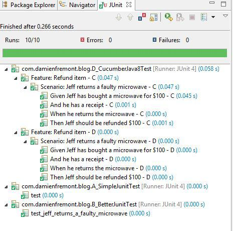

Migrating from Simple JUnit Test to Cucumber Java
======
 

 
This post explains how to migrate source code from simple JUnit test to Cucumber Java Test. It’s a not so simple task, because in older JUnit test the behaviour is not always implemetend.
 

 
## Step A – Simple JUnit Test
 
It’s the shortest source code ever. But it lacks stability, behaviour and documentation.
A_SimpleJunitTest.java
 
```java
public class A_SimpleJunitTest {
 
    @Test
    public void test() {
        ClassToTest classToTest = new ClassToTest();
        String receipt = classToTest.buy("microwave", 100);
        assertThat(receipt).isNotNull();
        assertThat(classToTest.returns("microwave", receipt)).contains("100");
    }
}
```
 
## Step B – Better JUnit Test
 
It’s stable and behaviour-oriented code. But functions reuse is not possible, and Javadoc is not an open collaboration format for other people like Product-Owner.
B_BetterJunitTest.java
 
```java
/**
 * Feature: Refund item
 */
public class B_BetterJunitTest {
 
    ClassToTest classToTest;
 
    @Before
    public void beforeScenario() {
        classToTest = new ClassToTest();
    }
 
    /**
     * Scenario: Jeff returns a faulty microwave
     * - Given Jeff has bought a microwave for $100
     * -- And he has a receipt
     * - When he returns the microwave
     * - Then Jeff should be refunded $100
     */
    @Test
    public void test_jeff_returns_a_faulty_microwave() {
        // Given
        int amount = 100;
        String receipt = classToTest.buy("microwave", amount);
        // When
        assertThat(receipt)
            .isNotNull();
        // Then
        String refund = classToTest.returns("microwave", receipt);
        assertThat(refund)
            .isNotNull()
            .contains("100");
    }
 
}
```
 
## Step C – Cucumber Java6
 
It’s modular code and functions reuse is possible. But it’s not very productive because of the duplicate annotation/function syntax.
C_CucumberJava6Test.java
 
```java
@RunWith(Cucumber.class)
@CucumberOptions(strict = true, features = "features")
public class C_CucumberJava6Test implements En {
 
    ClassToTest classToTest;
    String receipt;
    String refund;
 
    @Before
    public void beforeScenario() {
        classToTest = new ClassToTest();
    }
 
    @Given("^Jeff has bought a microwave for \\$(\\d+) - C$")
    public void jeff_has_bought_a_microwave_for(Integer amount) {
        receipt = classToTest.buy("microwave", amount);
    }
 
    @Given("^he has a receipt - C$")
    public void he_has_a_receipt() {
        assertThat(receipt).isNotNull();
    }
 
    @When("^he returns the microwave - C$")
    public void he_returns_the_microwave() {
        refund = classToTest.returns("microwave", receipt);
    }
 
    @Then("^Jeff should be refunded \\$(\\d+) - C$")
    public void jeff_should_be_refunded(Integer amount) {
        assertThat(refund).isNotNull().contains(amount.toString());
    }
}
```
 
C_CucumberJava6.feature
 
```
Feature: Refund item - C
 
  Scenario: Jeff returns a faulty microwave - C
    Given Jeff has bought a microwave for $100 - C
    And he has a receipt - C
    When he returns the microwave - C
    Then Jeff should be refunded $100 - C
```
 
## Step D – Cucumber Java8
 
D_CucumberJava8Test.java
 
```java
@RunWith(Cucumber.class)
@CucumberOptions(strict = true, features = "features")
public class D_CucumberJava8Test implements En {
     
    ClassToTest classToTest;
    String receipt;
    String refund;
 
    public D_CucumberJava8Test() {
         
        Before(()->{
            classToTest = new ClassToTest();
        });
         
        Given("^Jeff has bought a microwave for \\$(\\d+) - D$", (Integer amount) -> {
            receipt = classToTest.buy("microwave", amount);
        });
 
        Given("^he has a receipt - D$", () -> {
            assertThat(receipt)
                .isNotNull();
        });
 
        When("^he returns the microwave - D$", () -> {
            refund = classToTest.returns("microwave", receipt);
        });
 
        Then("^Jeff should be refunded \\$(\\d+) - D$", (Integer amount) -> {
            assertThat(refund)
                .isNotNull()
                .contains(amount.toString());
        });
    }  
}
```
 
## Demo
 
This project runs the four test classes, targeting the same implementation.
 

 

 
Maven config pom.xml
 
```xml
<?xml version="1.0" encoding="UTF-8"?>
<project xmlns="http://maven.apache.org/POM/4.0.0" xmlns:xsi="http://www.w3.org/2001/XMLSchema-instance" xsi:schemaLocation="http://maven.apache.org/POM/4.0.0 http://maven.apache.org/xsd/maven-4.0.0.xsd">
    <modelVersion>4.0.0</modelVersion>
    <groupId>com.damienfremont.blog</groupId>
    <artifactId>20150807-test-cucumber_migrating_from_junit</artifactId>
    <version>0.0.1-SNAPSHOT</version>
    <packaging>jar</packaging>
    <dependencies>
        <dependency>
            <groupId>junit</groupId>
            <artifactId>junit</artifactId>
            <version>4.12</version>
            <scope>test</scope>
        </dependency>
        <dependency>
            <groupId>org.assertj</groupId>
            <artifactId>assertj-core</artifactId>
            <version>3.1.0</version>
            <scope>test</scope>
        </dependency>
        <dependency>
            <groupId>info.cukes</groupId>
            <artifactId>cucumber-junit</artifactId>
            <version>1.2.4</version>
            <scope>test</scope>
        </dependency>
        <dependency>
            <groupId>info.cukes</groupId>
            <artifactId>cucumber-java8</artifactId>
            <version>1.2.4</version>
            <scope>test</scope>
        </dependency>
    </dependencies>
    <build>
        <plugins>
            <plugin>
                <groupId>org.apache.maven.plugins</groupId>
                <artifactId>maven-compiler-plugin</artifactId>
                <configuration>
                    <source>1.8</source>
                    <target>1.8</target>
                </configuration>
            </plugin>
        </plugins>
    </build>
</project>
```
 
Run ti with JUnit.
 

 

 
## Sources
 
[https://github.com/DamienFremont/blog/tree/master/20150807-test-cucumber_migrating_from_junit](https://github.com/DamienFremont/blog/tree/master/20150807-test-cucumber_migrating_from_junit)
https://github.com/DamienFremont/blog/tree/master/20150807-test-cucumber_migrating_from_junit
 
## References
 
[https://cucumber.io/docs/reference](https://cucumber.io/docs/reference)
https://cucumber.io/docs/reference
 
[https://rmannibucau.wordpress.com/2015/01/26/cukespace-or-bdd-arquillian-and-java-8/](https://rmannibucau.wordpress.com/2015/01/26/cukespace-or-bdd-arquillian-and-java-8/)
https://rmannibucau.wordpress.com/2015/01/26/cukespace-or-bdd-arquillian-and-java-8/
 
 
[https://damienfremont.com/2015/08/07/migrating-from-simple-junit-test-to-cucumber-java/](https://damienfremont.com/2015/08/07/migrating-from-simple-junit-test-to-cucumber-java/)
 
