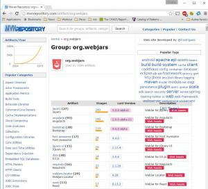

Webjars: Manage your Web Dependencies with Maven
======
 

 

 
No more /src/main/webapp/vendor/jquery.min.js, or /styles/bootstrap.css! Just a Maven dependency like the other libraries. WebJars are client-side web libraries (e.g. jQuery & Bootstrap) packaged into JAR (Java Archive) files.
 

 
# Why?
 
Maven is great on managing jars, but not so good for static web dependencies like CSS or JS files packaged in a zip. With Webjars you can have AngularJS or Bootstrap in your pom.xml, like you did with Bower on a web project.
 
# How?
 
maven pom.xml (manage web dependencies)
 
```xml
<project xmlns="http://maven.apache.org/POM/4.0.0" xmlns:xsi="http://www.w3.org/2001/XMLSchema-instance" xsi:schemaLocation="http://maven.apache.org/POM/4.0.0 http://maven.apache.org/xsd/maven-4.0.0.xsd">
  <modelVersion>4.0.0</modelVersion>
 
  <groupId>com.damienfremont.blog</groupId>
  <artifactId>20151007-javaee-webjars</artifactId>
  <version>0.0.1-SNAPSHOT</version>
  <packaging>war</packaging>
 
  <dependencies>
     
    <!-- WEB DEPENDENCIES -->
    <dependency>
      <groupId>org.webjars</groupId>
      <artifactId>bootstrap</artifactId>
      <version>3.3.5</version>
    </dependency>
    <dependency>
      <groupId>org.webjars</groupId>
      <artifactId>jquery</artifactId>
      <version>2.1.4</version>
    </dependency>
 
    <!-- WEB DEPENDENCIES SERVLET -->
    <dependency>
      <groupId>org.webjars</groupId>
      <artifactId>webjars-servlet-2.x</artifactId>
      <version>1.1</version>
    </dependency>
 
  </dependencies>
</project>
```
 
webapp web.xml (declare webjars servlet)
 
```xml
 
```
 
index.html (standard example, use webjars paths)
 
```xml
<!DOCTYPE html>
<head>
  <!-- ADD ALL YOUR CSS DEPENDENCIES HERE... -->
  <link rel="stylesheet" href="webjars/bootstrap/3.3.5/css/bootstrap.css">
</head>
<body>
 
  <!-- DO YOUR THING HERE... -->
  Hello world!
 
  <!-- ADD ALL YOUR JS DEPENDENCIES HERE... -->
  <script src="webjars/jquery/2.1.4/jquery.js"></script>
  <script src="webjars/bootstrap/3.3.5/js/bootstrap.js"></script>
</body>
</html>
```
 
Only pom.xml and web.xml are required to manage web depencies. And you’ll see your web dependencies like the others.
 

 

 
# Demo
 
Run this project on your webapp server (Tomcat for example), and test on:
 
[http://localhost:8080/20151007-javaee-webjars/](http://localhost:8080/20151007-javaee-webjars/)
http://localhost:8080/20151007-javaee-webjars/
 

 

 

 

 

 

 
# Conclusion
 
A good tool, and a big maven repository behind it (org.webjars).
 
Pro:
 
* faster: less work adding a web library
* safe: no copy/paste error on web libs
* clean: no more binaries in your source repositories!
 
Con:
 
* perf: a servlet is serving the static files (be sure to put a cache server in front of your app)
 
You will find a lot more libs at mvnrepository or webjars.org !
 

 

 
# Sources
 
[https://github.com/DamienFremont/blog/tree/master/20151007-javaee-webjars](https://github.com/DamienFremont/blog/tree/master/20151007-javaee-webjars)
https://github.com/DamienFremont/blog/tree/master/20151007-javaee-webjars
 
# References
 
[http://www.webjars.org/](http://www.webjars.org/)
http://www.webjars.org/
 
[https://github.com/webjars/webjars-servlet-2.x](https://github.com/webjars/webjars-servlet-2.x)
https://github.com/webjars/webjars-servlet-2.x
 
[http://mvnrepository.com/artifact/org.webjars](http://mvnrepository.com/artifact/org.webjars)
http://mvnrepository.com/artifact/org.webjars
 
 
## Origin
[https://damienfremont.com/2015/10/07/webjars-manage-your-web-dependencies-with-maven/](https://damienfremont.com/2015/10/07/webjars-manage-your-web-dependencies-with-maven/)
 
