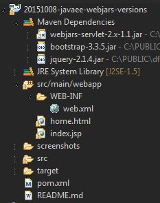
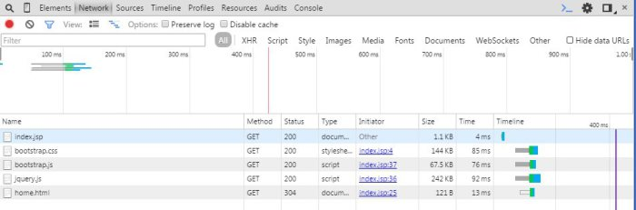
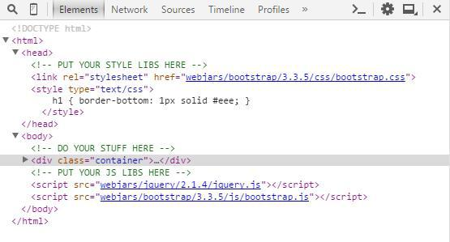

Webjars: Use Dynamic URLs for your Dependencies (VS Versionning Hell)
======
 

 
WebJars is a useful tool. It’s a client-side web libraries (e.g. jQuery & Bootstrap) packaged into JAR (Java Archive) files. But a static URL for your dependency is painfull to maintain. This tutorial provides a simpler way of managing version and URL in only one location.
 

 
# How?
 
By using Maven filtering to provide a dynamic jar version value.
 
* use a jsp file instead of html to avoid filtering conflicts with html templating engine from webapp folder (like in angularjs) <include>*.jsp</include>
* put a filtering properties into your index.jsp webjars url version src=”webjars/jquery/1.2/…” to src=”webjars/jquery/${jquery.version}/…”
* extract your webjars versions into a maven properties ‘<version>1.2</version>’ to ‘<jquery.version>1.2</version>’
* configure war plugin to also include fitlering for final packaging (avoid conflict with eclipse wtp plugin)
 
index.jsp (custom example, use webjars paths)
 
```xml
<!DOCTYPE html>
<head>
  <!-- PUT YOUR STYLE LIBS HERE -->
  <link rel="stylesheet" href="webjars/bootstrap/${bootstrap.version}/css/bootstrap.css">
</head>
<body>
 
  <!-- DO YOUR STUFF HERE... -->
  Hello!
 
 
  <!-- PUT YOUR JS LIBS HERE -->
  <script src="webjars/jquery/${jquery.version}/jquery.js"></script>
  <script src="webjars/bootstrap/${bootstrap.version}/js/bootstrap.js"></script>
</body>
</html>
```
 
webapp web.xml (declare webjars servlet)
 
```xml
<?xml version="1.0" encoding="UTF-8"?>
<web-app xmlns:xsi="http://www.w3.org/2001/XMLSchema-instance" xmlns="http://java.sun.com/xml/ns/javaee" xmlns:web="http://java.sun.com/xml/ns/javaee/web-app_2_5.xsd" xsi:schemaLocation="http://java.sun.com/xml/ns/javaee http://java.sun.com/xml/ns/javaee/web-app_2_5.xsd" id="WebApp_ID" version="2.5">
 
  <!--Webjars Servlet -->
  <servlet>
    <servlet-name>WebjarsServlet</servlet-name>
    <servlet-class>org.webjars.servlet.WebjarsServlet</servlet-class>
    <init-param>
        <param-name>disableCache</param-name>
        <param-value>true</param-value>
    </init-param>
    <load-on-startup>2</load-on-startup>
  </servlet>
  <servlet-mapping>
    <servlet-name>WebjarsServlet</servlet-name>
    <url-pattern>/webjars/*</url-pattern>
  </servlet-mapping>
 
</web-app>
```
 
maven pom.xml (manage web dependencies)
 
```xml
<project xmlns="http://maven.apache.org/POM/4.0.0" xmlns:xsi="http://www.w3.org/2001/XMLSchema-instance" xsi:schemaLocation="http://maven.apache.org/POM/4.0.0 http://maven.apache.org/xsd/maven-4.0.0.xsd">
  <modelVersion>4.0.0</modelVersion>
  <groupId>com.damienfremont.blog</groupId>
  <artifactId>20151008-javaee-webjars-versions</artifactId>
  <version>0.0.1-SNAPSHOT</version>
  <packaging>war</packaging>
  <properties>
 
    <!-- WEB DEPENDENCIES VERSIONS (USED FOR FILTERING AND URL RESOLUTION) -->
    <bootstrap.version>3.3.5</bootstrap.version>
    <jquery.version>2.1.4</jquery.version>
 
  </properties>
  <dependencies>
 
    <!-- WEB DEPENDENCIES -->
    <dependency>
      <groupId>org.webjars</groupId>
      <artifactId>webjars-servlet-2.x</artifactId>
      <version>1.1</version>
    </dependency>
    <dependency>
      <groupId>org.webjars</groupId>
      <artifactId>bootstrap</artifactId>
      <version>${bootstrap.version}</version>
    </dependency>
    <dependency>
      <groupId>org.webjars</groupId>
      <artifactId>jquery</artifactId>
      <version>${jquery.version}</version>
    </dependency>
 
  </dependencies>
 
  <!-- RESOURCES FILTERING ONLY ON JSP FILES TO AVOID HTML TEMPLATES MODIFICATION -->
 
  <build>
    <resources>
 
      <!-- FILTERING FOR WTP PLUGIN -->
 
      <resource>
        <directory>src/main/webapp</directory>
        <filtering>true</filtering>
        <targetPath>${project.basedir}/target/m2e-wtp/web-resources</targetPath>
        <includes>
          <include>*.jsp</include>
        </includes>
      </resource>
    </resources>
    <plugins>
      <plugin>
        <groupId>org.apache.maven.plugins</groupId>
        <artifactId>maven-war-plugin</artifactId>
        <version>2.6</version>
        <configuration>
          <webResources>
 
            <!-- FILTERING FOR PACKAGING -->
 
            <resource>
              <directory>src/main/webapp</directory>
              <filtering>true</filtering>
              <includes>
                <include>*.jsp</include>
              </includes>
            </resource>
          </webResources>
        </configuration>
      </plugin>
    </plugins>
  </build>
</project>
```
 
Eclipse Java Maven Project Structure
 

 

 
 
 
# Demo
 
Run this project on your webapp server (Tomcat for example), and test on:
 
[http://localhost:8080/20151008-javaee-webjars-versions/](http://localhost:8080/20151008-javaee-webjars-versions/)
http://localhost:8080/20151008-javaee-webjars-versions/
 

 

 

 

 

 

 
# Conclusion
 
A more productive way to maintain your project (no more static lib url).
 
Pros:
 
* productivity
* maven properties usage for lib versions
 
Cons:
 
* unstable filtering (conflict on tags ${} pattern between Maven and other third party tools like AngularJs)
 
# Sources
 
[https://github.com/DamienFremont/blog/tree/master/20151008-javaee-webjars-versions](https://github.com/DamienFremont/blog/tree/master/20151008-javaee-webjars-versions)
https://github.com/DamienFremont/blog/tree/master/20151008-javaee-webjars-versions
 
# References
 
[http://www.webjars.org/](http://www.webjars.org/)
http://www.webjars.org/
 
[https://github.com/webjars/webjars-servlet-2.x](https://github.com/webjars/webjars-servlet-2.x)
https://github.com/webjars/webjars-servlet-2.x
 
[http://mvnrepository.com/artifact/org.webjars](http://mvnrepository.com/artifact/org.webjars)
http://mvnrepository.com/artifact/org.webjars
 
 
## Origin
[https://damienfremont.com/2015/10/08/webjars-use-dynamic-urls-for-your-dependencies-vs-versionning-hell/](https://damienfremont.com/2015/10/08/webjars-use-dynamic-urls-for-your-dependencies-vs-versionning-hell/)
 
