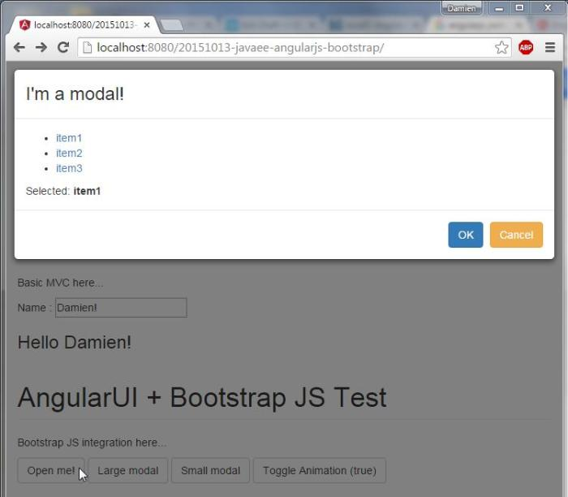

JavaEE AngularJS Bootstrap: Integration
======
 

 
This tutorial is a basic integration of AngularJS, Bootstrap3, JavaEE JAX-RS, Maven and WebJars. Usefull for replacing your old JSF or GWT application from intranet.
 
# Why?
 
Because AngularJs is not a web framework anymore and tends to replace GWT in intranet web applications. And because most of these team have a Java legacy, it’s sometimes more productive to build on top of a well known Java Server instead of jumping in a new system like NodeJs in addition to migrating to a new MVC framework (like from JSF to AngularJs).
 
# How?
 
By using:
 
* Bootstrap for UI
* AngularJS for MVC
* AngularUIBootstrap for Bootstrap Javascript support in AngularJS
* WebJars to manage web dependencies
* Maven to manage java dependencies
* JavaEE to provide REST web services
* Tomcat to contain the webapp
 
pom.xml: maven config
 
```xml
<project xmlns="http://maven.apache.org/POM/4.0.0" xmlns:xsi="http://www.w3.org/2001/XMLSchema-instance" xsi:schemaLocation="http://maven.apache.org/POM/4.0.0 http://maven.apache.org/xsd/maven-4.0.0.xsd">
  <modelVersion>4.0.0</modelVersion>
 
  <groupId>com.damienfremont.blog</groupId>
  <artifactId>20151013-javaee-angularjs-bootstrap</artifactId>
  <version>0.0.1-SNAPSHOT</version>
  <packaging>war</packaging>
 
  <properties>
    <project.build.sourceEncoding>UTF-8</project.build.sourceEncoding>
    <java.version>7</java.version>
    <jersey.version>2.22.1</jersey.version>
    <angularjs.version>1.4.7</angularjs.version>
    <angular-ui-bootstrap.version>0.13.4</angular-ui-bootstrap.version>
    <bootstrap.version>3.3.5</bootstrap.version>
  </properties>
 
  <dependencies>
 
    <!-- JAVA -->
 
    <dependency>
      <groupId>javax</groupId>
      <artifactId>javaee-api</artifactId>
      <version>7.0</version>
      <scope>provided</scope>
    </dependency>
 
    <dependency>
      <groupId>org.glassfish.jersey.containers</groupId>
      <artifactId>jersey-container-servlet</artifactId>
      <version>${jersey.version}</version>
    </dependency>
    <dependency>
      <groupId>org.glassfish.jersey.media</groupId>
      <artifactId>jersey-media-json-jackson</artifactId>
      <version>${jersey.version}</version>
    </dependency>
 
    <!-- WEB -->
 
    <dependency>
      <groupId>org.webjars</groupId>
      <artifactId>webjars-servlet-2.x</artifactId>
      <version>1.1</version>
    </dependency>
 
    <dependency>
      <groupId>org.webjars</groupId>
      <artifactId>angularjs</artifactId>
      <version>${angularjs.version}</version>
    </dependency>
    <dependency>
      <groupId>org.webjars</groupId>
      <artifactId>angular-ui-bootstrap</artifactId>
      <version>${angular-ui-bootstrap.version}</version>
    </dependency>
 
    <dependency>
      <groupId>org.webjars</groupId>
      <artifactId>bootstrap</artifactId>
      <version>${bootstrap.version}</version>
    </dependency>
 
  </dependencies>
 
 
  <build>
    <resources>
      <resource>
        <directory>src/main/webapp</directory>
        <filtering>true</filtering>
        <targetPath>${project.basedir}/target/m2e-wtp/web-resources</targetPath>
        <includes>
          <include>*.jsp</include>
        </includes>
      </resource>
    </resources>
    <plugins>
      <plugin>
        <groupId>org.apache.maven.plugins</groupId>
        <artifactId>maven-war-plugin</artifactId>
        <version>2.6</version>
        <configuration>
          <webResources>
            <resource>
              <directory>src/main/webapp</directory>
              <filtering>true</filtering>
              <includes>
                <include>*.jsp</include>
              </includes>
            </resource>
          </webResources>
        </configuration>
      </plugin>
 
      <plugin>
        <groupId>org.apache.maven.plugins</groupId>
        <artifactId>maven-compiler-plugin</artifactId>
        <version>3.1</version>
        <configuration>
          <source>1.${java.version}</source>
          <target>1.${java.version}</target>
        </configuration>
      </plugin>
 
    </plugins>
  </build>
</project>
```
 
 
 
StatusService.java: javaEE REST service
 
```java
package com.damienfremont.blog;
 
import static javax.ws.rs.core.Response.status;
import static javax.ws.rs.core.Response.Status.OK;
 
import java.io.Serializable;
import java.text.SimpleDateFormat;
import java.util.Date;
 
import javax.ws.rs.GET;
import javax.ws.rs.Path;
import javax.ws.rs.Produces;
import javax.ws.rs.core.MediaType;
import javax.ws.rs.core.Response;
 
@Path("/status")
public class StatusService {
 
  @GET
  public Response ping() {
    return status(OK).build();
  }
 
  @GET
  @Path("details")
  @Produces(MediaType.APPLICATION_JSON)
  public StatusModel details() {
    String pattern = "yyyy-MM-dd hh:mm:ss";
    SimpleDateFormat sdf = new SimpleDateFormat(pattern);
    String date = sdf.format(new Date());
    return new StatusModel("OK", date);
  }
 
  class StatusModel implements Serializable {
    private static final long serialVersionUID = 9167120287441116359L;
     
    public String value;
 
    public StatusModel(String value, String date) {
      super();
      this.value = value;
      this.date = date;
    }
 
    public String date;
  }
 
}
```
 
MyApplication.java: javaEE Configuration
 
```java
package com.damienfremont.blog;
 
import java.util.HashSet;
import java.util.Set;
import javax.ws.rs.core.Application;
 
public class MyApplication extends Application {
 
  @Override
  public Set<Class<?>> getClasses() {
    Set<Class<?>> s = new HashSet<Class<?>>();
    s.add(StatusService.class);
    return s;
  }
}
```
 
web.xml: webapp config
 
```xml
<web-app xmlns="http://xmlns.jcp.org/xml/ns/javaee" xmlns:xsi="http://www.w3.org/2001/XMLSchema-instance" xsi:schemaLocation="http://xmlns.jcp.org/xml/ns/javaee http://xmlns.jcp.org/xml/ns/javaee/web-app_3_1.xsd" version="3.1">
 
  <servlet>
    <servlet-name>REST</servlet-name>
    <servlet-class>org.glassfish.jersey.servlet.ServletContainer</servlet-class>
    <init-param>
      <param-name>javax.ws.rs.Application</param-name>
      <param-value>com.damienfremont.blog.MyApplication</param-value>
    </init-param>
    <load-on-startup>1</load-on-startup>
  </servlet>
  <servlet-mapping>
    <servlet-name>REST</servlet-name>
    <url-pattern>/api/*</url-pattern>
  </servlet-mapping>
 
  <servlet>
    <servlet-name>WEBJARS</servlet-name>
    <servlet-class>org.webjars.servlet.WebjarsServlet</servlet-class>
    <init-param>
      <param-name>disableCache</param-name>
      <param-value>true</param-value>
    </init-param>
    <load-on-startup>2</load-on-startup>
  </servlet>
  <servlet-mapping>
    <servlet-name>WEBJARS</servlet-name>
    <url-pattern>/webjars/*</url-pattern>
  </servlet-mapping>
 
</web-app>
```
 
index.jsp: web component integration
 
```xml
<!DOCTYPE html >
<head>
  <link rel="icon" href="favicon.ico">
       
  <!-- LIBS CSS -->
  <link rel="stylesheet" href="webjars/bootstrap/${bootstrap.version}/css/bootstrap.css">
  <link rel="stylesheet" href="styles/main.css">
  <!-- LIBS JS -->
  <script src="webjars/angularjs/${angularjs.version}/angular.js"></script>
  <script src="webjars/angularjs/${angularjs.version}/angular-resource.js"></script>
  <script src="webjars/angularjs/${angularjs.version}/angular-animate.js"></script>
  <script src="webjars/angular-ui-bootstrap/${angular-ui-bootstrap.version}/ui-bootstrap-tpls.js"></script>
  <!-- YOUR JS -->
  <script src="js/app.js"></script>
  <script src="js/controllers/ModalCtrl.js"></script>
  <script src="js/controllers/StatusCtrl.js"></script>
  <script src="js/services/StatusResource.js"></script>
</head>
<body>
  <div class="container" ng-app="ui.bootstrap.demo">
   
    <!-- BOOTSTRAP -->
   
    <div>
        <h1>Bootstrap Test</h1>
        <p>CSS button here...</p>
        <div class="bs-example" data-example-id="btn-variants">
          <button type="button" class="btn btn-default">Default</button>
          <button type="button" class="btn btn-primary">Primary</button>
          <button type="button" class="btn btn-success">Success</button>
          <button type="button" class="btn btn-info">Info</button>
          <button type="button" class="btn btn-warning">Warning</button>
          <button type="button" class="btn btn-danger">Danger</button>
          <button type="button" class="btn btn-link">Link</button>
        </div>
    </div>
     
    <!-- ANGULARJS -->
     
    <div>
        <h1>AngularJs Test</h1>
        <p>Basic MVC here...</p>
        <p>Name : <input type="text" ng-model="name" placeholder="type your name here..."></p>
        <h3>Hello {{name}}</h3>
    </div>
     
    <!-- ANGULARJS + UIBOOTSTRAP -->
 
     
    <div ng-controller="ModalDemoCtrl">
      <h1>AngularUI + Bootstrap JS Test</h1>
      <p>Bootstrap JS integration here...</p>
      <script type="text/ng-template" id="myModalContent.html">
        <div class="modal-header">
            <h3 class="modal-title">I'm a modal!</h3>
        </div>
        <div class="modal-body">
            <ul>
                <li ng-repeat="item in items">
                    <a href="#" ng-click="$event.preventDefault(); selected.item = item">{{ item }}</a>
                </li>
            </ul>
            Selected: <b>{{ selected.item }}</b>
        </div>
        <div class="modal-footer">
            <button class="btn btn-primary" type="button" ng-click="ok()">OK</button>
            <button class="btn btn-warning" type="button" ng-click="cancel()">Cancel</button>
        </div>
      </script>
      <button type="button" class="btn btn-default" ng-click="open()">Open me!</button>
      <button type="button" class="btn btn-default" ng-click="open('lg')">Large modal</button>
      <button type="button" class="btn btn-default" ng-click="open('sm')">Small modal</button>
      <button type="button" class="btn btn-default" ng-click="toggleAnimation()">Toggle Animation ({{ animationsEnabled }})</button>
      <div ng-show="selected">Selection from a modal: {{ selected }}</div>
    </div>
     
    <!-- ANGULARJS + JAVAEE REST SERVER -->
 
    <div ng-controller="StatusCtrl">
        <h1>JavaEE + AngularJs Rest client Test</h1>
        <p>REST call here...</p>
        <p>Response from /api/status is
          <span class="label label-default">{{status === null ? "ERROR" : "OK" }}</span></p>
        <p>Response from /api/status/details is
          <span class="label label-default">{{details.value}}</span> at {{details.date}} (JSON object mapped to {{details}})</p>
    </div>
   
</body>
</html>
```
 
app.js: main
 
```javascript
'use strict';
 
var myApp = angular.module(
        'ui.bootstrap.demo',
        [
          'ngAnimate',
          'ui.bootstrap',
          'ngResource']);
```
 
ModalCtrl.js: test UI Bootstrap
 
```javascript
'use strict';
 
myApp.controller('ModalDemoCtrl', function ($scope, $modal, $log) {
 
  $scope.items = ['item1', 'item2', 'item3'];
 
  $scope.animationsEnabled = true;
 
  $scope.open = function (size) {
 
    var modalInstance = $modal.open({
      animation: $scope.animationsEnabled,
      templateUrl: 'myModalContent.html',
      controller: 'ModalInstanceCtrl',
      size: size,
      resolve: {
        items: function () {
          return $scope.items;
        }
      }
    });
 
    modalInstance.result.then(function (selectedItem) {
      $scope.selected = selectedItem;
    }, function () {
      $log.info('Modal dismissed at: ' + new Date());
    });
  };
 
  $scope.toggleAnimation = function () {
    $scope.animationsEnabled = !$scope.animationsEnabled;
  };
 
});
 
// Please note that $modalInstance represents a modal window (instance) dependency.
// It is not the same as the $modal service used above.
 
angular.module('ui.bootstrap.demo').controller('ModalInstanceCtrl', function ($scope, $modalInstance, items) {
 
  $scope.items = items;
  $scope.selected = {
    item: $scope.items[0]
  };
 
  $scope.ok = function () {
    $modalInstance.close($scope.selected.item);
  };
 
  $scope.cancel = function () {
    $modalInstance.dismiss('cancel');
  };
});
```
 
StatusCtrl.js: test Angular REST Client
 
```javascript
'use strict';
 
myApp.controller('StatusCtrl', ['$scope', 'Status', 'StatusDetails', function($scope, Status, StatusDetails) {
    Status.get(function(s) {
         $scope.status = s;
    });
    StatusDetails.get(function(d) {
         $scope.details = d;
    });
}]);
```
 
StatusResource.js: test Angular REST Client
 
```javascript
'use strict';
 
myApp.factory('Status', function($resource) {
    return $resource('api/status', {}, {});
});
 
myApp.factory('StatusDetails', function($resource) {
    return $resource('api/status/details', {}, {});
});
```
 
main.css: style
 
```css
h1 {
    padding-bottom: 9px;
    margin: 40px 0 20px;
    border-bottom: 1px solid #eee;
}
```
 

 
And you’ll have a simple project like this:
 
 
 
# 
 
# Demo
 
Run this project on your webapp server (Tomcat for example), and test on:
 
[http://localhost:8080/20151013-javaee-angularjs-bootstrap/](http://localhost:8080/20151013-javaee-angularjs-bootstrap/)
http://localhost:8080/20151013-javaee-angularjs-bootstrap/
 
The main page test all frameworks.
 

 

 
Here is AngularJS MVC
 

 

 
Here is UI Bootstrap for AngularJS
 

 

 
Here is AngularJS REST Client and JavaEE REST Server
 

 

 
[http://localhost:8080/20151013-javaee-angularjs-bootstrap/api/status](http://localhost:8080/20151013-javaee-angularjs-bootstrap/api/status)
http://localhost:8080/20151013-javaee-angularjs-bootstrap/api/status
 

 

 
[http://localhost:8080/20151013-javaee-angularjs-bootstrap/api/status/details](http://localhost:8080/20151013-javaee-angularjs-bootstrap/api/status/details)
http://localhost:8080/20151013-javaee-angularjs-bootstrap/api/status/details
 

 

 
# Conclusion
 
It’s a step by step approach. Maybe later you will have some NodeJS backend and a team full of webdeveloper.
 
Pros: simple approach for Java developer (productivity)
 
Cons: not so shiny from a web developer point of view (legacy, performance)
 
# Sources
 
[https://github.com/DamienFremont/blog/tree/master/20151013-javaee-angularjs-bootstrap](https://github.com/DamienFremont/blog/tree/master/20151013-javaee-angularjs-bootstrap)
https://github.com/DamienFremont/blog/tree/master/20151013-javaee-angularjs-bootstrap
 
# References
 
[http://www.webjars.org/](http://www.webjars.org/)
http://www.webjars.org/
 
[https://github.com/webjars/webjars-servlet-2.x](https://github.com/webjars/webjars-servlet-2.x)
https://github.com/webjars/webjars-servlet-2.x
 
[http://getbootstrap.com/](http://getbootstrap.com/)
http://getbootstrap.com/
 
[http://www.w3schools.com/angular/](http://www.w3schools.com/angular/)
http://www.w3schools.com/angular/
 
[https://angular-ui.github.io/](https://angular-ui.github.io/)
https://angular-ui.github.io/
 
[https://docs.angularjs.org/tutorial/step_11](https://docs.angularjs.org/tutorial/step_11)
https://docs.angularjs.org/tutorial/step_11
 
[https://jersey.java.net/nonav/documentation/2.0/deployment.html](https://jersey.java.net/nonav/documentation/2.0/deployment.html)
https://jersey.java.net/nonav/documentation/2.0/deployment.html
 
[https://scotch.io/tutorials/how-to-correctly-use-bootstrapjs-and-angularjs-together](https://scotch.io/tutorials/how-to-correctly-use-bootstrapjs-and-angularjs-together)
https://scotch.io/tutorials/how-to-correctly-use-bootstrapjs-and-angularjs-together
 
 
[https://damienfremont.com/2015/10/13/javaee-angularjs-bootstrap-integration/](https://damienfremont.com/2015/10/13/javaee-angularjs-bootstrap-integration/)
 
