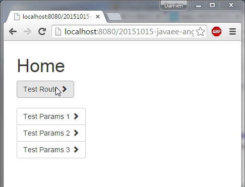

JavaEE AngularJS Bootstrap: routes, templates, redirection and params
======
 

 
A simple example about navigation inside a web application, using native AngularJS components.
 

 
# Why ?
 
Using Templates provides a more reusable View and less duplicate code.
 
Using Route provide a better decoupling between View and Controller.
 
Using Redirection inside Controller allows View to not contains compelx logic, but only datas and states.
 
Using Animation to Enhance User Experience with more transitions.
 
# How to ?
 
By using AngularJs’ rout, location and animation components.
 

 

 
## Template
 
The template contains ng-view.
index.jsp
 
```xml
<html ng-app="myApp">
<head>
<!-- LIBS CSS -->
<link rel="stylesheet" href="webjars/bootstrap/${bootstrap.version}/css/bootstrap.css">
<link rel="stylesheet" href="styles/main.css">
<!-- LIBS JS -->
<script src="webjars/angularjs/${angularjs.version}/angular.js"></script>
<script src="webjars/angularjs/${angularjs.version}/angular-route.js"></script>
<script src="webjars/angularjs/${angularjs.version}/angular-animate.js"></script>
<!-- YOUR JS -->
<script src="js/app.js"></script>
<script src="js/controllers/homeCtrl.js"></script>
<script src="js/controllers/testRouteCtrl.js"></script>
<script src="js/controllers/testParamsCtrl.js"></script>
</head>
<body>
<div class="container">
  <!-- MAIN CONTENT AND INJECTED VIEWS -->
  <div id="main">
    <!-- angular templating -->
    <!-- this is where content will be injected -->
    <div ng-view class="view-animate"></div>
  </div>
</div>
</body>
</html>
```
 
home.html
 
```xml
<h1>Home</h1>
<div>
  <button class="btn btn-default" ng-click="goToTestRoute()">
    Test Route <span class="glyphicon glyphicon-chevron-right"></span>
  </button>
</div>
<div class="btn-group-vertical" role="group">
  <button class="btn btn-default" ng-click="goToTestParams(1)">
    Test Params 1 <span class="glyphicon glyphicon-chevron-right"></span>
  </button>
  <button class="btn btn-default" ng-click="goToTestParams(2)">
    Test Params 2 <span class="glyphicon glyphicon-chevron-right"></span>
  </button>
  <button class="btn btn-default" ng-click="goToTestParams(3)">
    Test Params 3 <span class="glyphicon glyphicon-chevron-right"></span>
  </button>
</div>
```
 
## Router
 
App file contains the main router for app’s paths, providding a View/Controller assocation for each route.
app.js
 
```javascript
var myApp = angular.module(
  'myApp',
  [ 'ngAnimate', 'ngRoute']);
 
myApp.config(function($routeProvider) {
  $routeProvider
  // route for the home page
  .when('/', {
    templateUrl : 'views/home.html',
    controller  : 'homeCtrl'
  })
  // route for the testRoute page
  .when('/testroute', {
    templateUrl : 'views/testRoute.html',
    controller  : 'testRouteCtrl'
  })
  // route for the testParams page 
  .when('/testparams/:id', {
    templateUrl : 'views/testParams.html',
    controller  : 'testParamsCtrl'
  })
  // default redirection
  .otherwise({
    redirectTo: '/'
  });
});
```
 
## Test Route
 
Controller contains redirection, triggered by a View click event.
 
homeCtrl.js
 
```javascript
myApp.controller('homeCtrl', function($scope, $location) {
     
  $scope.goToTestRoute = function() {
    $location.path( "/testroute" );   
  }
   
  $scope.goToPageB = function() {
    $location.path( "/pageb" );   
  }
   
  $scope.goToTestParams= function(id) {
    $location.path( "/testparams/"+id );   
  }
});
```
 
testRouteCtrl.js
 
```javascript
myApp.controller('testRouteCtrl', function($scope, $location) {
     
  $scope.goBack = function() {
    $location.path( "/" );   
  }
});
```
 
testRoute.html
 
```xml
<h1>Test Route</h1>
<button class="btn btn-default" ng-click="goBack()">
  <span class="glyphicon glyphicon-chevron-left"></span> Home
</button>
```
 
## Test params
 
A route can be parameterized, like in API’s path.
 
testParamsCtrl.js
 
```xml
myApp.controller('testParamsCtrl', function($scope, $route, $routeParams, $location) {
     
  $scope.goBack = function() {
    $location.path( "/" );   
  }
   
  $scope.$route = $route;
  $scope.$location = $location;
  $scope.$routeParams = $routeParams;
});
```
 
testParams.html
 
```xml
<h1>Test Params</h1>
<p>This is page {{$routeParams.id}} !</p>
<pre>
  $location.path() = {{$location.path()}}
  $route.current.templateUrl = {{$route.current.templateUrl}}
  $route.current.params = {{$route.current.params}}
  $route.current.scope.name = {{$route.current.scope.name}}
  $routeParams = {{$routeParams}}
</pre>
<button class="btn btn-default" ng-click="goBack()">
  <span class="glyphicon glyphicon-chevron-left"></span> Home
</button>
```
 
## Animation
 
CSS is linked to view-animate AngularJs’ class.
 
main.css
 
```css
.view-animate-container {
  position:relative;
  height:100px!important;
  background:white;
  border:1px solid black;
  height:40px;
  overflow:hidden;
}
 
.view-animate {
  padding:10px;
}
 
.view-animate.ng-enter, .view-animate.ng-leave {
  transition:all cubic-bezier(0.250, 0.460, 0.450, 0.940) 1.5s;
 
  display:block;
  width:100%;
  border-left:1px solid black;
 
  position:absolute;
  top:0;
  left:0;
  right:0;
  bottom:0;
  padding:10px;
}
 
.view-animate.ng-enter {
  left:100%;
}
.view-animate.ng-enter.ng-enter-active {
  left:0;
}
.view-animate.ng-leave.ng-leave-active {
  left:-100%;
}
```
 
 
 
# Demo
 
Deploy on your local Tomcat and test at:
 
[http://localhost:8080/20151015-javaee-angularjs-bootstrap-route-template](http://localhost:8080/20151015-javaee-angularjs-bootstrap-route-template)
http://localhost:8080/20151015-javaee-angularjs-bootstrap-route-template
 
 
 
Here is home View (home.html + homeCtr.js) rendered inside the main Template (index.jsp).
 

 

 
Here is animation when Viewchanges (from home Viewto testroute View).
 

 

 

 

 
Here is route of Test Route View. The Route is ‘/testroute’.
 
[http://localhost:8080/20151015-javaee-angularjs-bootstrap-route-template/#/testroute](http://localhost:8080/20151015-javaee-angularjs-bootstrap-route-template/#/testroute)
http://localhost:8080/20151015-javaee-angularjs-bootstrap-route-template/#/testroute
 

 

 
Here is routeParams for Test Params View.
 

 

 
The Route is ‘/testparams/:id’.
 
[http://localhost:8080/20151015-javaee-angularjs-bootstrap-route-template/#/testparams/1](http://localhost:8080/20151015-javaee-angularjs-bootstrap-route-template/#/testparams/1)
http://localhost:8080/20151015-javaee-angularjs-bootstrap-route-template/#/testparams/1
 

 

 
[http://localhost:8080/20151015-javaee-angularjs-bootstrap-route-template/#/testparams/2](http://localhost:8080/20151015-javaee-angularjs-bootstrap-route-template/#/testparams/2)
http://localhost:8080/20151015-javaee-angularjs-bootstrap-route-template/#/testparams/2
 

 

 
# Conclusion
 
Never put a raw url in your html for the sake of maintenability. It’s controllers’ job!
 
# Sources
 
[https://github.com/DamienFremont/blog/tree/master/20151015-javaee-angularjs-bootstrap-route-template](https://github.com/DamienFremont/blog/tree/master/20151015-javaee-angularjs-bootstrap-route-template)
https://github.com/DamienFremont/blog/tree/master/20151015-javaee-angularjs-bootstrap-route-template
 
# References
 
[https://docs.angularjs.org/api/ngRoute/service/$route](https://docs.angularjs.org/api/ngRoute/service/$route)
https://docs.angularjs.org/api/ngRoute/service/$route
 
[https://docs.angularjs.org/api/ngRoute/directive/ngView#animations](https://docs.angularjs.org/api/ngRoute/directive/ngView#animations)
https://docs.angularjs.org/api/ngRoute/directive/ngView#animations
 
[https://docs.angularjs.org/tutorial/step_07](https://docs.angularjs.org/tutorial/step_07)
https://docs.angularjs.org/tutorial/step_07
 
[https://docs.angularjs.org/api/ng/directive/ngDisabled](https://docs.angularjs.org/api/ng/directive/ngDisabled)
https://docs.angularjs.org/api/ng/directive/ngDisabled
 
 
[https://damienfremont.com/2015/10/15/javaee-angularjs-bootstrap-routes-templates-redirection-and-params/](https://damienfremont.com/2015/10/15/javaee-angularjs-bootstrap-routes-templates-redirection-and-params/)
 
