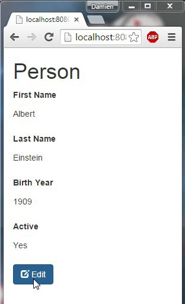
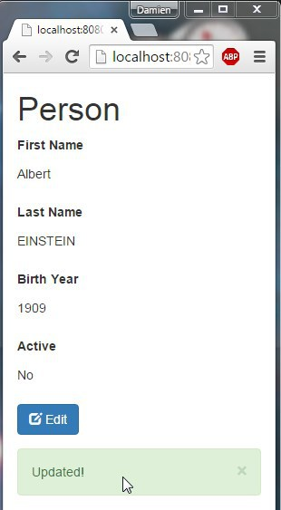
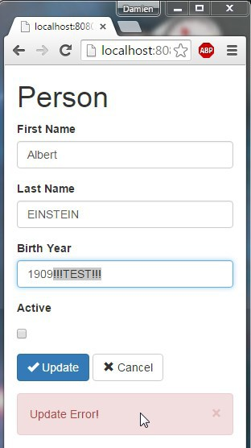

JavaEE AngularJS Bootstrap: Form (Basic: read, post)
======
 

 
 
# How to?
 
By using:
 
* Build Maven to manage java dependencies WebJars to manage web dependencies
* Front Bootstrap for UI AngularJS for MVC ng-route ng-resource ng-animate
AngularUIBootstrap for Bootstrap Javascript support in AngularJS
* Back JavaEE to provide REST web services Jersey for REST Server BeanValidation for API validation Tomcat to contain the webapp
 
 
 
# Demo
 
Run this project on your webapp server (Tomcat for example), and test on:
 
[http://localhost:8080/20151016-javaee-angularjs-bootstrap-form-basic](http://localhost:8080/20151016-javaee-angularjs-bootstrap-form-basic)
 
First a read-only view.
 

 
It’s animated with angular’s animate lib and animation.css style (fade-in effect here).
 

 
An then an edit view.
 

 
You can post the form then receive an alert (success here).
 

 
Or post wrong datas and get another type of alert (error here for year format).
 

 
It’s responsive too!
 

 
 
 
# Sources
 
## The Config Part
 
pom.xml: maven config
 
```xml
<project xmlns="http://maven.apache.org/POM/4.0.0" xmlns:xsi="http://www.w3.org/2001/XMLSchema-instance"
  xsi:schemaLocation="http://maven.apache.org/POM/4.0.0 http://maven.apache.org/xsd/maven-4.0.0.xsd">
  <modelVersion>4.0.0</modelVersion>
 
  <groupId>com.damienfremont.blog</groupId>
  <artifactId>20151016-javaee-angularjs-bootstrap-form-basic</artifactId>
  <version>0.0.1-SNAPSHOT</version>
  <packaging>war</packaging>
 
  <properties>
    <project.build.sourceEncoding>UTF-8</project.build.sourceEncoding>
    <java.version>7</java.version>
    <jersey.version>2.22.1</jersey.version>
    <angularjs.version>1.4.7</angularjs.version>
    <angular-ui-bootstrap.version>0.14.0</angular-ui-bootstrap.version>
    <bootstrap.version>3.3.5</bootstrap.version>
  </properties>
 
  <dependencies>
 
    <!-- JAVA -->
 
    <dependency>
      <groupId>javax</groupId>
      <artifactId>javaee-api</artifactId>
      <version>7.0</version>
      <scope>provided</scope>
    </dependency>
 
    <dependency>
      <groupId>org.glassfish.jersey.containers</groupId>
      <artifactId>jersey-container-servlet</artifactId>
      <version>${jersey.version}</version>
    </dependency>
    <dependency>
      <groupId>org.glassfish.jersey.media</groupId>
      <artifactId>jersey-media-json-jackson</artifactId>
      <version>${jersey.version}</version>
    </dependency>
 
    <!-- WEB -->
 
    <dependency>
      <groupId>org.webjars</groupId>
      <artifactId>webjars-servlet-2.x</artifactId>
      <version>1.1</version>
    </dependency>
 
    <dependency>
      <groupId>org.webjars</groupId>
      <artifactId>angularjs</artifactId>
      <version>${angularjs.version}</version>
    </dependency>
    <dependency>
      <groupId>org.webjars</groupId>
      <artifactId>angular-ui-bootstrap</artifactId>
      <version>${angular-ui-bootstrap.version}</version>
    </dependency>
 
    <dependency>
      <groupId>org.webjars</groupId>
      <artifactId>bootstrap</artifactId>
      <version>${bootstrap.version}</version>
    </dependency>
 
  </dependencies>
 
 
  <build>
    <resources>
      <resource>
        <directory>src/main/webapp</directory>
        <filtering>true</filtering>
        <targetPath>${project.basedir}/target/m2e-wtp/web-resources</targetPath>
        <includes>
          <include>*.jsp</include>
        </includes>
      </resource>
    </resources>
    <plugins>
      <plugin>
        <groupId>org.apache.maven.plugins</groupId>
        <artifactId>maven-war-plugin</artifactId>
        <version>2.6</version>
        <configuration>
          <webResources>
            <resource>
              <directory>src/main/webapp</directory>
              <filtering>true</filtering>
              <includes>
                <include>*.jsp</include>
              </includes>
            </resource>
          </webResources>
        </configuration>
      </plugin>
 
      <plugin>
        <groupId>org.apache.maven.plugins</groupId>
        <artifactId>maven-compiler-plugin</artifactId>
        <version>3.1</version>
        <configuration>
          <source>1.${java.version}</source>
          <target>1.${java.version}</target>
        </configuration>
      </plugin>
 
    </plugins>
  </build>
</project>
```
 
web.xml
 
```xml
<web-app xmlns="http://xmlns.jcp.org/xml/ns/javaee"
         xmlns:xsi="http://www.w3.org/2001/XMLSchema-instance"
         xsi:schemaLocation="http://xmlns.jcp.org/xml/ns/javaee
     http://xmlns.jcp.org/xml/ns/javaee/web-app_3_1.xsd"
         version="3.1">
 
  <servlet>
    <servlet-name>REST</servlet-name>
    <servlet-class>org.glassfish.jersey.servlet.ServletContainer</servlet-class>
    <init-param>
      <param-name>javax.ws.rs.Application</param-name>
      <param-value>com.damienfremont.blog.MyApplication</param-value>
    </init-param>
    <load-on-startup>1</load-on-startup>
  </servlet>
  <servlet-mapping>
    <servlet-name>REST</servlet-name>
    <url-pattern>/api/*</url-pattern>
  </servlet-mapping>
 
  <servlet>
    <servlet-name>WEBJARS</servlet-name>
    <servlet-class>org.webjars.servlet.WebjarsServlet</servlet-class>
    <init-param>
      <param-name>disableCache</param-name>
      <param-value>true</param-value>
    </init-param>
    <load-on-startup>2</load-on-startup>
  </servlet>
  <servlet-mapping>
    <servlet-name>WEBJARS</servlet-name>
    <url-pattern>/webjars/*</url-pattern>
  </servlet-mapping>
 
</web-app>
```
 
## The Java Part
 
MyApplication.java
 
```java
package com.damienfremont.blog;
 
import java.util.HashSet;
import java.util.Set;
import javax.ws.rs.core.Application;
 
public class MyApplication extends Application {
 
  @Override
  public Set<Class<?>> getClasses() {
    Set<Class<?>> s = new HashSet<Class<?>>();
    s.add(PersonResource.class);
    return s;
  }
}
```
 
PersonResource.java
 
```java
package com.damienfremont.blog;
 
import java.io.Serializable;
 
import javax.ws.rs.Consumes;
import javax.ws.rs.GET;
import javax.ws.rs.POST;
import javax.ws.rs.Path;
import javax.ws.rs.Produces;
import javax.ws.rs.core.MediaType;
 
@Path("/person")
public class PersonResource {
 
  @GET
  @Produces(MediaType.APPLICATION_JSON)
  public Person get() {
    return data;
  }
   
  @POST
  @Consumes(MediaType.APPLICATION_JSON)
  public void post(Person data) {
    this.data = data;
  }
   
  // MODEL
   
  static class Person implements Serializable {
    private static final long serialVersionUID = 9167120287441116359L;
    public String firstName;
    public String lastName;
    public Integer birthYear;
    public Boolean active;
  }
   
  // MOCK
 
  static Person data;
  static {
    data = new Person();
    data.firstName = "Albert";
    data.lastName = "Einstein";
    data.birthYear = 1909;
    data.active = Boolean.FALSE;
  }
 
}
```
 
## The Web Part
 
PersonSrv.js
 
```javascript
'use strict';
 
myApp.factory('Person', function($resource) {
    return $resource('api/person');
});
```
 
PersonCtrl.js
 
```javascript
'use strict';
 
myApp.controller('PersonCtrl', function($scope, Person, $location) {
  Person.get(function(obj) {
     $scope.person = obj;
  });
       
  // READ FORM
  $scope.edit = function() {
    $location.path( "/person/edit" );   
  }
   
  // EDIT FORM
  $scope.update = function() {
    Person.save($scope.person ,function(obj) {
      // this callback will be called asynchronously
      // when the response is available
      $scope.person = obj;
      $location.path( "/person" );
      $scope.$parent.alerts.push({type: 'success', msg: 'Updated!'});
    }, function() {
      // called asynchronously if an error occurs
      // or server returns response with an error status.
      $scope.$parent.alerts.push({type: 'danger', msg: 'Update Error!'});
    });
  }
  $scope.cancel = function() {
      $location.path( "/person" );   
  }
});
```
 
person.html
 
```xml
<div class="form-horizontal">
  <div class="form-group">
    <label class="col-sm-2 control-label">First Name</label>
    <div class="col-sm-10">
      <p class="form-control-static">{{person.firstName}}</p>
    </div>
  </div>
  <div class="form-group">
    <label class="col-sm-2 control-label">Last Name</label>
    <div class="col-sm-10">
      <p class="form-control-static">{{person.lastName}}</p>
    </div>
  </div>
  <div class="form-group">
    <label class="col-sm-2 control-label">Birth Year</label>
    <div class="col-sm-10">
      <p class="form-control-static">{{person.birthYear}}</p>
    </div>
  </div>
  <div class="form-group">
    <label class="col-sm-2 control-label">Active</label>
    <div class="col-sm-10">
      <p class="form-control-static">{{person.active === true ? 'Yes' : 'No'}}</p>
    </div>
  </div>
  <div class="form-group">
    <div class="col-sm-offset-2 col-sm-10">
      <button type="submit" class="btn btn-primary" ng-click="edit()">
        <span class="glyphicon glyphicon-edit"></span> Edit
      </button>
    </div>
  </div>
</div>
```
 
personEdit.html
 
```xml
<div class="form-horizontal">
  <div class="form-group">
    <label class="col-sm-2 control-label">First Name</label>
    <div class="col-sm-10">
      <input class="form-control" placeholder="FirstName" ng-model="person.firstName">
    </div>
  </div>
  <div class="form-group">
    <label class="col-sm-2 control-label">Last Name</label>
    <div class="col-sm-10">
      <input class="form-control" placeholder="Last Name" ng-model="person.lastName">
    </div>
  </div>
  <div class="form-group">
    <label class="col-sm-2 control-label">Birth Year</label>
    <div class="col-sm-10">
      <input class="form-control" placeholder="Birth Year" ng-model="person.birthYear">
    </div>
  </div>
  <div class="form-group">
    <label class="col-sm-2 control-label">Active</label>
    <div class="col-sm-10">
      <div class="checkbox">
        <label>
          <input type="checkbox" ng-model="person.active">
        </label>
      </div>
    </div>
  </div>
  <div class="form-group">
    <div class="col-sm-offset-2 col-sm-10">
      <button type="submit" class="btn btn-primary" ng-click="update()">
        <span class="glyphicon glyphicon-ok"></span> Update
      </button>
      <button type="submit" class="btn btn-default" ng-click="cancel()">
        <span class="glyphicon glyphicon-remove"></span> Cancel
      </button>
    </div>
  </div>
</div>
```
 
app.js
 
```javascript
'use strict';
 
var myApp = angular.module(
  'myApp',
  [ 'ngAnimate',
    'ui.bootstrap',
    'ngRoute',
    'ngResource']);
 
myApp.config(function($routeProvider) {
  $routeProvider
  // ROUTE FOR THE READ PAGE
  .when('/person', {
    templateUrl : 'views/person.html',
    controller  : 'PersonCtrl'
  })
  // ROUTE FOR THE EDIT PAGE
  .when('/person/edit', {
    templateUrl : 'views/personEdit.html',
    controller  : 'PersonCtrl'
  })
  // DEFAULT
  .otherwise({
    redirectTo: '/person'
  });
});
 
myApp.controller('AlertCtrl', function($scope) {
  $scope.alerts = [ ];
  $scope.closeAlert = function(index) {
    $scope.alerts.splice(index, 1);
  };
});
```
 
index.jsp
 
```xml
<html ng-app="myApp">
<head>
<!-- LIBS CSS -->
<link rel="stylesheet" href="webjars/bootstrap/${bootstrap.version}/css/bootstrap.css">
<link rel="stylesheet" href="styles/animation.css">
<!-- LIBS JS -->
<script src="webjars/angularjs/${angularjs.version}/angular.js"></script>
<script src="webjars/angularjs/${angularjs.version}/angular-resource.js"></script>
<script src="webjars/angularjs/${angularjs.version}/angular-route.js"></script>
<script src="webjars/angularjs/${angularjs.version}/angular-animate.js"></script>
<script src="webjars/angular-ui-bootstrap/${angular-ui-bootstrap.version}/ui-bootstrap-tpls.js"></script>
<!-- YOUR JS -->
<script src="js/app.js"></script>
<script src="js/controllers/PersonCtrl.js"></script>
<script src="js/services/PersonSrv.js"></script>
</head>
<body>
  <div class="container" ng-controller="AlertCtrl">
    <h1>Person</h1>
    <div ng-view class="view-animate"></div>
    <uib-alert ng-repeat="alert in alerts" type="{{alert.type}}" close="closeAlert($index)">{{alert.msg}}</uib-alert>
  </div>
</body>
</html>
```
 
animation.css
 
```css
/* 1: ENTER */
.view-animate.ng-enter {
  transition: 1s linear all;
  opacity: 0;
}
 
/* 2: ACTIVE */
.view-animate.ng-enter.ng-enter-active {
  opacity: 1;
}
 
/* 3: LEAVE */
.view-animate.ng-leave {
  opacity: 1;
}
```
 
 
 
## Project Structure
 

 
# Project
 
[https://github.com/DamienFremont/blog/tree/master/20151016-javaee-angularjs-bootstrap-form-basic](https://github.com/DamienFremont/blog/tree/master/20151016-javaee-angularjs-bootstrap-form-basic)
 
# References
 
[http://getbootstrap.com/css/](http://getbootstrap.com/css/)
 
[https://docs.angularjs.org/guide/forms](https://docs.angularjs.org/guide/forms)
 
[https://docs.angularjs.org/api/ngResource/service/$resource](https://docs.angularjs.org/api/ngResource/service/$resource)
 
[https://angular-ui.github.io/bootstrap/](https://angular-ui.github.io/bootstrap/)
 
[https://scotch.io/tutorials/single-page-apps-with-angularjs-routing-and-templating](https://scotch.io/tutorials/single-page-apps-with-angularjs-routing-and-templating)
 
