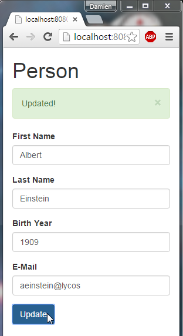
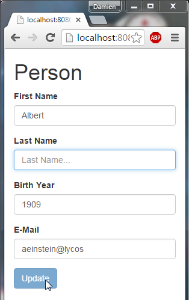
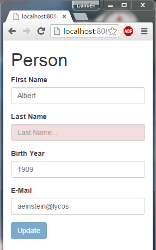
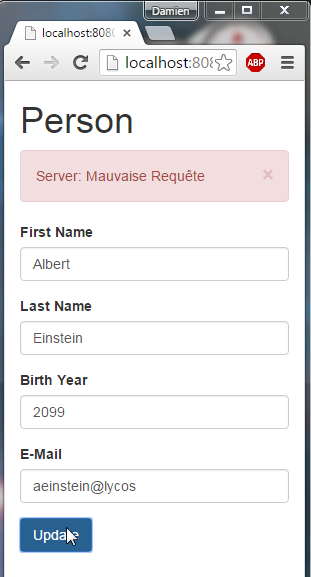
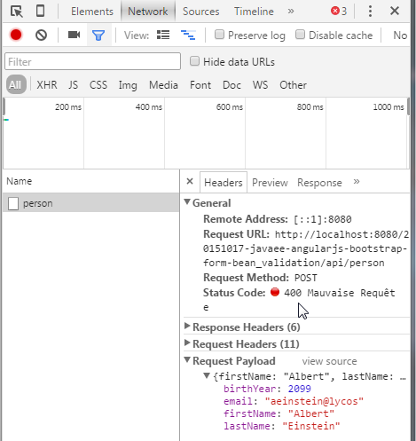

JavaEE AngularJS Bootstrap: Form Bean Validation (front and back)
======
 

 
Dual Validation, on Web side and Server side (UI and API), using AngularJs Validation directives and JavaEE BeanValidation API.
 
 
# Demo
 
A simple User form, with REST HTTP Get then Post.
 

 

 
Disable submit button with tag (if form is $invalid).
 

 
ng-valid and ng-invalid will automatically determine if a field is valid based on the tags placed in your form.
 

 

 
Her we are testing the back end validation, which is more extended than UI Validation
 
Validation: Birth Year < 2015
 

 
This message is from the Java Server.
 

 
Here the HTTP Request.
 

 
and Response from Java Server (Bad Request).
 

 
# Source
 
[http://localhost:8080/20151017-javaee-angularjs-bootstrap-form-bean_validation/#/person](http://localhost:8080/20151017-javaee-angularjs-bootstrap-form-bean_validation/#/person)
 

 
 
 
MyAppCONFIG.java
 
```java
package com.damienfremont.blog;
 
import java.util.HashSet;
import java.util.Set;
import javax.ws.rs.core.Application;
 
public class MyAppCONFIG extends Application {
 
  @Override
  public Set<Class<?>> getClasses() {
    Set<Class<?>> s = new HashSet<Class<?>>();
    s.add(PersonJAXRS.class);
    return s;
  }
}
```
 
PersonJAXRS.java
 
```java
package com.damienfremont.blog;
 
import java.io.Serializable;
 
import javax.validation.Valid;
import javax.validation.constraints.DecimalMax;
import javax.validation.constraints.NotNull;
import javax.validation.executable.ValidateOnExecution;
import javax.ws.rs.Consumes;
import javax.ws.rs.GET;
import javax.ws.rs.POST;
import javax.ws.rs.Path;
import javax.ws.rs.Produces;
import javax.ws.rs.core.MediaType;
 
import org.hibernate.validator.constraints.Email;
 
 
@Path("/person")
public class PersonJAXRS {
 
  // READ
  @GET
  @Produces(MediaType.APPLICATION_JSON)
  public Person get() {
    return data;
  }
   
  // UPDATE
  @POST
  @Consumes(MediaType.APPLICATION_JSON)
  @ValidateOnExecution
  public void post(@Valid Person data) {
    this.data = data;
  }
   
  // MODEL
  static class Person implements Serializable {
    private static final long serialVersionUID = 9167120287441116359L;
    @NotNull
    public String firstName;
    @NotNull
    public String lastName;
    @NotNull
    @DecimalMax("2015")
    public Integer birthYear;
    @Email
    public String email;
  }
   
  // MOCK
  static Person data;
  static {
    data = new Person();
    data.firstName = "Albert";
    data.lastName = "Einstein";
    data.birthYear= 1909;
    data.email= "aeinstein@lycos.com";
  }
 
}
```
 
web.xml
 
```xml
<web-app xmlns="http://xmlns.jcp.org/xml/ns/javaee" xmlns:xsi="http://www.w3.org/2001/XMLSchema-instance" xsi:schemaLocation="http://xmlns.jcp.org/xml/ns/javaee http://xmlns.jcp.org/xml/ns/javaee/web-app_3_1.xsd" version="3.1">
 
  <servlet>
    <servlet-name>REST</servlet-name>
    <servlet-class>org.glassfish.jersey.servlet.ServletContainer</servlet-class>
    <init-param>
      <param-name>javax.ws.rs.Application</param-name>
      <param-value>com.damienfremont.blog.MyAppCONFIG</param-value>
    </init-param>
    <load-on-startup>1</load-on-startup>
  </servlet>
  <servlet-mapping>
    <servlet-name>REST</servlet-name>
    <url-pattern>/api/*</url-pattern>
  </servlet-mapping>
 
  <servlet>
    <servlet-name>WEBJARS</servlet-name>
    <servlet-class>org.webjars.servlet.WebjarsServlet</servlet-class>
    <init-param>
      <param-name>disableCache</param-name>
      <param-value>true</param-value>
    </init-param>
    <load-on-startup>2</load-on-startup>
  </servlet>
  <servlet-mapping>
    <servlet-name>WEBJARS</servlet-name>
    <url-pattern>/webjars/*</url-pattern>
  </servlet-mapping>
 
</web-app>
```
 
app.js
 
```javascript
'use strict';
 
var myApp = angular.module(
  'myApp',
  [ 'ngAnimate',
    'ui.bootstrap',
    'ngRoute',
    'ngResource']);
 
myApp.controller('AlertCtrl', function($scope) {
  $scope.alerts = [ ];
  $scope.closeAlert = function(index) {
    $scope.alerts.splice(index, 1);
  };
});
 
myApp.factory('Person', function($resource) {
    return $resource('api/person');
});
 
myApp.controller('PersonCtrl', function($scope, Person, $location) {
     
  // READ
  Person.get(function(obj) {
     $scope.person = obj;
  });
   
  // SAVE
  $scope.update = function() {
    Person.save($scope.person ,function(obj) {
      // this callback will be called asynchronously
      // when the response is available
      $scope.person = obj;
      $location.path( "/person" );
      $scope.$parent.alerts.push({type: 'success', msg: 'Updated!'});
    }, function(error) {
      // called asynchronously if an error occurs
      // or server returns response with an error status.
      $scope.$parent.alerts.push({type: 'danger', msg: 'Server: '+error.statusText});
    });
  }
});
```
 
index.jsp
 
```xml
<html ng-app="myApp">
<head>
<!-- LIBS CSS -->
<link rel="stylesheet" href="webjars/bootstrap/${bootstrap.version}/css/bootstrap.css">
<link rel="stylesheet" href="styles.css">
<!-- LIBS JS -->
<script src="webjars/angularjs/${angularjs.version}/angular.js"></script>
<script src="webjars/angularjs/${angularjs.version}/angular-resource.js"></script>
<script src="webjars/angularjs/${angularjs.version}/angular-route.js"></script>
<script src="webjars/angularjs/${angularjs.version}/angular-animate.js"></script>
<script src="webjars/angular-ui-bootstrap/${angular-ui-bootstrap.version}/ui-bootstrap-tpls.js"></script>
<!-- YOUR JS -->
<script src="app.js"></script>
</head>
<body>
  <div class="container" ng-controller="AlertCtrl">
    <h1>Person</h1>
 
    <!-- ALERT -->
    <uib-alert ng-repeat="alert in alerts" type="{{alert.type}}" close="closeAlert($index)">{{alert.msg}}</uib-alert>
 
    <!-- FORM -->
    <form class="form-horizontal" ng-controller="PersonCtrl" name="userForm">
      <div class="form-group">
        <label class="col-sm-2 control-label">First Name</label>
        <div class="col-sm-10">
          <input class="form-control" placeholder="FirstName..." ng-model="person.firstName"
          required> <!-- VALIDATION HERE -->
        </div>
      </div>
      <div class="form-group">
        <label class="col-sm-2 control-label">Last Name</label>
        <div class="col-sm-10">
          <input class="form-control" placeholder="Last Name..." ng-model="person.lastName"
          required> <!-- VALIDATION HERE -->
        </div>
      </div>
      <div class="form-group">
        <label class="col-sm-2 control-label">Birth Year</label>
        <div class="col-sm-10">
          <input class="form-control" placeholder="Birth Year..." ng-model="person.birthYear" type="number"
          required> <!-- VALIDATION HERE -->
        </div>
      </div>
      <div class="form-group">
        <label class="col-sm-2 control-label">E-Mail</label>
        <div class="col-sm-10">
          <input class="form-control" placeholder="E-Mail..." ng-model="person.email" type="email"
          required> <!-- VALIDATION HERE -->
        </div>
      </div>
      <!-- BUTTON -->
      <div class="form-group">
        <div class="col-sm-offset-2 col-sm-10">
          <button type="submit" class="btn btn-primary" ng-click="update()"
            ng-disabled="userForm.$invalid"> <!-- VALIDATION HERE -->
            Update</button>
        </div>
      </div>
    </div>
  </form>
</body>
</html>
```
 
styles.css
 
```css
form input.ng-invalid.ng-touched {
  background-color: #f2dede;
}
```
 
pom.xml
 
```xml
<project xmlns="http://maven.apache.org/POM/4.0.0" xmlns:xsi="http://www.w3.org/2001/XMLSchema-instance" xsi:schemaLocation="http://maven.apache.org/POM/4.0.0 http://maven.apache.org/xsd/maven-4.0.0.xsd">
  <modelVersion>4.0.0</modelVersion>
 
  <groupId>com.damienfremont.blog</groupId>
  <artifactId>20151017-javaee-angularjs-bootstrap-form-bean_validation</artifactId>
  <version>0.0.1-SNAPSHOT</version>
  <packaging>war</packaging>
 
  <properties>
    <project.build.sourceEncoding>UTF-8</project.build.sourceEncoding>
    <java.version>7</java.version>
    <jersey.version>2.22.1</jersey.version>
    <angularjs.version>1.4.7</angularjs.version>
    <angular-ui-bootstrap.version>0.14.0</angular-ui-bootstrap.version>
    <bootstrap.version>3.3.5</bootstrap.version>
  </properties>
 
  <dependencies>
 
    <!-- JAVA -->
 
    <dependency>
      <groupId>javax</groupId>
      <artifactId>javaee-api</artifactId>
      <version>7.0</version>
      <scope>provided</scope>
    </dependency>
 
    <dependency>
      <groupId>org.glassfish.jersey.containers</groupId>
      <artifactId>jersey-container-servlet</artifactId>
      <version>${jersey.version}</version>
    </dependency>
    <dependency>
      <groupId>org.glassfish.jersey.media</groupId>
      <artifactId>jersey-media-json-jackson</artifactId>
      <version>${jersey.version}</version>
    </dependency>
    <dependency>
      <groupId>org.glassfish.jersey.ext</groupId>
      <artifactId>jersey-bean-validation</artifactId>
      <version>${jersey.version}</version>
    </dependency>
 
    <!-- WEB -->
 
    <dependency>
      <groupId>org.webjars</groupId>
      <artifactId>webjars-servlet-2.x</artifactId>
      <version>1.1</version>
    </dependency>
 
    <dependency>
      <groupId>org.webjars</groupId>
      <artifactId>angularjs</artifactId>
      <version>${angularjs.version}</version>
    </dependency>
    <dependency>
      <groupId>org.webjars</groupId>
      <artifactId>angular-ui-bootstrap</artifactId>
      <version>${angular-ui-bootstrap.version}</version>
    </dependency>
 
    <dependency>
      <groupId>org.webjars</groupId>
      <artifactId>bootstrap</artifactId>
      <version>${bootstrap.version}</version>
    </dependency>
 
  </dependencies>
 
 
  <build>
    <resources>
      <resource>
        <directory>src/main/webapp</directory>
        <filtering>true</filtering>
        <targetPath>${project.basedir}/target/m2e-wtp/web-resources</targetPath>
        <includes>
          <include>*.jsp</include>
        </includes>
      </resource>
    </resources>
    <plugins>
      <plugin>
        <groupId>org.apache.maven.plugins</groupId>
        <artifactId>maven-war-plugin</artifactId>
        <version>2.6</version>
        <configuration>
          <webResources>
            <resource>
              <directory>src/main/webapp</directory>
              <filtering>true</filtering>
              <includes>
                <include>*.jsp</include>
              </includes>
            </resource>
          </webResources>
        </configuration>
      </plugin>
 
      <plugin>
        <groupId>org.apache.maven.plugins</groupId>
        <artifactId>maven-compiler-plugin</artifactId>
        <version>3.1</version>
        <configuration>
          <source>1.${java.version}</source>
          <target>1.${java.version}</target>
        </configuration>
      </plugin>
 
    </plugins>
  </build>
</project>
```
 
# Project
 
[https://github.com/DamienFremont/blog/tree/master/20151017-javaee-angularjs-bootstrap-validation](https://github.com/DamienFremont/blog/tree/master/20151017-javaee-angularjs-bootstrap-validation)
 
# References
 
[http://blog.xebia.fr/2010/07/15/bean-validation/](http://blog.xebia.fr/2010/07/15/bean-validation/)
 
[https://docs.angularjs.org/guide/forms](https://docs.angularjs.org/guide/forms)
 
