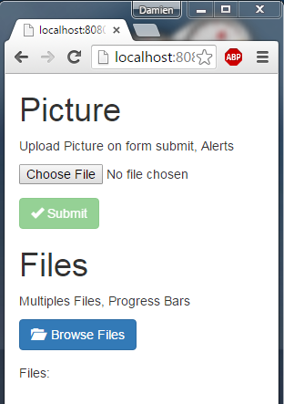
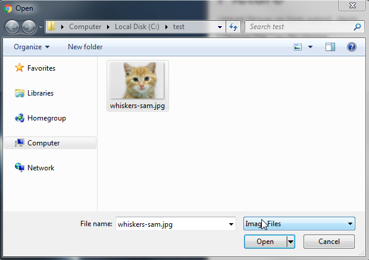
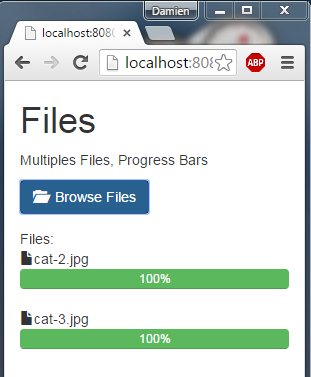

JavaEE AngularJS Bootstrap: File Upload
======
 

 
A simple picture upload with preview with alert messages for avatar and a multiple files upload with progress bar.
 

 
# Demo
 
[http://localhost:8080/20151019-javaee-angularjs-bootstrap-upload_file/](http://localhost:8080/20151019-javaee-angularjs-bootstrap-upload_file/)
http://localhost:8080/20151019-javaee-angularjs-bootstrap-upload_file/
 

 

 
Here is Picture upload.
 

 

 

 

 

 

 

 

 
 
 
 
 

 

 
Here is multiple files upload.
 

 

 

 

 

 

 

 

 

 

 
# Source
 

 

 
MyAppCONFIG.java
 
```java
package com.damienfremont.blog;
 
import java.util.HashSet;
import java.util.Set;
import javax.ws.rs.core.Application;
 
public class MyAppCONFIG extends Application {
 
  @Override
  public Set<Class<?>> getClasses() {
    Set<Class<?>> s = new HashSet<Class<?>>();
    s.add(ServiceJAXRS.class);
    return s;
  }
}
```
 
ServiceJAXRS.java
 
```java
package com.damienfremont.blog;
 
import java.io.File;
import java.io.FileOutputStream;
import java.io.IOException;
import java.io.InputStream;
import java.io.OutputStream;
 
import javax.ws.rs.Consumes;
import javax.ws.rs.POST;
import javax.ws.rs.Path;
import javax.ws.rs.WebApplicationException;
import javax.ws.rs.core.MediaType;
import javax.ws.rs.core.Response;
 
import org.glassfish.jersey.media.multipart.FormDataContentDisposition;
import org.glassfish.jersey.media.multipart.FormDataParam;
 
@Path("/upload")
public class ServiceJAXRS {
 
    @POST
    @Path("/file")
    @Consumes({MediaType.MULTIPART_FORM_DATA})
    public Response uploadFile(
            @FormDataParam("file") InputStream fileInputStream,
            @FormDataParam("file") FormDataContentDisposition fileMetaData) throws Exception {
        try {
            int read = 0;
            byte[] bytes = new byte[1024];
            File file = new File(fileMetaData.getFileName());
            System.out.println("Upload File Path : "+file.getAbsolutePath());
            OutputStream out = new FileOutputStream(file);
            while ((read = fileInputStream.read(bytes)) != -1) {
                out.write(bytes, 0, read);
            }
            out.flush();
            out.close();
        } catch (IOException e) {
            throw new WebApplicationException("Error while uploading file. Please try again !!");
        }
        return Response.ok("Data uploaded successfully !!").build();
    }
     
}
```
 
web.xml
 
```xml
<web-app xmlns="http://xmlns.jcp.org/xml/ns/javaee" xmlns:xsi="http://www.w3.org/2001/XMLSchema-instance" xsi:schemaLocation="http://xmlns.jcp.org/xml/ns/javaee http://xmlns.jcp.org/xml/ns/javaee/web-app_3_1.xsd" version="3.1">
 
  <servlet>
    <servlet-name>REST</servlet-name>
    <servlet-class>org.glassfish.jersey.servlet.ServletContainer</servlet-class>
    <init-param>
      <param-name>javax.ws.rs.Application</param-name>
      <param-value>com.damienfremont.blog.MyAppCONFIG</param-value>
    </init-param>
    <init-param>
      <param-name>jersey.config.server.provider.classnames</param-name>
      <param-value>org.glassfish.jersey.media.multipart.MultiPartFeature</param-value>
    </init-param>
    <load-on-startup>1</load-on-startup>
  </servlet>
  <servlet-mapping>
    <servlet-name>REST</servlet-name>
    <url-pattern>/api/*</url-pattern>
  </servlet-mapping>
 
  <servlet>
    <servlet-name>WEBJARS</servlet-name>
    <servlet-class>org.webjars.servlet.WebjarsServlet</servlet-class>
    <init-param>
      <param-name>disableCache</param-name>
      <param-value>true</param-value>
    </init-param>
    <load-on-startup>2</load-on-startup>
  </servlet>
  <servlet-mapping>
    <servlet-name>WEBJARS</servlet-name>
    <url-pattern>/webjars/*</url-pattern>
  </servlet-mapping>
 
</web-app>
```
 
app.js
 
```javascript
'use strict';
 
var app = angular.module(
  'app',
  [ 'ngAnimate',
    'ui.bootstrap',
    'ngResource',
    'ngFileUpload' ]);
 
app.factory('Model', function($resource) {
  return $resource('api/upload');
});
 
app.controller('SubmitFileCtrl', function ($scope, Upload, $timeout) {
  $scope.uploadPic = function(file) {
  file.upload = Upload.upload({
    url: 'api/upload/file',
    data: {file: file },
  });
  file.upload.then(function (response) {
    $timeout(function () {
    file.result = response.data;
    });
  }, function (response) {
    if (response.status > 0)
    $scope.errorMsg = "Server Error! ("+response.data+")";
  }, function (evt) {
    // Math.min is to fix IE which reports 200% sometimes
    file.progress = Math.min(100, parseInt(100.0 * evt.loaded / evt.total));
  });
  }
});
 
app.controller('FilesCtrl', function ($scope, Upload, $timeout) {
  $scope.uploadFiles = function(files, errFiles) {
    $scope.files = files;
    $scope.errFiles = errFiles;
    angular.forEach(files, function(file) {
      file.upload = Upload.upload({
        url: 'api/upload/file',
        data: {file: file}
      });
 
      file.upload.then(function (response) {
        $timeout(function () {
          file.result = response.data;
        });
      }, function (response) {
        if (response.status > 0)
          $scope.errorMsg = response.status + ': ' + response.data;
      }, function (evt) {
        file.progress = Math.min(100, parseInt(100.0 * evt.loaded / evt.total));
      });
    });
  }
});
```
 
index.jsp
 
```xml
<!DOCTYPE html>
<html ng-app="app">
<head>
<!-- LIBS CSS -->
<link rel="stylesheet" href="webjars/bootstrap/${bootstrap.version}/css/bootstrap.css">
<link rel="stylesheet" href="styles.css">
<!-- LIBS JS -->
<script src="webjars/angularjs/${angularjs.version}/angular.js"></script>
<script src="webjars/angularjs/${angularjs.version}/angular-resource.js"></script>
<script src="webjars/angularjs/${angularjs.version}/angular-animate.js"></script>
<script src="webjars/angular-ui-bootstrap/${angular-ui-bootstrap.version}/ui-bootstrap-tpls.js"></script>
<script src="webjars/ng-file-upload/${ng-file-upload.version}/ng-file-upload.js"></script>
<!-- YOUR JS -->
<script src="app.js"></script>
</head>
<body>
  <div class="container">
     
   <!-- PICTURE FILE -->
     
   <form name="myForm" ng-controller="SubmitFileCtrl">
     <h1>Picture</h1>
     <p>Upload Picture on form submit, Alerts</p>
     <!-- BROWSE -->
     <div class="form-group">
       <input type="file"
         ngf-select
         ng-model="picFile" name="file"   
         accept="image/*"
         ngf-max-size="2MB"
         required>
         <i ng-show="myForm.file.$error.maxSize">File too large {{picFile.size / 1000000|number:1}}MB: max 2M</i>
     </div>
     <!-- PREVIEW -->
     <div class="form-group">
       
       <button class="btn btn-danger btn-xs"
         ng-click="picFile = null"
         ng-show="picFile">
         <i class="glyphicon glyphicon-remove"></i> Remove
       </button>
     </div>
     <!-- SUBMIT -->
     <button class="btn btn-success"
       ng-disabled="!myForm.$valid"
       ng-click="uploadPic(picFile)">
       <i class="glyphicon glyphicon-ok"></i> Submit
     </button>
     <!-- ALERT -->
     <p>
       <div class="alert alert-danger" ng-show="errorMsg">Upload Error!</div>
       <div class="alert alert-success" ng-show="picFile.result">Upload Successful.</div>
     </p>
    </form>
     
    <!-- FILES -->
     
    <form ng-controller="FilesCtrl">
      <h1>Files</h1>
      <p>Multiples Files, Progress Bars</p>
     <!-- BROWSE -->
      <div class="form-group">
        <button class="btn btn-primary"
          ngf-select="uploadFiles($files)"
          multiple
          accept="*">
          <i class="glyphicon glyphicon-folder-open"></i>&nbsp;&nbsp;Browse Files
        </button>
      </div>
      Files:
      <div class="uploadedfile" ng-repeat="f in files" style="font:smaller">
        <!-- FILE -->
        <i class="glyphicon glyphicon-file"></i><span ng-class="{removed: f.removed}">{{f.name}} {{f.$errorParam}}</span>
        <!-- PROGRESS -->
        <div class="progress" ng-show="f.progress >= 0">
          <div class="progress-bar progress-bar-success" role="progressbar"
            aria-valuenow="{{f.progress}}" aria-valuemin="0" aria-valuemax="100"
            style="width: {{f.progress}}%">
            <span class="sr-only">{{f.progress}}% Complete</span> {{f.progress}}%
          </div>
        </div>
      </div>
      {{errorMsg}}
    </form>
     
  </div>
</body>
</html>
```
 
styles.css
 
```xml
.thumb {
    width: 24px;
    height: 24px;
    float: none;
    position: relative;
}
```
 
# Project
 
[https://github.com/DamienFremont/blog/tree/master/20151019-javaee-angularjs-bootstrap-upload_file](https://github.com/DamienFremont/blog/tree/master/20151019-javaee-angularjs-bootstrap-upload_file)
https://github.com/DamienFremont/blog/tree/master/20151019-javaee-angularjs-bootstrap-upload_file
 
# References
 
[https://github.com/danialfarid/ng-file-upload](https://github.com/danialfarid/ng-file-upload)
https://github.com/danialfarid/ng-file-upload
 
[https://angular-file-upload.appspot.com/](https://angular-file-upload.appspot.com/)
https://angular-file-upload.appspot.com/
 
[http://howtodoinjava.com/2015/08/05/jersey-file-upload-example/](http://howtodoinjava.com/2015/08/05/jersey-file-upload-example/)
http://howtodoinjava.com/2015/08/05/jersey-file-upload-example/
 
 
[https://damienfremont.com/2015/10/19/javaee-angularjs-bootstrap-file-upload/](https://damienfremont.com/2015/10/19/javaee-angularjs-bootstrap-file-upload/)
 
