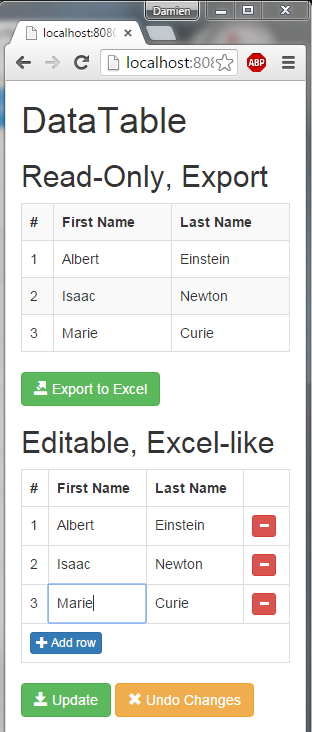
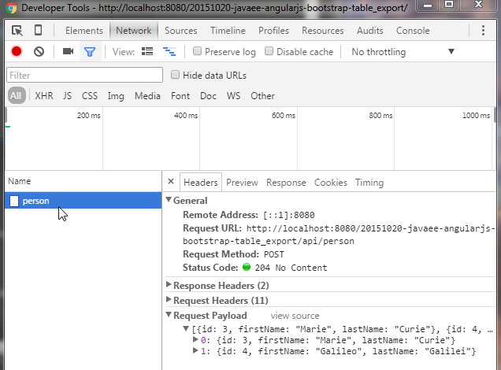
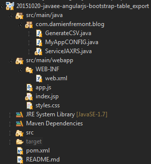

JavaEE AngularJS Bootstrap: DataTable and Excel Export
======
 

 
This is a read-only table with a CSV export button, then an editable table form like Excel tab (DataTable) with add, remove, undo and update buttons. There is also a default focus on last editable row.
 
# Demo
 
[http://localhost:8080/20151020-javaee-angularjs-bootstrap-table_export/](http://localhost:8080/20151020-javaee-angularjs-bootstrap-table_export/)
http://localhost:8080/20151020-javaee-angularjs-bootstrap-table_export/
 

 

 
Here is a read-only table with CSV Export Button, from REST API @GET /person/all
 

 

 
A CSV file is send by REST API @GET /person/all/csv.
 

 

 

 

 
Here is a DataTable, editable like an Excel Window, with focus set on the last row’s cell.
 

 

 
You can add or remove table’s row with buttons, then update.
 

 

 

 

 
And send to REST API @POST /person/all.
 

 

 
# Source
 

 
GenerateCSV.java
 
```java
package com.damienfremont.blog;
 
import java.io.File;
import java.io.FileWriter;
import java.io.IOException;
import java.util.List;
 
import com.damienfremont.blog.ServiceJAXRS.Person;
 
public class GenerateCSV {
 
  public static File generateCsvFile(List<Person> datas) {
    try {
      File file = new File("temp");
      FileWriter writer = new FileWriter(file);
      char separator = ';';
      for (Person i : datas) {
        writer.append(i.id.toString());
        writer.append(separator);
        writer.append(i.firstName);
        writer.append(separator);
        writer.append(i.lastName);
        writer.append('\n');
      }
      writer.flush();
      writer.close();
      return file;
    } catch (IOException e) {
      throw new RuntimeException();
    }
  }
 
}
```
 
MyAppCONFIG.java
 
```java
package com.damienfremont.blog;
 
import java.util.HashSet;
import java.util.Set;
import javax.ws.rs.core.Application;
 
public class MyAppCONFIG extends Application {
 
  @Override
  public Set<Class<?>> getClasses() {
    Set<Class<?>> s = new HashSet<Class<?>>();
    s.add(ServiceJAXRS.class);
    return s;
  }
}
```
 
ServiceJAXRS.java
 
```java
package com.damienfremont.blog;
 
import java.io.File;
import java.io.Serializable;
import java.util.ArrayList;
import java.util.List;
 
import javax.ws.rs.Consumes;
import javax.ws.rs.GET;
import javax.ws.rs.POST;
import javax.ws.rs.Path;
import javax.ws.rs.Produces;
import javax.ws.rs.core.MediaType;
import javax.ws.rs.core.Response;
import javax.ws.rs.core.Response.ResponseBuilder;
 
@Path("/person")
public class ServiceJAXRS {
 
  @Path("/all")
  @GET
  @Produces(MediaType.APPLICATION_JSON)
  public List<Person> getAll() {
    return datas;
  }
   
  @Path("/all")
  @POST
  @Consumes(MediaType.APPLICATION_JSON)
  public void saveAll(List<Person>  datas) {
    this.datas = datas;
  }
   
  @GET
  @Path("/all/csv")
  @Produces("application/pdf")
  public Response getFile() {
    File file = GenerateCSV.generateCsvFile(datas);
    ResponseBuilder response = Response.ok((Object) file);
    String filename = "export.csv";
    response.header("Content-Disposition", "attachment; filename="+filename);
    return response.build();
  }
 
  // MODEL
  static class Person implements Serializable {
    private static final long serialVersionUID = 9167120287441116359L;
    public Integer id;
    public String firstName;
    public String lastName;
    public Person() {
 
    }
    public Person(Integer id, String firstName, String lastName) {
      this.id = id;
      this.firstName = firstName;
      this.lastName = lastName;
    }   
  }
 
  // MOCK
  static List<Person> datas;
  static {
    datas = new ArrayList<>();
    datas.add(new Person(1, "Albert", "Einstein"));
    datas.add(new Person(2, "Isaac", "Newton"));
    datas.add(new Person(3, "Marie", "Curie"));
  }
}
```
 
web.xml
 
```xml
<web-app xmlns="http://xmlns.jcp.org/xml/ns/javaee" xmlns:xsi="http://www.w3.org/2001/XMLSchema-instance" xsi:schemaLocation="http://xmlns.jcp.org/xml/ns/javaee http://xmlns.jcp.org/xml/ns/javaee/web-app_3_1.xsd" version="3.1">
 
  <servlet>
    <servlet-name>REST</servlet-name>
    <servlet-class>org.glassfish.jersey.servlet.ServletContainer</servlet-class>
    <init-param>
      <param-name>javax.ws.rs.Application</param-name>
      <param-value>com.damienfremont.blog.MyAppCONFIG</param-value>
    </init-param>
    <init-param>
      <param-name>jersey.config.server.provider.classnames</param-name>
      <param-value>org.glassfish.jersey.media.multipart.MultiPartFeature</param-value>
    </init-param>
    <load-on-startup>1</load-on-startup>
  </servlet>
  <servlet-mapping>
    <servlet-name>REST</servlet-name>
    <url-pattern>/api/*</url-pattern>
  </servlet-mapping>
 
  <servlet>
    <servlet-name>WEBJARS</servlet-name>
    <servlet-class>org.webjars.servlet.WebjarsServlet</servlet-class>
    <init-param>
      <param-name>disableCache</param-name>
      <param-value>true</param-value>
    </init-param>
    <load-on-startup>2</load-on-startup>
  </servlet>
  <servlet-mapping>
    <servlet-name>WEBJARS</servlet-name>
    <url-pattern>/webjars/*</url-pattern>
  </servlet-mapping>
 
</web-app>
```
 
app.js
 
```javascript
'use strict';
 
var app = angular.module(
  'app',
  [ 'ngResource' ]);
 
app.factory('Person', function($resource) {
      return $resource('api/person/all');
});
 
//TABLE
 
app.factory('PersonCSV', function($resource) {
      return 'api/person/all/csv';
});
 
app.controller('TableCtrl', function ($scope, Person, PersonCSV, $window) {
 
  Person.query(function(datas) {
      $scope.items = datas;
  });
   
  $scope.downloadCSV = function() {
      var url = PersonCSV;
      $window.open(url);
  }
});
 
// DATATABLE
 
app.controller('DataTableCtrl', function ($scope, Person) {
 
  Person.query(function(datas) {
    $scope.items = datas;
  });
       
  $scope.add = function() {
    var nextId = $scope.items[$scope.items.length - 1].id + 1;
    $scope.items.push({
        id: nextId
    })
  };
       
  $scope.remove = function(data) {
    var i = $scope.items.indexOf(data);
    $scope.items.splice(i, 1);
  }
   
  $scope.update = function() {
    Person.save($scope.items ,function() {
      alert('updated!');
    }, function() {
      alert('error!');
    });
  };
   
  $scope.undo = function() {
    Person.query(function(datas) {
      $scope.items = datas;
    });
  }
   
});
 
app.directive('focus', function($timeout) {
  return {
    scope : {
      trigger : '@focus'
    },
    link : function(scope, element) {
      scope.$watch('trigger', function(value) {
        if (value === "true") {
          $timeout(function() {
            element[0].focus();
          });
        }
      });
    }
  };
});
 
app.directive('contenteditable', function() {
  return {
    require: 'ngModel',
    link: function(scope, elm, attrs, ctrl) {
      // view -> model
       elm.bind('blur', function() {
         scope.$apply(function() {
           ctrl.$setViewValue(elm.html());
         });
       });
       // model -> view
       ctrl.render = function(value) {
         elm.html(value);
       };
       elm.bind('keydown', function(event) {
         var esc = event.which == 27,
         el = event.target;
         if (esc) {
           ctrl.$setViewValue(elm.html());
           el.blur();
           event.preventDefault();
         }
       });
    }
  };
});
```
 
index.jsp
 
```xml
<!DOCTYPE html>
<html ng-app="app">
<head>
<!-- LIBS CSS -->
<link rel="stylesheet" href="webjars/bootstrap/${bootstrap.version}/css/bootstrap.css">
<!-- LIBS JS -->
<script src="webjars/angularjs/${angularjs.version}/angular.js"></script>
<script src="webjars/angularjs/${angularjs.version}/angular-resource.js"></script>
<!-- YOUR JS -->
<script src="app.js"></script>
</head>
<body>
<div class="container">
<h1>DataTable</h1>
     
<!-- SIMPLE TABLE -->
<form name="readForm" ng-controller="TableCtrl">
  <h2>Read-Only, Export</h2>
  <!-- TABLE -->
  <table id="table"  class="table table-bordered table-striped">
    <tr>
      <th>#</th>
      <th>First Name</th>
      <th>Last Name</th>
    </tr>
    <tr ng-repeat="i in items">
      <td>{{i.id}}</td>
      <td>{{i.firstName}}</td>
      <td>{{i.lastName}}</td>
    </tr>
  </table>
  <!-- EXPORT -->
  <button class="btn btn-success"
    ng-click="downloadCSV()">
    <i class="glyphicon glyphicon-export"></i> Export to Excel
  </button>
</form>
 
<!-- DATATABLE -->
     
<form name="editForm" ng-controller="DataTableCtrl">
  <h2>Editable, Excel-like</h2>
  <!-- TABLE -->
  <table id="datatable" class="table table-bordered table-hover">
    <tr>
      <th>#</th>
      <th>First Name</th>
      <th>Last Name</th>
      <th></th>
    </tr>
    <tr ng-repeat="i in items">
      <td>{{i.id}}</td>
      <td contentEditable='true'
        focus="true"
        ng-model="i.firstName">{{i.firstName}}</td>
      <td contentEditable='true'
        ng-model="i.lastName">{{i.lastName}}</td>
      <td>
        <!-- REMOVE -->
        <button class="btn btn-danger btn-xs"
          ng-click="remove(i)">
          <i class="glyphicon glyphicon-minus"></i>
         </button>
      </td>
    </tr>
    <!-- ADD -->
    <tr>
      <td colspan="4">
        <button class="btn btn-primary btn-xs"
          ng-click="add()">
          <i class="glyphicon glyphicon-plus"></i> Add row
         </button>
      </td>
    </tr>
  </table>
  <!-- UPDATE -->
  <button class="btn btn-success"
    ng-click="update()" ng>
    <i class="glyphicon glyphicon-save"></i> Update
  </button>
  <!-- UNDO -->
  <button class="btn btn-warning"
    ng-click="undo()">
    <i class="glyphicon glyphicon-remove"></i> Undo Changes
  </button>
</form>
     
</div>
</body>
</html>
```
 
# Project
 
[https://github.com/DamienFremont/blog/tree/master/20151020-javaee-angularjs-bootstrap-table_export](https://github.com/DamienFremont/blog/tree/master/20151020-javaee-angularjs-bootstrap-table_export)
https://github.com/DamienFremont/blog/tree/master/20151020-javaee-angularjs-bootstrap-table_export
 
# References
 
[https://docs.angularjs.org/api/ng/directive/ngRepeat](https://docs.angularjs.org/api/ng/directive/ngRepeat)
https://docs.angularjs.org/api/ng/directive/ngRepeat
 
[http://getbootstrap.com/css/#tables](http://getbootstrap.com/css/#tables)
http://getbootstrap.com/css/#tables
 
[http://www.mkyong.com/java/how-to-export-data-to-csv-file-java/](http://www.mkyong.com/java/how-to-export-data-to-csv-file-java/)
http://www.mkyong.com/java/how-to-export-data-to-csv-file-java/
 
[http://www.mkyong.com/webservices/jax-rs/download-pdf-file-from-jax-rs/](http://www.mkyong.com/webservices/jax-rs/download-pdf-file-from-jax-rs/)
http://www.mkyong.com/webservices/jax-rs/download-pdf-file-from-jax-rs/
 
[http://www.angulartutorial.net/2014/04/angular-js-auto-focus-for-input-box.html](http://www.angulartutorial.net/2014/04/angular-js-auto-focus-for-input-box.html)
http://www.angulartutorial.net/2014/04/angular-js-auto-focus-for-input-box.html
 
[http://jsfiddle.net/bonamico/cahz7/](http://jsfiddle.net/bonamico/cahz7/)
http://jsfiddle.net/bonamico/cahz7/
 
 
[https://damienfremont.com/2015/10/20/javaee-angularjs-bootstrap-datatable-and-excel-export/](https://damienfremont.com/2015/10/20/javaee-angularjs-bootstrap-datatable-and-excel-export/)
 
