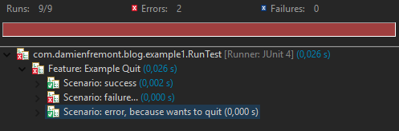

How to Cucumber Java : Wants to quit
======
 

 

 
# Ruby Example
 
```ruby
After do |s|
  # Tell Cucumber to quit after this scenario is done - if it failed.
  Cucumber.wants_to_quit = true if s.failed?
end
```
 
# Java Example
 
```java
@After
public void after(Scenario s) throws Exception {
  // Tell Cucumber to quit after this scenario is done - if it failed.
  CucumberHooks.wantsToQuit = true == s.isFailed();
}
```
 
# 
 
# Example 1: Wants ot Quit
 
## Before
 

 
## After
 

 

 
# Example 2: Quit After Tagged Scenario fails
 
## Before
 

 
## After
 

 
# Source
 

 

 
## Example 1: Wants ot Quit
 
CucumberHooks .java
 
```java
package com.damienfremont.blog.example1;
 
import cucumber.api.Scenario;
import cucumber.api.java.Before;
 
public final class CucumberHooks {
 
  public static boolean wantsToQuit = false;
 
  @Before
  public void quitIfRequested(Scenario scenario) {
    if (wantsToQuit)
      throw new RuntimeException("Cucumber wants to quit.");
  }
}
```
 
example1.feature
 
```
Feature: Example Quit
 
  Scenario: success
    Given something
    When something
    Then something
 
  Scenario: failure...
    Given something
    When something
    Then something bad
 
  Scenario: error, because wants to quit
    Given something
    When something
    Then something
```
 
StepDefinitions.java
 
```java
package com.damienfremont.blog.example1;
 
import cucumber.api.Scenario;
import cucumber.api.java.After;
import cucumber.api.java.en.Then;
import cucumber.api.java.en.When;
 
public class StepDefinitions {
 
  @When("^something$")
  public void do_something() throws Throwable {
    // something
  }
 
  @Then("^something bad$")
  public void quit() throws Throwable {
    throw new RuntimeException("Fail!");
  }
   
  @After
  public void after(Scenario s) throws Exception {
    // Tell Cucumber to quit after this scenario is done - if it failed.
    CucumberHooks.wantsToQuit = true == s.isFailed();
  }
}
```
 
RunTest.java
 
```java
package com.damienfremont.blog.example1;
 
import org.junit.runner.RunWith;
 
import cucumber.api.CucumberOptions;
import cucumber.api.junit.Cucumber;
 
@RunWith(Cucumber.class)
@CucumberOptions(strict = true, features = "features/example1.feature")
public class RunTest {
 
}
```
 
## Example 2: Quit After Tagged Scenario fails
 
CucumberHooks.java
 
```java
package com.damienfremont.blog.example2;
 
import java.util.Collection;
 
import cucumber.api.Scenario;
import cucumber.api.java.After;
import cucumber.api.java.Before;
 
public final class CucumberHooks {
 
  private static final String TAG = "@important";
  private static boolean prevScenarioFailed = false;
 
  @After
  public void watch_this_tagged_scenario(Scenario scenario) throws Exception {
    if (isTagged(scenario)) {
      boolean isFailed = scenario.isFailed();
      if (isFailed)
        prevScenarioFailed = isFailed;
    }
  }
 
  @Before
  public void quit_if_tagged_scenario_failed(Scenario scenario) {
    if (!isTagged(scenario) && prevScenarioFailed)
      throw new IllegalStateException("An important scenario has failed! Cucumber wants to quit.");
  }
 
  private boolean isTagged(Scenario scenario) {
    Collection<String> tags = scenario.getSourceTagNames();
    return tags.contains(TAG);
  }
}
```
 
example2.feature
 
```
Feature: Example Quit after tag
 
  @important
  Scenario: important 1, and fails
    Given something
    When fail
    Then something
 
  @important
  Scenario: important 2, but run it anyway
    Given something
    When something
    Then something
 
  Scenario: optionnal, error because wants to quit
    Given something
    When something
    Then something
```
 
StepDefinitions.java
 
```java
package com.damienfremont.blog.example2;
 
import cucumber.api.java.en.Then;
import cucumber.api.java.en.When;
 
public class StepDefinitions {
 
  @When("^something$")
  public void do_something() throws Throwable {
    // something
  }
 
  @Then("^fail$")
  public void fail() throws Throwable {
    throw new RuntimeException("Fail!");
  }
}
```
 
RunTest .java
 
```java
package com.damienfremont.blog.example2;
 
import org.junit.runner.RunWith;
 
import cucumber.api.CucumberOptions;
import cucumber.api.junit.Cucumber;
 
@RunWith(Cucumber.class)
@CucumberOptions(strict = true, features = "features/example2.feature")
public class RunTest {
 
}
```
 
# Conclusion
 
Now, you have faster feedback:
 
* small execution time when all your tests fail (good for Continuous Integration).
* much readable results with multiple failures, instead of semi-skipped/failed state for each scenario (reporting)
 
# Project
 
[https://github.com/DamienFremont/blog/tree/master/20151027-test-cucumber-wants_to_quit](https://github.com/DamienFremont/blog/tree/master/20151027-test-cucumber-wants_to_quit)
# References
 
[https://github.com/cucumber/cucumber/wiki/Hooks](https://github.com/cucumber/cucumber/wiki/Hooks)
[https://github.com/cucumber/cucumber-java-skeleton](https://github.com/cucumber/cucumber-java-skeleton)
[http://stackoverflow.com/questions/15272523/what-is-the-cucumber-jvm-equivalent-of-cucumber-wants-to-quit](http://stackoverflow.com/questions/15272523/what-is-the-cucumber-jvm-equivalent-of-cucumber-wants-to-quit)
 
## Origin
[https://damienfremont.com/2015/10/27/how-to-cucumber-java-wants-to-quit/](https://damienfremont.com/2015/10/27/how-to-cucumber-java-wants-to-quit/)
 
