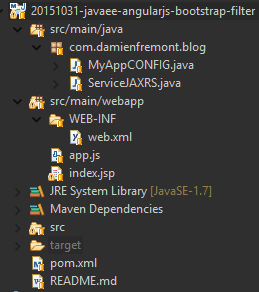

JavaEE AngularJS Bootstrap: How to Filtering
======
 

 
This tutorial is about a simple field that will filter datas. Using Bootstrap’s Data-Table and AngularJS ng-change event.
 
# Demo
 
[http://localhost:8080/20151031-javaee-angularjs-bootstrap-filter/](http://localhost:8080/20151031-javaee-angularjs-bootstrap-filter/)
http://localhost:8080/20151031-javaee-angularjs-bootstrap-filter/
 
A simple table with datas from backend.
 

 

 
You can type text to search field. Data is filtered in real time.
 

 

 
With empty result, datatable is replaced by a warning alert.
 

 

 
You can also reset the search filed with the clear button.
 

 

 
# Source
 

 

 
MyAppCONFIG.java
 
```java
package com.damienfremont.blog;
 
import java.util.HashSet;
import java.util.Set;
import javax.ws.rs.core.Application;
 
public class MyAppCONFIG extends Application {
 
  @Override
  public Set<Class<?>> getClasses() {
    Set<Class<?>> s = new HashSet<Class<?>>();
    s.add(ServiceJAXRS.class);
    return s;
  }
}
```
 
ServiceJAXRS.java
 
```java
package com.damienfremont.blog;
 
import java.io.Serializable;
import java.util.ArrayList;
import java.util.List;
 
import javax.ws.rs.GET;
import javax.ws.rs.Path;
import javax.ws.rs.Produces;
import javax.ws.rs.QueryParam;
import javax.ws.rs.core.MediaType;
 
@Path("/person")
public class ServiceJAXRS {
 
  @Path("/all")
  @GET
  @Produces(MediaType.APPLICATION_JSON)
  public List<Person> getAll(
      @QueryParam("like") final String like) {
  List<Person> res = filter(like);
    return res;
  }
   
  private List<Person> filter(final String like) {
  List<Person> res = new ArrayList<>();
  for (Person i : datas) {
    boolean isSkipped = false;
    for (String likePart : like.split(" ")) {
      String dataLike = (i.id+i.firstName+i.lastName).toLowerCase();
      String argLike = likePart.toLowerCase();
      if(!dataLike.contains(argLike)) {
        isSkipped = true;
      }
    }
    if(!isSkipped) {
      res.add(i);
    } 
  }
  return res;
  }
     
  // MODEL
  static class Person implements Serializable {
    private static final long serialVersionUID = 9167120287441116359L;
    public Integer id;
    public String firstName;
    public String lastName;
    public Person() {
 
    }
    public Person(Integer id, String firstName, String lastName) {
      super();
      this.id = id;
      this.firstName = firstName;
      this.lastName = lastName;
    }
  }
 
  // MOCK
  static List<Person> datas;
  static {
    datas = new ArrayList<>();
    for (int i = 0; i < 100; i++) {
        datas.add(new Person(i+1, "John", "Doe"));
        i++;
        datas.add(new Person(i+1, "Mich", "Jogger"));
        i++;
        datas.add(new Person(i+1, "Santa", "Close"));
    }
  }
}
```
 
web.xml
 
```xml
<?xml version="1.0" encoding="UTF-8"?>
<web-app xmlns:xsi="http://www.w3.org/2001/XMLSchema-instance" xmlns="http://xmlns.jcp.org/xml/ns/javaee" xsi:schemaLocation="http://xmlns.jcp.org/xml/ns/javaee http://xmlns.jcp.org/xml/ns/javaee/web-app_3_1.xsd" version="3.1">
  <servlet>
    <servlet-name>REST</servlet-name>
    <servlet-class>org.glassfish.jersey.servlet.ServletContainer</servlet-class>
    <init-param>
      <param-name>javax.ws.rs.Application</param-name>
      <param-value>com.damienfremont.blog.MyAppCONFIG</param-value>
    </init-param>
    <init-param>
      <param-name>jersey.config.server.provider.classnames</param-name>
      <param-value>org.glassfish.jersey.media.multipart.MultiPartFeature</param-value>
    </init-param>
    <load-on-startup>1</load-on-startup>
  </servlet>
  <servlet-mapping>
    <servlet-name>REST</servlet-name>
    <url-pattern>/api/*</url-pattern>
  </servlet-mapping>
  <servlet>
    <servlet-name>WEBJARS</servlet-name>
    <servlet-class>org.webjars.servlet.WebjarsServlet</servlet-class>
    <init-param>
      <param-name>disableCache</param-name>
      <param-value>true</param-value>
    </init-param>
    <load-on-startup>2</load-on-startup>
  </servlet>
  <servlet-mapping>
    <servlet-name>WEBJARS</servlet-name>
    <url-pattern>/webjars/*</url-pattern>
  </servlet-mapping>
</web-app>
```
 
app.js
 
```javascript
'use strict';
 
var app = angular.module(
  'app',
  [ 'ngResource' ]);
 
app.factory('Person', function($resource) {
      return $resource('api/person/all');
});
 
app.controller('PersonSearchCtrl', function ($scope, Person) {
   
  $scope.like = '';
 
  $scope.doFilter = function(like) {
      $scope.like = like;
      Person.query({
            like : $scope.like
          }, function(datas) {
          $scope.items = datas;
      });
  }
 
  $scope.doClear = function() {
      $scope.like = '';
      $scope.doFilter($scope.like);
  }
 
  $scope.doClear();
});
```
 
index.jsp
 
```xml
<!DOCTYPE html>
<html ng-app="app">
<head>
<!-- LIBS CSS -->
<link rel="stylesheet" href="webjars/bootstrap/${bootstrap.version}/css/bootstrap.css">
<!-- LIBS JS -->
<script src="webjars/angularjs/${angularjs.version}/angular.js"></script>
<script src="webjars/angularjs/${angularjs.version}/angular-resource.js"></script>
<!-- YOUR JS -->
<script src="app.js"></script>
</head>
<body>
<div class="container">
 
<h1>List Filter</h1>
 
<form ng-controller="PersonSearchCtrl">
 
<!-- SEARCH INPUT -->
<div class="row">
<div class="col-lg-6 col-lg-offset-3">
<div class="input-group">
  <span class="input-group-addon">
    <span class="glyphicon glyphicon-search"></span>
  </span>
  <input class="form-control" placeholder="type anything here to filter the table..." ng-model="like" ng-change="doFilter(like)">
  <span class="input-group-btn">
    <button class="btn btn-primary" type="button" ng-click="doClear()">
      <span class="glyphicon glyphicon-remove"></span> Clear
    </button>
  </span>
</div>
</div>
</div>
 
<!-- RESULTS -->
<table ng-show="items.length" id="table" class="table table-striped">
<tr>
  <th>#</th>
  <th>First Name</th>
  <th>Last Name</th>
</tr>
<tr ng-repeat="i in items">
  <td>{{i.id}}</td>
  <td>{{i.firstName}}</td>
  <td>{{i.lastName}}</td>
</tr>
</table>
   
<!-- EMPTY RESULT ALERT -->
<strong>Not found!</strong> Maybe change your criteria filter.
   
</form>
</div>
</body>
</html>
```
 
pom.xml
 
```xml
<project xmlns="http://maven.apache.org/POM/4.0.0" xmlns:xsi="http://www.w3.org/2001/XMLSchema-instance" xsi:schemaLocation="http://maven.apache.org/POM/4.0.0 http://maven.apache.org/xsd/maven-4.0.0.xsd">
    <modelVersion>4.0.0</modelVersion>
 
    <groupId>com.damienfremont.blog</groupId>
    <artifactId>20151031-javaee-angularjs-bootstrap-filter</artifactId>
    <version>0.0.1-SNAPSHOT</version>
    <packaging>war</packaging>
 
    <properties>
        <project.build.sourceEncoding>UTF-8</project.build.sourceEncoding>
        <!-- JAVAEE -->
        <java.version>7</java.version>
        <javaee.version>7.0</javaee.version>
        <jersey.version>2.22.1</jersey.version>
        <!-- WEB -->
        <angularjs.version>1.4.7</angularjs.version>
        <angular-ui-bootstrap.version>0.14.0</angular-ui-bootstrap.version>
        <bootstrap.version>3.3.5</bootstrap.version>
    </properties>
 
    <dependencies>
 
        <!-- JAVA -->
 
        <dependency>
            <groupId>javax</groupId>
            <artifactId>javaee-api</artifactId>
            <version>${javaee.version}</version>
            <scope>provided</scope>
        </dependency>
 
        <dependency>
            <groupId>org.glassfish.jersey.containers</groupId>
            <artifactId>jersey-container-servlet</artifactId>
            <version>${jersey.version}</version>
        </dependency>
        <dependency>
            <groupId>org.glassfish.jersey.media</groupId>
            <artifactId>jersey-media-json-jackson</artifactId>
            <version>${jersey.version}</version>
        </dependency>
 
        <!-- WEB -->
 
        <dependency>
            <groupId>org.webjars</groupId>
            <artifactId>webjars-servlet-2.x</artifactId>
            <version>1.1</version>
        </dependency>
 
        <dependency>
            <groupId>org.webjars</groupId>
            <artifactId>angularjs</artifactId>
            <version>${angularjs.version}</version>
        </dependency>
        <dependency>
            <groupId>org.webjars</groupId>
            <artifactId>angular-ui-bootstrap</artifactId>
            <version>${angular-ui-bootstrap.version}</version>
        </dependency>
 
        <dependency>
            <groupId>org.webjars</groupId>
            <artifactId>bootstrap</artifactId>
            <version>${bootstrap.version}</version>
        </dependency>
 
    </dependencies>
    <build>
        <resources>
            <resource>
                <directory>src/main/webapp</directory>
                <filtering>true</filtering>
                <targetPath>${project.basedir}/target/m2e-wtp/web-resources</targetPath>
                <includes>
                    <include>*.jsp</include>
                </includes>
            </resource>
        </resources>
        <plugins>
            <plugin>
                <groupId>org.apache.maven.plugins</groupId>
                <artifactId>maven-war-plugin</artifactId>
                <version>2.6</version>
                <configuration>
                    <webResources>
                        <resource>
                            <directory>src/main/webapp</directory>
                            <filtering>true</filtering>
                            <includes>
                                <include>*.jsp</include>
                            </includes>
                        </resource>
                    </webResources>
                </configuration>
            </plugin>
            <plugin>
                <groupId>org.apache.maven.plugins</groupId>
                <artifactId>maven-compiler-plugin</artifactId>
                <version>3.1</version>
                <configuration>
                    <source>1.${java.version}</source>
                    <target>1.${java.version}</target>
                </configuration>
            </plugin>
        </plugins>
    </build>
</project>
```
 
# Project
 
[https://github.com/DamienFremont/blog/tree/master/20151031-javaee-angularjs-bootstrap-filter](https://github.com/DamienFremont/blog/tree/master/20151031-javaee-angularjs-bootstrap-filter)
https://github.com/DamienFremont/blog/tree/master/20151031-javaee-angularjs-bootstrap-filter
 
# References
 
[http://ng-table.com/#/](http://ng-table.com/#/)
http://ng-table.com/#/
 
 
## Origin
[https://damienfremont.com/2015/10/31/javaee-angularjs-bootstrap-how-to-filtering/](https://damienfremont.com/2015/10/31/javaee-angularjs-bootstrap-how-to-filtering/)
 
