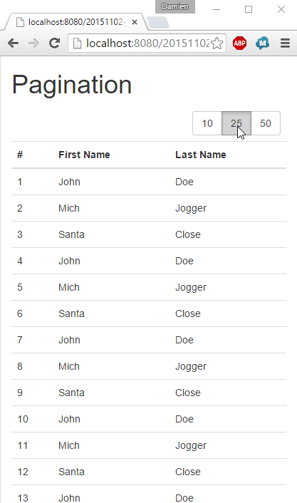

JavaEE AngularJS Bootstrap: How to Pagination with Smart-Table
======
 

 

 
A paginated data-table with a back-end inspired by Spring-Data Repository pattern implementation and front-end using Bootstrap pagination and ng-module Smart-Table.

Note: there are two famous ng-modules. Ng-Table and SmartTable. Ng-table has a lot of stars on ngmodules.org but I choose Smart-Table instead because it’s latest version is in maven repositories (183 vs 35 stars on ngmodules.org, but 2014 jar vs 2015 on mvnrepository.com).
 
# Demo
 
[http://localhost:8080/20151102-javaee-angularjs-bootstrap-pagination/](http://localhost:8080/20151102-javaee-angularjs-bootstrap-pagination/)
http://localhost:8080/20151102-javaee-angularjs-bootstrap-pagination/
 
A data-table with page size selector (10, 25, 50) and pagination bar (1,2,3,4,5,>,LAST)
 

 

 
Data-table’s page size can be change to 25 or 50.
 

 

 
The displayed page can be change to another (2 here).
 

 

 
It’s also possible to jump to First or Last page.
 

 

 
# Source
 

 

 
DatasRepository.java
 
```java
package com.damienfremont.blog;
 
import java.io.Serializable;
import java.util.ArrayList;
import java.util.List;
import org.springframework.data.domain.Page;
import org.springframework.data.domain.PageImpl;
import org.springframework.data.domain.Pageable;
import org.springframework.data.domain.Sort;
import org.springframework.data.repository.PagingAndSortingRepository;
import com.damienfremont.blog.ServiceJAXRS.Person;
 
public class DatasRepository implements PagingAndSortingRepository<Person, Serializable> {
 
  // MOCK
  static List<Person> datas;
  static {
    datas = new ArrayList<>();
    for (int i = 0; i < 5000; i++) {
      datas.add(new Person(i + 1, "John", "Doe"));
      i++;
      datas.add(new Person(i + 1, "Mich", "Jogger"));
      i++;
      datas.add(new Person(i + 1, "Santa", "Close"));
    }
  }
 
  @Override
  public Page<Person> findAll(Pageable arg0) {
    int pSize = arg0.getPageSize();
    int pNumb = arg0.getPageNumber();
    int pFirst = pNumb * pSize;
    int pLast = pFirst + pSize;
    int total = datas.size();
    List<Person> content = new ArrayList<>();
    for (int i = 0; i < total; i++) { if (i >= pFirst && i < pLast) {
        Person data = datas.get(i);
        content.add(data);
      }
    }
    return new PageImpl<>(content, arg0, total);
  }
  ...
}
```
 
MyAppCONFIG.java
 
```java
package com.damienfremont.blog;
 
import java.util.HashSet;
import java.util.Set;
import javax.ws.rs.core.Application;
 
public class MyAppCONFIG extends Application {
 
  @Override
  public Set<Class<?>> getClasses() {
    Set<Class<?>> s = new HashSet<Class<?>>();
    s.add(ServiceJAXRS.class);
    return s;
  }
}
```
 
ServiceJAXRS.java
 
```java
package com.damienfremont.blog;
 
import java.io.Serializable;
import javax.ws.rs.GET;
import javax.ws.rs.Path;
import javax.ws.rs.Produces;
import javax.ws.rs.QueryParam;
import javax.ws.rs.core.MediaType;
import org.springframework.data.domain.Page;
import org.springframework.data.domain.PageRequest;
import org.springframework.data.domain.Pageable;
 
@Path("/person")
public class ServiceJAXRS {
 
  DatasRepository datas = new DatasRepository();
 
  @Path("/page")
  @GET
  @Produces(MediaType.APPLICATION_JSON)
  public Page<Person> getAll( //
      @QueryParam("sort") String sort, //
      @QueryParam("page") Integer page, //
      @QueryParam("size") Integer size) {
    Pageable pageRequest = new PageRequest( //
        ((page == null) ? 0 : (page-1)), //
        ((size == null) ? 10 : size));
    return datas.findAll(pageRequest);
  }
 
  // MODEL
  static class Person implements Serializable {
    private static final long serialVersionUID = 9167120287441116359L;
    public Integer id;
    public String firstName;
    public String lastName;
 
    public Person() {
 
    }
 
    public Person(Integer id, String firstName, String lastName) {
      super();
      this.id = id;
      this.firstName = firstName;
      this.lastName = lastName;
    }
  }
 
}
```
 
web.xml
 
```xml
<web-app xmlns="http://xmlns.jcp.org/xml/ns/javaee" xmlns:xsi="http://www.w3.org/2001/XMLSchema-instance" xsi:schemaLocation="http://xmlns.jcp.org/xml/ns/javaee http://xmlns.jcp.org/xml/ns/javaee/web-app_3_1.xsd" version="3.1">
 
    <servlet>
        <servlet-name>REST</servlet-name>
        <servlet-class>org.glassfish.jersey.servlet.ServletContainer</servlet-class>
        <init-param>
            <param-name>javax.ws.rs.Application</param-name>
            <param-value>com.damienfremont.blog.MyAppCONFIG</param-value>
        </init-param>
        <init-param>
            <param-name>jersey.config.server.provider.classnames</param-name>
            <param-value>org.glassfish.jersey.media.multipart.MultiPartFeature</param-value>
        </init-param>
        <load-on-startup>1</load-on-startup>
    </servlet>
    <servlet-mapping>
        <servlet-name>REST</servlet-name>
        <url-pattern>/api/*</url-pattern>
    </servlet-mapping>
 
    <servlet>
        <servlet-name>WEBJARS</servlet-name>
        <servlet-class>org.webjars.servlet.WebjarsServlet</servlet-class>
        <init-param>
            <param-name>disableCache</param-name>
            <param-value>true</param-value>
        </init-param>
        <load-on-startup>2</load-on-startup>
    </servlet>
    <servlet-mapping>
        <servlet-name>WEBJARS</servlet-name>
        <url-pattern>/webjars/*</url-pattern>
    </servlet-mapping>
 
</web-app>
```
 
app.js
 
```javascript
'use strict';
 
var app = angular.module(
  'app',
  [ 'ngResource',
    'smart-table'
    ]);
 
app.factory('Service', function($resource) {
    return $resource('api/person/page');
});
 
app.controller('TableCtrl', function ($scope, Service) {
     
  $scope.itemsByPage = 10;
     
  $scope.callServer = function(tableState) {
    $scope.isLoading = true;
    var pagination = tableState.pagination;
    var start = pagination.start || 0;
    var number = pagination.number || $scope.itemsByPage;
    Service.get({
      page : 1+(start/number),
      size : number
      },
      function(pageable) {
        $scope.pageable = pageable;
        $scope.items = pageable.content;
        tableState.pagination.numberOfPages = pageable.totalPages;
        $scope.isLoading = false;
    });
  };
});
```
 
index.jsp
 
```xml
<!DOCTYPE html>
<html ng-app="app">
<head>
<!-- LIBS CSS -->
<link rel="stylesheet" href="webjars/bootstrap/${bootstrap.version}/css/bootstrap.css">
<!-- LIBS JS -->
<script src="webjars/angularjs/${angularjs.version}/angular.js"></script>
<script src="webjars/angularjs/${angularjs.version}/angular-resource.js"></script>
<script src="webjars/angular-smart-table/${angular-smart-table.version}/dist/smart-table.js"></script>
<!-- YOUR JS -->
<script src="app.js"></script>
</head>
<body>
<div class="container">
<h1>Pagination</h1>
<form ng-controller="TableCtrl">
<table class="table"
  st-table="items"
  st-pipe="callServer">
<thead>
 
<!-- PAGE SIZE -->
<tr>
  <td colspan="3">
    <div class="btn-group pull-right ng-scope">
      <button type="button"
        ng-class="{'active':itemsByPage==10}"
        ng-click="itemsByPage=10"
        class="btn btn-default">10</button>
      <button type="button"
        ng-class="{'active':itemsByPage==25}"
        ng-click="itemsByPage=25"
        class="btn btn-default">25</button>
      <button type="button"
        ng-class="{'active':itemsByPage==50}"
        ng-click="itemsByPage=59"
        class="btn btn-default">50</button>
    </div>
  </td>
</tr>
     
<!-- HEADERS -->
<tr>
  <th>#</th>
  <th>First Name</th>
  <th>Last Name</th>
</tr>
</thead>
 
<!-- CONTENT -->
<tbody>
<tr ng-repeat="i in items">
  <td>{{i.id}}</td>
  <td>{{i.firstName}}</td>
  <td>{{i.lastName}}</td>
</tr>
</tbody>
 
<!-- PAGINATION -->
<tfoot>
<tr>
  <td colspan="3" class="text-center">
    <div
      st-template="pagination.html"
      st-pagination=""
      st-items-by-page="itemsByPage"></div>
  </td>
</tr>
</tfoot>
</table>
</form>   
</div>
</body>
</html>
```
 
pagination.html
 
```xml
<div class="pagination" ng-if="pages.length >= 2">
  <ul class="pagination">
    <li ng-if="currentPage > 1">
      <a ng-click="selectPage(1)" href="#1">
        FIRST</a></li>
    <li ng-if="currentPage > 1">
      <a ng-click="selectPage(currentPage-1)" href="#">
        &lt;</a></li>
    <li ng-repeat="page in pages" ng-class="{active: page==currentPage}">
      <a ng-click="selectPage(page)" href="#{{page}}">
        {{page}}</a></li>
    <li ng-if="currentPage < numPages">
      <a ng-click="selectPage(currentPage+1)" href="#">
        &gt;</a></li>
    <li ng-if="currentPage < numPages">
      <a ng-click="selectPage(numPages)" href="#{{numPages}}">
        LAST</a></li>
  </ul>
</div>
```
 
pom.xml
 
```xml
<project xmlns="http://maven.apache.org/POM/4.0.0" xmlns:xsi="http://www.w3.org/2001/XMLSchema-instance" xsi:schemaLocation="http://maven.apache.org/POM/4.0.0 http://maven.apache.org/xsd/maven-4.0.0.xsd">
  <modelVersion>4.0.0</modelVersion>
 
  <groupId>com.damienfremont.blog</groupId>
  <artifactId>20151102-javaee-angularjs-bootstrap-pagination</artifactId>
  <version>0.0.1-SNAPSHOT</version>
  <packaging>war</packaging>
 
  <properties>
    <project.build.sourceEncoding>UTF-8</project.build.sourceEncoding>
    <!-- JAVAEE -->
    <java.version>7</java.version>
    <javaee.version>7.0</javaee.version>
    <jersey.version>2.22.1</jersey.version>
    <!-- WEB -->
    <bootstrap.version>3.3.5</bootstrap.version>
    <angularjs.version>1.4.7</angularjs.version>
    <angular-ui-bootstrap.version>0.14.0</angular-ui-bootstrap.version>
    <angular-smart-table.version>2.1.4</angular-smart-table.version>
  </properties>
 
  <dependencies>
 
    <!-- JAVA -->
 
    <dependency>
      <groupId>javax</groupId>
      <artifactId>javaee-api</artifactId>
      <version>${javaee.version}</version>
      <scope>provided</scope>
    </dependency>
 
    <dependency>
      <groupId>org.glassfish.jersey.containers</groupId>
      <artifactId>jersey-container-servlet</artifactId>
      <version>${jersey.version}</version>
    </dependency>
    <dependency>
      <groupId>org.glassfish.jersey.media</groupId>
      <artifactId>jersey-media-json-jackson</artifactId>
      <version>${jersey.version}</version>
    </dependency>
 
    <dependency>
      <groupId>org.springframework.data</groupId>
      <artifactId>spring-data-commons</artifactId>
      <version>1.9.0.RELEASE</version>
    </dependency>
 
 
    <!-- WEB -->
 
    <dependency>
      <groupId>org.webjars</groupId>
      <artifactId>webjars-servlet-2.x</artifactId>
      <version>1.1</version>
    </dependency>
 
    <dependency>
      <groupId>org.webjars</groupId>
      <artifactId>angularjs</artifactId>
      <version>${angularjs.version}</version>
    </dependency>
    <dependency>
      <groupId>org.webjars</groupId>
      <artifactId>angular-ui-bootstrap</artifactId>
      <version>${angular-ui-bootstrap.version}</version>
    </dependency>
    <dependency>
      <groupId>org.webjars.bower</groupId>
      <artifactId>angular-smart-table</artifactId>
      <version>${angular-smart-table.version}</version>
    </dependency>
 
    <dependency>
      <groupId>org.webjars</groupId>
      <artifactId>bootstrap</artifactId>
      <version>${bootstrap.version}</version>
    </dependency>
 
  </dependencies>
  <build>
    <resources>
      <resource>
        <directory>src/main/webapp</directory>
        <filtering>true</filtering>
        <targetPath>${project.basedir}/target/m2e-wtp/web-resources</targetPath>
        <includes>
          <include>*.jsp</include>
        </includes>
      </resource>
    </resources>
    <plugins>
      <plugin>
        <groupId>org.apache.maven.plugins</groupId>
        <artifactId>maven-war-plugin</artifactId>
        <version>2.6</version>
        <configuration>
          <webResources>
            <resource>
              <directory>src/main/webapp</directory>
              <filtering>true</filtering>
              <includes>
                <include>*.jsp</include>
              </includes>
            </resource>
          </webResources>
        </configuration>
      </plugin>
      <plugin>
        <groupId>org.apache.maven.plugins</groupId>
        <artifactId>maven-compiler-plugin</artifactId>
        <version>3.1</version>
        <configuration>
          <source>1.${java.version}</source>
          <target>1.${java.version}</target>
        </configuration>
      </plugin>
    </plugins>
  </build>
</project>
```
 
# Project
 
[https://github.com/DamienFremont/blog/tree/master/20151102-javaee-angularjs-bootstrap-pagination](https://github.com/DamienFremont/blog/tree/master/20151102-javaee-angularjs-bootstrap-pagination)
https://github.com/DamienFremont/blog/tree/master/20151102-javaee-angularjs-bootstrap-pagination
 
# References
 
[http://projects.spring.io/spring-data/](http://projects.spring.io/spring-data/)
http://projects.spring.io/spring-data/
 
[http://ngmodules.org/modules/Smart-Table](http://ngmodules.org/modules/Smart-Table)
http://ngmodules.org/modules/Smart-Table
 
[http://lorenzofox3.github.io/smart-table-website/](http://lorenzofox3.github.io/smart-table-website/)
http://lorenzofox3.github.io/smart-table-website/
 
[http://plnkr.co/edit/e82rdx7R4pjbLvayUHXx?p=preview](http://plnkr.co/edit/e82rdx7R4pjbLvayUHXx?p=preview)
http://plnkr.co/edit/e82rdx7R4pjbLvayUHXx?p=preview
 
 
[https://damienfremont.com/2015/11/02/javaee-angularjs-bootstrap-how-to-pagination-with-smart-table/](https://damienfremont.com/2015/11/02/javaee-angularjs-bootstrap-how-to-pagination-with-smart-table/)
 
