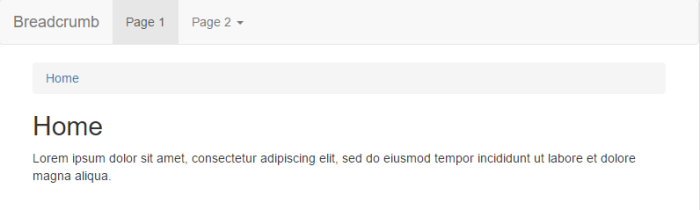
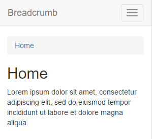
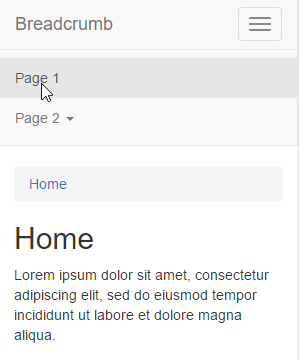
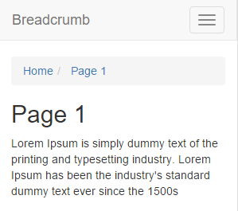
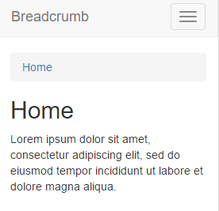

JavaEE AngularJS Bootstrap: How to Breadcrumb and NavBar
======
 

 
A navigation feature: simple responsive navbar, with breadcrumb and home view. Using vanilla AngularJS (because angular-breadcrumb is too complicated: it’s also using ui-router …two frameworks for one feature?).
 

 
# Demo
 
[http://localhost:8080/20151105-javaee-angularjs-bootstrap-breadcrumb/](http://localhost:8080/20151105-javaee-angularjs-bootstrap-breadcrumb/)
http://localhost:8080/20151105-javaee-angularjs-bootstrap-breadcrumb/
 

 

 
After reducing displayed size, navbar’s menu toggle from a bar to a button.
 

 

 
A click on ‘Page 1’ button…
 

 

 
…route to page 1.
 

 

 
The URI is also consistant with the route and the view (here #/page1 for page1.html)
 

 

 
It’s possible to go further in depth with a third level (here ‘home/page2/subpage’).
 

 

 
The URI is consistant ot (here #/page2/subpage for page2subpage.html)
 

 

 
All breadcrumb items are clickable (here ‘home’).
 

 

 

 

 
# Source
 

 

 
index.jsp
 
```xml
<!DOCTYPE html>
<html ng-app="app">
<head>
<!-- LIBS CSS -->
<link rel="stylesheet" href="webjars/bootstrap/${bootstrap.version}/css/bootstrap.css">
<!-- LIBS JS -->
<script src="webjars/jquery/${jquery.version}/jquery.js"></script>
<script src="webjars/bootstrap/${bootstrap.version}/js/bootstrap.js"></script>
<script src="webjars/angularjs/${angularjs.version}/angular.js"></script>
<script src="webjars/angularjs/${angularjs.version}/angular-route.js"></script>
<!-- YOUR JS -->
<script src="app.js"></script>
</head>
<body ng-controller="MainCtrl">
 
<!-- MENU -->
<nav class="navbar navbar-default">
<div class="container-fluid">
 
  <!-- HEADER AND MOBILE BUTTON -->
  <div class="navbar-header">
    <button type="button" class="navbar-toggle"
      data-toggle="collapse"
      data-target="#bs-example-navbar-collapse-1"
      aria-expanded="true">
    <span class="sr-only">Toggle navigation</span>
    <span class="icon-bar"></span>
    <span class="icon-bar"></span>
    <span class="icon-bar"></span>
    </button>
     
    <!-- LOGO -->
    <a class="navbar-brand" href="#">
      Breadcrumb</a>
  </div>
   
  <!-- MENU ITEMS -->
  <div class="navbar-collapse collapse"
    id="bs-example-navbar-collapse-1"
    aria-expanded="true">
    <ul class="nav navbar-nav">
     
    <!-- PAGE 1 -->
    <li class="active">
      <a href="#/page1">
       Page 1 <span class="sr-only">
         (current)</span></a></li>
        
     <!-- PAGE 2 -->
    <li class="dropdown">
      <a href="#/page2" class="dropdown-toggle"
        data-toggle="dropdown"
        role="button"
        aria-haspopup="true"
        aria-expanded="false">
       Page 2 <span class="caret"></span></a>
 
      <!-- PAGE 2 SUBMENU -->
      <ul class="dropdown-menu">
        <li><a href="#/page2/subpage">SubPage</a></li>
      </ul>
   </li>
   </ul>
  </div>
</div>
</nav>
 
<div class="container">
 
<!-- BREADCRUMB -->
<div ng-controller="BreadcrumbsController">
<ol class="breadcrumb"
    ng-show="route.current.breadcrumbs">
  <li
    ng-class="{active: $last}"
    ng-repeat="breadcrumb in route.current.breadcrumbs">
    <a href="{{breadcrumb.href}}">
      {{breadcrumb.label}}
    </a>
  </li>
</ol>
</div>
 
<!-- VIEW/PAGE -->
<div ng-view></div>
 
</div>
</body>
</html>
```
 
app.js
 
```javascript
'use strict';
 
var app = angular.module('app', [ 'ngRoute' ]);
 
app.config(function($routeProvider) {
  $routeProvider //
  .when('/page1', {
    controller : 'MainCtrl',
    templateUrl : 'views/page1.html',
    breadcrumbs : [ home, page1 ]
  }).when('/page2', {
    controller : 'MainCtrl',
    templateUrl : 'views/page2.html',
    breadcrumbs : [ home, page2 ]
  }).when('/page2/subpage', {
    controller : 'MainCtrl',
    templateUrl : 'views/page2subpage.html',
    breadcrumbs : [ home, page2, page2subpage ]
  }).otherwise({
    templateUrl : 'views/home.html',
    breadcrumbs : [ home ]
  });
});
 
const home = { href : '#/', label : 'Home' };
const page1 = { href : '#/page1', label : 'Page 1' };
const page2 = { href : '#/page2', label : 'Page 2' };
const page2subpage = { href : '#/page2/subpage', label : 'SubPage' };
 
app.controller('BreadcrumbsController', function($scope, $route) {
  $scope.route = $route;
});
 
app.controller('MainCtrl', function($scope) {
 
});
```
 
views/home.html
 
```xml
<h2>Home</h2>
<p>Lorem ipsum dolor sit amet, consectetur
adipiscing elit, sed do eiusmod tempor incididunt
ut labore et dolore magna aliqua.</p>
```
 
views/page1.html
 
```xml
<h2>Page 1</h2>
<p>Lorem Ipsum is simply dummy text
of the printing and typesetting industry.
Lorem Ipsum has been the industry's
standard dummy text ever since the 1500s</p>
```
 
views/page2.html
 
```xml
<h2>Page 2</h2>
<p>It is a long established fact that a
reader will be distracted by the readable
content of a page when looking at its layout. </p>
```
 
views/page2subpage.html
 
```xml
<h2>SubPage of Page 2</h2>
<p>Contrary to popular belief, Lorem Ipsum is
not simply random text. It has roots in a piece
of classical Latin literature from 45 BC, making
it over 2000 years old.</p>
```
 
pom.xml
 
```xml
<project xmlns="http://maven.apache.org/POM/4.0.0" xmlns:xsi="http://www.w3.org/2001/XMLSchema-instance"
  xsi:schemaLocation="http://maven.apache.org/POM/4.0.0 http://maven.apache.org/xsd/maven-4.0.0.xsd">
  <modelVersion>4.0.0</modelVersion>
 
  <groupId>com.damienfremont.blog</groupId>
  <artifactId>20151105-javaee-angularjs-bootstrap-breadcrumb</artifactId>
  <version>0.0.1-SNAPSHOT</version>
  <packaging>war</packaging>
 
  <properties>
    <project.build.sourceEncoding>UTF-8</project.build.sourceEncoding>
    <!-- JAVAEE -->
    <java.version>7</java.version>
    <javaee.version>7.0</javaee.version>
    <jersey.version>2.22.1</jersey.version>
    <!-- WEB -->
    <bootstrap.version>3.3.5</bootstrap.version>
    <angularjs.version>1.4.7</angularjs.version>
    <angular-ui-bootstrap.version>0.14.0</angular-ui-bootstrap.version>
    <jquery.version>2.1.4</jquery.version>
  </properties>
 
  <dependencies>
 
    <!-- JAVA -->
 
    <dependency>
      <groupId>javax</groupId>
      <artifactId>javaee-api</artifactId>
      <version>${javaee.version}</version>
      <scope>provided</scope>
    </dependency>
 
    <dependency>
      <groupId>org.glassfish.jersey.containers</groupId>
      <artifactId>jersey-container-servlet</artifactId>
      <version>${jersey.version}</version>
    </dependency>
    <dependency>
      <groupId>org.glassfish.jersey.media</groupId>
      <artifactId>jersey-media-json-jackson</artifactId>
      <version>${jersey.version}</version>
    </dependency>
 
    <!-- WEB -->
 
    <dependency>
      <groupId>org.webjars</groupId>
      <artifactId>webjars-servlet-2.x</artifactId>
      <version>1.1</version>
    </dependency>
 
    <dependency>
      <groupId>org.webjars</groupId>
      <artifactId>bootstrap</artifactId>
      <version>${bootstrap.version}</version>
    </dependency>
 
    <dependency>
      <groupId>org.webjars</groupId>
      <artifactId>angularjs</artifactId>
      <version>${angularjs.version}</version>
    </dependency>
    <dependency>
      <groupId>org.webjars</groupId>
      <artifactId>angular-ui-bootstrap</artifactId>
      <version>${angular-ui-bootstrap.version}</version>
    </dependency>
    <dependency>
      <groupId>org.webjars</groupId>
      <artifactId>jquery</artifactId>
      <version>${jquery.version}</version>
    </dependency>
  </dependencies>
  <build>
    <resources>
      <resource>
        <directory>src/main/webapp</directory>
        <filtering>true</filtering>
        <targetPath>${project.basedir}/target/m2e-wtp/web-resources</targetPath>
        <includes>
          <include>*.jsp</include>
        </includes>
      </resource>
    </resources>
    <plugins>
      <plugin>
        <groupId>org.apache.maven.plugins</groupId>
        <artifactId>maven-war-plugin</artifactId>
        <version>2.6</version>
        <configuration>
          <webResources>
            <resource>
              <directory>src/main/webapp</directory>
              <filtering>true</filtering>
              <includes>
                <include>*.jsp</include>
              </includes>
            </resource>
          </webResources>
        </configuration>
      </plugin>
      <plugin>
        <groupId>org.apache.maven.plugins</groupId>
        <artifactId>maven-compiler-plugin</artifactId>
        <version>3.1</version>
        <configuration>
          <source>1.${java.version}</source>
          <target>1.${java.version}</target>
        </configuration>
      </plugin>
    </plugins>
  </build>
</project>
```
 
web.xml
 
```xml
<web-app xmlns="http://xmlns.jcp.org/xml/ns/javaee"
         xmlns:xsi="http://www.w3.org/2001/XMLSchema-instance"
         xsi:schemaLocation="http://xmlns.jcp.org/xml/ns/javaee
     http://xmlns.jcp.org/xml/ns/javaee/web-app_3_1.xsd"
         version="3.1">
 
  <servlet>
    <servlet-name>WEBJARS</servlet-name>
    <servlet-class>org.webjars.servlet.WebjarsServlet</servlet-class>
    <init-param>
      <param-name>disableCache</param-name>
      <param-value>true</param-value>
    </init-param>
    <load-on-startup>2</load-on-startup>
  </servlet>
  <servlet-mapping>
    <servlet-name>WEBJARS</servlet-name>
    <url-pattern>/webjars/*</url-pattern>
  </servlet-mapping>
 
</web-app>
```
 
# Project
 
[https://github.com/DamienFremont/blog/tree/master/20151105-javaee-angularjs-bootstrap-breadcrumb](https://github.com/DamienFremont/blog/tree/master/20151105-javaee-angularjs-bootstrap-breadcrumb)
https://github.com/DamienFremont/blog/tree/master/20151105-javaee-angularjs-bootstrap-breadcrumb
 
# References
 
[http://getbootstrap.com/components/#breadcrumbs](http://getbootstrap.com/components/#breadcrumbs)
http://getbootstrap.com/components/#breadcrumbs
 
 
[https://damienfremont.com/2015/11/05/javaee-angularjs-bootstrap-how-to-breadcrumb-and-navbar/](https://damienfremont.com/2015/11/05/javaee-angularjs-bootstrap-how-to-breadcrumb-and-navbar/)
 
