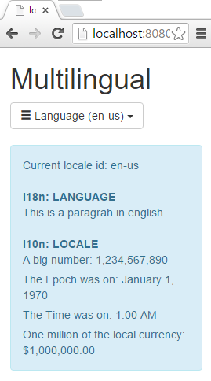

JavaEE AngularJS Bootstrap: How to Multilingual (i18n, l10n)
======
 

 

 
This is about dynamic Internationalization (i18n*), Localization (L10n*) , Globalization (i18n* and L10n*) and Cookies storage with angular-translate and agular-dynamic-locale.
 

 
# Demo
 
[http://localhost:8080/20151106-javaee-angularjs-bootstrap-multilingual-i18n-l10n/](http://localhost:8080/20151106-javaee-angularjs-bootstrap-multilingual-i18n-l10n/)
http://localhost:8080/20151106-javaee-angularjs-bootstrap-multilingual-i18n-l10n/
 
A simple content where language and locale can be change by country.
 

 

 
Here are three countries, including two with the same language (i18n) but different currency and date format (l10n).
 
* English (US): lang=en, locale=us
* English (GB): lang=en, locale=gb
* French (FR): lang=fr, locale=fr
 

 

 
By switching from US to GB, only currency and date format has changed (l10n).
 

 

 
With FR: language, date and currency change.
 

 

 

 

 
For each language, there are two files.
 
* An l10n locale file (format of date, currency, calendar,etc)
 

 

 
* An i18n language file (text, label translation)
 
 
 

 

 
By default, your browser language is used. But if the app does not know this language, it fallbacks to ‘English (US)’ …until you choose another with the menu.
 
Because this app use browser locale, cookie and fallback language, there are three scenarios at startup.
 
* 1st time : no cookies browser language is supported by the app (English or French)  => it will be the default language browser language is not supported (Deutch?) => the app fallbacks to English
* 2nd time : cookies => the app use the previous used language
 

 

 
# Source
 

 

 
i18n/locale-en.json
 
{
"PARAGRAPH": "This is a paragrah in english."
}
 
i18n/locale-fr.json
 
{
"PARAGRAPH": "C’est un paragraphe en français."
}
 
web.xml
 
```xml
<web-app xmlns="http://xmlns.jcp.org/xml/ns/javaee"
         xmlns:xsi="http://www.w3.org/2001/XMLSchema-instance"
         xsi:schemaLocation="http://xmlns.jcp.org/xml/ns/javaee
     http://xmlns.jcp.org/xml/ns/javaee/web-app_3_1.xsd"
         version="3.1">
 
  <servlet>
    <servlet-name>WEBJARS</servlet-name>
    <servlet-class>org.webjars.servlet.WebjarsServlet</servlet-class>
    <init-param>
      <param-name>disableCache</param-name>
      <param-value>true</param-value>
    </init-param>
    <load-on-startup>2</load-on-startup>
  </servlet>
  <servlet-mapping>
    <servlet-name>WEBJARS</servlet-name>
    <url-pattern>/webjars/*</url-pattern>
  </servlet-mapping>
 
</web-app>
```
 
app.js
 
```javascript
'use strict';
 
var app = angular.module('app',
  [ 'ngCookies',
    'pascalprecht.translate',
    'tmh.dynamicLocale']);
 
// i18n: LANGUAGE
app.config( function ($translateProvider) {
     
  // ADD LANG
  $translateProvider
  .useStaticFilesLoader({
    prefix: 'i18n/locale-',
    suffix: '.json'
  })
   
  // REMEMBER
  .preferredLanguage('en')
  .fallbackLanguage('en')
  .useCookieStorage()
   
  // SECURITY
  .useSanitizeValueStrategy('escape');
});
 
// l10n: LOCALE
app.config(function(tmhDynamicLocaleProvider) {
  const locales = 'webjars/angular-i18n/1.4.7/angular-locale_{{locale}}.js';
  tmhDynamicLocaleProvider
 
  // REMEMBER
  .localeLocationPattern(locales)
  .useCookieStorage();
})
 
app.controller('MainCtrl', function($window, $scope, $translate, $cookieStore, tmhDynamicLocale, tmhDynamicLocaleCache, $rootScope, $locale) {
   
  $scope.availableLocales = {
    'en-us': 'English (US)',
    'en-gb': 'English (GB)',
    'fr-fr': 'French (FR)'
  };
   
  // CHANGE LANG
  $scope.changeLocale = function(key) {
    $rootScope.model = {selectedLocale: key};
    // i18n
    var langKey = key.substring(0,2);
    $translate.use(langKey);
    // l10n
    tmhDynamicLocale.set(key);
  }
   
  // INIT
  $rootScope.$locale = $locale;
  var lang = $cookieStore.get('tmhDynamicLocale.locale');;
  if(!lang) {
      lang = $window.navigator.language || $window.navigator.userLanguage;
  }
  $scope.changeLocale(lang);
   
});
```
 
index.jsp
 
```xml
<!DOCTYPE html>
<html ng-app="app">
<head>
<!-- LIBS CSS -->
<link rel="stylesheet" href="webjars/bootstrap/${bootstrap.version}/css/bootstrap.css">
<!-- LIBS JS -->
<script src="webjars/jquery/${jquery.version}/jquery.js"></script>
<script src="webjars/bootstrap/${bootstrap.version}/js/bootstrap.js"></script>
<script src="webjars/angularjs/${angularjs.version}/angular.js"></script>
<script src="webjars/angularjs/${angularjs.version}/angular-route.js"></script>
<script src="webjars/angularjs/${angularjs.version}/angular-resource.js"></script>
<script src="webjars/angularjs/${angularjs.version}/angular-cookies.js"></script>
<script src="webjars/angular-translate/${angular-translate.version}/angular-translate.js"></script>
<script src="webjars/angular-translate-storage-cookie/${angular-translate-storage-cookie.version}/angular-translate-storage-cookie.js"></script>
<script src="webjars/angular-translate-loader-static-files/${angular-translate-loader-static-files.version}/angular-translate-loader-static-files.js"></script>
<script src="webjars/angular-dynamic-locale/${angular-dynamic-locale.version}/dist/tmhDynamicLocale.js"></script>
<!-- YOUR JS -->
<script src="app.js"></script>
</head>
<body ng-controller="MainCtrl">
<div class="container">
<h1>Multilingual</h1>
 
<!-- CHANGE LANGUAGE -->
<div class="dropdown">
  <button class="btn btn-default dropdown-toggle" data-toggle="dropdown">
    <i class="glyphicon glyphicon-menu-hamburger"></i>
     Language ({{model.selectedLocale}})
     <span class="caret"></span>
  </button>
  <ul class="dropdown-menu">
    <li ng-repeat="(key, value) in availableLocales">
      <a href="#"
        ng-click="changeLocale(key)">
      
      {{value}}</a></li>
  </ul>
</div>
<br/>
<div class="alert alert-info col-md-5">
<p>Current locale id: {{$locale.id}}</p>
<br/>
   
<!-- i18n: LANGUAGE -->
<strong>i18n: LANGUAGE</strong>
<p>{{ 'PARAGRAPH' | translate }}</p>
   
<br/>
 
<!-- l10n: LOCALE -->
<strong>l10n: LOCALE</strong>
<p>A big number: {{1234567890 | number}}</p>
<p>The Epoch was on: {{0 | date:'longDate'}}</p>
<p>The Time was on: {{0 | date:'shortTime'}}</p>
<p>One million of the local currency: {{1000000 | currency}}</p>
</div>
 
</div>
</body>
</html>
```
 
pom.xml
 
```xml
<project xmlns="http://maven.apache.org/POM/4.0.0" xmlns:xsi="http://www.w3.org/2001/XMLSchema-instance"
  xsi:schemaLocation="http://maven.apache.org/POM/4.0.0 http://maven.apache.org/xsd/maven-4.0.0.xsd">
  <modelVersion>4.0.0</modelVersion>
 
  <groupId>com.damienfremont.blog</groupId>
  <artifactId>20151106-javaee-angularjs-bootstrap-multilingual</artifactId>
  <version>0.0.1-SNAPSHOT</version>
  <packaging>war</packaging>
 
  <properties>
    <project.build.sourceEncoding>UTF-8</project.build.sourceEncoding>
    <!-- JAVAEE -->
    <java.version>7</java.version>
    <javaee.version>7.0</javaee.version>
    <jersey.version>2.22.1</jersey.version>
    <!-- WEB -->
    <bootstrap.version>3.3.5</bootstrap.version>
    <angularjs.version>1.4.7</angularjs.version>
    <angular-translate.version>2.8.1</angular-translate.version>
    <angular-translate-storage-cookie.version>2.8.0</angular-translate-storage-cookie.version>
    <angular-translate-loader-static-files.version>2.6.1</angular-translate-loader-static-files.version>
    <angular-dynamic-locale.version>0.1.28</angular-dynamic-locale.version>
    <angular-i18n.version>1.4.7</angular-i18n.version>
    <jquery.version>2.1.4</jquery.version>
  </properties>
 
  <dependencies>
 
    <!-- JAVA -->
 
    <dependency>
      <groupId>javax</groupId>
      <artifactId>javaee-api</artifactId>
      <version>${javaee.version}</version>
      <scope>provided</scope>
    </dependency>
 
    <dependency>
      <groupId>org.glassfish.jersey.containers</groupId>
      <artifactId>jersey-container-servlet</artifactId>
      <version>${jersey.version}</version>
    </dependency>
    <dependency>
      <groupId>org.glassfish.jersey.media</groupId>
      <artifactId>jersey-media-json-jackson</artifactId>
      <version>${jersey.version}</version>
    </dependency>
 
    <!-- WEB -->
 
    <dependency>
      <groupId>org.webjars</groupId>
      <artifactId>webjars-servlet-2.x</artifactId>
      <version>1.1</version>
    </dependency>
 
    <dependency>
      <groupId>org.webjars</groupId>
      <artifactId>bootstrap</artifactId>
      <version>${bootstrap.version}</version>
    </dependency>
 
    <dependency>
      <groupId>org.webjars</groupId>
      <artifactId>angularjs</artifactId>
      <version>${angularjs.version}</version>
    </dependency>
    <dependency>
      <groupId>org.webjars</groupId>
      <artifactId>jquery</artifactId>
      <version>${jquery.version}</version>
    </dependency>
    <!-- i18n: LANGUE -->
    <dependency>
      <groupId>org.webjars.bower</groupId>
      <artifactId>angular-translate</artifactId>
      <version>${angular-translate.version}</version>
    </dependency>
    <dependency>
      <groupId>org.webjars.bower</groupId>
      <artifactId>angular-translate-storage-cookie</artifactId>
      <version>${angular-translate-storage-cookie.version}</version>
    </dependency>
    <dependency>
      <groupId>org.webjars</groupId>
      <artifactId>angular-translate-loader-static-files</artifactId>
      <version>${angular-translate-loader-static-files.version}</version>
    </dependency>
    <!-- l10n: LOCALE -->
    <dependency>
      <groupId>org.webjars.bower</groupId>
      <artifactId>angular-dynamic-locale</artifactId>
      <version>${angular-dynamic-locale.version}</version>
    </dependency> 
    <dependency>
      <groupId>org.webjars.bower</groupId>
      <artifactId>angular-i18n</artifactId>
      <version>${angular-i18n.version}</version>
    </dependency> 
 
  </dependencies>
  <build>
    <resources>
      <resource>
        <directory>src/main/webapp</directory>
        <filtering>true</filtering>
        <targetPath>${project.basedir}/target/m2e-wtp/web-resources</targetPath>
        <includes>
          <include>*.jsp</include>
        </includes>
      </resource>
    </resources>
    <plugins>
      <plugin>
        <groupId>org.apache.maven.plugins</groupId>
        <artifactId>maven-war-plugin</artifactId>
        <version>2.6</version>
        <configuration>
          <webResources>
            <resource>
              <directory>src/main/webapp</directory>
              <filtering>true</filtering>
              <includes>
                <include>*.jsp</include>
              </includes>
            </resource>
          </webResources>
        </configuration>
      </plugin>
      <plugin>
        <groupId>org.apache.maven.plugins</groupId>
        <artifactId>maven-compiler-plugin</artifactId>
        <version>3.1</version>
        <configuration>
          <source>1.${java.version}</source>
          <target>1.${java.version}</target>
        </configuration>
      </plugin>
    </plugins>
  </build>
</project>
```
 
# Project
 
[https://github.com/DamienFremont/blog/tree/master/20151106-javaee-angularjs-bootstrap-multilingual-i18n-l10n](https://github.com/DamienFremont/blog/tree/master/20151106-javaee-angularjs-bootstrap-multilingual-i18n-l10n)
https://github.com/DamienFremont/blog/tree/master/20151106-javaee-angularjs-bootstrap-multilingual-i18n-l10n
 
# References
 
[https://docs.angularjs.org/guide/i18n](https://docs.angularjs.org/guide/i18n)
https://docs.angularjs.org/guide/i18n
 
[http://www.ng-newsletter.com/posts/angular-translate.html](http://www.ng-newsletter.com/posts/angular-translate.html)
http://www.ng-newsletter.com/posts/angular-translate.html
 
[https://github.com/SlexAxton/messageformat.js](https://github.com/SlexAxton/messageformat.js)
https://github.com/SlexAxton/messageformat.js
 
[https://docs.angularjs.org/api/ngCookies/service/$cookies](https://docs.angularjs.org/api/ngCookies/service/$cookies)
https://docs.angularjs.org/api/ngCookies/service/$cookies
 
[http://www.famfamfam.com/lab/icons/flags/](http://www.famfamfam.com/lab/icons/flags/)
http://www.famfamfam.com/lab/icons/flags/
 
[https://docs.angularjs.org/api/ng/filter/date](https://docs.angularjs.org/api/ng/filter/date)
https://docs.angularjs.org/api/ng/filter/date
 
[https://github.com/lgalfaso/angular-dynamic-locale](https://github.com/lgalfaso/angular-dynamic-locale)
https://github.com/lgalfaso/angular-dynamic-locale
 
 
[https://damienfremont.com/2015/11/06/javaee-angularjs-bootstrap-how-to-multilingual-i18n-l10n/](https://damienfremont.com/2015/11/06/javaee-angularjs-bootstrap-how-to-multilingual-i18n-l10n/)
 
