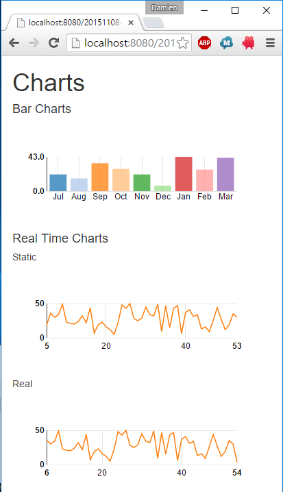
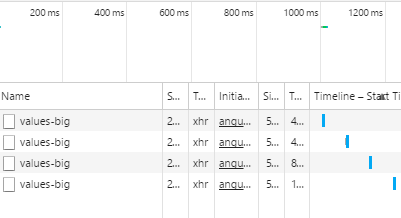

JavaEE AngularJS Bootstrap: HowTo Charts with D3JS
======
 

 
Here simple use cases: a static Bar chart and a dynamic Line chart. It’s build with d3js and nvd3 for angularjs integration and java jersey for backend datas.
 
Note: for more advanced use cases, you’ll need to create your own angularjs directive working directly with d3js.
 
# Demo
 
[http://localhost:8080/20151108-javaee-angularjs-bootstrap-charts_d3js/](http://localhost:8080/20151108-javaee-angularjs-bootstrap-charts_d3js/)
http://localhost:8080/20151108-javaee-angularjs-bootstrap-charts_d3js/
 
Here the two uses cases: bar charts and line charts.
 

 

 
There is a tooltip for each datas in charts.
 

 

 
There are two instances of Line chart:
 
* static (unique update at loading time)
* dynamic (refreshing every second)
 

 

 
Caution: for each refresh you’ll ended with a backend request. Pay attention to performance and load (bigger refresh interval, or replace only with new datas)
 

 

 
Java Data back-end response (build with Jersey JAX-RS impl).
 

 

 
# Source
 

 

 
MyAppCONFIG.java
 
```java
package com.damienfremont.blog;
 
import java.util.HashSet;
import java.util.Set;
import javax.ws.rs.core.Application;
 
public class MyAppCONFIG extends Application {
 
  @Override
  public Set<Class<?>> getClasses() {
    Set<Class<?>> s = new HashSet<Class<?>>();
    s.add(ServiceJAXRS.class);
    return s;
  }
}
```
 
ServiceJAXRS.java
 
```java
package com.damienfremont.blog;
 
import java.util.ArrayList;
import java.util.List;
import java.util.Random;
 
import javax.ws.rs.GET;
import javax.ws.rs.Path;
import javax.ws.rs.Produces;
import javax.ws.rs.core.MediaType;
 
 
@Path("/datas")
public class ServiceJAXRS {
 
  @Path("/values")
  @GET
  @Produces(MediaType.APPLICATION_JSON)
  public List<List> getAll() {
    return mockDatas;
  }
   
  @Path("/values-big")
  @GET
  @Produces(MediaType.APPLICATION_JSON)
  public List<List> getAllReal() {
    // MOCK: UPDATE FOR REAL TIME
    mockDatasReal.remove(0);
    mockStart = mockStart + mockInterval;
    mockDatasReal.add(newValue(mockStart));
    return mockDatasReal;
  }
   
  // MOCK
  // MOCK: INIT
  static ArrayList<List> mockDatas = new ArrayList<>();
  static {
    long mockStart = 1025409600000L;
    long mockInterval = 2592000000L;
    for (int i = 1; i < 10; i++) {
      mockStart = mockStart + mockInterval;
      mockDatas.add(newValue(mockStart));
    }
  }
   
  static ArrayList<List> mockDatasReal = new ArrayList<>();
  static long mockStart = 1;
  static long mockInterval = 1;
  static {
    for (int i = 1; i < 50; i++) {
      mockStart = mockStart + mockInterval;
      mockDatasReal.add(newValue(mockStart));
    }
  }
  private static ArrayList<Long> newValue(long start) {
    long randomNum = new Random().nextInt(50) + 1;
    ArrayList<Long> value = new ArrayList<>();
    value.add(start);
    value.add(randomNum);
    return value;
  }
 
}
```
 
web.xml
 
```xml
<web-app xmlns="http://xmlns.jcp.org/xml/ns/javaee" xmlns:xsi="http://www.w3.org/2001/XMLSchema-instance" xsi:schemaLocation="http://xmlns.jcp.org/xml/ns/javaee http://xmlns.jcp.org/xml/ns/javaee/web-app_3_1.xsd" version="3.1">
 
  <servlet>
    <servlet-name>REST</servlet-name>
    <servlet-class>org.glassfish.jersey.servlet.ServletContainer</servlet-class>
    <init-param>
      <param-name>javax.ws.rs.Application</param-name>
      <param-value>com.damienfremont.blog.MyAppCONFIG</param-value>
    </init-param>
    <init-param>
      <param-name>jersey.config.server.provider.classnames</param-name>
      <param-value>org.glassfish.jersey.media.multipart.MultiPartFeature</param-value>
    </init-param>
    <load-on-startup>1</load-on-startup>
  </servlet>
  <servlet-mapping>
    <servlet-name>REST</servlet-name>
    <url-pattern>/api/*</url-pattern>
  </servlet-mapping>
 
  <servlet>
    <servlet-name>WEBJARS</servlet-name>
    <servlet-class>org.webjars.servlet.WebjarsServlet</servlet-class>
    <init-param>
      <param-name>disableCache</param-name>
      <param-value>true</param-value>
    </init-param>
    <load-on-startup>2</load-on-startup>
  </servlet>
  <servlet-mapping>
    <servlet-name>WEBJARS</servlet-name>
    <url-pattern>/webjars/*</url-pattern>
  </servlet-mapping>
 
</web-app>
```
 
app.js
 
```javascript
'use strict';
 
var app = angular.module('app', [ 'ngResource', 'nvd3ChartDirectives' ]);
 
// BAR *************
 
app.factory('Service', function($resource) {
  return $resource('api/datas/values');
});
 
app.controller('BarCtrl', function($scope, Service) {
 
  // FORMATTING FUNCTION (OPTIONNAL)
  $scope.xAxisTickFormatFunction = function() {
    return function(d) {
      return d3.time.format('%b')(new Date(d));
    }
  }
   
  // INIT
  Service.query(function(datas) {
    $scope.exampleData = [ {
      "key" : "Series 1",
      "values" : datas
    } ];
  });
});
 
// LINE IN REAL TIME ******
 
app.factory('ServiceReal', function($resource) {
  return $resource('api/datas/values-big');
});
 
app.controller('RealTimeCtrl', function($scope, Service, ServiceReal) {
     
  // REFRESH VALUE:  0.1 SEC
  var refreshInterval = 1 * 1000;
   
  // UPDATE
  $scope.fetchData = function() {
      ServiceReal
    .query(function(datas) {
        $scope.exampleData = [ {
          key : 'Series 1',
          values : datas,
          color : '#ff7f0e'
        } ];
      });
  }
  $scope.fetchData2 = function() {
      ServiceReal
        .query(function(datas) {
            $scope.exampleData2 = [ {
              key : 'Series 1',
              values : datas,
              color : '#ff7f0e'
            } ];
          });
      }
     
  // EVERY X TIME
  setInterval(function() {
    $scope.$apply(function() {
        $scope.fetchData2();
    })
  }, refreshInterval);
   
  // INIT
  $scope.fetchData();
  $scope.fetchData2();
});
```
 
index.html
 
```xml
<!DOCTYPE html>
<html>
<head>
<!-- YOU NEED THIS TAG TO PREVENT D3JS CHARACTER ERROR!!! -->
<meta charset="utf-8">
 
<!-- LIBS CSS -->
<link rel="stylesheet" href="webjars/bootstrap/${bootstrap.version}/css/bootstrap.css">
<link rel="stylesheet" href="webjars/nvd3/${nvd3.version}/nv.d3.css">
</head>
<body ng-app="app">
<div class="container">
<h1>Charts</h1>
 
<!-- BARS -->
<h4>Bar Charts</h4>
<div ng-controller="BarCtrl">
<nvd3-discrete-bar-chart
        data="exampleData"
        showXAxis="true"
        showYAxis="true"
        xAxisTickFormat="xAxisTickFormatFunction()">
            <svg></svg>
    </nvd3-discrete-bar-chart>
</div>
 
<!-- REAL TIME -->
<h4>Real Time Charts</h4>
<div ng-controller="RealTimeCtrl">
   <h5>Static</h5>
   <nvd3-line-chart
     data="exampleData"
     showXAxis="true"
     showYAxis="true"
     tooltips="true"
     interactive="true">
        <svg></svg>
    </nvd3-line-chart>
 
 
    <h5>Real</h5>
    <nvd3-line-chart
     data="exampleData2"
     showXAxis="true"
     showYAxis="true"
     tooltips="true"
     interactive="true"
      
     objectEquality="true">
        <svg></svg>
    </nvd3-line-chart>
</div>
</div>
 
<!-- LIBS JS -->
<script src="webjars/angularjs/${angularjs.version}/angular.js"></script>
<script src="webjars/angularjs/${angularjs.version}/angular-resource.js"></script>
<script src="webjars/d3js/${d3js.version}/d3.js"></script>
<script src="webjars/nvd3/${nvd3.version}/nv.d3.js"></script>
<script src="webjars/angularjs-nvd3-directives/${angularjs-nvd3-directives.version}/angularjs-nvd3-directives.js"></script>
 
<!-- YOUR JS -->
<script src="app.js"></script>
</body>
</html>
```
 
# Project
 
[https://github.com/DamienFremont/blog/tree/master/20151108-javaee-angularjs-bootstrap-charts_d3js](https://github.com/DamienFremont/blog/tree/master/20151108-javaee-angularjs-bootstrap-charts_d3js)
https://github.com/DamienFremont/blog/tree/master/20151108-javaee-angularjs-bootstrap-charts_d3js
 
# References
 
[http://cmaurer.github.io/angularjs-nvd3-directives/](http://cmaurer.github.io/angularjs-nvd3-directives/)
http://cmaurer.github.io/angularjs-nvd3-directives/
 
[http://ngmodules.org/modules/angularjs-nvd3-directives](http://ngmodules.org/modules/angularjs-nvd3-directives)
http://ngmodules.org/modules/angularjs-nvd3-directives
 
[https://github.com/angularjs-nvd3-directives/angularjs-nvd3-directives](https://github.com/angularjs-nvd3-directives/angularjs-nvd3-directives)
https://github.com/angularjs-nvd3-directives/angularjs-nvd3-directives
 
[https://github.com/angularjs-nvd3-directives/angularjs-nvd3-directives/blob/master/examples/objectEquality.html](https://github.com/angularjs-nvd3-directives/angularjs-nvd3-directives/blob/master/examples/objectEquality.html)
https://github.com/angularjs-nvd3-directives/angularjs-nvd3-directives/blob/master/examples/objectEquality.html
 
[http://busypeoples.github.io/post/promises-in-angular-js/](http://busypeoples.github.io/post/promises-in-angular-js/)
http://busypeoples.github.io/post/promises-in-angular-js/
 
 
 
 
[https://damienfremont.com/2015/11/08/javaee-angularjs-bootstrap-howto-charts-with-d3js/](https://damienfremont.com/2015/11/08/javaee-angularjs-bootstrap-howto-charts-with-d3js/)
 
