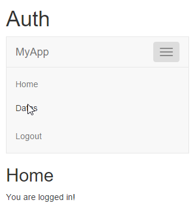
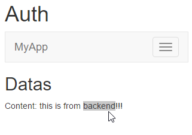

JavaEE AngularJS Bootstrap: How to Authent (Basic)
======
 

 
This post is about basic authentification with AngularJs, Satellizer and JAX-RS Jersey.
 
Warning: it only covers auth and token. For a production-ready app, you need to add Keystore, back-end URL filtering, encryption.
 

 
Note: a lot of examples are on Satellizer’s GitHub
 
[https://github.com/sahat/satellizer/tree/master/examples/client](https://github.com/sahat/satellizer/tree/master/examples/client)
https://github.com/sahat/satellizer/tree/master/examples/client
 
[https://github.com/sahat/satellizer/tree/master/examples/server/java](https://github.com/sahat/satellizer/tree/master/examples/server/java)
https://github.com/sahat/satellizer/tree/master/examples/server/java
 
# Demo
 
Start Tomcat and open your Internet Browser at :
 
[http://localhost:8080/20151119-javaee-angularjs-bootstrap-auth_basic/#/](http://localhost:8080/20151119-javaee-angularjs-bootstrap-auth_basic/#/)
http://localhost:8080/20151119-javaee-angularjs-bootstrap-auth_basic/#/
 

 

 
Only Login and Home menu’s buttons are visible.
 

 

 
Login redirect to the Login page (login=user1@mail.com, password=pass1).
 

 

 
The login view call the Java backend, and as a response there’ll be a token. After login, the Home page is displayed.
 

 

 
And the navbar now contains a “Datas” button. Also, Login is now more visible, but Logout is.
 

 

 
This secured page by route authent and navbar is now displayed with a message from the REST backend server.
 

 

 
On Logout, the app’s first state is restored (no auth, need to login).
 

 

 
It’s no longer possible to access #/datas page (route url is also secured).
 

 

 
# Source
 

 

 
 
 
pom.xml
 
```xml
<project xmlns="http://maven.apache.org/POM/4.0.0" xmlns:xsi="http://www.w3.org/2001/XMLSchema-instance"
  xsi:schemaLocation="http://maven.apache.org/POM/4.0.0 http://maven.apache.org/xsd/maven-4.0.0.xsd">
  <modelVersion>4.0.0</modelVersion>
 
  <groupId>com.damienfremont.blog</groupId>
  <artifactId>20151119-javaee-angularjs-bootstrap-auth_basic</artifactId>
  <version>0.0.1-SNAPSHOT</version>
  <packaging>war</packaging>
 
  <properties>
    <project.build.sourceEncoding>UTF-8</project.build.sourceEncoding>
    <!-- JAVAEE -->
    <java.version>7</java.version>
    <javaee.version>7.0</javaee.version>
    <jersey.version>2.22.1</jersey.version>
    <!-- WEB -->
    <jquery.version>2.1.4</jquery.version>
    <bootstrap.version>3.3.5</bootstrap.version>
    <angularjs.version>1.4.7</angularjs.version>
    <satellizer.version>0.12.5</satellizer.version>
    <ui-router.version>0.2.9</ui-router.version>
  </properties>
 
  <dependencies>
 
    <!-- JAVA -->
 
    <dependency>
      <groupId>javax</groupId>
      <artifactId>javaee-api</artifactId>
      <version>${javaee.version}</version>
      <scope>provided</scope>
    </dependency>
 
    <dependency>
      <groupId>org.glassfish.jersey.containers</groupId>
      <artifactId>jersey-container-servlet</artifactId>
      <version>${jersey.version}</version>
    </dependency>
    <dependency>
      <groupId>org.glassfish.jersey.media</groupId>
      <artifactId>jersey-media-json-jackson</artifactId>
      <version>${jersey.version}</version>
    </dependency>
 
    <dependency>
      <groupId>com.nimbusds</groupId>
      <artifactId>nimbus-jose-jwt</artifactId>
      <version>3.1.1</version>
    </dependency>
 
    <!-- JAVA LANGUAGE EXTENSION -->
    <dependency>
      <groupId>joda-time</groupId>
      <artifactId>joda-time</artifactId>
      <version>2.7</version>
    </dependency>
    <dependency>
      <groupId>com.google.guava</groupId>
      <artifactId>guava</artifactId>
      <version>18.0</version>
    </dependency>
 
    <!-- WEB -->
 
    <dependency>
      <groupId>org.webjars</groupId>
      <artifactId>webjars-servlet-2.x</artifactId>
      <version>1.1</version>
    </dependency>
 
    <dependency>
      <groupId>org.webjars</groupId>
      <artifactId>jquery</artifactId>
      <version>${jquery.version}</version>
    </dependency>
    <dependency>
      <groupId>org.webjars</groupId>
      <artifactId>bootstrap</artifactId>
      <version>${bootstrap.version}</version>
    </dependency>
    <dependency>
      <groupId>org.webjars</groupId>
      <artifactId>angularjs</artifactId>
      <version>${angularjs.version}</version>
    </dependency>
    <dependency>
      <groupId>org.webjars.bower</groupId>
      <artifactId>ui-router</artifactId>
      <version>${ui-router.version}</version>
    </dependency>
    <dependency>
      <groupId>org.webjars</groupId>
      <artifactId>satellizer</artifactId>
      <version>${satellizer.version}</version>
    </dependency>
 
  </dependencies>
  <build>
    <resources>
      <resource>
        <directory>src/main/webapp</directory>
        <filtering>true</filtering>
        <targetPath>${project.basedir}/target/m2e-wtp/web-resources</targetPath>
        <includes>
          <include>*.jsp</include>
        </includes>
      </resource>
    </resources>
    <plugins>
      <plugin>
        <groupId>org.apache.maven.plugins</groupId>
        <artifactId>maven-war-plugin</artifactId>
        <version>2.6</version>
        <configuration>
          <webResources>
            <resource>
              <directory>src/main/webapp</directory>
              <filtering>true</filtering>
              <includes>
                <include>index.html</include>
              </includes>
            </resource>
          </webResources>
        </configuration>
      </plugin>
      <plugin>
        <groupId>org.apache.maven.plugins</groupId>
        <artifactId>maven-compiler-plugin</artifactId>
        <version>3.1</version>
        <configuration>
          <source>1.${java.version}</source>
          <target>1.${java.version}</target>
        </configuration>
      </plugin>
    </plugins>
  </build>
</project>
```
 
AuthUtils.java
 
```java
package com.damienfremont.blog;
 
import java.text.ParseException;
 
import org.joda.time.DateTime;
 
import com.nimbusds.jose.JOSEException;
import com.nimbusds.jose.JWSAlgorithm;
import com.nimbusds.jose.JWSHeader;
import com.nimbusds.jose.JWSSigner;
import com.nimbusds.jose.crypto.MACSigner;
import com.nimbusds.jose.crypto.MACVerifier;
import com.nimbusds.jwt.JWTClaimsSet;
import com.nimbusds.jwt.ReadOnlyJWTClaimsSet;
import com.nimbusds.jwt.SignedJWT;
 
 
/**
 * @see https://github.com/sahat/satellizer/blob/master/examples/server/java/src/main/java/com/example/helloworld/auth/AuthUtils.java
 */
public class AuthUtils {
  private static final JWSHeader JWT_HEADER = new JWSHeader(JWSAlgorithm.HS256);
  private static final String TOKEN_SECRET = "aliceinwonderland";
  public static final String AUTH_HEADER_KEY = "Authorization";
 
  public static String getSubject(String authHeader) throws ParseException, JOSEException {
    return decodeToken(authHeader).getSubject();
  }
 
  public static ReadOnlyJWTClaimsSet decodeToken(String authHeader) throws ParseException, JOSEException {
    SignedJWT signedJWT = SignedJWT.parse(getSerializedToken(authHeader));
    if (signedJWT.verify(new MACVerifier(TOKEN_SECRET))) {
      return signedJWT.getJWTClaimsSet();
    } else {
      throw new JOSEException("Signature verification failed");
    }
  }
 
  public static Token createToken(String host, long sub) throws JOSEException {
    JWTClaimsSet claim = new JWTClaimsSet();
    claim.setSubject(Long.toString(sub));
    claim.setIssuer(host);
    claim.setIssueTime(DateTime.now().toDate());
    claim.setExpirationTime(DateTime.now().plusDays(14).toDate());
 
    JWSSigner signer = new MACSigner(TOKEN_SECRET);
    SignedJWT jwt = new SignedJWT(JWT_HEADER, claim);
    jwt.sign(signer);
 
    return new Token(jwt.serialize());
  }
 
  public static String getSerializedToken(String authHeader) {
    return authHeader.split(" ")[1];
  }
}
```
 
MyAppCONFIG.java
 
```java
package com.damienfremont.blog;
 
import java.util.HashSet;
import java.util.Set;
import javax.ws.rs.core.Application;
 
public class MyAppCONFIG extends Application {
 
  @Override
  public Set<Class<?>> getClasses() {
    Set<Class<?>> s = new HashSet<Class<?>>();
    s.add(ServiceJAXRS.class);
    s.add(ServiceAuth.class);
    return s;
  }
}
```
 
ServiceAuth.java
 
```java
package com.damienfremont.blog;
 
import java.util.HashMap;
import java.util.Map;
 
import javax.servlet.http.HttpServletRequest;
import javax.validation.Valid;
import javax.ws.rs.Consumes;
import javax.ws.rs.GET;
import javax.ws.rs.POST;
import javax.ws.rs.Path;
import javax.ws.rs.Produces;
import javax.ws.rs.core.Context;
import javax.ws.rs.core.MediaType;
import javax.ws.rs.core.Response;
import javax.ws.rs.core.Response.Status;
 
import com.damienfremont.blog.ServiceJAXRS.Content;
import com.google.common.base.Optional;
import com.nimbusds.jose.JOSEException;
 
/**
 * @see https://github.com/sahat/satellizer/blob/master/examples/server/java/src/main/java/com/example/helloworld/resources/AuthResource.java
 */
@Path("/auth")
@Produces(MediaType.APPLICATION_JSON)
@Consumes(MediaType.APPLICATION_JSON)
public class ServiceAuth {
 
  static Map<String, User> users = new HashMap<>();
 
  static {
    users.put("user1@mail.com", new User(1L, "user1@mail.com", "pass1"));
    users.put("user2@mail.com", new User(2L, "user2@mail.com", "pass2"));
  }
 
  @GET
  @Produces(MediaType.APPLICATION_JSON)
  public Content get() {
    Content res = new Content();
    res.content = "this is from backend!!!";
    return res;
  }
 
  @Path("/login")
  @POST
  public Response login(@Valid final User user, @Context final HttpServletRequest request) throws JOSEException {
    final Optional<User> foundUser = findByEmail(user.email);
    if (foundUser.isPresent() && checkPassword(user.password, foundUser.get().password)) {
      final Token token = AuthUtils.createToken(request.getRemoteHost(), foundUser.get().id);
      return Response.ok().entity(token).build();
    }
    return Response.status(Status.UNAUTHORIZED).entity("LOGING_ERROR_MSG").build();
  }
 
  private boolean checkPassword(String password, String password2) {
    // TODO BUILD YOUR OWN ENCRYPT PASSWORD CHECKER
    return password.equals(password2);
  }
 
  private Optional<User> findByEmail(String email) {
    // TODO BUILD YOUR OWN DAO
    return Optional.fromNullable(users.get(email));
  }
 
  static class User {
    public Long id;
    public String email;
    public String password;
 
    public User() {
    }
 
    public User(Long id, String email, String password) {
      this.id = id;
      this.email = email;
      this.password = password;
    }
 
  }
 
}
```
 
ServiceJAXRS.java
 
```java
package com.damienfremont.blog;
 
import java.io.Serializable;
 
import javax.ws.rs.GET;
import javax.ws.rs.Path;
import javax.ws.rs.Produces;
import javax.ws.rs.core.MediaType;
 
@Path("/data")
public class ServiceJAXRS {
 
  @GET
  @Produces(MediaType.APPLICATION_JSON)
  public Content get() {
    Content res = new Content();
    res.content = "this is from backend!!!";
    return res;
  }
   
  static class Content implements Serializable {
    private static final long serialVersionUID = 611255415996442390L;
    public String content;
  }
 
}
```
 
Token.java
 
```java
package com.damienfremont.blog;
 
import com.fasterxml.jackson.annotation.JsonProperty;
 
/**
 * @see https://github.com/sahat/satellizer/blob/master/examples/server/java/src/main/java/com/example/helloworld/core/Token.java
 */
public class Token {
  String token;
 
  public Token(@JsonProperty("token") String token) {
    this.token = token;
  }
 
  public String getToken() {
    return token;
  }
}
```
 
app.js
 
```javascript
'use strict';
 
var app = angular.module('app', [ 'ngResource', 'ngRoute',  'ui.router', 'satellizer' ]);
 
// CONFIG
app.config(function($routeProvider, $authProvider) {
     
  // ROUTE
  $routeProvider
    .when('/', {
      templateUrl: 'views/home.html',
      controller: 'HomeCtrl'
    })
    .when('/login', {
      templateUrl: 'views/login.html',
      controller: 'LoginCtrl'
    })
    .when('/logout', {
      templateUrl: 'views/home.html',
      controller: 'LogoutCtrl'
    })
    .when('/datas', {
      templateUrl: 'views/datas.html',
      controller: 'DatasCtrl',
      resolve: {
          loginRequired: loginRequired
        }
    })
    .otherwise('/');
 
  // SECURITY
  $authProvider.withCredentials = true;
  $authProvider.tokenRoot = null;
  $authProvider.cordova = false;
  $authProvider.baseUrl = './api/';
  $authProvider.loginUrl = '/auth/login';
  $authProvider.signupUrl = '/auth/signup';
  $authProvider.unlinkUrl = '/auth/unlink/';
  $authProvider.tokenName = 'token';
  $authProvider.tokenPrefix = 'satellizer';
  $authProvider.authHeader = 'Authorization';
  $authProvider.authToken = 'Bearer';
  $authProvider.storageType = 'localStorage';
   
});
 
function skipIfLoggedIn($q, $auth) {
    var deferred = $q.defer();
    if ($auth.isAuthenticated()) {
      deferred.reject();
    } else {
      deferred.resolve();
    }
    return deferred.promise;
  }
 
  function loginRequired($q, $location, $auth) {
    var deferred = $q.defer();
    if ($auth.isAuthenticated()) {
      deferred.resolve();
    } else {
      $location.path('/login');
    }
    return deferred.promise;
  }
 
app.factory('Service', function($resource) {
  return $resource('api/data');
});
 
// COMMON CTRL
 
app.controller('ParentCtrl', function($scope, $auth) {
  $scope.isAuthenticated = function() {
    return $auth.isAuthenticated();
  };
});
 
app.controller('NavbarCtrl', function($scope, $auth) {
   
});
```
 
datas.js
 
```javascript
'use strict';
 
app.controller('DatasCtrl', function($scope, $auth, Service) {
 
    // GET DATAS IF AUTH OK
  if ($auth.isAuthenticated()) {
    Service.get(function(obj) {
      $scope.content = obj.content;
    });
  }
});
```
 
home.js
 
```javascript
'use strict';
 
app.controller('HomeCtrl', function($scope, $auth, Service) {
 
    // GET DATAS IF AUTH OK
  if ($auth.isAuthenticated()) {
    $scope.message = "You are logged in!";
  } else {
    $scope.message = "You must login to access Datas.";  
  }
});
```
 
login.js
 
```javascript
'use strict';
 
app.controller('LoginCtrl', function($scope, $auth, $location, $route) {
 
  $scope.emailLogin = function() {
  $auth.login({email: $scope.email, password: $scope.password})
      .then(function() {
//        toastr.success('You have successfully signed in!');
        $location.path('/');
        $route.reload();
      })
      .catch(function(error) {
//        toastr.error(error.data.message, error.status);
      });
  };
});
```
 
logout.js
 
```javascript
'use strict';
 
app.controller('LogoutCtrl', function($location, $auth) {
  if (!$auth.isAuthenticated()) { return; }
  $auth.logout()
  .then(function() {
//  toastr.info('You have been logged out');
    $location.path('/');
  });
});
```
 
index.html
 
```xml
<!DOCTYPE html>
<html>
<head>
<!-- YOU NEED THIS TAG TO PREVENT D3JS CHARACTER ERROR!!! -->
<meta charset="utf-8">
 
<!-- LIBS CSS -->
<link rel="stylesheet" href="webjars/bootstrap/${bootstrap.version}/css/bootstrap.css">
</head>
<body ng-app="app">
<div class="container" ng-controller="ParentCtrl">
<h1>Auth</h1>
 
  <!-- MENU -->
  <div class="slide-animate"
  ng-include="'menu.html'" ></div>
 
  <!-- MAIN CONTENT -->
  <div class="view-animate"
  ng-view ></div>
 
</div>
 
<!-- LIBS JS -->
<script src="webjars/jquery/${jquery.version}/jquery.js"></script>
<script src="webjars/bootstrap/${bootstrap.version}/js/bootstrap.js"></script>
<script src="webjars/angularjs/${angularjs.version}/angular.js"></script>
<script src="webjars/angularjs/${angularjs.version}/angular-resource.js"></script>
<script src="webjars/angularjs/${angularjs.version}/angular-route.js"></script>
<script src="webjars/angularjs/${angularjs.version}/angular-animate.js"></script>
<script src="webjars/satellizer/${satellizer.version}/satellizer.js"></script>
<script src="webjars/ui-router/${ui-router.version}/release/angular-ui-router.js"></script>
 
<!-- YOUR JS -->
<script src="app.js"></script>
<script src="controllers/home.js"></script>
<script src="controllers/datas.js"></script>
<script src="controllers/login.js"></script>
<script src="controllers/logout.js"></script>
</body>
</html>
```
 
menu.html
 
```xml
<!-- MENU -->
<nav class="navbar navbar-default" >
<div class="container-fluid" ng-controller="NavbarCtrl">
 
<!-- HEADER AND MOBILE BUTTON -->
<div class="navbar-header">
  <button type="button" class="navbar-toggle"
    data-toggle="collapse"
    data-target="#bs-example-navbar-collapse-1"
    aria-expanded="true">
    <span class="sr-only">Toggle navigation</span>
    <span class="icon-bar"></span>
    <span class="icon-bar"></span>
    <span class="icon-bar"></span>
  </button>
     
  <!-- LOGO -->
  <a class="navbar-brand" href="#/">
    MyApp</a>
</div>
   
<!-- MENU ITEMS -->
<div class="navbar-collapse collapse"
  id="bs-example-navbar-collapse-1"
  aria-expanded="true">
<ul class="nav navbar-nav">
  <li><a href="#/">Home</a></li>
  <li ng-if="isAuthenticated()"><a href="#/datas">Datas</a></li>
</ul>
  <ul ng-if="!isAuthenticated()" class="nav navbar-nav navbar-right">
    <li><a href="#/login">Login</a></li>
  </ul>
  <ul ng-if="isAuthenticated()" class="nav navbar-nav navbar-right">
    <li><a href="#/logout">Logout</a></li>
  </ul>
</div>
</div>
</nav>
```
 
datas.html
 
```xml
<h2>Datas</h2>
<!-- SECURED CONTENT FROM BACKEND-->
<div ng-if="isAuthenticated()">
  Content: {{content}}
</div>
```
 
home.html
 
```xml
<h2>Home</h2>
<p>{{message}}</p>
```
 
login.html
 
```xml
<!-- FROM https://github.com/sahat/satellizer/blob/master/examples/client/partials/login.html -->
 
<div class="panel panel-default col-md-4 col-md-offset-4">
  <div class="panel-body">
    <h4 class="text-center">
      <i class="glyphicon glyphicon-log-in"></i> Log in
    </h4>
 
    <form name="loginForm" ng-submit="emailLogin()" novalidate>
 
      <!-- LOGIN -->
      <div class="form-group has-feedback"
        ng-class="{ 'has-error': loginForm.email.$invalid && loginForm.email.$dirty }">
        <input server-error class="form-control input-lg" type="text"
          name="email" ng-model="email" placeholder="Email" required
          autofocus>
        <div class="help-block" ng-if="loginForm.email.$dirty"
          ng-messages="loginForm.email.$error">
          <div ng-message="required">Please enter your email</div>
          <div ng-message="server">{{errorMessage.email}}</div>
        </div>
      </div>
 
      <!-- PASSWORD -->
      <div class="form-group has-feedback"
        ng-class="{ 'has-error': loginForm.password.$invalid && loginForm.password.$dirty }">
        <input server-error class="form-control input-lg"
          type="password" name="password" ng-model="password"
          placeholder="Password" required>
        <div class="help-block" ng-if="loginForm.password.$dirty"
          ng-messages="loginForm.password.$error">
          <div ng-message="required">Please enter your password</div>
          <div ng-message="server">{{errorMessage.password}}</div>
        </div>
      </div>
 
      <!-- SUBMIT -->
      <button type="submit" class="btn btn-block btn-success"
        ng-disabled="loginForm.$invalid">Log in</button>
 
    </form>
  </div>
</div>
```
 
web.xml
 
```xml
<web-app xmlns="http://xmlns.jcp.org/xml/ns/javaee"
         xmlns:xsi="http://www.w3.org/2001/XMLSchema-instance"
         xsi:schemaLocation="http://xmlns.jcp.org/xml/ns/javaee
     http://xmlns.jcp.org/xml/ns/javaee/web-app_3_1.xsd"
         version="3.1">
 
  <servlet>
    <servlet-name>REST</servlet-name>
    <servlet-class>org.glassfish.jersey.servlet.ServletContainer</servlet-class>
    <init-param>
      <param-name>javax.ws.rs.Application</param-name>
      <param-value>com.damienfremont.blog.MyAppCONFIG</param-value>
    </init-param>
    <init-param>
      <param-name>jersey.config.server.provider.classnames</param-name>
      <param-value>org.glassfish.jersey.media.multipart.MultiPartFeature</param-value>
    </init-param>
    <load-on-startup>1</load-on-startup>
  </servlet>
  <servlet-mapping>
    <servlet-name>REST</servlet-name>
    <url-pattern>/api/*</url-pattern>
  </servlet-mapping>
 
  <servlet>
    <servlet-name>WEBJARS</servlet-name>
    <servlet-class>org.webjars.servlet.WebjarsServlet</servlet-class>
    <init-param>
      <param-name>disableCache</param-name>
      <param-value>true</param-value>
    </init-param>
    <load-on-startup>2</load-on-startup>
  </servlet>
  <servlet-mapping>
    <servlet-name>WEBJARS</servlet-name>
    <url-pattern>/webjars/*</url-pattern>
  </servlet-mapping>
 
</web-app>
```
 
# Project
 
[https://github.com/DamienFremont/blog/tree/master/20151119-javaee-angularjs-bootstrap-auth_basic](https://github.com/DamienFremont/blog/tree/master/20151119-javaee-angularjs-bootstrap-auth_basic)
https://github.com/DamienFremont/blog/tree/master/20151119-javaee-angularjs-bootstrap-auth_basic
 
# References
 
[https://github.com/sahat/satellizer](https://github.com/sahat/satellizer)
https://github.com/sahat/satellizer
 
[https://github.com/sahat/satellizer/tree/master/examples/client](https://github.com/sahat/satellizer/tree/master/examples/client)
https://github.com/sahat/satellizer/tree/master/examples/client
 
[https://github.com/sahat/satellizer/tree/master/examples/server/java](https://github.com/sahat/satellizer/tree/master/examples/server/java)
https://github.com/sahat/satellizer/tree/master/examples/server/java
 
[https://hackhands.com/building-instagram-clone-angularjs-satellizer-nodejs-mongodb/](https://hackhands.com/building-instagram-clone-angularjs-satellizer-nodejs-mongodb/)
https://hackhands.com/building-instagram-clone-angularjs-satellizer-nodejs-mongodb/
 
[https://github.com/sahat/instagram-hackhands](https://github.com/sahat/instagram-hackhands)
https://github.com/sahat/instagram-hackhands
 
 
[https://damienfremont.com/2015/11/19/javaee-angularjs-bootstrap-how-to-authent-basic/](https://damienfremont.com/2015/11/19/javaee-angularjs-bootstrap-how-to-authent-basic/)
 
