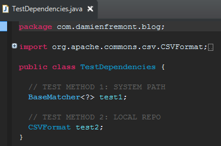

Maven Project with Embedded Repository
======
 

 
Use this when : a dependency is not available on a public Maven repository and you need your project portable (ex: unreachable repository), or it’s not a maven dependency at all (ex: proprietary IBM jars)
 

 
Warning: It is not recommended that you store your JARs in CVS. See the folowing page:
 
[https://maven.apache.org/guides/introduction/introduction-to-repositories.html](https://maven.apache.org/guides/introduction/introduction-to-repositories.html)
https://maven.apache.org/guides/introduction/introduction-to-repositories.html
 
## Demo
 
You’ll need Eclipse, Maven, Java.
 
Two jars are embedded in the project. One in a system path way like Ant, and the other like an embedded Maven repo. The second solution is the better, because it looks like a maven repo and integrate easly in Maven lifecycle and plugins (versus systemPath where it’s not easy to embedded the jar in the final app, like a war).
 

 

 
No compile error here: you can use these jars.
 

 

 
## Source
 
pom.xml
 
```xml
<project xmlns="http://maven.apache.org/POM/4.0.0" xmlns:xsi="http://www.w3.org/2001/XMLSchema-instance"
  xsi:schemaLocation="http://maven.apache.org/POM/4.0.0 http://maven.apache.org/xsd/maven-4.0.0.xsd">
  <modelVersion>4.0.0</modelVersion>
  <groupId>com.damienfremont.blog</groupId>
  <artifactId>20160108-maven-project_embedded_repo</artifactId>
  <version>0.0.1-SNAPSHOT</version>
  <packaging>jar</packaging>
  <dependencies>
 
    <!-- METHOD 1: SYSTEM PATH -->
 
    <dependency>
      <groupId>com.damienfremont.blog</groupId>
      <artifactId>hamcrest-core-1.3.jar</artifactId>
      <version>1.3</version>
      <scope>system</scope>
      <systemPath>${project.basedir}/libs1/hamcrest-core-1.3.jar</systemPath>
    </dependency>
 
    <!-- METHOD 2: LOCAL REPO -->
 
    <dependency>
      <groupId>com.damienfremont.blog</groupId>
      <artifactId>commons-csv</artifactId>
      <version>1.2</version>
    </dependency>
  </dependencies>
  <repositories>
    <repository>
      <id>in-project</id>
      <name>In Project Repo</name>
      <url>file://${project.basedir}/libs2</url>
    </repository>
  </repositories>
</project>
```
 
TestDependencies.java
 
```java
package com.damienfremont.blog;
 
import org.apache.commons.csv.CSVFormat;
import org.hamcrest.BaseMatcher;
 
public class TestDependencies {
 
  // TEST METHOD 1: SYSTEM PATH
  BaseMatcher<?> test1;
 
  // TEST METHOD 2: LOCAL REPO
  CSVFormat test2;
}
```
 
## Project
 
[https://github.com/DamienFremont/blog/tree/master/20160108-maven-project_embedded_repo](https://github.com/DamienFremont/blog/tree/master/20160108-maven-project_embedded_repo)
https://github.com/DamienFremont/blog/tree/master/20160108-maven-project_embedded_repo
 
## References
 
[https://maven.apache.org/guides/introduction/introduction-to-dependency-mechanism.html#System_Dependencies](https://maven.apache.org/guides/introduction/introduction-to-dependency-mechanism.html#System_Dependencies)
https://maven.apache.org/guides/introduction/introduction-to-dependency-mechanism.html#System_Dependencies
 
[https://maven.apache.org/guides/introduction/introduction-to-repositories.html](https://maven.apache.org/guides/introduction/introduction-to-repositories.html)
https://maven.apache.org/guides/introduction/introduction-to-repositories.html
 
 
[https://damienfremont.com/2016/01/08/maven-project-with-embedded-repository/](https://damienfremont.com/2016/01/08/maven-project-with-embedded-repository/)
 
