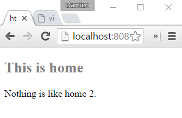
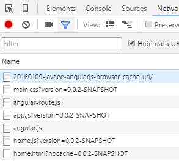
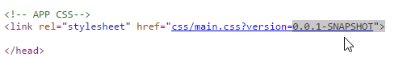
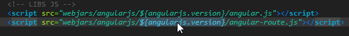

JavaEE AngularJs: Browser URLs Cache and Version
======
 

 
This tutorial provides a way for the browser to manage different versions of the same resource.
 

 
Because new version of your website is deployed, especially with a rich client, you may encounter some issues, like browser caching (ex: you have updated your-lib.js, but some users still experienced the old lib behavior : it’s caused by browser cache on this file, they still have the old version and CTRL+F5 keys do not always resolves this).
 
## Demo
 
You need Eclipse, Maven, Tomcat.
 

 

 

 

 
There are two parts: the vendor URLs version (like angular.js) and your app URLs version (like  app.js, home.html, main.css).
 

 

 
You can update versions in pom.xml.
 

 

 
And after restarting the app server, the URLs have changed.
 

 

 

 

 

 

 
Details of vendor URLs version (like angular.js):
 
pom.xml: version
 

 

 
index.html: url
 

 

 
browser: real world
 

 

 
Details of webapp URLs version (like app.js):
 

 

 

 

 

 

 
## Source
 

 

 
 
 
pom.xml
 
```xml
<project xmlns="http://maven.apache.org/POM/4.0.0" xmlns:xsi="http://www.w3.org/2001/XMLSchema-instance"
  xsi:schemaLocation="http://maven.apache.org/POM/4.0.0 http://maven.apache.org/xsd/maven-4.0.0.xsd">
  <modelVersion>4.0.0</modelVersion>
  <groupId>com.damienfremont.blog</groupId>
  <artifactId>20160109-javaee-angularjs-browser_url_version_cache</artifactId>
   
  <!-- APP VERSION (USED FOR CACHE) -->
  <version>0.0.1-SNAPSHOT</version>
   
  <packaging>war</packaging>
  <properties>
    <project.build.sourceEncoding>UTF-8</project.build.sourceEncoding>
    <java.version>7</java.version>
     
    <!-- WEB JAR VERSION (USED FOR CACHE) -->
    <angularjs.version>1.4.7</angularjs.version>
     
  </properties>
  <dependencies>
    <dependency>
      <groupId>org.webjars</groupId>
      <artifactId>webjars-servlet-2.x</artifactId>
      <version>1.1</version>
    </dependency>
    <dependency>
      <groupId>org.webjars</groupId>
      <artifactId>angularjs</artifactId>
      <version>${angularjs.version}</version>
    </dependency>
  </dependencies>
  <build>
    <resources>
      <resource>
        <directory>src/main/webapp</directory>
        <filtering>true</filtering>
        <targetPath>${project.basedir}/target/m2e-wtp/web-resources</targetPath>
        <includes>
          <include>index.html</include>
        </includes>
      </resource>
    </resources> 
    <plugins>
      <plugin>
        <groupId>org.apache.maven.plugins</groupId>
        <artifactId>maven-war-plugin</artifactId>
        <configuration>
           
          <!-- REPLACE ALL FOR WEBJARS URLS -->
          <webResources>
            <resource>
              <directory>src/main/webapp</directory>
              <filtering>true</filtering>
              <includes>
                <include>app.js</include>
                <include>index.html</include>
              </includes>
            </resource>
          </webResources>
        </configuration>
      </plugin>
      <plugin>
        <groupId>org.apache.maven.plugins</groupId>
        <artifactId>maven-compiler-plugin</artifactId>
        <version>3.1</version>
        <configuration>
          <source>1.${java.version}</source>
          <target>1.${java.version}</target>
        </configuration>
      </plugin>
    </plugins>
  </build>
</project>
```
 
app.js
 
```javascript
'use strict';
 
angular.module('app', [ 'ngRoute' ])
 
// CONFIG
 
.config(function($routeProvider) {
   
  var version = '?nocache=${project.version}';
   
  // ROUTE: URLs
  $routeProvider
  // HOME
  .when('/home', {
    templateUrl : 'modules/home/home.html'+version
  })
  // DEFAULT
  .otherwise('/home');
});
```
 
main.css
 
```css
h2 {
    color: grey;
}
```
 
index.html
 
```xml
<!DOCTYPE html>
<html ng-app="app">
<head>
<meta charset="utf-8">
 
<!-- APP CSS-->
<link rel="stylesheet" href="css/main.css?version=${project.version}">
 
</head>
<body>
 
    <!-- VIEW/PAGE -->
    <div ng-view>Loading...</div>
         
    <!-- LIBS JS -->
    <script src="webjars/angularjs/${angularjs.version}/angular.js"></script>
    <script src="webjars/angularjs/${angularjs.version}/angular-route.js"></script>
 
    <!-- APP JS -->
    <script src="app.js?version=${project.version}"></script>
    <script src="modules/home/home.js?version=${project.version}"></script>
 
</body>
</html>
```
 
home.html
 
```xml
<div ng-controller="HomeCtrl">
  <h2>This is home</h2>
  <p>{{message}}</p>
</div>
```
 
home.js
 
```javascript
'use strict';
 
angular.module('app') //
 
.controller('HomeCtrl', function($scope) {
  $scope.message = 'Nothing is like home.';
});
```
 
web.xml
 
```xml
<web-app xmlns="http://xmlns.jcp.org/xml/ns/javaee"
         xmlns:xsi="http://www.w3.org/2001/XMLSchema-instance"
         xsi:schemaLocation="http://xmlns.jcp.org/xml/ns/javaee
     http://xmlns.jcp.org/xml/ns/javaee/web-app_3_1.xsd"
         version="3.1">
   
  <servlet>
    <servlet-name>WEBJARS</servlet-name>
    <servlet-class>org.webjars.servlet.WebjarsServlet</servlet-class>
    <init-param>
      <param-name>disableCache</param-name>
      <param-value>true</param-value>
    </init-param>
    <load-on-startup>2</load-on-startup>
  </servlet>
  <servlet-mapping>
    <servlet-name>WEBJARS</servlet-name>
    <url-pattern>/webjars/*</url-pattern>
  </servlet-mapping>
 
</web-app>
```
 
 
 
## Project
 
[https://github.com/DamienFremont/blog/tree/master/20160109-javaee-angularjs-browser_url_version_cache](https://github.com/DamienFremont/blog/tree/master/20160109-javaee-angularjs-browser_url_version_cache)
https://github.com/DamienFremont/blog/tree/master/20160109-javaee-angularjs-browser_url_version_cache
 
 
 
 
## Origin
[https://damienfremont.com/2016/01/09/javaee-angularjs-browser-urls-cache-and-version/](https://damienfremont.com/2016/01/09/javaee-angularjs-browser-urls-cache-and-version/)
 
