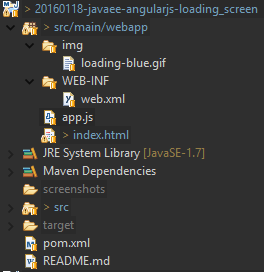

JavaEE AngularJS : Loading Screen
======
 

 
A simple way to handle loading screen before javascript kick-in, rely on ng-if.
 
## Demo
 

 

 

 

 
## Source
 

 

 
 
 
pom.xml
 
```xml
<project xmlns="http://maven.apache.org/POM/4.0.0" xmlns:xsi="http://www.w3.org/2001/XMLSchema-instance"
  xsi:schemaLocation="http://maven.apache.org/POM/4.0.0 http://maven.apache.org/xsd/maven-4.0.0.xsd">
  <modelVersion>4.0.0</modelVersion>
  <groupId>com.damienfremont.blog</groupId>
  <artifactId>20160118-javaee-angularjs-loading_screen</artifactId>
  <version>0.0.1-SNAPSHOT</version> 
  <packaging>war</packaging>
  <properties>
    <project.build.sourceEncoding>UTF-8</project.build.sourceEncoding>
    <java.version>7</java.version>
    <angularjs.version>1.4.7</angularjs.version>
  </properties>
  <dependencies>
    <dependency>
      <groupId>org.webjars</groupId>
      <artifactId>webjars-servlet-2.x</artifactId>
      <version>1.1</version>
    </dependency>
    <dependency>
      <groupId>org.webjars</groupId>
      <artifactId>angularjs</artifactId>
      <version>${angularjs.version}</version>
    </dependency>
  </dependencies>
  <build>
    <resources>
      <resource>
        <directory>src/main/webapp</directory>
        <filtering>true</filtering>
        <targetPath>${project.basedir}/target/m2e-wtp/web-resources</targetPath>
        <includes>
          <include>index.html</include>
        </includes>
      </resource>
    </resources> 
    <plugins>
      <plugin>
        <groupId>org.apache.maven.plugins</groupId>
        <artifactId>maven-war-plugin</artifactId>
        <configuration>
          <webResources>
            <resource>
              <directory>src/main/webapp</directory>
              <filtering>true</filtering>
              <includes>
                <include>app.js</include>
                <include>index.html</include>
              </includes>
            </resource>
          </webResources>
        </configuration>
      </plugin>
      <plugin>
        <groupId>org.apache.maven.plugins</groupId>
        <artifactId>maven-compiler-plugin</artifactId>
        <version>3.1</version>
        <configuration>
          <source>1.${java.version}</source>
          <target>1.${java.version}</target>
        </configuration>
      </plugin>
    </plugins>
  </build>
</project>
```
 
app.js
 
```javascript
'use strict';
 
angular.module('app', []);
 
angular.module('app')
.controller('ExampleCtrl', function($scope) {
    $scope.message = 'Loaded!';
});
```
 
index.html
 
```xml
<!DOCTYPE html>
<html ng-app="app">
<body>
 
  <!-- LOADING SCREEN-->
  <div class="m-app-loading" ng-if="false">
    <!--
      HACKY CODE WARNING: I'm putting Style block inside directive so that it
      will be removed from the DOM when we remove the directive container.
    -->
    <style type="text/css">
      .m-app-loading .spinner {
        width: 30%;
        max-width: 100px;
        height: 30%;
        max-height: 100px;
      }
      div.m-app-loading {
        position: fixed ;
      }
      div.m-app-loading div.animated-container {
        background-color: #FFFFFF ;
        bottom: 0px ;
        left: 0px ;
        opacity: 1.0 ;
        position: fixed ;
        right: 0px ;
        top: 0px ;
        z-index: 999999 ;
      }
      div.m-app-loading div.messaging {
        color:  #2089B6;
        left: 0px ;
        margin-top: -37px ;
        position: absolute ;
        right: 0px ;
        text-align: center ;
        top: 40% ;
      }
      div.m-app-loading h1 {
        font-size: 26px ;
        line-height: 35px ;
        margin: 0px 0px 20px 0px ;
      }
    </style>
    <!-- BEGIN: Actual animated container. -->
    <div class="animated-container" ng-class="ng-leave">
      <div class="messaging">
        <h1>
          MY APP
        </h1>
         
      </div>
    </div>
    <!-- END: Actual animated container. -->
  </div>
 
  <!-- VIEW/PAGE -->
  <div ng-controller="ExampleCtrl">
    Loading...{{message}}
  </div>
 
  <!-- YOUR JS 2nd -->
  <script src="webjars/angularjs/${angularjs.version}/angular.js"></script>
  <script src="app.js?version=${project.version}"></script>
</body>
</html>
```
 
web.xml
 
```xml
<web-app xmlns="http://xmlns.jcp.org/xml/ns/javaee"
         xmlns:xsi="http://www.w3.org/2001/XMLSchema-instance"
         xsi:schemaLocation="http://xmlns.jcp.org/xml/ns/javaee
     http://xmlns.jcp.org/xml/ns/javaee/web-app_3_1.xsd"
         version="3.1">
   
  <servlet>
    <servlet-name>WEBJARS</servlet-name>
    <servlet-class>org.webjars.servlet.WebjarsServlet</servlet-class>
    <init-param>
      <param-name>disableCache</param-name>
      <param-value>true</param-value>
    </init-param>
    <load-on-startup>2</load-on-startup>
  </servlet>
  <servlet-mapping>
    <servlet-name>WEBJARS</servlet-name>
    <url-pattern>/webjars/*</url-pattern>
  </servlet-mapping>
 
</web-app>
```
 
## Project
 
[https://github.com/DamienFremont/blog/tree/master/20160118-javaee-angularjs-loading_screen](https://github.com/DamienFremont/blog/tree/master/20160118-javaee-angularjs-loading_screen)
https://github.com/DamienFremont/blog/tree/master/20160118-javaee-angularjs-loading_screen
 
## References
 
[http://www.bennadel.com/blog/2758-creating-a-pre-bootstrap-loading-screen-in-angularjs.htm](http://www.bennadel.com/blog/2758-creating-a-pre-bootstrap-loading-screen-in-angularjs.htm)
http://www.bennadel.com/blog/2758-creating-a-pre-bootstrap-loading-screen-in-angularjs.htm
 
[JavaEE AngularJS : Loading Screen](http://damienfremont.com/2016/01/18/javaee-angularjs-loading-screen/)
JavaEE AngularJS : Loading Screen
 
 
## Origin
[https://damienfremont.com/2016/01/18/javaee-angularjs-loading-screen/](https://damienfremont.com/2016/01/18/javaee-angularjs-loading-screen/)
 
