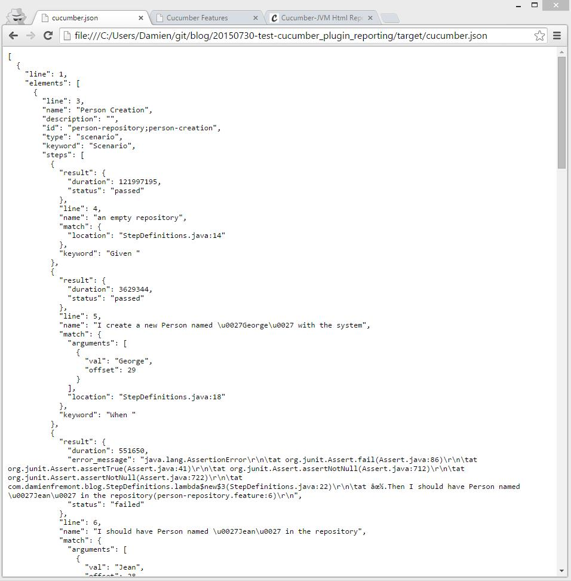
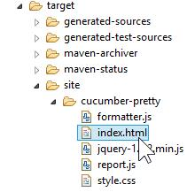
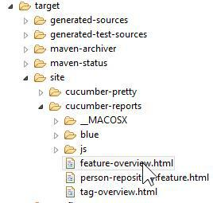

How to Cucumber : Test Reporting Plugin with Maven and Java
======

<p align="right"></p>

It is often useful to show the results of our tests to others people who are not developers, like managers or executive. This tutorial shows how to integrate a Cucumber reporting a Java plugin in Maven project. The result is a simple web page, which does not require a special tool to be read. 

This tutorial will cover 3 reports plugins : JSON, HTML Pretty and HTML Reports.

|  |  |  |
| ------------- |:-------------:| -----:|

Native JSON Result
------


How to:
------

pom.xml
```xml
<?xml version="1.0" encoding="UTF-8"?>
<project xmlns="http://maven.apache.org/POM/4.0.0" xmlns:xsi="http://www.w3.org/2001/XMLSchema-instance" xsi:schemaLocation="http://maven.apache.org/POM/4.0.0 http://maven.apache.org/xsd/maven-4.0.0.xsd">
    <modelVersion>4.0.0</modelVersion>
    <groupId>com.damienfremont.blog</groupId>
    <artifactId>20150730-test-cucumber_plugin_reporting</artifactId>
    <version>0.0.1-SNAPSHOT</version>
    <packaging>jar</packaging>
    <dependencies>
        <dependency>
            <groupId>junit</groupId>
            <artifactId>junit</artifactId>
            <version>4.12</version>
            <scope>test</scope>
        </dependency>
        <dependency>
            <groupId>info.cukes</groupId>
            <artifactId>cucumber-junit</artifactId>
            <version>1.2.3</version>
            <scope>test</scope>
        </dependency>
        <dependency>
            <groupId>info.cukes</groupId>
            <artifactId>cucumber-java8</artifactId>
            <version>1.2.3</version>
            <scope>test</scope>
        </dependency>
    </dependencies>
</project>
```
RunBDDTest.java
```java
@RunWith(Cucumber.class)
@CucumberOptions(strict = false, features = "features", format = { "pretty",
        "json:target/cucumber.json" }, tags = { "~@ignore" })
public class RunBDDTest {
 
}
```

Demo:
------

Launch with JUnit or

```
>mvn test
```

The result is at /target/cucumber.json


Native HTML Plugin
------


How to:
------

RunBDDTest.java
```java
@RunWith(Cucumber.class)
@CucumberOptions(strict = false, features = "features", format = { "pretty",
        "html:target/site/cucumber-pretty",
        "json:target/cucumber.json" }, tags = { "~@ignore" })
public class RunBDDTest {
 
}
```

Demo:
------

Launch with JUnit or

```
>mvn test
```

The result is at /target/site/cucumber-pretty/index.html



Cucumber-Reports HTML Plugin
------


How to:
------

pom.xml
```xml
<?xml version="1.0" encoding="UTF-8"?>
<project xmlns="http://maven.apache.org/POM/4.0.0" xmlns:xsi="http://www.w3.org/2001/XMLSchema-instance" xsi:schemaLocation="http://maven.apache.org/POM/4.0.0 http://maven.apache.org/xsd/maven-4.0.0.xsd">
    <modelVersion>4.0.0</modelVersion>
    <groupId>com.damienfremont.blog</groupId>
    <artifactId>20150730-test-cucumber_plugin_reporting</artifactId>
    <version>0.0.1-SNAPSHOT</version>
    <packaging>jar</packaging>
    <dependencies>
        <dependency>
            <groupId>junit</groupId>
            <artifactId>junit</artifactId>
            <version>4.12</version>
            <scope>test</scope>
        </dependency>
        <dependency>
            <groupId>info.cukes</groupId>
            <artifactId>cucumber-junit</artifactId>
            <version>1.2.3</version>
            <scope>test</scope>
        </dependency>
        <dependency>
            <groupId>info.cukes</groupId>
            <artifactId>cucumber-java8</artifactId>
            <version>1.2.3</version>
            <scope>test</scope>
        </dependency>
 
        <!-- REPORTING -->
        <dependency>
            <groupId>com.googlecode.totallylazy</groupId>
            <artifactId>totallylazy</artifactId>
            <version>1.20</version>
            <scope>system</scope>
            <systemPath>${project.basedir}/lib/totallylazy-1.20.jar</systemPath>
        </dependency>
        <dependency>
            <groupId>net.masterthought</groupId>
            <artifactId>cucumber-reporting</artifactId>
            <version>0.0.24</version>
        </dependency>
 
    </dependencies>
    <build>
        <plugins>
            <plugin>
                <groupId>org.apache.maven.plugins</groupId>
                <artifactId>maven-compiler-plugin</artifactId>
                <version>3.3</version>
                <configuration>
                    <source>1.8</source>
                    <target>1.8</target>
                </configuration>
            </plugin>
            <plugin>
                <groupId>org.apache.maven.plugins</groupId>
                <artifactId>maven-surefire-plugin</artifactId>
                <version>2.18.1</version>
                <configuration>
                    <testFailureIgnore>true</testFailureIgnore>
                    <includes>
                        <exclude>**/*BDDTest.java</exclude>
                    </includes>
                </configuration>
            </plugin>
            <plugin>
                <groupId>net.masterthought</groupId>
                <artifactId>maven-cucumber-reporting</artifactId>
                <version>0.0.5</version>
                <dependencies>
                    <dependency>
                        <groupId>com.googlecode.totallylazy</groupId>
                        <artifactId>totallylazy</artifactId>
                        <version>991</version>
                        <scope>system</scope>
                        <systemPath>${project.basedir}/lib/totallylazy-991.jar</systemPath>
                    </dependency>
                </dependencies>
                <executions>
                    <execution>
                        <id>execution</id>
                        <phase>verify</phase>
                        <goals>
                            <goal>generate</goal>
                        </goals>
                        <configuration>
                            <projectName>cucumber-jvm-example</projectName>
                            <outputDirectory>${project.build.directory}/site/cucumber-reports</outputDirectory>
                            <cucumberOutput>${project.build.directory}/cucumber.json</cucumberOutput>
                            <enableFlashCharts>false</enableFlashCharts>
                            <skippedFails>true</skippedFails>
                        </configuration>
                    </execution>
                </executions>
            </plugin>
 
        </plugins>
    </build>
</project>
```


RunBDDTest.java
```java
@RunWith(Cucumber.class)
@CucumberOptions(strict = false, features = "features", format = { "pretty",
        "html:target/site/cucumber-pretty",
        "json:target/cucumber.json" }, tags = { "~@ignore" })
public class RunBDDTest {
 
}
```

Demo:
------

Launch with

```
mvn clean install
```

The result is at /target/site/cucumber-reports/feature-overview.html



Conclusion
------

JSON is OK for integration with other tools (jenkins plugin, reports, etc).

Pretty HTML is OK during development phase (like a JUnit or Surefire report for versionning).

Cucumber-Reports is good for reporting outside of the dev team (like managers).

Source
------

https://github.com/DamienFremont/blog/tree/master/20150730-test-cucumber_plugin_reporting

References
------

https://cucumber.io/docs/reference/jvm

ttps://github.com/masterthought/cucumber-reporting

http://www.masterthought.net/section/cucumber-reporting
