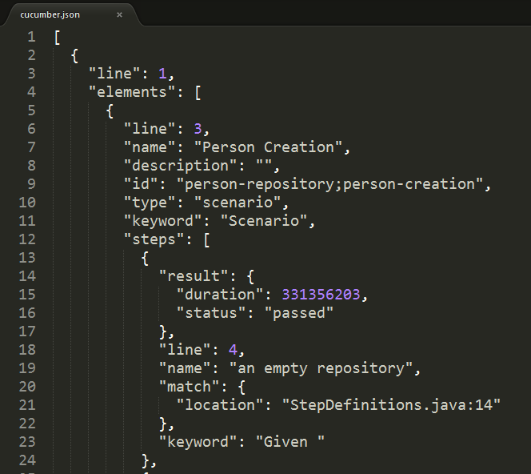
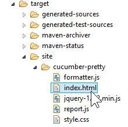
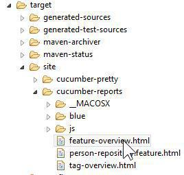

How to Cucumber : Test Report Plugin 2 with Maven and Java
======
 

 
It is often useful to show the results of our tests to others people who are not developers, like managers or executive. This tutorial shows how to integrate a Cucumber reporting a Java plugin in Maven project. The result is a simple web page, which does not require a special tool to be read.
 

 
This tutorial will cover 3 reports plugins : JSON, HTML Pretty and Cucumber Report 2.
 

 

 
# Native JSON Result
 

 

 
## How to:
 
pom.xml
 
```xml
<?xml version="1.0" encoding="UTF-8"?>
<project xmlns="http://maven.apache.org/POM/4.0.0" xmlns:xsi="http://www.w3.org/2001/XMLSchema-instance"
  xsi:schemaLocation="http://maven.apache.org/POM/4.0.0 http://maven.apache.org/xsd/maven-4.0.0.xsd">
  <modelVersion>4.0.0</modelVersion>
  <groupId>com.damienfremont.blog</groupId>
  <artifactId>20160509-test-cucumber_plugin_reporting_2</artifactId>
  <version>0.0.1-SNAPSHOT</version>
  <packaging>jar</packaging>
  <properties>
    <cucumber.version>1.2.4</cucumber.version>
    <java.version>8</java.version>
  </properties>
  <dependencies>
    <dependency>
      <groupId>info.cukes</groupId>
      <artifactId>cucumber-junit</artifactId>
      <version>${cucumber.version}</version>
      <scope>test</scope>
    </dependency>
    <dependency>
      <groupId>info.cukes</groupId>
      <artifactId>cucumber-java8</artifactId>
      <version>${cucumber.version}</version>
      <scope>test</scope>
    </dependency>
  </dependencies>
  <build>
    <plugins>
      <plugin>
        <groupId>org.apache.maven.plugins</groupId>
        <artifactId>maven-compiler-plugin</artifactId>
        <version>3.3</version>
        <configuration>
          <source>1.${java.version}</source>
          <target>1.${java.version}</target>
        </configuration>
      </plugin>
      <plugin>
        <groupId>org.apache.maven.plugins</groupId>
        <artifactId>maven-surefire-plugin</artifactId>
        <version>2.18.1</version>
        <configuration>
          <testFailureIgnore>true</testFailureIgnore>
          <includes>
            <exclude>**/*BDDTest.java</exclude>
          </includes>
        </configuration>
      </plugin>
    </plugins>
  </build>
</project>
```
 
RunBDDTest.java
 
```java
package com.damienfremont.blog;
 
import org.junit.runner.RunWith;
import cucumber.api.CucumberOptions;
import cucumber.api.junit.Cucumber;
 
@RunWith(Cucumber.class)
@CucumberOptions(strict = false, features = "features", format = { "pretty",
    "json:target/cucumber.json" }, tags = { "~@ignore" })
public class RunBDDTest {
 
}
```
 
## Demo:
 
Launch with JUnit or
 
```
mvn test
mvn verify
```
 
The result is at /target/cucumber.json
 

 

 
# Native HTML Plugin
 

 

 
## How to:
 
RunBDDTest.java
 
```java
package com.damienfremont.blog;
 
import org.junit.runner.RunWith;
import cucumber.api.CucumberOptions;
import cucumber.api.junit.Cucumber;
 
@RunWith(Cucumber.class)
@CucumberOptions(strict = false, features = "features", format = { "pretty",
    "html:target/site/cucumber-pretty",
    "json:target/cucumber.json" }, tags = { "~@ignore" })
public class RunBDDTest {
 
}
```
 
## Demo:
 
Launch with JUnit or
 
```
mvn test
```
 
The result is at /target/site/cucumber-pretty/index.html
 

 

 
# Cucumber-Reports HTML Plugin
 

 

 

 

 
## How to:
 
pom.xml
 
```xml
<?xml version="1.0" encoding="UTF-8"?>
<project xmlns="http://maven.apache.org/POM/4.0.0" xmlns:xsi="http://www.w3.org/2001/XMLSchema-instance"
  xsi:schemaLocation="http://maven.apache.org/POM/4.0.0 http://maven.apache.org/xsd/maven-4.0.0.xsd">
  <modelVersion>4.0.0</modelVersion>
  <groupId>com.damienfremont.blog</groupId>
  <artifactId>20160509-test-cucumber_plugin_reporting_2</artifactId>
  <version>0.0.1-SNAPSHOT</version>
  <packaging>jar</packaging>
  <properties>
    <cucumber.version>1.2.4</cucumber.version>
    <java.version>8</java.version>
  </properties>
  <dependencies>
    <dependency>
      <groupId>info.cukes</groupId>
      <artifactId>cucumber-junit</artifactId>
      <version>${cucumber.version}</version>
      <scope>test</scope>
    </dependency>
    <dependency>
      <groupId>info.cukes</groupId>
      <artifactId>cucumber-java8</artifactId>
      <version>${cucumber.version}</version>
      <scope>test</scope>
    </dependency>
  </dependencies>
  <build>
    <plugins>
      <plugin>
        <groupId>org.apache.maven.plugins</groupId>
        <artifactId>maven-compiler-plugin</artifactId>
        <version>3.3</version>
        <configuration>
          <source>1.${java.version}</source>
          <target>1.${java.version}</target>
        </configuration>
      </plugin>
      <plugin>
        <groupId>org.apache.maven.plugins</groupId>
        <artifactId>maven-surefire-plugin</artifactId>
        <version>2.18.1</version>
        <configuration>
          <testFailureIgnore>true</testFailureIgnore>
          <includes>
            <exclude>**/*BDDTest.java</exclude>
          </includes>
        </configuration>
      </plugin>
      <plugin>
        <groupId>net.masterthought</groupId>
        <artifactId>maven-cucumber-reporting</artifactId>
        <version>2.0.0</version>
        <executions>
          <execution>
            <id>execution</id>
            <phase>verify</phase>
            <goals>
              <goal>generate</goal>
            </goals>
            <configuration>
              <projectName>cucumber-jvm-example</projectName>
              <outputDirectory>${project.build.directory}/site/cucumber-reports</outputDirectory>
              <cucumberOutput>${project.build.directory}/cucumber.json</cucumberOutput>
              <skippedFails>true</skippedFails>
              <enableFlashCharts>false</enableFlashCharts>
              <buildNumber>42</buildNumber>
            </configuration>
          </execution>
        </executions>
      </plugin>
    </plugins>
  </build>
</project>
```
 
RunBDDTest.java
 
```java
package com.damienfremont.blog;
 
import org.junit.runner.RunWith;
 
import cucumber.api.CucumberOptions;
import cucumber.api.junit.Cucumber;
 
@RunWith(Cucumber.class)
@CucumberOptions(strict = false, features = "features", format = { "pretty",
    "json:target/cucumber.json" }, tags = { "~@ignore" })
public class RunBDDTest {
 
}
```
 
## Demo:
 
Launch with
 
```
mvn clean install
```
 
The result is at /target/site/cucumber-reports/feature-overview.html
 

 

 
# Conclusion
 
JSON is OK for integration with other tools (jenkins plugin, reports, etc).
 
Pretty HTML is OK during development phase (like a JUnit or Surefire report for versionning).
 
Cucumber-Reports is good for reporting outside of the dev team (like managers).
 
# Source
 
[https://damienfremont.com/2016/05/09/how-to-cucumber-test-report-plugin-2-with-maven-and-java](https://damienfremont.com/2016/05/09/how-to-cucumber-test-report-plugin-2-with-maven-and-java)
https://damienfremont.com/2016/05/09/how-to-cucumber-test-report-plugin-2-with-maven-and-java
 
[https://github.com/DamienFremont/blog/tree/master/20160509-test-cucumber_plugin_reporting_2](https://github.com/DamienFremont/blog/tree/master/20160509-test-cucumber_plugin_reporting_2)
https://github.com/DamienFremont/blog/tree/master/20160509-test-cucumber_plugin_reporting_2
 
# References
 
[https://cucumber.io/docs/reference/jvm](https://cucumber.io/docs/reference/jvm)
https://cucumber.io/docs/reference/jvm
 
[https://github.com/masterthought/cucumber-reporting](https://github.com/masterthought/cucumber-reporting)
https://github.com/masterthought/cucumber-reporting
 
[http://www.masterthought.net/section/cucumber-reporting](http://www.masterthought.net/section/cucumber-reporting)
http://www.masterthought.net/section/cucumber-reporting
 
 
## Origin
[https://damienfremont.com/2016/05/09/how-to-cucumber-test-report-plugin-2-with-maven-and-java/](https://damienfremont.com/2016/05/09/how-to-cucumber-test-report-plugin-2-with-maven-and-java/)
 
