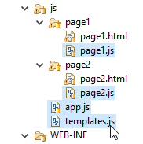

JavaEE AngularJS : Web Packaging – Concat – Minify
======
 

 
This tutorial is intended to make a Maven web packaging like NodeJS+Brunch or NodeJS+WebPack. With HTML to JS, Single JS file, Minify. It’s usefull for web release because you’ll to limit the number of HTTP request, have a simple artifact to update, and limit the size of your app.
 
## Demo
 
A simple two pages app: 2 templates, 2 controllers.
 

 

 

 

 
## Concat HTML files to single JS file
 
All HTML templates files are merged into a single JS file : template.js. Used with require.js. Limiting the number of HTTP requests done by the client (better for mobile network) and doing a better job on handling browser cache than URL to HTML templates.
 
Build it with the default ‘dev’ maven profile.
 
```
mvn package -P dev
```
 

 

 
Before
 

 

 
After
 

 

 
templates.js (generated)
 
```javascript
/*jshint -W099 */
angular.module('templates-main', []).run(['$templateCache', function($templateCache) {
    $templateCache.put('/js/page1/page1.html',
    "<div class=\"page1\" ng-controller=\"Page1Ctrl\">\n" +
    "  <h2>Page 1</h2>\n" +
    "  <button ng-click=\"goToPage2()\">Go to Page 2 >></button>\n" +
    "</div>");
    $templateCache.put('/js/page2/page2.html',
    "<div class=\"page2\" ng-controller=\"Page2Ctrl\">\n" +
    "  <h2>Page 2</h2>\n" +
    "  <button ng-click=\"goToPage1()\">Go to Page 1 >></button>\n" +
    "</div>");
}]);
```
 
index_dev.html
 
```xml
<!DOCTYPE html>
<html>
<head>
<meta charset="utf-8">
 
<!-- LIBS CSS -->
<link rel="stylesheet" href="webjars/angularjs/${angularjs.version}/angular-csp.css">
 
<!-- LIBS JS -->
<script src="webjars/requirejs/${requirejs.version}/require${javascript.min}.js"></script>
<script src="webjars/angularjs/${angularjs.version}/angular${javascript.min}.js"></script>
<script src="webjars/angularjs/${angularjs.version}/angular-resource${javascript.min}.js"></script>
<script src="webjars/angularjs/${angularjs.version}/angular-route${javascript.min}.js"></script>
 
<!-- YOUR APP -->
 
<!-- YOUR CSS -->
<link rel="stylesheet" href="css/page1.css?nocache=${project.version}">
<link rel="stylesheet" href="css/page2.css?nocache=${project.version}">
 
<!-- YOUR JS -->
<script src="js/templates.js?nocache=${project.version}"></script>
<script src="js/app.js?nocache=${project.version}"></script>
<script src="js/page1/page1.js?nocache=${project.version}"></script>
<script src="js/page2/page2.js?nocache=${project.version}"></script>
 
</head>
<body ng-app="myapp">
<div class="container">
 
  <h1>Packaging</h1>
 
  <!-- MAIN CONTENT -->
  <div class="view-animate" ng-view ></div>
 
</div>
</body>
</html>
```
 
## Concat JS ans CSS Files to single Minimize file
 
All JS files (included templates.js) are merged into a single file. Then the same is done with CSS files. Limiting the number of HTTP requests done by the client (better for mobile network).
 
Build it with the ‘prod’ maven profile.
 
```
mvn package -P prod
```
 
Before
 

 

 

 

 
After
 

 

 

 

 
Warning: You’ll need to write angular files in a certain way, in order to be compatible with minification.
 
Before: global app var, simple injection
 
* var app = angular.module…
* app.controller…
* …Ctrl’, function(…
 
```javascript
var app = angular.module('myapp', [ //
'ngResource', //
'ngRoute', //
'templates-main' //
]);
...
app.controller('Page2Ctrl', function($scope, $location) {
  ...
});
```
 
Now: global module, injection with array before function
 
* angular.module…
* angular.module(…).controller…
* …Ctrl’, [ “$scope”, …, function(…
 
```javascript
angular.module('myapp', [ //
'ngResource', //
'ngRoute', //
'templates-main' //
]);
...
angular.module('myapp')
.controller('Page2Ctrl', [ "$scope", "$location", function($scope, $location) {
  ...
} ]);
```
 
index_prod.html
 
```xml
<!DOCTYPE html>
<html>
<head>
<meta charset="utf-8">
 
<!-- LIBS CSS -->
<link rel="stylesheet" href="webjars/angularjs/${angularjs.version}/angular-csp.css">
 
<!-- LIBS JS -->
<script src="webjars/requirejs/${requirejs.version}/require${javascript.min}.js"></script>
<script src="webjars/angularjs/${angularjs.version}/angular${javascript.min}.js"></script>
<script src="webjars/angularjs/${angularjs.version}/angular-resource${javascript.min}.js"></script>
<script src="webjars/angularjs/${angularjs.version}/angular-route${javascript.min}.js"></script>
 
<!-- YOUR APP -->
<link rel="stylesheet" href="css/style.min.css?nocache=${project.version}">
<script src="js/script.min.js?nocache=${project.version}"></script>
 
</head>
<body ng-app="myapp">
<div class="container">
 
  <h1>Packaging</h1>
 
  <!-- MAIN CONTENT -->
  <div class="view-animate" ng-view ></div>
 
</div>
</body>
</html>
```
 
## Project
 

 

 
## Source
 
pom.xml
 
```xml
<project xmlns="http://maven.apache.org/POM/4.0.0" xmlns:xsi="http://www.w3.org/2001/XMLSchema-instance"
  xsi:schemaLocation="http://maven.apache.org/POM/4.0.0 http://maven.apache.org/xsd/maven-4.0.0.xsd">
  <modelVersion>4.0.0</modelVersion>
 
  <groupId>com.damienfremont.blog</groupId>
  <artifactId>20160522-javaee-angularjs-webpackaging_min_single_file</artifactId>
  <version>0.0.1-SNAPSHOT</version>
  <packaging>war</packaging>
 
  <properties>
    <project.build.sourceEncoding>UTF-8</project.build.sourceEncoding>
    <java.version>7</java.version>
    <angularjs.version>1.4.7</angularjs.version>
    <requirejs.version>2.2.0</requirejs.version>
  </properties>
 
  <dependencies>
 
    <!-- WEB DEPENDENCIES MANAGER -->
    <dependency>
      <groupId>org.webjars</groupId>
      <artifactId>webjars-servlet-2.x</artifactId>
      <version>1.1</version>
    </dependency>
 
    <!-- WEB DEPENDENCIES -->
    <dependency>
      <groupId>org.webjars</groupId>
      <artifactId>angularjs</artifactId>
      <version>${angularjs.version}</version>
    </dependency>
    <dependency>
      <groupId>org.webjars</groupId>
      <artifactId>requirejs</artifactId>
      <version>${requirejs.version}</version>
    </dependency>
 
  </dependencies>
  <build>
    <resources>
 
      <!-- REPLACE KEYS IN FILES (ECLIPSE IDE) -->
      <resource>
        <directory>src/main/webapp</directory>
        <filtering>true</filtering>
        <targetPath>${project.basedir}/target/m2e-wtp/web-resources</targetPath>
        <includes>
          <include>*.html</include>
          <include>WEB-INF/web.xml</include>
        </includes>
      </resource>
    </resources>
    <plugins>
      <plugin>
        <groupId>org.apache.maven.plugins</groupId>
        <artifactId>maven-compiler-plugin</artifactId>
        <version>3.1</version>
        <configuration>
          <source>1.${java.version}</source>
          <target>1.${java.version}</target>
        </configuration>
      </plugin>
 
      <!-- REPLACE KEYS IN FILES (BUILD) -->
      <plugin>
        <groupId>org.apache.maven.plugins</groupId>
        <artifactId>maven-war-plugin</artifactId>
        <version>2.6</version>
        <configuration>
          <webResources>
            <resource>
              <directory>src/main/webapp</directory>
              <filtering>true</filtering>
              <includes>
                <include>*.html</include>
                <include>WEB-INF/web.xml</include>
              </includes>
            </resource>
          </webResources>
        </configuration>
      </plugin>
 
      <!-- HTML TO JS (BUILD) -->
      <plugin>
        <groupId>com.keithbranton.mojo</groupId>
        <artifactId>angular-maven-plugin</artifactId>
        <version>0.3.4</version>
        <executions>
          <execution>
            <phase>generate-resources</phase>
            <goals>
              <goal>html2js</goal>
            </goals>
          </execution>
        </executions>
        <configuration>
          <sourceDir>${basedir}/src/main/webapp/js/</sourceDir>
          <angularDependency>angular</angularDependency>
          <include>**/*.html</include>
          <exclude>index*.html</exclude>
          <target>${basedir}/src/main/webapp/js/templates.js</target>
          <addRequireWrapper>false</addRequireWrapper>
          <prefix>/js</prefix>
          <multiModule>false</multiModule>
          <preambles>
            <preamble>/*jshint -W099 */</preamble>
          </preambles>
        </configuration>
      </plugin>
 
      <!-- ASSEMBLE AND MINIFY -->
      <plugin>
        <groupId>com.samaxes.maven</groupId>
        <artifactId>minify-maven-plugin</artifactId>
        <version>1.7.4</version>
        <executions>
          <execution>
            <id>default-minify</id>
            <goals>
              <goal>minify</goal>
            </goals>
            <configuration>
              <charset>UTF-8</charset>
              <cssSourceIncludes>
                <cssSourceInclude>**/*.css</cssSourceInclude>
              </cssSourceIncludes>
              <cssSourceExcludes>
                <cssSourceExclude>**/*.min.css</cssSourceExclude>
              </cssSourceExcludes>
              <jsSourceIncludes>
                <jsSourceInclude>**/app.js</jsSourceInclude>
                <jsSourceInclude>**/template.js</jsSourceInclude>
                <jsSourceInclude>**/**/*.*js</jsSourceInclude>
              </jsSourceIncludes>
              <jsEngine>CLOSURE</jsEngine>
              <jsFinalFile></jsFinalFile>
            </configuration>
          </execution>
        </executions>
      </plugin>
 
    </plugins>
    <pluginManagement>
      <plugins>
        <!-- HTML TO JS (FOR ECLIPSE IDE) -->
        <plugin>
          <groupId>org.eclipse.m2e</groupId>
          <artifactId>lifecycle-mapping</artifactId>
          <version>1.0.0</version>
          <configuration>
            <lifecycleMappingMetadata>
              <pluginExecutions>
                <pluginExecution>
                  <pluginExecutionFilter>
                    <groupId>com.keithbranton.mojo</groupId>
                    <artifactId>angular-maven-plugin</artifactId>
                    <versionRange>[0.1-SNAPSHOT,)</versionRange>
                    <goals>
                      <goal>html2js</goal>
                    </goals>
                  </pluginExecutionFilter>
                  <action>
                    <execute>
                      <runOnIncremental>true</runOnIncremental>
                    </execute>
                  </action>
                </pluginExecution>
              </pluginExecutions>
            </lifecycleMappingMetadata>
          </configuration>
        </plugin>
      </plugins>
    </pluginManagement>
  </build>
  <profiles>
    <profile>
     
      <!-- NO ASSEMBLY, NO MINIFIY, NO CACHE -->
      <id>dev</id>
      <activation>
        <activeByDefault>true</activeByDefault>
      </activation>
      <properties>
        <profile.id>dev</profile.id>
        <javascript.min></javascript.min>
        <webjars.disablecache>true</webjars.disablecache>
      </properties>
    </profile>
    <profile>
     
      <!-- ASSEMBLY, MINIFIY, NOCACHE -->
      <id>prod</id>
      <properties>
        <profile.id>prod</profile.id>
        <javascript.min>.min</javascript.min>
        <webjars.disablecache>false</webjars.disablecache>
      </properties>
    </profile>
  </profiles>
</project>
```
 
page1.css
 
```css
.page1 {
  color: green;
}
```
 
page2.css
 
```css
.page2 {
  color: orange;
}
```
 
index_dev.html
 
```xml
<!DOCTYPE html>
<html>
<head>
<meta charset="utf-8">
 
<!-- LIBS CSS -->
<link rel="stylesheet" href="webjars/angularjs/${angularjs.version}/angular-csp.css">
 
<!-- LIBS JS -->
<script src="webjars/requirejs/${requirejs.version}/require${javascript.min}.js"></script>
<script src="webjars/angularjs/${angularjs.version}/angular${javascript.min}.js"></script>
<script src="webjars/angularjs/${angularjs.version}/angular-resource${javascript.min}.js"></script>
<script src="webjars/angularjs/${angularjs.version}/angular-route${javascript.min}.js"></script>
 
<!-- YOUR APP -->
 
<!-- YOUR CSS -->
<link rel="stylesheet" href="css/page1.css?nocache=${project.version}">
<link rel="stylesheet" href="css/page2.css?nocache=${project.version}">
 
<!-- YOUR JS -->
<script src="js/templates.js?nocache=${project.version}"></script>
<script src="js/app.js?nocache=${project.version}"></script>
<script src="js/page1/page1.js?nocache=${project.version}"></script>
<script src="js/page2/page2.js?nocache=${project.version}"></script>
 
</head>
<body ng-app="myapp">
<div class="container">
 
  <h1>Packaging</h1>
 
  <!-- MAIN CONTENT -->
  <div class="view-animate" ng-view ></div>
 
</div>
</body>
</html>
```
 
index_prod.html
 
```xml
<!DOCTYPE html>
<html>
<head>
<meta charset="utf-8">
 
<!-- LIBS CSS -->
<link rel="stylesheet" href="webjars/angularjs/${angularjs.version}/angular-csp.css">
 
<!-- LIBS JS -->
<script src="webjars/requirejs/${requirejs.version}/require${javascript.min}.js"></script>
<script src="webjars/angularjs/${angularjs.version}/angular${javascript.min}.js"></script>
<script src="webjars/angularjs/${angularjs.version}/angular-resource${javascript.min}.js"></script>
<script src="webjars/angularjs/${angularjs.version}/angular-route${javascript.min}.js"></script>
 
<!-- YOUR APP -->
<link rel="stylesheet" href="css/style.min.css?nocache=${project.version}">
<script src="js/script.min.js?nocache=${project.version}"></script>
 
</head>
<body ng-app="myapp">
<div class="container">
 
  <h1>Packaging</h1>
 
  <!-- MAIN CONTENT -->
  <div class="view-animate" ng-view ></div>
 
</div>
</body>
</html>
```
 
app.js
 
```javascript
'use strict';
 
angular.module('myapp', [ //
'ngResource', //
'ngRoute', //
'templates-main' //
])
 
// CONFIG
.config([ "$routeProvider", function($routeProvider) {
 
  // ROUTE
  $routeProvider
 
  // PAGE1
  .when('/page1', {
    templateUrl : '/js/page1/page1.html',
    controller : 'Page1Ctrl'
  })
  // PAGE 2
  .when('/page2', {
    templateUrl : '/js/page2/page2.html',
    controller : 'Page2Ctrl'
  })
  // DEFAULT
  .otherwise('/page1');
} ]);
```
 
page1.html
 
```xml
<div class="page1" ng-controller="Page1Ctrl">
  <h2>Page 1</h2>
  <button ng-click="goToPage2()">Go to Page 2 >></button>
</div>
```
 
page1.js
 
```javascript
angular.module('myapp')
 
.controller('Page1Ctrl', [ "$scope", "$location", function($scope, $location) {
  $scope.goToPage2 = function() {
    $location.path('/page2');
  }
} ]);
```
 
page2.html
 
```xml
<div class="page2" ng-controller="Page2Ctrl">
  <h2>Page 2</h2>
  <button ng-click="goToPage1()">Go to Page 1 >></button>
</div>
```
 
page2.js
 
```javascript
angular.module('myapp')
 
.controller('Page2Ctrl', [ "$scope", "$location", function($scope, $location) {
  $scope.goToPage1 = function() {
    $location.path('/page1');
  }
} ]);
```
 
web.xml
 
```xml
<web-app xmlns="http://xmlns.jcp.org/xml/ns/javaee" xmlns:xsi="http://www.w3.org/2001/XMLSchema-instance"
  xsi:schemaLocation="http://xmlns.jcp.org/xml/ns/javaee
     http://xmlns.jcp.org/xml/ns/javaee/web-app_3_1.xsd"
  version="3.1">
 
  <servlet>
    <servlet-name>WEBJARS</servlet-name>
    <servlet-class>org.webjars.servlet.WebjarsServlet</servlet-class>
    <init-param>
      <param-name>disableCache</param-name>
      <param-value>${webjars.disablecache}</param-value>
    </init-param>
    <load-on-startup>2</load-on-startup>
  </servlet>
  <servlet-mapping>
    <servlet-name>WEBJARS</servlet-name>
    <url-pattern>/webjars/*</url-pattern>
  </servlet-mapping>
 
  <welcome-file-list>
    <welcome-file>index_${profile.id}.html</welcome-file>
  </welcome-file-list>
 
</web-app>
```
 
## Conclusion
 
Not so easy to build. Very complex lifecycle. Not as good as NodeJS builds, but doing the job.
 
You’ll need it if you intend to deploy a web app. But for intranet apps, you don’t.
 
For big projects: use nodejs build for front-end, and maven for back-end.
 
## Project
 
[https://github.com/DamienFremont/blog/tree/master/20160522-javaee-angularjs-webpackaging_min_single_file](https://github.com/DamienFremont/blog/tree/master/20160522-javaee-angularjs-webpackaging_min_single_file)
https://github.com/DamienFremont/blog/tree/master/20160522-javaee-angularjs-webpackaging_min_single_file
 
## References
 
[https://github.com/keithbranton/angular-maven-plugin](https://github.com/keithbranton/angular-maven-plugin)
https://github.com/keithbranton/angular-maven-plugin
 
[https://github.com/samaxes/minify-maven-plugin](https://github.com/samaxes/minify-maven-plugin)
https://github.com/samaxes/minify-maven-plugin
 
[http://maven.apache.org/plugins/maven-dependency-plugin/examples/unpacking-artifacts.html](http://maven.apache.org/plugins/maven-dependency-plugin/examples/unpacking-artifacts.html)
http://maven.apache.org/plugins/maven-dependency-plugin/examples/unpacking-artifacts.html
 
[http://stackoverflow.com/questions/35784489/angular-javascript-minification-cause-error-injectormodulerr-module-error](http://stackoverflow.com/questions/35784489/angular-javascript-minification-cause-error-injectormodulerr-module-error)
http://stackoverflow.com/questions/35784489/angular-javascript-minification-cause-error-injectormodulerr-module-error
 
 
# Origin
[https://damienfremont.com/2016/05/22/javaee-angularjs-web-packaging-concat-minify/](https://damienfremont.com/2016/05/22/javaee-angularjs-web-packaging-concat-minify/)
 
