How to Silkuli - Test UI without programming
======
 

This tutorial is intended to provide a way for non-developpers to start building UI test case. By using Silkuli IDE for making and runnning visual scripts (Python script + Screenshots thumbs)

## Demo

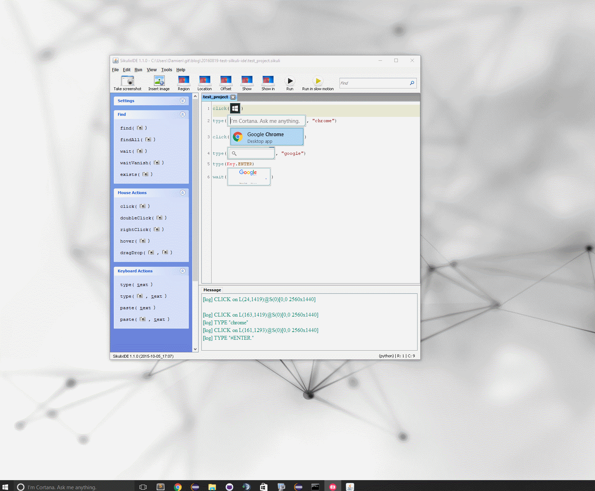

## Steps

The following steps are details in the original documentation at http://sikulix.com/quickstart/ and are currently testing a website (Google).

1. Download
2. Install
3. Init project
4. Create Test
5. Run Test with Success
6. Run Test with Error
7. Find your project and share it

Create Test Details:
1. Step 1 - Open start menu
2. Step 2 - Search for chrome app
3. Step 3 - Click on chrome icon
4. Step 4 - Go to Google website
5. Step 5 - Check result

### 1. Download

Download last release at https://launchpad.net/sikuli/sikulix/

https://launchpad.net/sikuli/sikulix/1.1.0

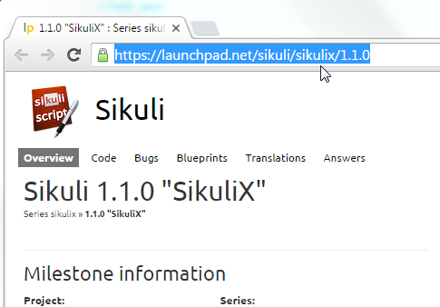

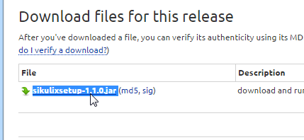

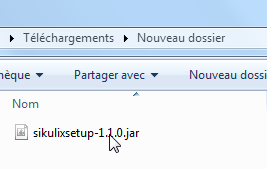

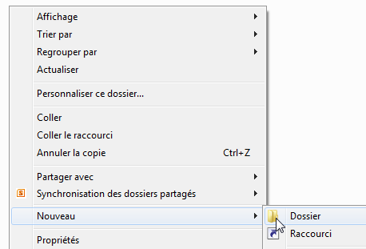

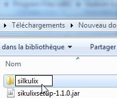

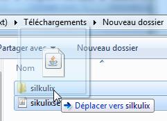

### 2. Install

Move it to a specific folder
Install it by running the jar

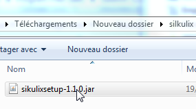

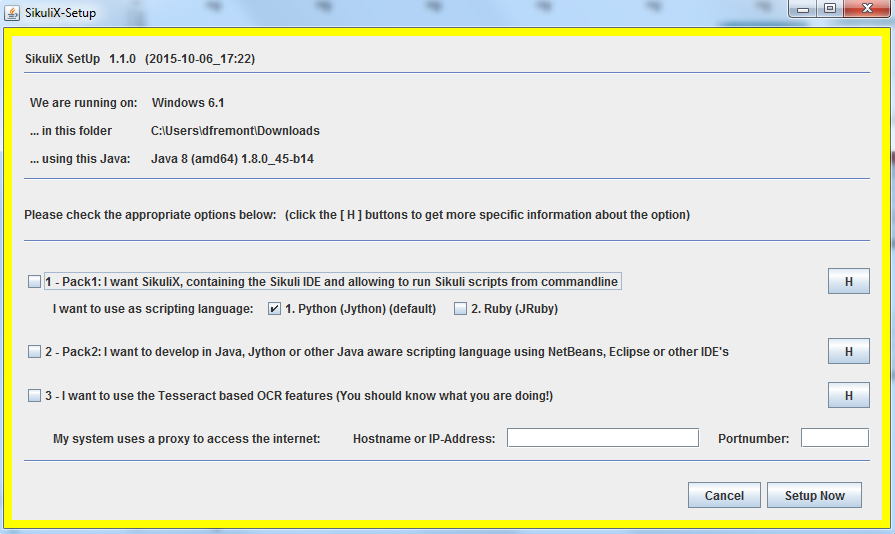

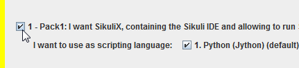

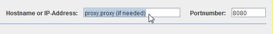

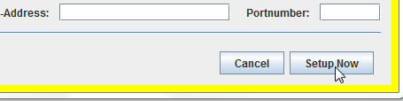

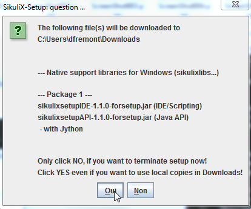

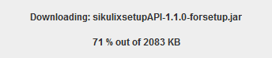

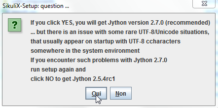

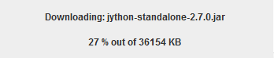

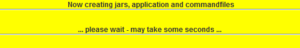

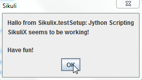

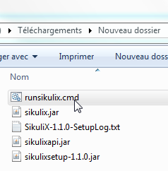

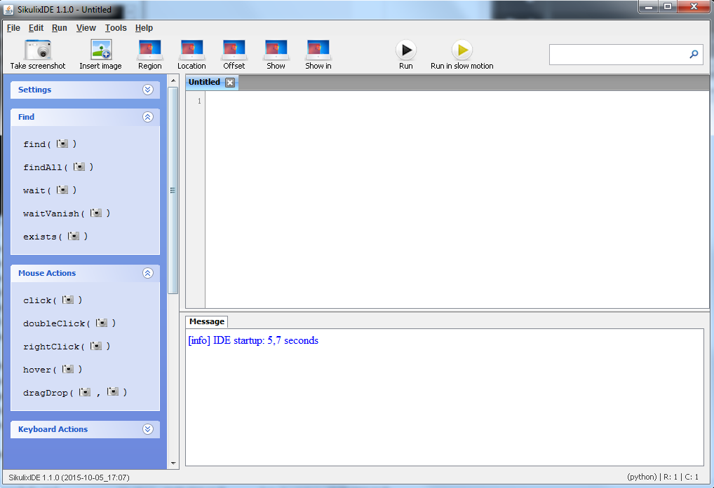

### 3. Init project

First save the test project

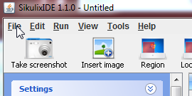

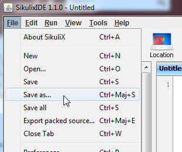

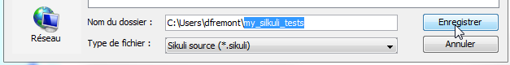

### 4. Create Test

#### 4.1. Step 1 - Open start menu

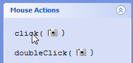

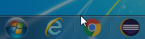

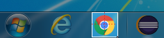

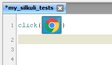

#### 4.2. Step 2 - Search for chrome app

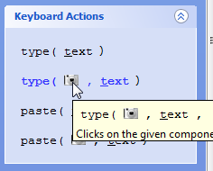

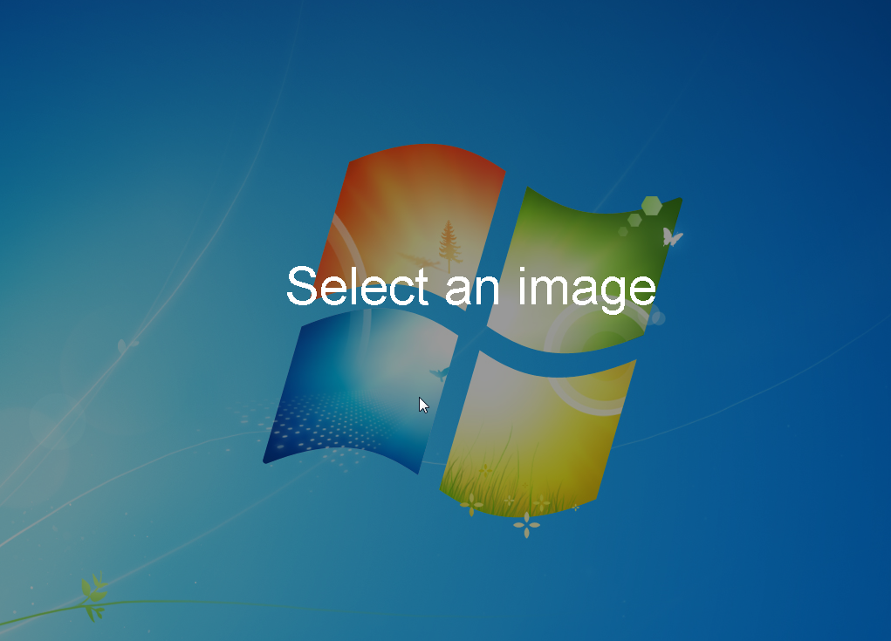

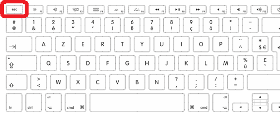

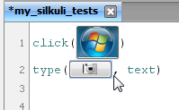

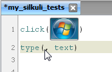

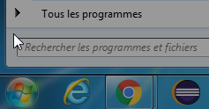

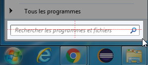

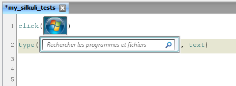

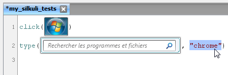

#### 4.3. Step 3 - Click on chrome icon

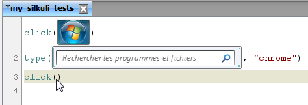

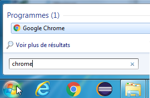

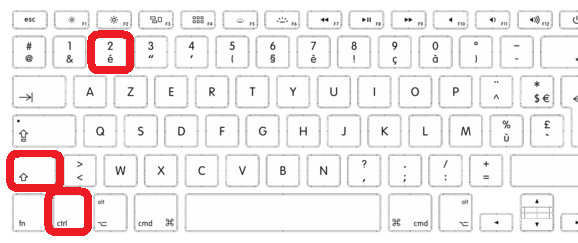

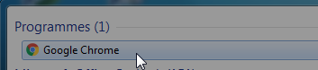

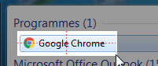

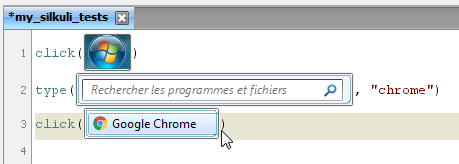

#### 4.4. Step 4 - Go to Google website

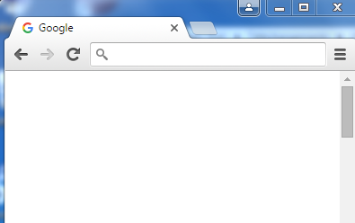

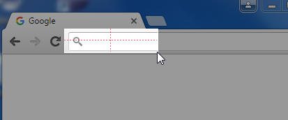

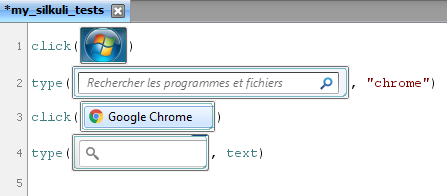

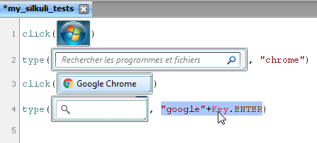

#### 4.5. Step 5 - Check result

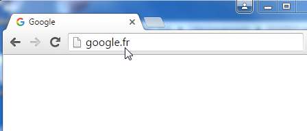

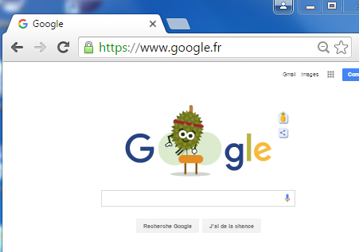

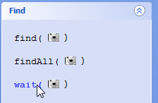

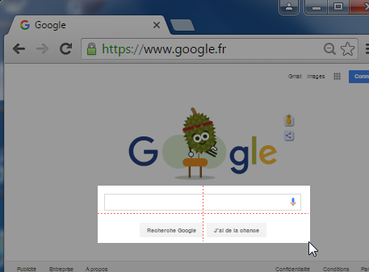

### 5. Run Test with Success

### 6. Run Test with Error

### 7. Find your project and share it

## Final Word

Silkuli 2 is on the way to be released at the end of 2016.

## Project

https://github.com/DamienFremont/blog/tree/master/20160819-test-silkuli-ide

## References

http://doc.sikuli.org/keys.html

## Origin

https://damienfremont.com/2016/08/19/how-to-silkuli-test-ui-without-programming/
