How to Silkuli - Test UI without programming - Advanced
======
 

This tutorial show how to organize UI tests and reuse most of your existing usecases elements, like comments and screenshots.

Note: see the previous post 'How to Silkuli - Test UI without programming' for a quick start.

https://damienfremont.com/2016/08/19/how-to-silkuli-test-ui-without-programming/

## Demo

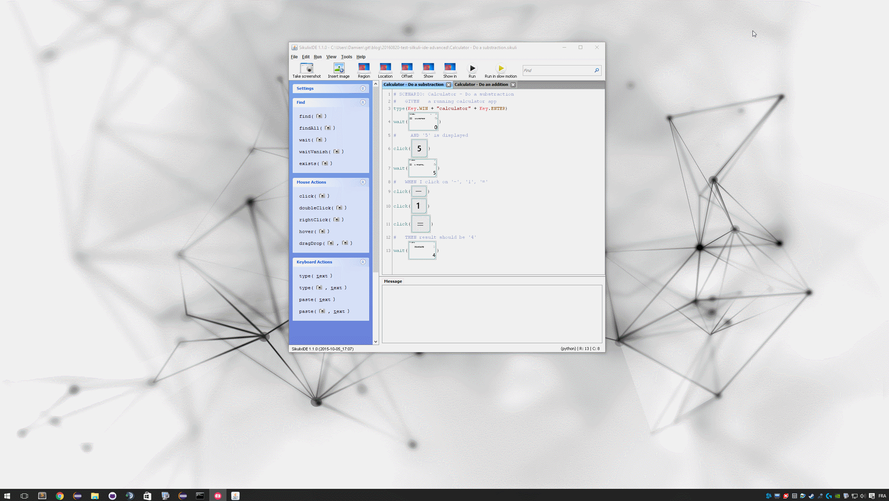

## Steps

We will create a two usecase project

1. Define usecases
2. Create projects
3. Create usecase A test
4. Reuse elements for usecase B
5. Create usecase B test
6. Run tests

### 1. Define usecases

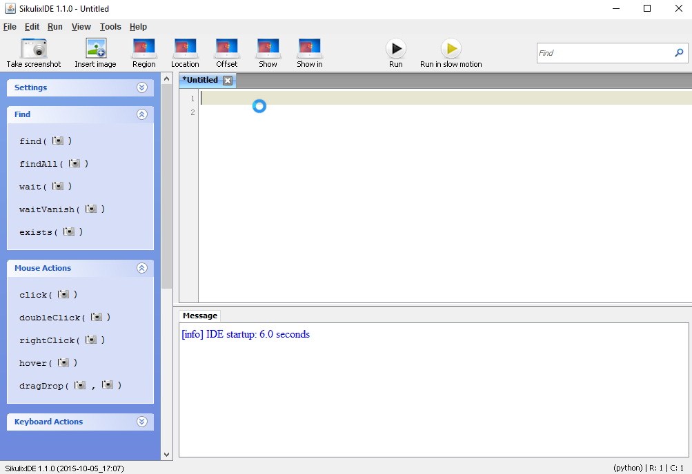

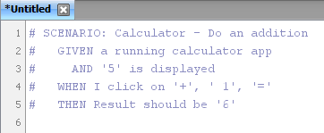

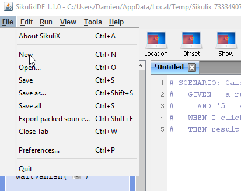

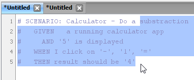

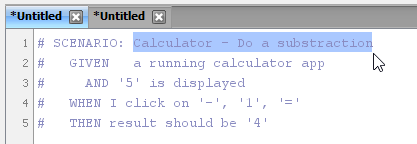

### 2. Create projects

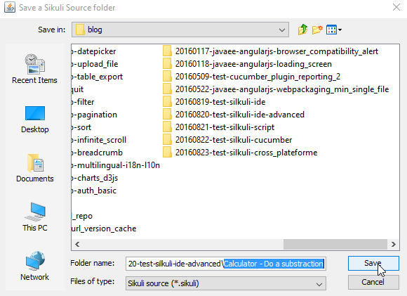

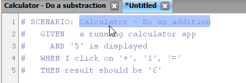

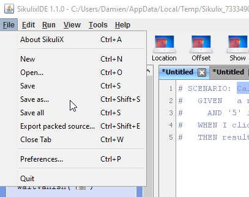

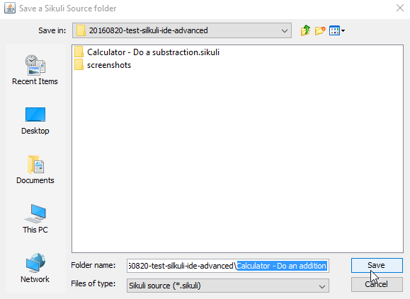

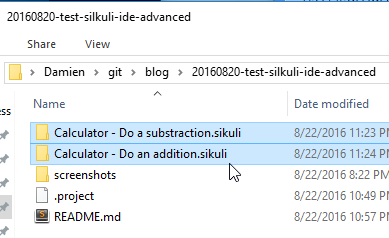

### 3. Create usecase A test

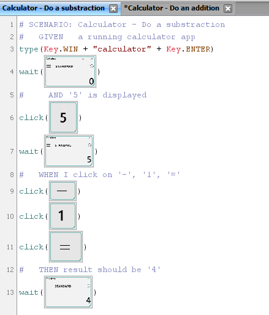

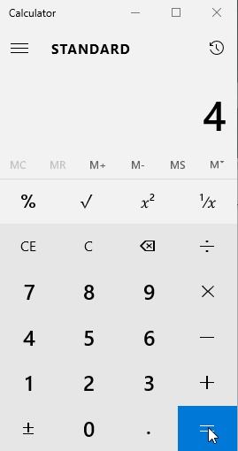

### 4. Reuse elements for usecase B

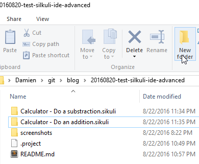

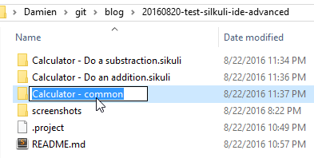

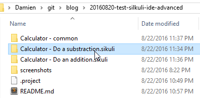

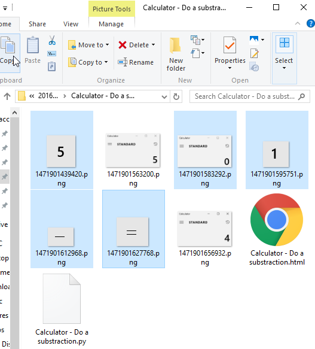

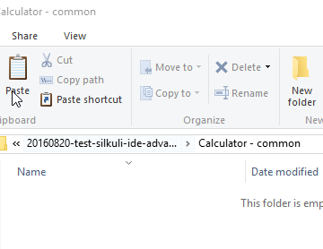

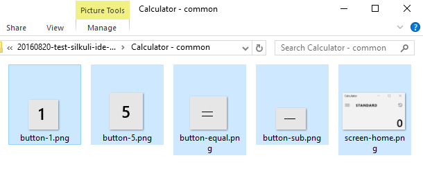

### 5. Create usecase B test

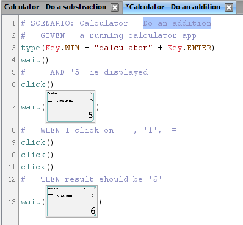

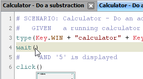

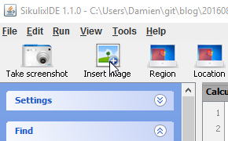

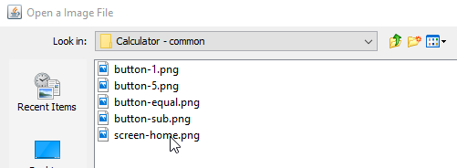

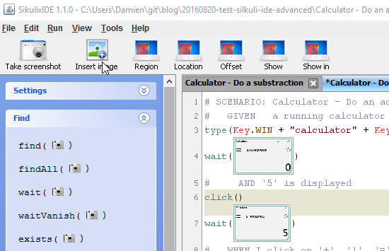

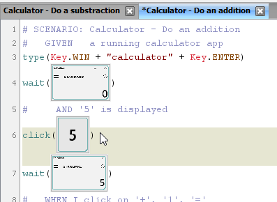

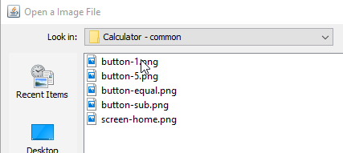

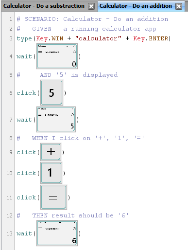

### 6. Run tests

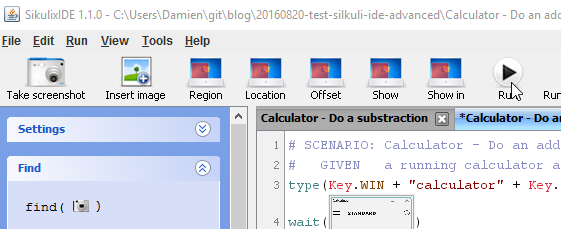

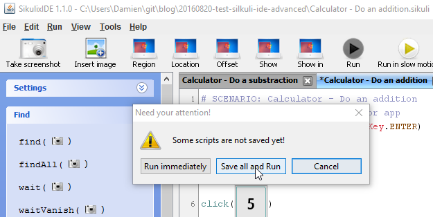

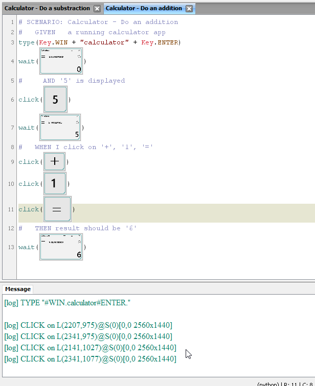

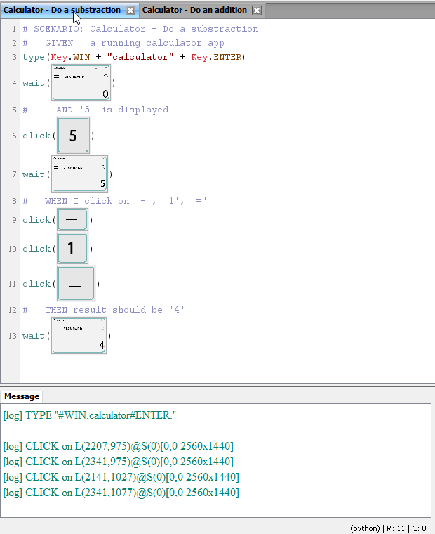

## Final Word

The element reuse is not a direct reference to the original screenshot. If you change a button, you'll need to update all the usecases.

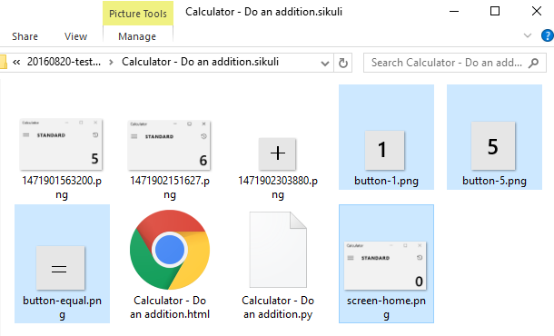

Next step will be automation with scripts. Like running all tests at once, using properties and 

## Project

https://github.com/DamienFremont/blog/tree/master/20160820-test-silkuli-ide-advanced

## References

http://doc.sikuli.org/keys.html

## Origin

https://damienfremont.com/2016/08/19/how-to-silkuli-test-ui-without-programming/
