JS React Material Express: Setting Up a Project Using Npm, Webpack, Babel
======
 

 
This is the simplest example to build a webapp using ReactJS, MaterialUI and ExpressJS in a project with Npm, Webpack, Babel.
 

 
A lot of these tools are not required to use React. But using ES6, JSX is more productive.
 
## Stack
 
* NodeJs – A JavaScript runtime built on Chrome’s V8 JavaScript engine.
* Npm – The package manager for JavaScript and the world’s largest software registry.
* ReactJS – The state based framework for your Views
* ExpressJS – The node framework to serve your views to the world when they hit the server at example.com or example.com/awesome.html
* MaterialUI – A Set of React Components that ImplementGoogle’s Material Design
* Webpack – The module binder which takes all your JS files from different directories and compiles them into a single app.bundle.js (you can change the filename of course) so you can include it in a HTML page
* Babel – The compiler to compile your JS files with es6, es7, JSX syntax to regular javascript
 
## Steps
 
* Init NodeJs, Project
* Add Express
* Add React
* Add Material
 
## 1. Init NodeJs, Project
 
Go to NodeJs website and download the stable version (LTS).
 
[https://nodejs.org/en/](https://nodejs.org/en/)
https://nodejs.org/en/
 

 

 
Create a new folder ‘YOUR_PROJECT_NAME’ and initialize it with npm.
 
```
mkdir YOUR_PROJECT_NAME
cd YOUR_PROJECT_NAME
npm init
```
 
Answer all the questions about your project.
 
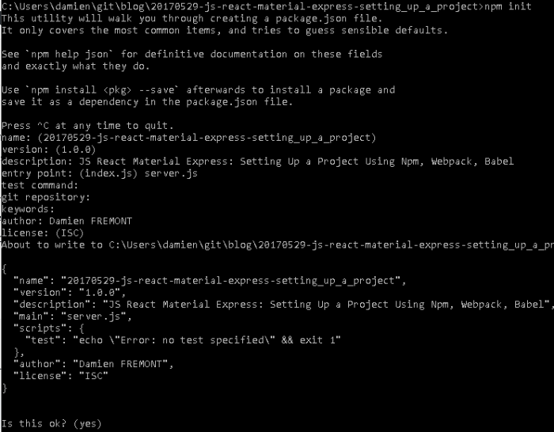
 

 
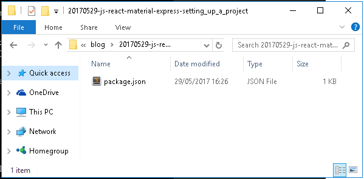
 

 
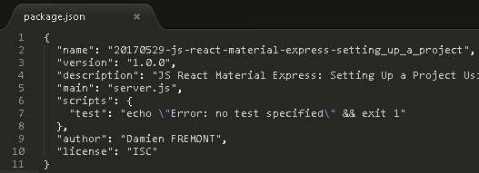
 

 
```
npm install
npm install webpack -g
```
 
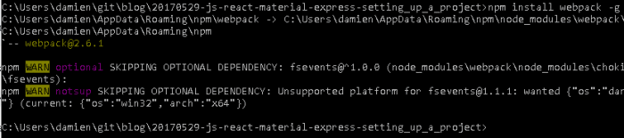
 

 
## 2. Add Express
 
```javascript
"dependencies": {
 "express": "4.13.3",
 "compression": "1.6.0"
 },
 "devDependencies": {
 }
```
 
Add then Implement Express Server (server.js).
 
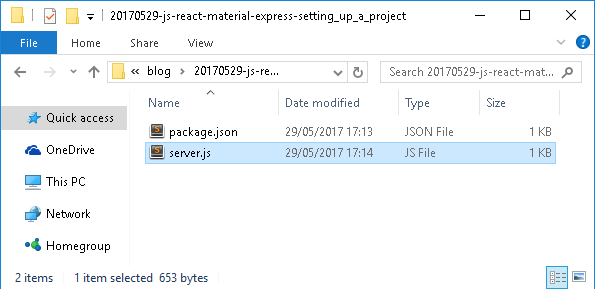
 

 
It’s a simple example with a REST API that provide server’s status.
 
```javascript
// Module dependencies.
var express = require('express'),
 compression = require('compression');
 
// Configuration
var app = express();
app.set('port', (process.env.PORT || 5000));
app.use(compression());
var http = require('http').Server(app);
 
// Routes
app.use('/', express.static('./public'));
 
// REST
app.get('/api/status', function (req, res) {
 var status = "ONLINE (v1.0.0)";
 res.send(status);
});
 
// Start server
var server = http.listen(app.get('port'), function(){
 var host = server.address().address;
 var port = server.address().port;
 console.log('Example app listening at http://%s:%s', host, port);
});
```
 
Build
 
```
npm install
```
 
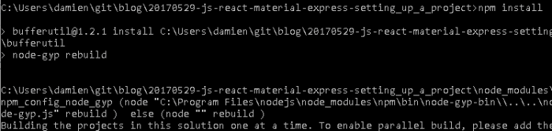
 

 
Start
 
```
npm start
```
 
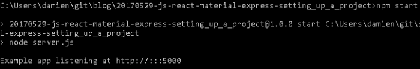
 

 
Test
 
[http://localhost:5000/api/status](http://localhost:5000/api/status)
http://localhost:5000/api/status
 
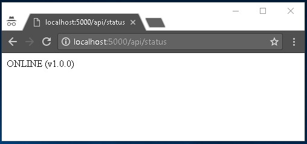
 

 
## 3. Add React
 
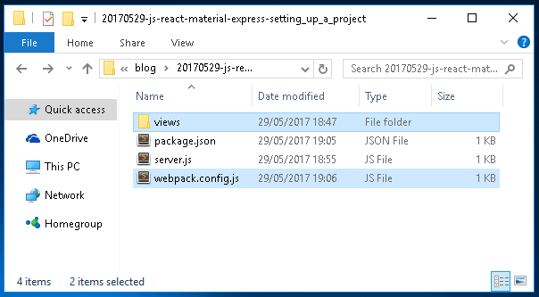
 

 
package.json
 
```javascript
"scripts": {
 "start": "node server.js",
 "test": "echo \"Error: no test specified\" && exit 1"
 },
 
"dependencies": {
 
  "express": "4.13.3",
  "compression": "1.6.0",
 
  "react": "15.4.2",
  "react-dom": "15.4.2",
 
  "babel-core": "6.24.1",
 },
 "devDependencies": {
 
   "babel-loader": "6.4.0",
   "babel-preset-es2015":  "6.24.1",
   "babel-preset-react":   "6.24.1",
   "babel-preset-stage-1": "6.24.1",
 
   "webpack": "2.6.1",
   "webpack-dev-server": "2.4.5",
 
"html-webpack-plugin": "2.28.0"
 }
```
 
webpack.config.js
 
```javascript
'use strict';
 
var path = require('path');
var webpack = require('webpack');
var HtmlWebpackPlugin = require('html-webpack-plugin');
 
module.exports = [
{
entry: './views/index.jsx',
output: {
path: __dirname + '/public/',
filename: '[name].js',
publicPath: '/'
},
plugins: [
new webpack.optimize.UglifyJsPlugin(),
new HtmlWebpackPlugin({
template: 'views/index.tpl.html',
inject: 'body',
filename: 'index.html'
})
],
module: {
loaders: [{
test: /\.jsx?$/,
exclude: /node_modules/,
loader: 'babel-loader',
query: {
"presets": ["react", "es2015"]
}
}]
}
}
];
```
 
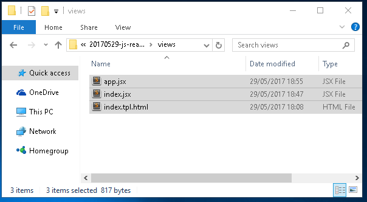
 

 
views/index.tpl.html
 
```xml
<!doctype html>
<html lang="en">
  <head>
    <meta charset="utf-8">
    <meta http-equiv="x-ua-compatible" content="ie=edge">
    <title>JS React Material Express</title>
    <meta name="description" content="Setting Up a Project Using Npm, Webpack, Babel">
    <meta name="viewport" content="width=device-width, initial-scale=1">
  </head>
  <body>
<div id="app"></div>
</body>
</html>
```
 
views/index.jsx
 
```javascript
import React from 'react';
import ReactDOM from 'react-dom';
import App from './app.jsx';
 
ReactDOM.render(
    <App />,
    document.getElementById('app'));
```
 
views/app.jsx
 
```javascript
import React from 'react';
 
export default class App extends React.Component {
  constructor(props) {
    super(props);
    this.state = {test: 'foo'};
  }
  render() {
    return (
<div>
        Hello World!</div>
);
  }
}
```
 
```
npm install
webpack
node server
```
 
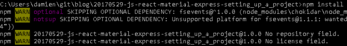
 

 
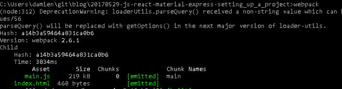
 

 
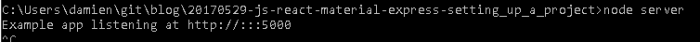
 

 
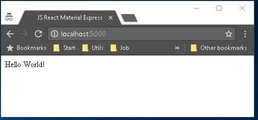
 

 
## 4. Add Material
 
package.json
 
```javascript
"dependencies": {
  ...
  "material-ui": "0.18.1",
  "react-tap-event-plugin": "2.0.1"
},
```
 
views/index.jsx
 
```javascript
import React from 'react';
import ReactDOM from 'react-dom';
import MuiThemeProvider from 'material-ui/styles/MuiThemeProvider';
import App from './app.jsx';
 
import injectTapEventPlugin from 'react-tap-event-plugin';
injectTapEventPlugin();
 
ReactDOM.render(
  <MuiThemeProvider>
    <App />
  </MuiThemeProvider>,
    document.getElementById('app'));
```
 
views/app.jsx
 
```javascript
import React from 'react';
import {Card, CardActions, CardHeader, CardMedia, CardTitle, CardText} from 'material-ui/Card';
import FlatButton from 'material-ui/FlatButton';
 
export default class App extends React.Component {
  constructor(props) {
    super(props);
    this.state = {test: 'foo'};
  }
  render() {
    return (
  <Card>
    <CardHeader       title="Hello Title"       subtitle="Subtitle"       actAsExpander={true}       showExpandableButton={true}     />
    <CardActions>
      <FlatButton label="OK" />
      <FlatButton label="CANCEL" />
    </CardActions>
    <CardText expandable={true}>
      Lorem ipsum dolor sit amet, consectetur adipiscing elit.
      Donec mattis pretium massa. Aliquam erat volutpat. Nulla facilisi.
      Donec vulputate interdum sollicitudin. Nunc lacinia auctor quam sed pellentesque.
      Aliquam dui mauris, mattis quis lacus id, pellentesque lobortis odio.
    </CardText>
  </Card>
    );
  }
}
```
 
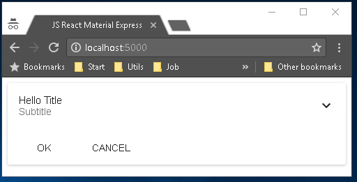
 

 
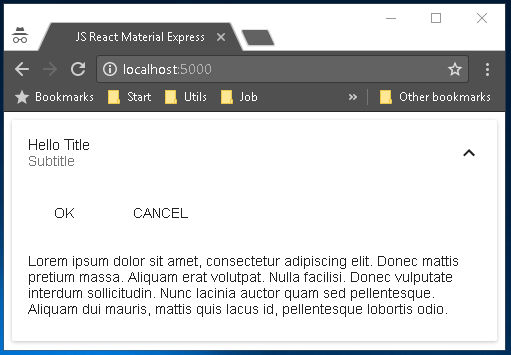
 

 
## Code
 
Here is the final project content.
 
* views app.jsx index.jsx index.tpl.html
* package.json
* server.js
* webpack.config.js
 
package.json
 
```javascript
{
  "name": "20170529-js-react-material-express-setting_up_a_project",
  "version": "1.0.0",
  "description": "JS React Material Express: Setting Up a Project Using Npm, Webpack, Babel",
  "author": "Damien FREMONT",
 
  "main": "server.js",
  "scripts": {
    "start": "node server.js",
    "test": "echo \"Error: no test specified\" && exit 1"
  },
 
  "dependencies": {
 
    "express": "4.13.3",
    "compression": "1.6.0",
 
    "react": "15.4.2",
    "react-dom": "15.4.2",
 
    "babel-core": "6.24.1",
 
    "material-ui": "0.18.1",
    "react-tap-event-plugin": "2.0.1"
  },
  "devDependencies": {
 
    "babel-loader": "6.4.0",
    "babel-preset-es2015":  "6.24.1",
    "babel-preset-react":   "6.24.1",
    "babel-preset-stage-1": "6.24.1",
 
    "webpack": "2.6.1",
    "webpack-dev-server": "2.4.5",
 
    "html-webpack-plugin": "2.28.0"
  }
}
```
 
webpack.config.js
 
```javascript
'use strict';
 
var path = require('path');
var webpack = require('webpack');
var HtmlWebpackPlugin = require('html-webpack-plugin');
 
module.exports = [
{
  entry: './views/index.jsx',
  output: {
    path: __dirname + '/public/',
    filename: '[name].js',
    publicPath: '/'
  },
  plugins: [
    new webpack.optimize.UglifyJsPlugin(),
    new HtmlWebpackPlugin({
      template: 'views/index.tpl.html',
      inject: 'body',
      filename: 'index.html'
    })
  ],
  module: {
    loaders: [{
      test: /\.jsx?$/,
      exclude: /node_modules/,
      loader: 'babel-loader',
      query: {
        "presets": ["react", "es2015"]
      }
    }]
  }
}
];
```
 
server.js
 
```javascript
// Module dependencies.
var express = require('express'),
 compression = require('compression');
 
// Configuration
var app = express();
app.set('port', (process.env.PORT || 5000));
app.use(compression());
var http = require('http').Server(app);
 
// VIEW Routes
app.use('/', express.static('./public'));
 
// REST
app.get('/api/status', function (req, res) {
  var status = "ONLINE (v1.0.0)";
  res.send(status);
});
 
// Start server
var server = http.listen(app.get('port'), function(){
  var host = server.address().address;
  var port = server.address().port;
  console.log('Example app listening at http://%s:%s', host, port);
});
```
 
views/index.tpl.html
 
```javascript
<!doctype html>
<html lang="en">
  <head>
    <meta charset="utf-8">
    <meta http-equiv="x-ua-compatible" content="ie=edge">
    <title>JS React Material Express</title>
    <meta name="description" content="Setting Up a Project Using Npm, Webpack, Babel">
    <meta name="viewport" content="width=device-width, initial-scale=1">
  </head>
  <body>
<div id="app"></div>
</body>
</html>
```
 
views/index.jsx
 
```javascript
import React from 'react';
import ReactDOM from 'react-dom';
import MuiThemeProvider from 'material-ui/styles/MuiThemeProvider';
import App from './app.jsx';
 
import injectTapEventPlugin from 'react-tap-event-plugin';
injectTapEventPlugin();
 
ReactDOM.render(
  <MuiThemeProvider>
    <App />
  </MuiThemeProvider>,
    document.getElementById('app'));
```
 
views/app.jsx
 
```javascript
import React from 'react';
import {Card, CardActions, CardHeader, CardMedia, CardTitle, CardText} from 'material-ui/Card';
import FlatButton from 'material-ui/FlatButton';
 
export default class App extends React.Component {
  constructor(props) {
    super(props);
    this.state = {test: 'foo'};
  }
  render() {
    return (
  <Card>
    <CardHeader       title="Hello Title"       subtitle="Subtitle"       actAsExpander={true}       showExpandableButton={true}     />
    <CardActions>
      <FlatButton label="OK" />
      <FlatButton label="CANCEL" />
    </CardActions>
    <CardText expandable={true}>
      Lorem ipsum dolor sit amet, consectetur adipiscing elit.
      Donec mattis pretium massa. Aliquam erat volutpat. Nulla facilisi.
      Donec vulputate interdum sollicitudin. Nunc lacinia auctor quam sed pellentesque.
      Aliquam dui mauris, mattis quis lacus id, pellentesque lobortis odio.
    </CardText>
  </Card>
    );
  }
}
```
 
## Source
 
[https://github.com/DamienFremont/blog/tree/master/20170529-js-react-material-express-setting_up_a_project](https://github.com/DamienFremont/blog/tree/master/20170529-js-react-material-express-setting_up_a_project)
https://github.com/DamienFremont/blog/tree/master/20170529-js-react-material-express-setting_up_a_project
 
## Reference
 
[https://www.python.org/downloads/](https://www.python.org/downloads/)
https://www.python.org/downloads/
 
[https://facebook.github.io/react/](https://facebook.github.io/react/)
https://facebook.github.io/react/
 
[http://www.material-ui.com/#/](http://www.material-ui.com/#/)
http://www.material-ui.com/#/
 
[https://webpack.js.org/guides/installation/#local-installation](https://webpack.js.org/guides/installation/#local-installation)
https://webpack.js.org/guides/installation/#local-installation
 
[https://github.com/christianalfoni/webpack-express-boilerplate](https://github.com/christianalfoni/webpack-express-boilerplate)
https://github.com/christianalfoni/webpack-express-boilerplate
 
[https://github.com/tahnik/react-express-webpack-babel](https://github.com/tahnik/react-express-webpack-babel)
https://github.com/tahnik/react-express-webpack-babel
 
 
## Origin
[https://damienfremont.com/2017/05/29/js-react-material-express-setting-up-a-project-using-npm-webpack-babel/](https://damienfremont.com/2017/05/29/js-react-material-express-setting-up-a-project-using-npm-webpack-babel/)
 
