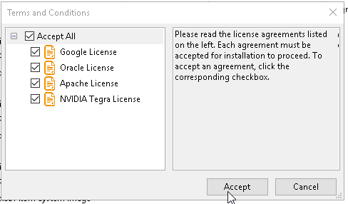
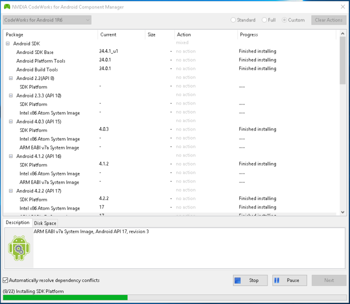
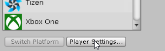
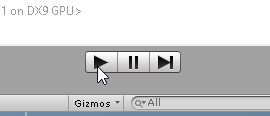

How to Unity3D – Configure Project for Android and Run it on Mobile Device
======
 

 
In this tutorial, you start from scratch. You will install Unity3D, Android SDK, then configure a project for Android, and run it on a mobile device.
 

 
## 
 
## Steps
 
* Choose Your Mobile Plateforme
* Install Unity3D and Android Plugin
* Install AndroidWorks
* Install Android Driver (optional)
* Activate Dev Debug mode
* Configure Project
* Build, Run and Play!
 
## 1. Choose Your Mobile Plateforme
 
Targeting a technology is always the same. Because it change over time, it’s safer to choose the “largest lesser” version (and not the latest) at your product launch to allow you to reach most devices .
 
Examples:
 
* 2016: choose Android 4.4, you’ll reach 80-90% of the devices.
* 2012: choose Android 2.3.3, you’ll reach 70%…
* 2010: choose Android 2.1…
 
[https://en.wikipedia.org/wiki/Android_version_history](https://en.wikipedia.org/wiki/Android_version_history)
https://en.wikipedia.org/wiki/Android_version_history
 

 

 

 

 
## 2. Install Unity3D And Android Plugin (Windows)
 
Unity3D and his Android package is needed.
 
* download your installer (perso, pro, etc)
* run installer
* choose components Example Project Android Build Support
* Wait for download to complete (4 Go)
 

 

 

 

 

 

 

 

 

 

 

 

 

 

 

 

 

 

 

 

 
##  
 
## 3. Install AndroidWorks (Windows)
 
You need to install Android SDK for Unity3D compatibility (API 23/Android6.0 for Unity3D 5.6) and for your target devices (API 19/Android 4.4.2)
 
* got to https://developer.nvidia.com/codeworks-android Create and Nvidia account download codeworks for Windows 64
* install
* wait for manager popup after download stage check install Unity3D android target Version (6.0). check install your android target Version (4.4). uncheck NVidia stuff like Android NDK, Developer Tools check  auto resolve click next
* ignore warnings
* accepts licences
* wait for download to complete (12 Go)
 
 
 

 

 

 

 

 

 

 

 

 

 

 

 

 

 

 

 

 

 
 
 
 
 

 

 

 

 

 

 
 
 

 

 

 

 
 
 
 
 
## 4. Install Android USB Driver (Windows)
 
Sometimes, to enable debug mode, you need to install a specific USB driver for your phone.
 
[https://developer.android.com/studio/run/win-usb.html](https://developer.android.com/studio/run/win-usb.html)
https://developer.android.com/studio/run/win-usb.html
 

 

 
## 5. Activate Dev Debug Mode (Android)
 
Settings > About Phone > Build number > Tap it 7 times to become developer;
 
Settings > Developer Options > USB Debugging.
 
[https://www.kingoapp.com/root-tutorials/how-to-enable-usb-debugging-mode-on-android.htm](https://www.kingoapp.com/root-tutorials/how-to-enable-usb-debugging-mode-on-android.htm)
https://www.kingoapp.com/root-tutorials/how-to-enable-usb-debugging-mode-on-android.htm
 

 

 

 
## 6. Configure Project (Unity3d)
 
We will use the “Standard Assets Example Project”, but limit to only ONE scene because of the load of the entire project during deployment to the mobile device (one scene is 30sec, all scenes is 10min).
 
* Open the Unity3d project Update Build Settings
Check only ONE project Choose Android, with dev build
* Update Player Settings Select Android Choose targets API (ex 4.4)
* Test it locally (Windows)
* Save
 

 

 
 
 

 

 

 

 

 

 

 

 

 

 

 

 

 

 

 

 

 

 

 

 

 

 

 

 

 
## 7. Build, Run and Play!
 
Project and device are ready.
 
* Build and Run
* Choose APK name, Save
* Autorise usb debug on for device from android
* Wait for deployment (‘Hold On’ popup)
* Play!
* Get APK from Project folder (on Windows, ‘Example Project.apk’)
 

 

 

 

 

 

 

 

 

 

 

 

 

 

 

 

 

 

 

 

 

 

 

 

 
##  Conclusion
 
AndroidWorks provide a simple way to install and manage android sdk installation.
 
Choosing Android version first is better, because latter it’s harder to do that latter in the project: you can run into Unity3D API changes, or bugs in your game, and you don’t want to do that just before your final release!
 
These example have been tested on multiple devices:
 
* LG G4 (2015) Android 6.x high specs
* Samsung Galaxy A5 (2016) Android 7.x low specs no gyro
 
If you change your mind about the Android Version, just relaunch AndroidWorks.
 

 

 
## Source
 
[https://github.com/DamienFremont/blog/tree/master/20170601-unity3d-configure-project-for-android-and-run-it](https://github.com/DamienFremont/blog/tree/master/20170601-unity3d-configure-project-for-android-and-run-it)
https://github.com/DamienFremont/blog/tree/master/20170601-unity3d-configure-project-for-android-and-run-it
 
## References
 
[https://en.wikipedia.org/wiki/Android_version_history](https://en.wikipedia.org/wiki/Android_version_history)
https://en.wikipedia.org/wiki/Android_version_history
 
[https://store.unity.com](https://store.unity.com)
https://store.unity.com
 
[https://docs.nvidia.com/gameworks/content/developertools/mobile/androidworks/androidworks_install.htm](https://docs.nvidia.com/gameworks/content/developertools/mobile/androidworks/androidworks_install.htm)
https://docs.nvidia.com/gameworks/content/developertools/mobile/androidworks/androidworks_install.htm
 
[https://developer.android.com/studio/run/win-usb.html](https://developer.android.com/studio/run/win-usb.html)
https://developer.android.com/studio/run/win-usb.html
 
[https://www.kingoapp.com/root-tutorials/how-to-enable-usb-debugging-mode-on-android.htm](https://www.kingoapp.com/root-tutorials/how-to-enable-usb-debugging-mode-on-android.htm)
https://www.kingoapp.com/root-tutorials/how-to-enable-usb-debugging-mode-on-android.htm
 
 
 
 
 
 
## Origin
[https://damienfremont.com/2017/05/24/how-to-unity3d-configure-project-for-android-and-run-it-on-mobile-device//](https://damienfremont.com/2017/05/24/how-to-unity3d-configure-project-for-android-and-run-it-on-mobile-device//)
 
