How to Unity3D – Why Use UI instead of GUI / IMGUI
======
 

 
In this use-case, you will see the difference between GUI and UI API. And why use the later in your game, for constancy between platforms and API long term support.
 

 

 

 
A lot of tutorials and feedbacks on Internet show code using GUI API. But it not a good approach to Unity3D.
 
Here si the official Unity3D documentation: “The IMGUI system is not generally intended to be used for normal in-game user interfaces … For that you should use Unity’s main GameObject-based UI system“.
 
[https://docs.unity3d.com/Manual/GUIScriptingGuide.html](https://docs.unity3d.com/Manual/GUIScriptingGuide.html)
https://docs.unity3d.com/Manual/GUIScriptingGuide.html
 
## Steps
 
* GUI Example
* UI Example Pros / Cons
* Project Code
* Demos
 
## GUI Example
 
The GUI is the fastest way to build UI, like on other platforms like webpage (HTML/JS/CSS), or Android (Java). But it’s not intended to be use in game code. It’s just for testing en Unity Editor.
 
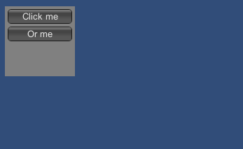
 

 
[https://docs.unity3d.com/Manual/GUIScriptingGuide.html](https://docs.unity3d.com/Manual/GUIScriptingGuide.html)
https://docs.unity3d.com/Manual/GUIScriptingGuide.html
 
* Pros Productive (simple) Maintainable (less code, params)
* Cons GUI is deprecated since Unity3D 5.x!!! Limited (don’t work properly on other plateforme than Windows) coordinates start at top/left (like webpage/android, are absolute in pixel)
 
## UI Example
 
Unity3d.UI is the actual UI API. It’s complex, but fully customizable. But there is no convention or default behavior (like size, colors, textures).
 
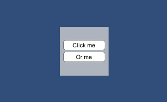
 

 
[https://docs.unity3d.com/Manual/HOWTO-UIMultiResolution.html](https://docs.unity3d.com/Manual/HOWTO-UIMultiResolution.html)
https://docs.unity3d.com/Manual/HOWTO-UIMultiResolution.html
 
* Pros relative position (to parent object) consistancy, responsive (same UI between plateformes)
* Cons Need an Event system (EventManager) very verbose (like WPF, GWT, or SWING) complex (you need lot of Canvas, GameObjects) coordinates start at bot/left
 
## Project Code
 
You can download or code this example project.
 
* create empty 2D project
* create a Startup.cs script for the Unity3D editor to add Script to scene automatically.
* create three examples
* run it on windows
* run it on mobile
* compare the result
 
[https://github.com/DamienFremont/blog/tree/master/20170602-unity3d-use-ui-instead-of-gui-or-imgui/](https://github.com/DamienFremont/blog/tree/master/20170602-unity3d-use-ui-instead-of-gui-or-imgui/)
https://github.com/DamienFremont/blog/tree/master/20170602-unity3d-use-ui-instead-of-gui-or-imgui/
 
Assets/Startup.cs
 
```
using UnityEngine;
using UnityEditor;
 
// http://docs.unity3d.com/Manual/RunningEditorCodeOnLaunch.html
[InitializeOnLoad]
public class Startup
{
    static Startup ()
    {
        GameObject gameObject;
        gameObject = GameObject.Find("Main Camera");
 
        Component script1 = gameObject.GetComponent&amp;lt;GUIExample&amp;gt;();
        if (script1 == null) {
            gameObject.AddComponent&amp;lt;GUIExample&amp;gt; ();
        }
 
        Component script2 = gameObject.GetComponent&amp;lt;UIExample&amp;gt;();
        if (script2 == null) {
            gameObject.AddComponent&amp;lt;UIExample&amp;gt; ();
        }
    }
}
```
 
[https://docs.unity3d.com/ScriptReference/GameObject.Find.html](https://docs.unity3d.com/ScriptReference/GameObject.Find.html)
https://docs.unity3d.com/ScriptReference/GameObject.Find.html
 
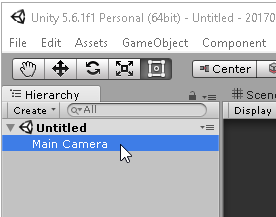
 

 
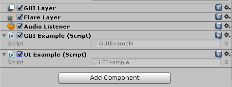
 

 
Assets/Scripts/GUIExample.cs
 
```
using System;
using UnityEngine;
 
// https://docs.unity3d.com/Manual/GUIScriptingGuide.html
public class GUIExample : MonoBehaviour
{
    // Use this for initialization
    void OnGUI ()
    {
        Rect rect = new Rect (10, 10, 100, 100);
        Texture2D tex = new Texture2D (1, 1);
        tex.SetPixels(new Color[]{Color.grey});
 
        GUIStyle style = new GUIStyle ();
        style.normal.background = tex;
        // https://docs.unity3d.com/ScriptReference/GUILayout.BeginArea.html
        GUILayout.BeginArea (rect, tex, style);
        if (GUILayout.Button ("Click me"))
            action ();
        if (GUILayout.Button ("Or me"))
            action ();
        GUILayout.EndArea ();
    }
 
    private void action ()
    {
        Debug.Log ("Hello!");
    }
}
```
 
Assets/Scripts/UIExample.cs
 
```
using System;
using UnityEngine;
using UnityEngine.UI;
using UnityEngine.Events;
using UnityEngine.EventSystems;
 
public class UIExample : MonoBehaviour
{
    // Use this for initialization
    void Start ()
    {
        Rect rect = new Rect (0, 0, 100, 100);
        Texture2D tex = new Texture2D (1, 1);
        tex.SetPixels(new Color[]{Color.blue});
 
        CreateEventSystem (this.transform);
 
        GameObject a = area (this.transform, rect, tex);
        GameObject b1 = button (a.transform, new Vector2(0,12), "Click me", delegate {
            TaskOnClick();
        });
        GameObject b2 = button (a.transform, new Vector2(0,-12), "Or me",  delegate {
            TaskOnClick();
        });
    }
 
    public void TaskOnClick ()
    {
        Debug.Log ("Hello!");
    }
 
    // BOILER PLATE BELLOW...
 
    GameObject area (Transform parent, Rect rect, Texture2D tex)
    {
        // OBJECT
        GameObject canObj = new GameObject ("UI:Canvas");
        canObj.transform.SetParent (parent);
 
        // OBJECT:CANVAS
        // http://docs.unity3d.com/Manual/UICanvas.html
        Canvas can = canObj.AddComponent<Canvas> ();
        can.renderMode = RenderMode.ScreenSpaceOverlay;
        can.pixelPerfect = true;
 
        // OBJECT:CANVAS:SCALER
        // http://docs.unity3d.com/ScriptReference/UI.CanvasScaler.html
        CanvasScaler canObjSca = canObj.AddComponent<CanvasScaler> ();
        canObjSca.uiScaleMode = CanvasScaler.ScaleMode.ScaleWithScreenSize;
        canObjSca.referenceResolution = new Vector2(540, 480);
 
        // OBJECT:CANVAS:RAYCASTER
        // https://docs.unity3d.com/Manual/script-GraphicRaycaster.html
        GraphicRaycaster canvasRayc = canObj.AddComponent<GraphicRaycaster> ();  
 
        // OBJECT:CANVAS:PANEL
        GameObject panObj = new GameObject ("UI:Panel");
        panObj.transform.SetParent (canObj.transform);
        // https://docs.unity3d.com/Manual/UIBasicLayout.html
        RectTransform panTrs = panObj.AddComponent<RectTransform> ();
        panTrs.anchoredPosition = new Vector2 (rect.x, rect.y);
        panTrs.localScale = new Vector3 (1.0f, 1.0f, 1.0f);
        // SetSize(panTrs, new Vector2(rect.width, rect.height));
 
        // OBJECT:CANVAS:PANEL:TEXTURE
        Image img = panObj.AddComponent<Image> ();
        img.sprite = Sprite.Create (tex, new Rect (0, 0, tex.width, tex.height),
            new Vector2 (1.0f, 1.0f));
 
        return canObj;
    }
 
    GameObject button (Transform parent, Vector2 coord, string textStr, UnityAction eventListner)
    {
        Vector2 size = new Vector2 (90, 25);
 
        // OBJECT
        GameObject btnObj = new GameObject ("UI:Button");
        btnObj.transform.SetParent (parent);
        RectTransform btnTrs = btnObj.AddComponent<RectTransform> ();
        btnTrs.anchoredPosition = coord;
        btnTrs.localScale = new Vector3 (1.0f, 1.0f, 1.0f);
        SetSize(btnTrs, size);
 
        // OBJECT:CANVAS:TEXTURE
        // http://docs.unity3d.com/ScriptReference/Sprite.Create.html
        Image img = btnObj.AddComponent<Image> ();
        Texture2D tex = Resources.Load<Texture2D> ("button_bkg");
        img.type = Image.Type.Sliced;
        img.sprite = Sprite.Create (tex, new Rect (0, 0, tex.width, tex.height), new Vector2 (0.5f, 0.5f),
            100.0f, 0, SpriteMeshType.Tight, new Vector4 (10, 10, 10, 10));
 
        //  OBJECT:BUTTON
        // https://docs.unity3d.com/ScriptReference/UI.Button-onClick.html
        Button btn = btnObj.AddComponent<Button> ();
        btn.interactable = true;
        btn.onClick.AddListener (eventListner);
        // https://docs.unity3d.com/ScriptReference/UI.Selectable-transition.html
        btn.targetGraphic = img;
        btn.transition = Selectable.Transition.ColorTint;
 
        //  OBJECT:TEXT
        // https://docs.unity3d.com/ScriptReference/UI.Text.html
        GameObject btnTxtObj = new GameObject ("UI:Text");
        btnTxtObj.transform.SetParent (btnObj.transform);
        RectTransform btnTxtTrs = btnTxtObj.AddComponent<RectTransform> ();
        btnTxtTrs.anchoredPosition = new Vector2(0,0);
        // SetSize(btnTxtTrs, size);
        Text txt = btnTxtObj.AddComponent<Text> ();
        txt.supportRichText = true;
        txt.text = textStr;
        txt.fontSize = 12;
        txt.font = Resources.GetBuiltinResource(typeof(Font), "Arial.ttf") as Font;
        txt.alignment = TextAnchor.MiddleCenter;
        txt.horizontalOverflow = HorizontalWrapMode.Overflow;
        txt.color = Color.black;
 
        return btnObj;
    }
 
    public static void SetSize (RectTransform trans, Vector2 size)
    {
        Vector2 currSize = trans.rect.size;
        Vector2 sizeDiff = size - currSize;
        trans.offsetMin = trans.offsetMin -
            new Vector2 (sizeDiff.x * trans.pivot.x,
                sizeDiff.y * trans.pivot.y);
        trans.offsetMax = trans.offsetMax +
            new Vector2 (sizeDiff.x * (1.0f - trans.pivot.x),
                sizeDiff.y * (1.0f - trans.pivot.y));
    }
 
    public static GameObject CreateEventSystem (Transform parent)
    {
        // https://docs.unity3d.com/Manual/EventSystem.html
        GameObject esObj = new GameObject ("EventSystem");
        esObj.transform.SetParent (parent);
 
        EventSystem esClz = esObj.AddComponent<EventSystem> ();
        esClz.sendNavigationEvents = true;
        esClz.pixelDragThreshold = 5;
 
        StandaloneInputModule stdIn = esObj.AddComponent<StandaloneInputModule> ();
        stdIn.horizontalAxis = "Horizontal";
        stdIn.verticalAxis = "Vertical";
 
        TouchInputModule touchIn = esObj.AddComponent<TouchInputModule> ();
 
        return esObj;
    }
}
```
 
## Demo
 
In this demo, we will test the two API side by side.
 
* on UnityEditor Preview test onClick action test responsive in low and high screen resolution in portrait and landscape orientation
* on Android Mobile Device
 
## 
 

 

 
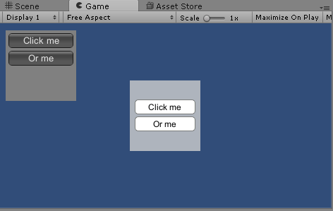
 

 
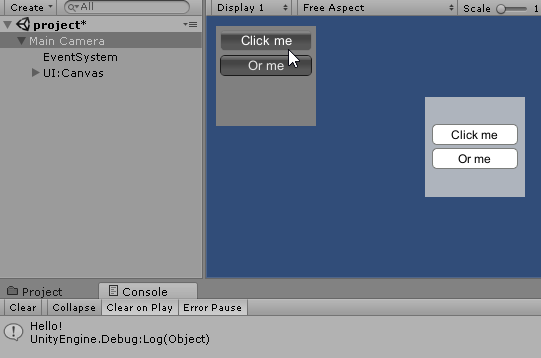
 

 
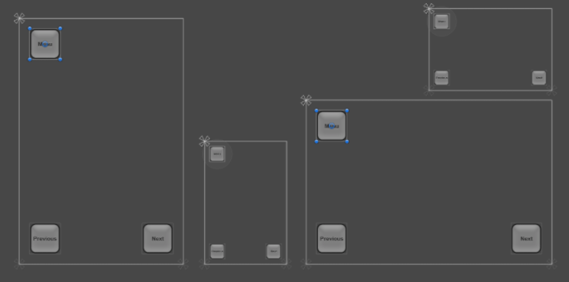
 

 
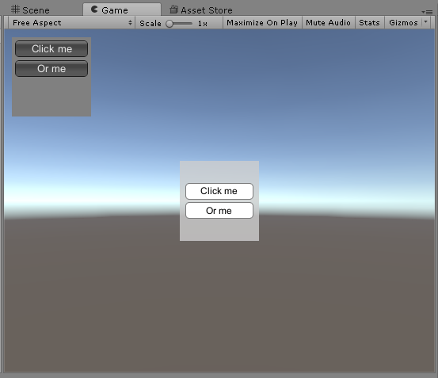
 

 
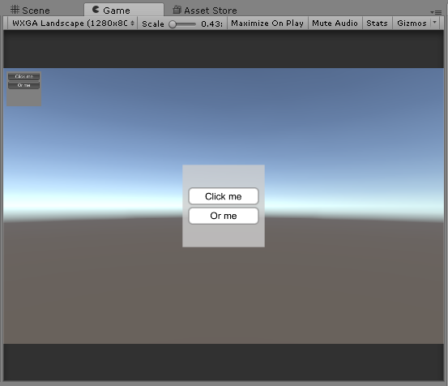
 

 
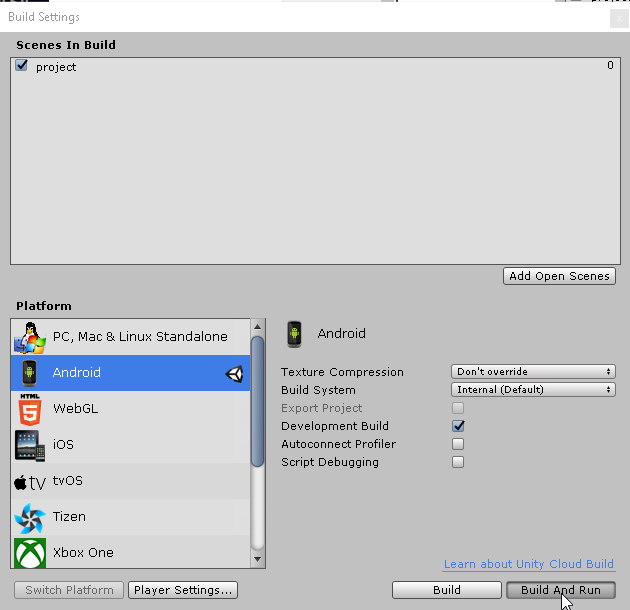
 

 
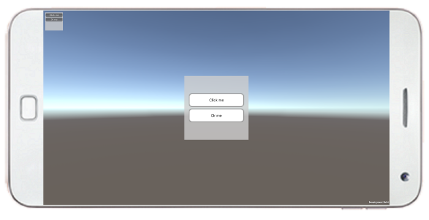
 

 
## Source
 
[https://github.com/DamienFremont/blog/tree/master/20170602-unity3d-use-ui-instead-of-gui-or-imgui/](https://github.com/DamienFremont/blog/tree/master/20170602-unity3d-use-ui-instead-of-gui-or-imgui/)
https://github.com/DamienFremont/blog/tree/master/20170602-unity3d-use-ui-instead-of-gui-or-imgui/
 
## References
 
[https://unity3d.com/fr/learn/tutorials/topics/user-interface-ui](https://unity3d.com/fr/learn/tutorials/topics/user-interface-ui)
https://unity3d.com/fr/learn/tutorials/topics/user-interface-ui
 
[https://docs.unity3d.com/Manual/GUIScriptingGuide.html](https://docs.unity3d.com/Manual/GUIScriptingGuide.html)
https://docs.unity3d.com/Manual/GUIScriptingGuide.html
 
 
## Origin
[https://damienfremont.com/2017/06/02/how-to-unity3d-why-use-ui-instead-of-gui-imgui/](https://damienfremont.com/2017/06/02/how-to-unity3d-why-use-ui-instead-of-gui-imgui/)
 
