How to Unity3D – Use MonoDevelop Script Editor and Debug Project
======
 

 
In this tutorial, you’ll see a project configured with MonoDevelop. And how to run and debug it.
 

 
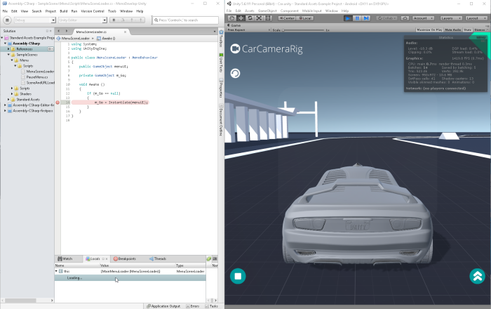
 

 
## Steps
 
* Open the ‘Example’ project
* Choose a Script Editor
* Add breakpoint in source code
* Attach Script Editor to Unity3D
* Debug
 
## 1. Open the ‘Example’ project
 
In Unity3D:
 
* Projects > Open > ‘Example’ > (wait) > Open Scene > ‘Sample Scenes Scenes/car.unity’
* Edit > Play > (test it) > Play (or click Play button, or press Ctrl+P)
 

 

 
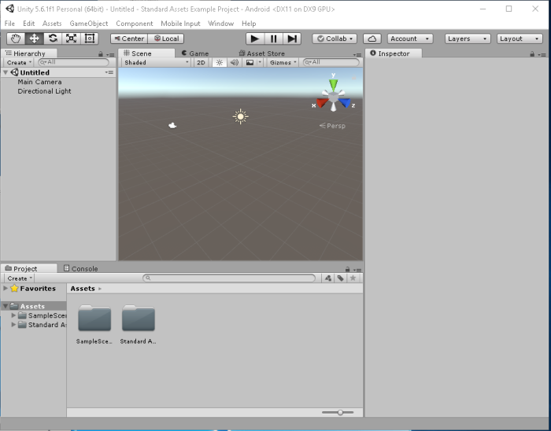
 

 

 

 

 

 
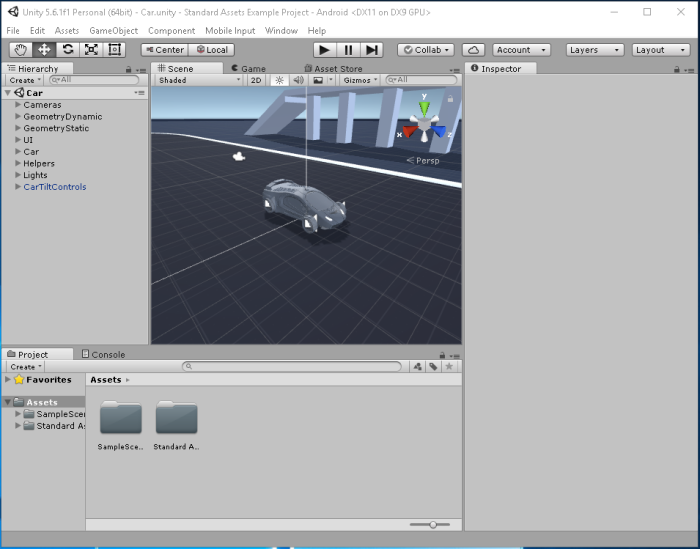
 

 

 

 

 

 

 

 
## 2. Choose a Script Editor
 
In Unity3d:
 
* Edit > Preferences > External Tools > ExternalScriptEditor: ‘MonoDevelop’
* Assets > Open C# Project
 
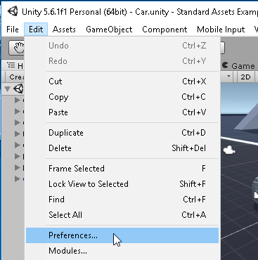
 

 
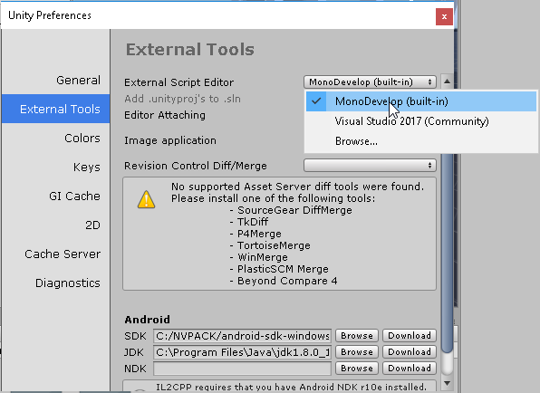
 

 

 

 
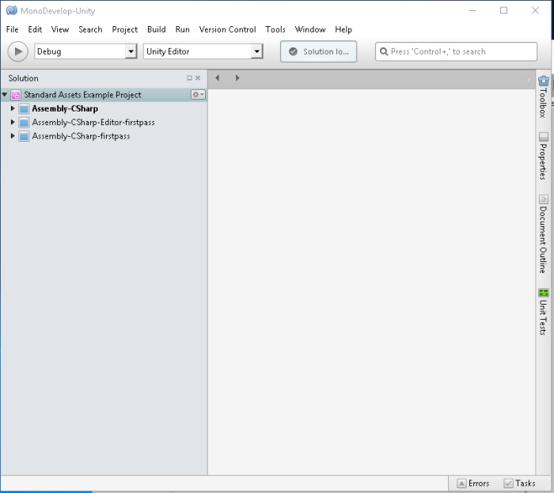
 

 
## 
 
## 3. Add Breakpoint in source code
 
In MonoDevelop:
 
* Open ‘SampleScenes/Menu/Scripts/MenuSceneLoader.cs’
* Add a breakpoint to line 14
 
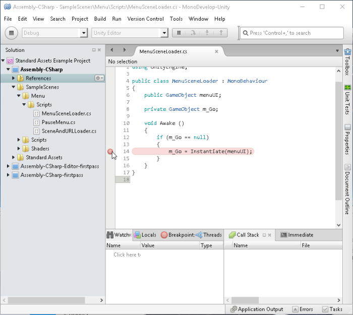
 

 
## 4. Attach Script Editor to Unity3D
 
In MonoDevelop:
 
* Run > Attach to process > Unity3d > Attach
 
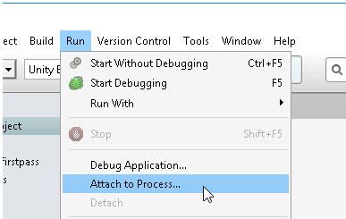
 

 
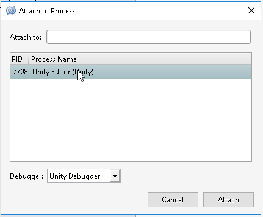
 

 
## 5. Debug
 
In Unity3d:
 
* Edit > Play
* (it’s in pause now, stopped at the breakpoint line)
 
In MonoDevelop:
 
* Run > Continue Debugging (or click Continue button or press F5)
 
In Unity3d:
 
* (play with it)
 
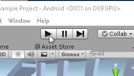
 

 
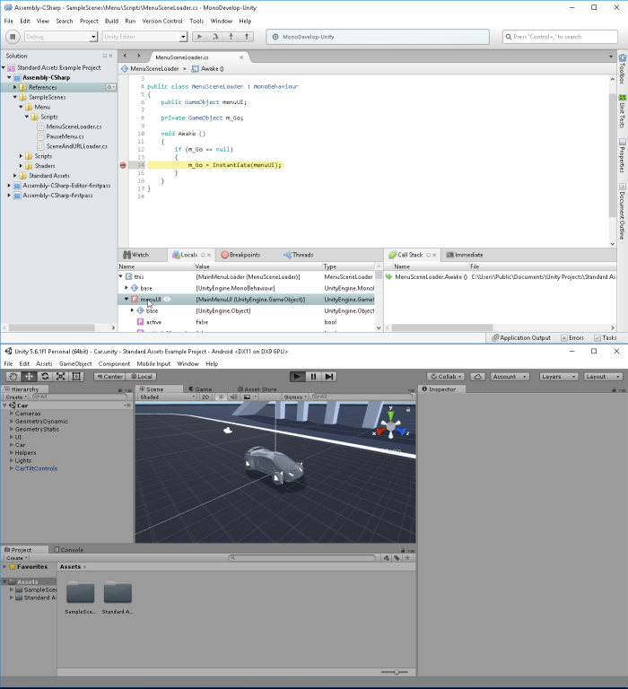
 

 
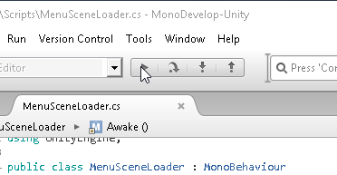
 

 
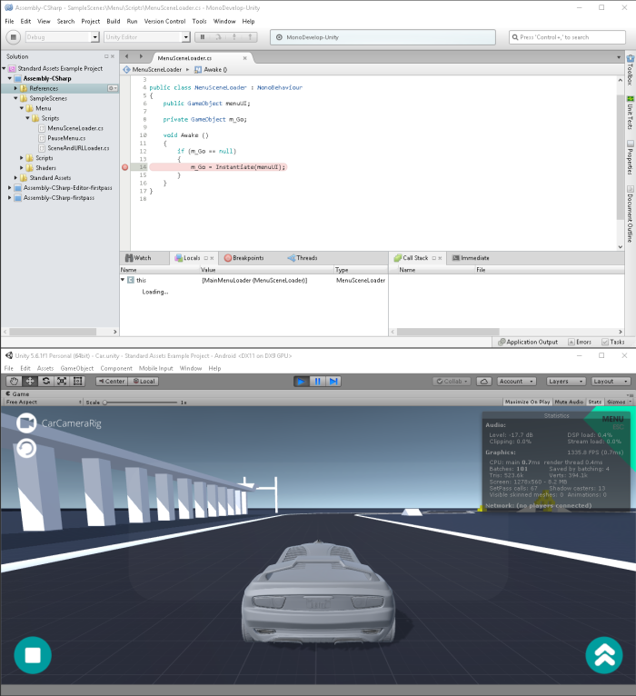
 

 
## Conclusion
 
Pros: MonoDevelop is more productive than editing script in simple text editor or in Unity3d (compilation,  warnings, autocomplete, etc). It’s light on CPU/RAM consumption.
 
Cons: Need to switch between Editor and Unity to run each debug. It’s also a little unstable (copy/paste from webbrowser sometime copy empty chars, compilation shutdown, etc).
 
 
 
Here is the same project opened on VisualStudio, MonoDevelop and a text Editor.
 
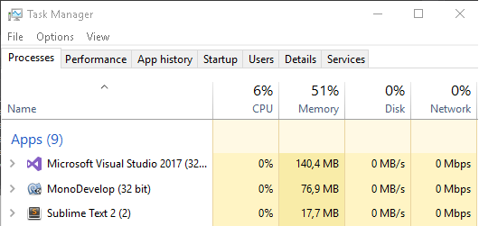
 

 
## Source
 
[https://github.com/DamienFremont/blog/tree/master/20170603-unity3d-use-monodevelop-script-editor-and-debug/](https://github.com/DamienFremont/blog/tree/master/20170603-unity3d-use-monodevelop-script-editor-and-debug/)
https://github.com/DamienFremont/blog/tree/master/20170603-unity3d-use-monodevelop-script-editor-and-debug/
 
## References
 
[http://answers.unity3d.com/questions/1240640/how-do-i-change-the-default-script-editor.html](http://answers.unity3d.com/questions/1240640/how-do-i-change-the-default-script-editor.html)
http://answers.unity3d.com/questions/1240640/how-do-i-change-the-default-script-editor.html
 
 
## Origin
[https://damienfremont.com/2017/06/03/how-to-unity3d-use-monodevelop-script-editor-and-debug-project/](https://damienfremont.com/2017/06/03/how-to-unity3d-use-monodevelop-script-editor-and-debug-project/)
 
