How to Unity3d – Use VisualStudio Script Editor and Debug Project
======
 

 
In this tutorial, you’ll see a project configured with VisualStudio. And how to run and debug it.
 

 
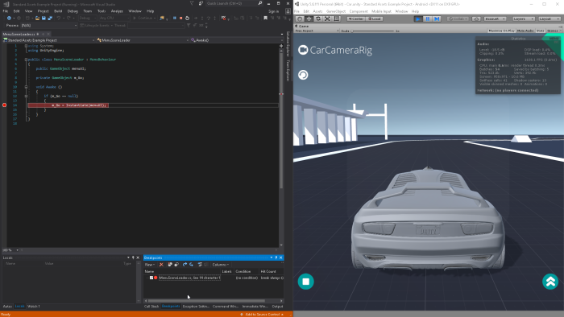
 

 
## Steps
 
* Open the ‘Example’ project
* Choose a Script Editor
* Add breakpoint in source code
* Attach Script Editor to Unity3D
* Debug
 
## 1. Open the ‘Example’ project
 
In Unity3D:
 
* Projects > Open > ‘Example’ > (wait) > Open Scene > ‘Sample Scenes Scenes/car.unity’
* Edit > Play > (test it) > Play (or click Play button, or press Ctrl+P)
 

 

 

 

 
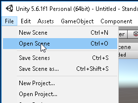
 

 
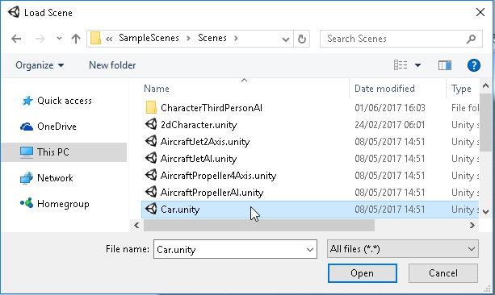
 

 

 

 

 

 
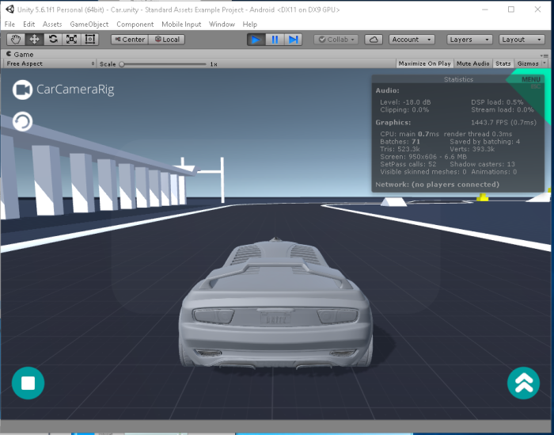
 

 
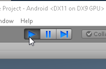
 

 
## 2. Choose a Script Editor
 
In Unity3d:
 
* Edit > Preferences > External Tools > ExternalScriptEditor: ‘MonoDevelop’
* Assets > Open C# Project
 

 

 
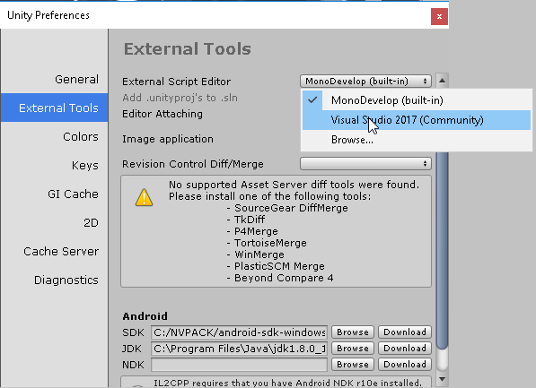
 

 
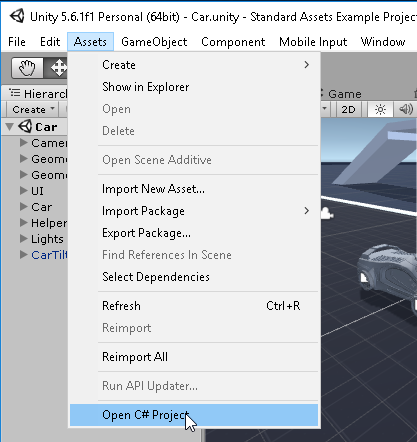
 

 

 

 
## 3. Add Breakpoint in source code
 
In VisualStudio:
 
* Open ‘SampleScenes/Menu/Scripts/MenuSceneLoader.cs’
* Add a breakpoint to line 14
 
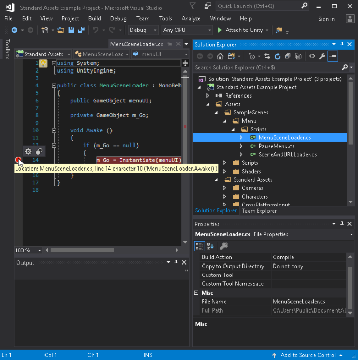
 

 
## 4. Attach Script Editor to Unity3D
 
In VisualStudio:
 
* Click the little show button next to ‘Attach to Unity’ > Select ‘Attach to Unity and Play’
 
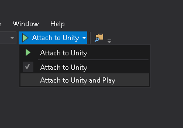
 

 
## 5. Debug
 
In VisualStudio:
 
* Click ‘Attach to Unity and Play’
* (it’s in pause now, stopped at the breakpoint line)
* Click Continue (or press F5)
 
In Unity3d:
 
* (play with it)
 
In VisualStudio:
 
* Click Stop (or press Shift+F5)
 
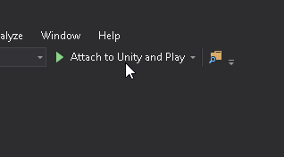
 

 
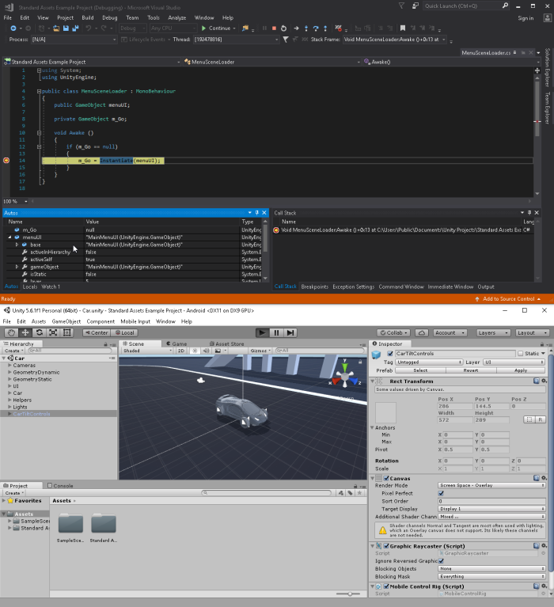
 

 
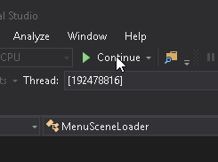
 

 
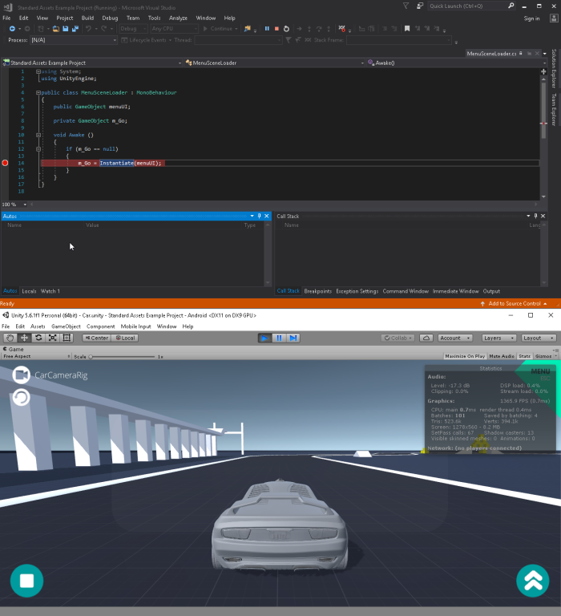
 

 
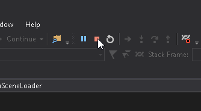
 

 
## Conclusion
 
Pros: More productive than MonoDevelop  (you don’t have to switch beetwen Editor and Unity3D to run a debug). Dark Them is nice too!
 

 
Cons: More heavy on CPU/RAM than MonoDevelop. And it’s a Microsoft product
 
 
 
Here is the same project opened on VisualStudio, MonoDevelop and a text Editor.
 

 

 
 
 
## Source
 
[https://github.com/DamienFremont/blog/tree/master/20170603-unity3d-use-visualstudio-script-editor-and-debug/](https://github.com/DamienFremont/blog/tree/master/20170603-unity3d-use-visualstudio-script-editor-and-debug/)
https://github.com/DamienFremont/blog/tree/master/20170603-unity3d-use-visualstudio-script-editor-and-debug/
 
## References
 
[https://unity3d.com/fr/learn/tutorials/topics/scripting/debugging-unity-games-visual-studio](https://unity3d.com/fr/learn/tutorials/topics/scripting/debugging-unity-games-visual-studio)
https://unity3d.com/fr/learn/tutorials/topics/scripting/debugging-unity-games-visual-studio
 
 
## Origin
[https://damienfremont.com/2017/06/03/how-to-unity3d-use-visualstudio-script-editor-and-debug-project/](https://damienfremont.com/2017/06/03/how-to-unity3d-use-visualstudio-script-editor-and-debug-project/)
 
