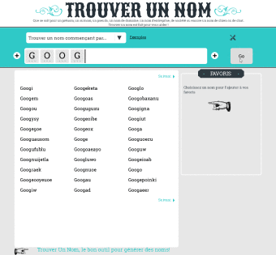
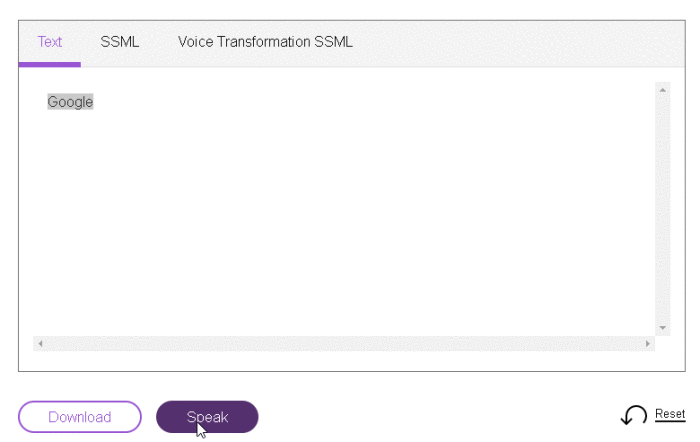
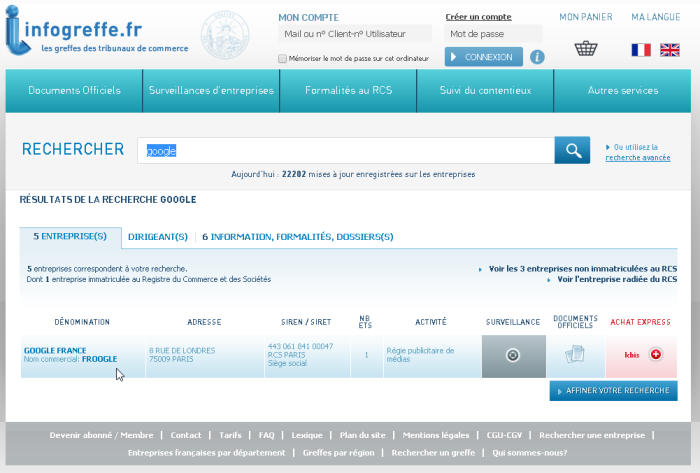
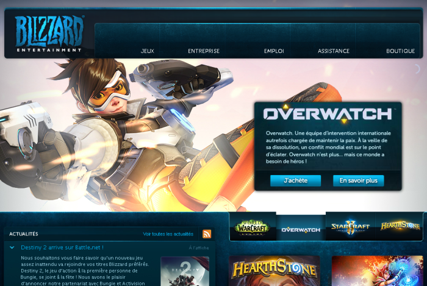
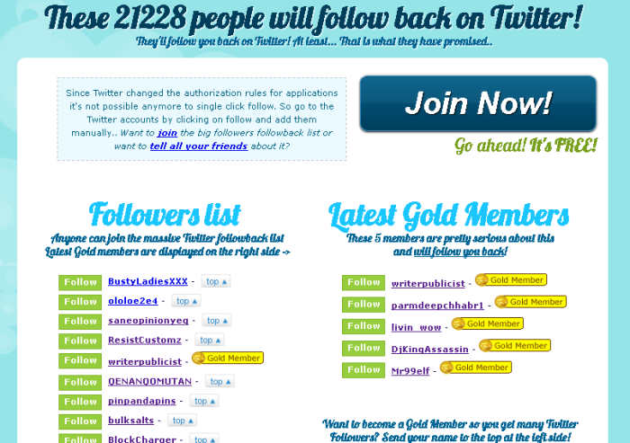
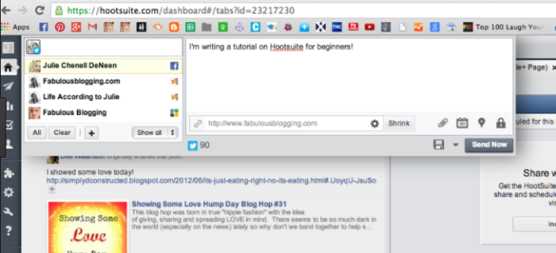
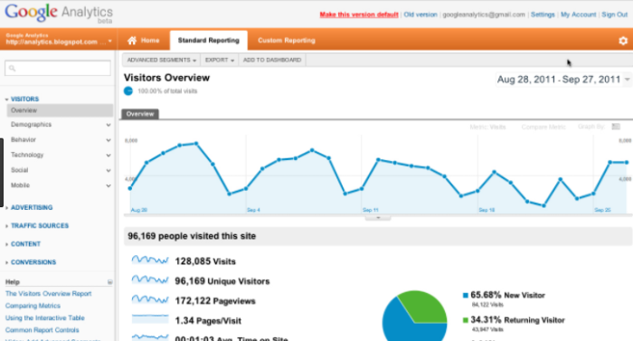
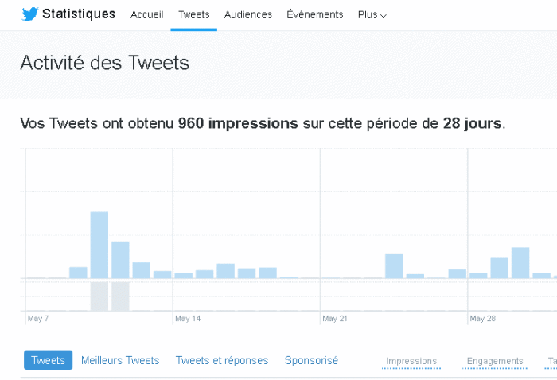

Créer rapidement une marque sur Internet – Nom, Domain, Site, Réseaux, Suivi
======
 

 
Voici un rapide retour sur rendre une idée visible sur Internet. Et comment en faire le suivi, à moindre frais.
 

 

 

 
## Etapes
 
* Construire un nom simple abstrait multilingue
* Verifier la dispo societe domain et reseaux
* Creer un site web acheter le domain creer un site minimaliste
* Ajouter des réseaux Twitter Facebook…
* Publier des actualités MultiPost avec Hootsuite
* Faire le suivi Support et Contact Traffic Reseaux Tendances/Recherches
 
## 1. Construire un nom
 
## Simple
 
Votre nom doit être facile à transmettre > donc facile à épeller, prononcer ou écrir. Pas plus de 3-4 silabes. Pas de tirets ou de points.
 
## Abstrait
 
Votre activité peut évoluer dans le temps > ne pas inclure de terme du domaine métier. Le générer avec un site est une bonne source d’idée
 
[http://www.trouverunnom.com](http://www.trouverunnom.com)
http://www.trouverunnom.com
 

 

 
## Multilingue
 
La langue ne doit pas être une barrière > tester le nom prononcé en Français et Anglais. Vérifier que le nom/mot n’existe pas dans une autre langue.
 
[https://text-to-speech-demo.mybluemix.net/](https://text-to-speech-demo.mybluemix.net/)
https://text-to-speech-demo.mybluemix.net/
 

 

 
## 2. Verifier la dispo
 
C’est très important, car après pas de retour possible!
 
## Societe
 
Eviter tout conflit ultérieur > le nom doit être disponible auprès du registre du commerce.
 
[https://www.infogreffe.fr](https://www.infogreffe.fr)
https://www.infogreffe.fr
 

 

 
Puis faire une demande de création d’entreprise
 
[https://www.insee.fr/fr/information/1401387](https://www.insee.fr/fr/information/1401387)
https://www.insee.fr/fr/information/1401387
 
## Domain et Reseaux
 
Ne pas racheter un domain existant > avoir un nom unique. Eviter le ‘cyber-squatage’ > acheter à minima le .com (.fr, .net sont en option).
 
Accèlerer les tests de noms > utiliser un site dédié de férification
 
[https://www.namecheck.com/search?searchterm=google](https://www.namecheck.com/search?searchterm=google)
https://www.namecheck.com/search?searchterm=google
 
## 
 
## 
 
## 
 
 
 
## 3. Creer un site web
 
## Acheter le domain
 
Le nom doit vous apartenir > souscrire chez un registrar sérieux avec une configuration simple et documentée. Au lieu de passer par wordpress.com et de leur demander de créer le domain.
 
Eviter les surcout > utiliser juste le site perso/static inclus dans l’offre de base domain
 
[https://www.gandi.net/?lang=fr](https://www.gandi.net/?lang=fr)
https://www.gandi.net/?lang=fr
 

 

 
## Creer un site minimaliste
 
Les pages doivent :
 
* être reférencées par les robots > mots clés et arborescence statiques
* s’afficher en miniatures dans les reseaux sociaux > pages statiques
* s’afficher sur tous support et connections > mobile et léger
 
Simple > pages accueil, produits,  contact
 
Utilisateur débutant > générer un site avec l’outil fourni par l’herbergeur
 
Utilisateur avancé > utiliser un moteur de site static comme Jekyll puis copier le résultat en FTP.
 

 

 

 

 
## 4. Ajouter des réseaux
 
Ajouter les prioritaires > Twitter et Facebook
 
 
 
Référencer ces comptes sur la page de votre site.
 
Les autres sont optionnels (Google+,  LinkedIn).
 
 
 
Pour Twitter vous pouvez augmenter votre nombre d’abonnées afin de rendre le compte plus attractif. Il suffit de suivre les comptes de ce site (attention à cibler ces comptes, eviter les comptes offensant ou trop loin de votre activité)
 
[http://www.letsallfollowback.com/](http://www.letsallfollowback.com/)
http://www.letsallfollowback.com/
 

 

 
## 5. Publier des actualités
 
Pas besoin de faire un blog > c’est un surcout et vos actualités ont plus de visibilité sur les reseaux.
 
Ecrire une seule fois vos messages > Eviter de dupliquer vos taches pour chaque réseaux, utiliser un seul point d’entré comme HootSuite qui fera suivre à chaque reseaux.
 
[https://hootsuite.com/](https://hootsuite.com/)
https://hootsuite.com/
 

 

 
## 6. Faire le suivi
 
## Support et Contact
 
Sécurité > éviter d’utiliser l’adresse mail du domain. Elle est plus facilement piratable et vous pouvez perdre votre domaine site. Utilsier GMail
 
Référencer ces adresses sur la page de votre site, mais en ajoutant des espaces pour limiter les spams.
 
## Traffic Site
 
La solution sans frais est Google Traffic > créer un compte > ajouter la balise sur votre site
 
[https://analytics.google.com/a](https://analytics.google.com/a)
https://analytics.google.com/a
 

 

 
## Traffic Réseaux
 
Twitter fournit sa solution.
 
[https://analytics.twitter.com/](https://analytics.twitter.com/)
https://analytics.twitter.com/
 

 

 
## Tendances/Recherches
 
GoogleTrends > ajouter votre <nom> et les termes concurrent ou proches
 
[https://trends.google.fr/](https://trends.google.fr/)
https://trends.google.fr/
 

 

 
## Exemple 1
 
* Société: Gaagle
* Domain: adresses: gaagle.com acheté chez chez gandi.net 20€
* Site: blog fournit par Gandi (moteur DotClear 2)
* Réseaux: Twitter, Facebook Publier avec hootsuite
* Suivi Contact et Support: contact-gaagle@gmail.Com
 
## Exemple 2
 
* Société: Gaagle
* Domain adresses: gaagle.com, gaagle.fr acheté chez chez gandi.net 40€
* Site: page web générée avec Jekyll, copié via FTP
* Réseaux: Twitter, Facebook, LinkedIn, Google+ Publier avec hootsuite Stats avec hootsuite
* Suivi Contact: contact-gaagle@gmail.com Support: support-gaagle@gmail.com Traffic site avec GoogleAnalytics Recherche avec GoogleTrends
 
## Conclusion
 
Bien penser à l’avance le nom et vérifier sa disponibilité sur les différentes plateformes (infogreffe, domain, réseaux), car c’ets impossible à changer ensuite.
 
Créer la societé et réserver le domain et les réseaux le plus tôt possible, sinon vous aurez une source de problème par la suite
 
Avoir dès le début un support/contact et un suivi du traffic. Même si Twittter sert aussi de support.
 
## References
 
[http://1001startups.fr/nom-entreprise/](http://1001startups.fr/nom-entreprise/)
http://1001startups.fr/nom-entreprise/
 
[https://coreight.com/content/outils-pour-automatiser-reseaux-sociaux](https://coreight.com/content/outils-pour-automatiser-reseaux-sociaux)
https://coreight.com/content/outils-pour-automatiser-reseaux-sociaux
 
 
 
 
 
 
## Origin
[https://damienfremont.com/2017/06/04/creer-rapidement-une-marque-sur-internet-nom-domain-site-reseaux-suivi/](https://damienfremont.com/2017/06/04/creer-rapidement-une-marque-sur-internet-nom-domain-site-reseaux-suivi/)
 
