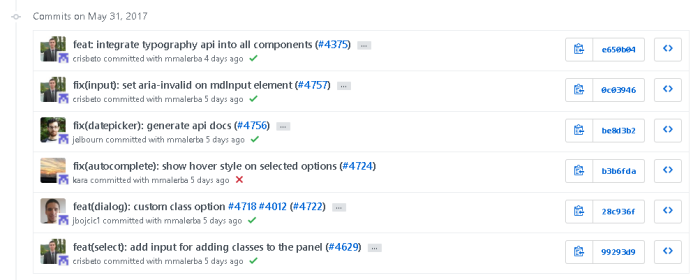

Git – Commit Message Conventions
======
 

 
A quicktip about writing good commit messages. It’s inspired by major open sources projects, like AngularJS.
 

 

 

 
 
 
## Commit Message Conventions
 
```
<type>(<scope>): <subject> (#<task_id>)
<BLANK LINE>
<body>
<BLANK LINE>
```
 
* title (less than 50 chars) type: ‘feat’, ‘doc’, ‘fix’, ‘refactor’, ‘build’ scope: your project task’s scope (one word) subject: the work done id: your task or issue or ticket unique ID
* body (optionnal) details for big tasks
 
 
 
## Examples
 
## 
 
 
 
## Source
 
[https://github.com/DamienFremont/blog/tree/master/20170606-git-commit-message-conventions/](https://github.com/DamienFremont/blog/tree/master/20170606-git-commit-message-conventions/)
https://github.com/DamienFremont/blog/tree/master/20170606-git-commit-message-conventions/
 
 
 
## References
 
[https://github.com/angular/material2/blob/master/CONTRIBUTING.md](https://github.com/angular/material2/blob/master/CONTRIBUTING.md)
https://github.com/angular/material2/blob/master/CONTRIBUTING.md
 
[https://chris.beams.io/posts/git-commit/](https://chris.beams.io/posts/git-commit/)
https://chris.beams.io/posts/git-commit/
 
[https://github.com/angular/material2/commits/master](https://github.com/angular/material2/commits/master)
https://github.com/angular/material2/commits/master
 
 
## Origin
[https://damienfremont.com/2017/06/06/git-commit-message-conventions/](https://damienfremont.com/2017/06/06/git-commit-message-conventions/)
 
