GitHub – Create a Simple Website for your Side Project
======
 

 
In this tutorial, you will see how to generate a website with your existing markdown documentation (like README.md …no need to rewrite everything).
 

 
## Example
 
[http://damienfremont.github.io/blog/](http://damienfremont.github.io/blog/)
http://damienfremont.github.io/blog/
 
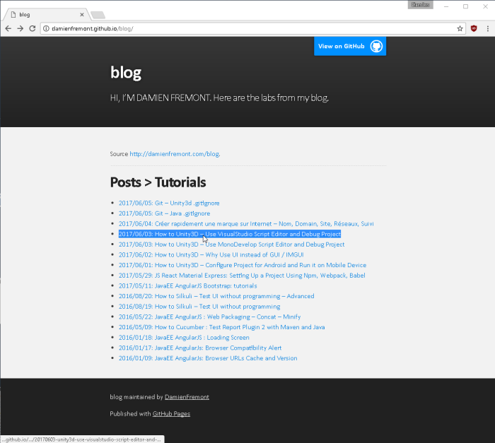
 

 
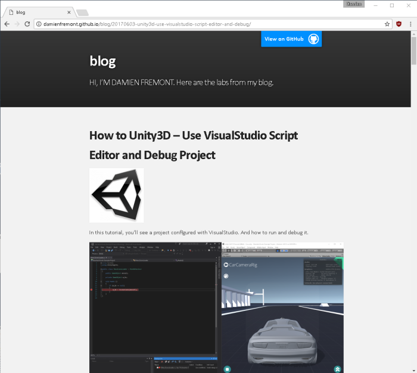
 

 
## Steps
 
* Create or use existing project
* Activate GitHub pages
* Choose a theme
* Write documentation in markdown
* Edit remotely on GitHub
 
 
 
## 1. Create or use existing project
 
You need a project > use your existing side project reposity.
 
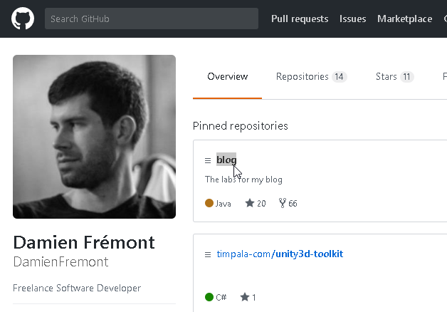
 

 
 
 
## 2. Activate GitHub pages
 
You just need to follow GitHub documentation: activate GitHub pages in repo’s settings > choose a theme.
 
[https://pages.github.com/](https://pages.github.com/)
https://pages.github.com/
 

 

 
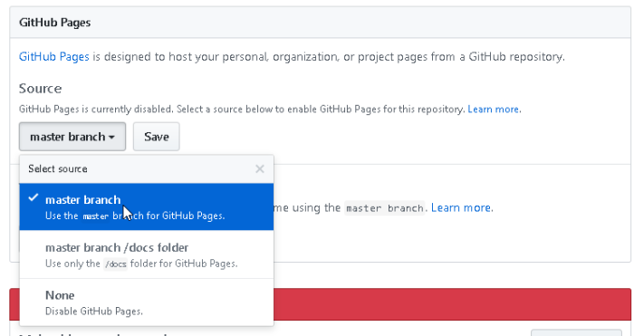
 
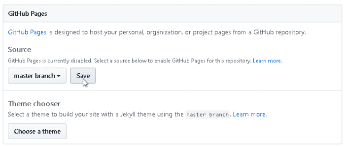
 

 

 

 
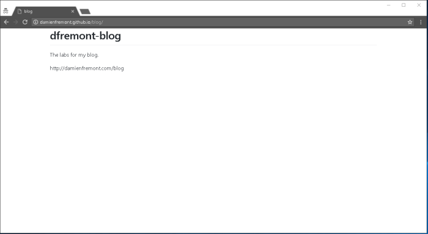
 

 
 
 
## 3. Choose a theme
 
Your project site is not very prety > use Theme chooser in your repo’s settings > choose one > test it.
 
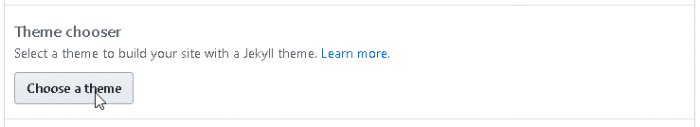
 

 
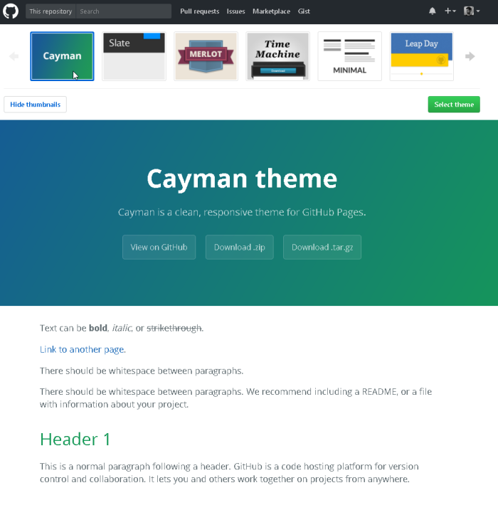
 

 
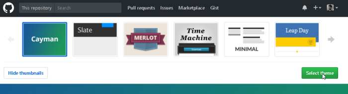
 

 
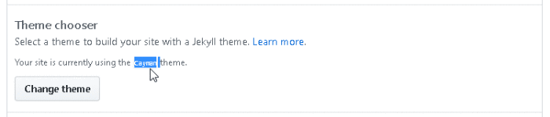
 

 
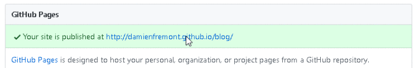
 

 

 

 
 
 
## 4. Write documentation in markdown
 
Your website pages layout start with README.md > after that it’s up to your links in the markdown files.
 
[https://guides.github.com/features/mastering-markdown/](https://guides.github.com/features/mastering-markdown/)
https://guides.github.com/features/mastering-markdown/
 
* create README.md main page
* create subpages
* add link to theses subpages in README.md
 
You can test it locally or onsite (GitHub). Depends of your goal (stable update lifecycle of your website with one-shot push,  or simpler with less tools but more chaotic).
 
 
 
## 5. Edit remotely on GitHub
 
The simplest way is to edit your files with GitHub website (no merge problem, no tools, builtin preview).
 
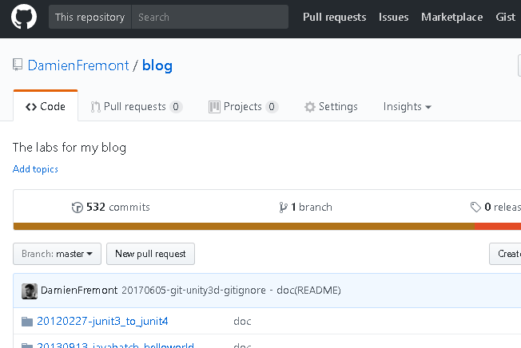
 

 
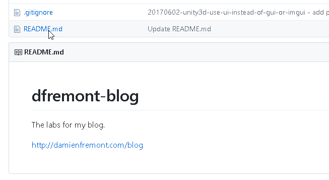
 

 
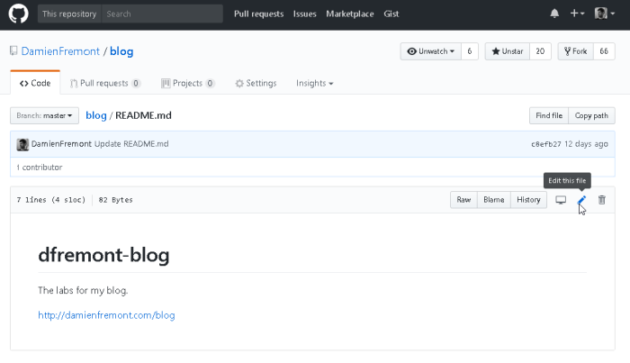
 

 
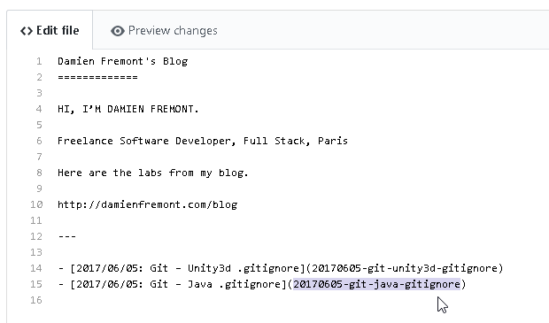
 

 

 

 
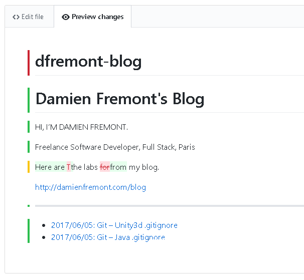
 

 
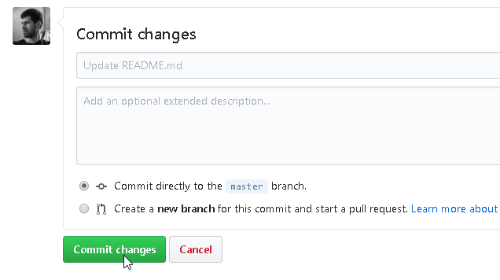
 

 
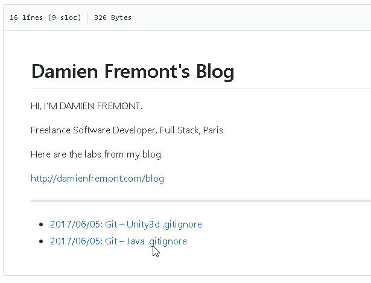
 

 
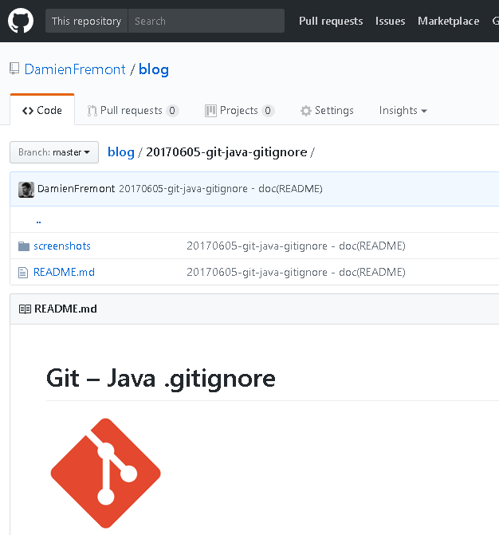
 

 

 

 
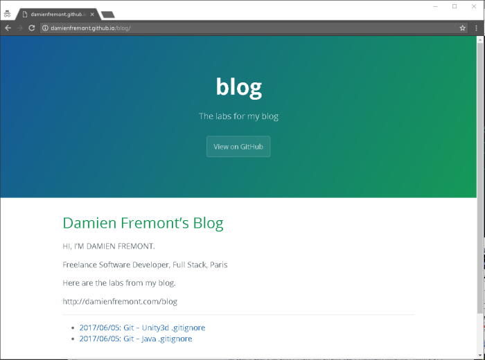
 

 
 
 
## 
 
## Source
 
[https://github.com/DamienFremont/blog/tree/master/20170607-github-create-simple-website](https://github.com/DamienFremont/blog/tree/master/20170607-github-create-simple-website)
https://github.com/DamienFremont/blog/tree/master/20170607-github-create-simple-website
 
## References
 
[https://guides.github.com/features/mastering-markdown/](https://guides.github.com/features/mastering-markdown/)
https://guides.github.com/features/mastering-markdown/
 
[https://pages.github.com/](https://pages.github.com/)
https://pages.github.com/
 
[https://help.github.com/articles/configuring-a-publishing-source-for-github-pages/](https://help.github.com/articles/configuring-a-publishing-source-for-github-pages/)
https://help.github.com/articles/configuring-a-publishing-source-for-github-pages/
 
[https://help.github.com/articles/creating-a-github-pages-site-with-the-jekyll-theme-chooser/](https://help.github.com/articles/creating-a-github-pages-site-with-the-jekyll-theme-chooser/)
https://help.github.com/articles/creating-a-github-pages-site-with-the-jekyll-theme-chooser/
 
 
## Origin
[https://damienfremont.com/2017/06/07/github-create-a-simple-website-for-your-side-project/](https://damienfremont.com/2017/06/07/github-create-a-simple-website-for-your-side-project/)
 
