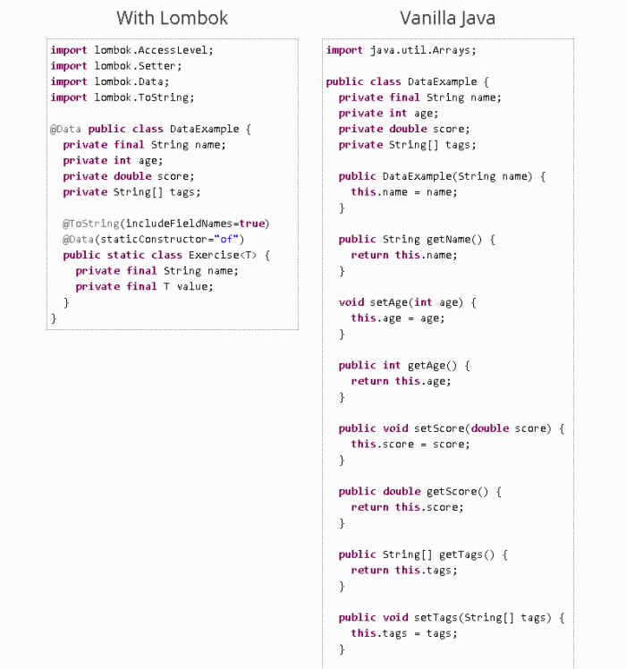
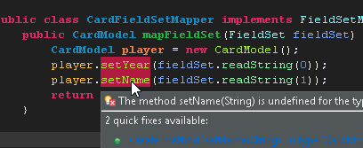
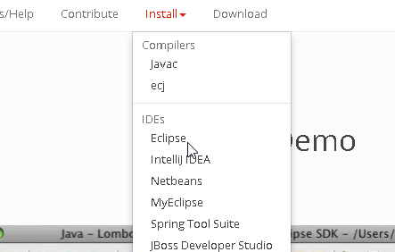
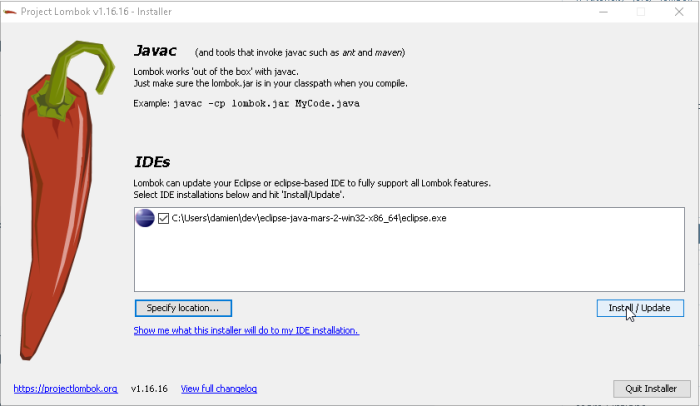
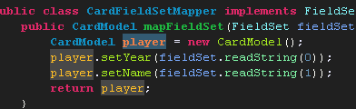
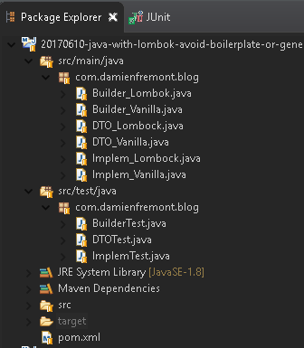
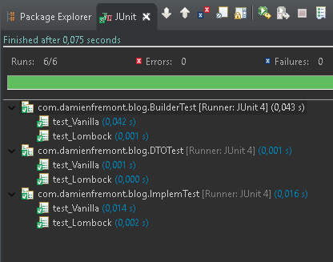

Java with Lombok – Avoid Boilerplate or Generated Code (like GET, SET, CONSTRUCT, COMPARE)
======
 

 
In this tutorial, you will compare the code between a “vanilla” approach (without library) and Lombok. With three classic use-cases: DTO (get, set, toString), Builder, Implementation (arg validation).
 

 

 

 
## Steps
 
* Examples DTO Implementation Builder
* Configure Project (Maven) IDE (Eclipse)
 
## DTO Example
 
Avoid code like get(), set(), toString(), public() by using @Data, @RequiredArgsConstructor, @ToString.
 
DTO_Lombock.java
 
```java
import java.util.Calendar;
import lombok.*;
 
@Data
@ToString(exclude =  {"id"})
@RequiredArgsConstructor
public class DTO_Lombock {
  @NonNull private Long id;
  @NonNull private String firstName;
  @NonNull private String lastName;
           private Calendar birthdate;
}
```
 
DTO_Vanilla.java
 
```java
import java.util.Calendar;
 
public class DTO_Vanilla {
  private Long id;
  private String firstName;
  private String lastName;
  private Calendar birthdate;
 
  public DTO_Vanilla(Long id, String firstName, String lastName) {
    super();
    this.id = id;
    this.firstName = firstName;
    this.lastName = lastName;
  }
 
  @Override
  public String toString() {
    return "DTO_Vanilla(firstName=" + firstName + ", lastName=" + lastName + ", birthdate=" + birthdate + ")";
  }
 
  public Long getId() {
    return id;
  }
 
  public void setId(Long id) {
    this.id = id;
  }
 
  public String getFirstName() {
    return firstName;
  }
 
  public void setFirstName(String firstName) {
    this.firstName = firstName;
  }
 
  public String getLastName() {
    return lastName;
  }
 
  public void setLastName(String lastName) {
    this.lastName = lastName;
  }
 
  public Calendar getBirthdate() {
    return birthdate;
  }
 
  public void setBirthdate(Calendar birthdate) {
    this.birthdate = birthdate;
  }
}
```
 
DTOTest.java
 
```java
import static org.assertj.core.api.Assertions.assertThat;
import org.junit.Test;
 
public class DTOTest {
 
  @Test
  public void test_Vanilla() {
    DTO_Vanilla obj = new DTO_Vanilla(1492L, "Damien", "FREMONT");
 
    assertThat(obj.getId()).isEqualTo(1492L);
    assertThat(obj.getFirstName()).isEqualTo("Damien");
    assertThat(obj.getLastName()).isEqualTo("FREMONT");
 
    assertThat(obj.toString()).isEqualTo("DTO_Vanilla(firstName=Damien, lastName=FREMONT, birthdate=null)");
  }
 
  @Test
  public void test_Lombock() {
    DTO_Lombock obj = new DTO_Lombock(1492L, "Damien", "FREMONT");
 
    assertThat(obj.getId()).isEqualTo(1492L);
    assertThat(obj.getFirstName()).isEqualTo("Damien");
    assertThat(obj.getLastName()).isEqualTo("FREMONT");
 
    assertThat(obj.toString()).isEqualTo("DTO_Lombock(firstName=Damien, lastName=FREMONT, birthdate=null)");
  }
 
}
```
 
## Implementation Example
 
Avoid code like Logger log = …, if(null==…),) by using @Log, @NonNull.
 
Implem_Lombock.java
 
```java
import lombok.*;
import lombok.extern.java.Log;
 
@Log
@RequiredArgsConstructor
public class Implem_Lombock {
  @NonNull private String status;
 
  public String execute(@NonNull String arg) {
    log.info("Execute for arg=" + arg);
    return arg + " " + status;
  }
}
```
 
Implem_Vanilla.java
 
```java
import java.util.logging.Logger;
 
public class Implem_Vanilla {
  private String status;
 
  private final static Logger log = Logger.getLogger(Implem_Vanilla.class.getName());
 
  public Implem_Vanilla(String status) {
    super();
    this.status = status;
  }
 
  public String execute(String arg) {
    if (arg == null)
      throw new NullPointerException("arg");
    log.info("Execute for arg=" + arg);
    return arg + " " + status;
  }
}
```
 
ImplemTest.java
 
```java
import static org.assertj.core.api.Assertions.assertThat;
import org.junit.Test;
 
public class ImplemTest {
 
  @Test
  public void test_Vanilla() {
    Implem_Vanilla obj = new Implem_Vanilla("suffix");
 
    String res = obj.execute("arg");
    assertThat(res).isEqualTo("arg suffix");
 
    try {
      obj.execute(null);
    } catch (NullPointerException e) {
      assertThat(e.getMessage()).contains("arg");
    }
  }
 
  @Test
  public void test_Lombock() {
    Implem_Lombock obj = new Implem_Lombock("suffix");
 
    String res = obj.execute("arg");
    assertThat(res).isEqualTo("arg suffix");
 
    try {
      obj.execute(null);
    } catch (NullPointerException e) {
      assertThat(e.getMessage()).contains("arg");
    }
  }
}
```
 
## Buidler Example
 
The builder pattern implementation.
 
Builder_Lombock.java
 
```java
import java.util.Calendar;
import lombok.*;
 
@Builder
@Getter
public class Builder_Lombok {
  private Long id;
  private String firstName;
  private String lastName;
  private Calendar birthdate;
}
```
 
Builder_Vanilla.java
 
```java
public class Builder_Vanilla {
  private Long id;
  private String firstName;
  private String lastName;
 
  public Long getId() {
    return id;
  }
 
  public void setId(Long id) {
    this.id = id;
  }
 
  public String getFirstName() {
    return firstName;
  }
 
  public void setFirstName(String firstName) {
    this.firstName = firstName;
  }
 
  public String getLastName() {
    return lastName;
  }
 
  public void setLastName(String lastName) {
    this.lastName = lastName;
  }
 
  public static Builder builder() {
    return new Builder();
  }
 
  public static class Builder {
    private Builder_Vanilla obj;
 
    public Builder() {
      obj = new Builder_Vanilla();
    }
 
    public Builder id(Long arg) {
      obj.id = arg;
      return this;
    }
 
    public Builder firstName(String arg) {
      obj.firstName = arg;
      return this;
    }
 
    public Builder lastName(String arg) {
      obj.lastName = arg;
      return this;
    }
 
    public Builder_Vanilla build() {
      return obj;
    }
  }
 
}
```
 
BuilderTest.java
 
```java
import static org.assertj.core.api.Assertions.assertThat;
import org.junit.Test;
 
public class BuilderTest {
 
  @Test
  public void test_Vanilla() {
    Builder_Vanilla obj = Builder_Vanilla.builder() //
        .id(1492L) //
        .firstName("Damien") //
        .lastName("FREMONT") //
        .build();
 
      assertThat(obj.getId()).isEqualTo(1492L);
      assertThat(obj.getFirstName()).isEqualTo("Damien");
      assertThat(obj.getLastName()).isEqualTo("FREMONT");
  }
 
  @Test
  public void test_Lombock() {
    Builder_Lombok obj = Builder_Lombok.builder() //
        .id(1492L) //
        .firstName("Damien") //
        .lastName("FREMONT") //
        .build();
 
      assertThat(obj.getId()).isEqualTo(1492L);
      assertThat(obj.getFirstName()).isEqualTo("Damien");
      assertThat(obj.getLastName()).isEqualTo("FREMONT");
  }
 
}
```
 
## Configure Project (Maven)
 
Add Lombok dependency to you Maven project config.
 
pom.xml
 
```xml
<project ...>
...
  <dependencies>
    <dependency>
      <groupId>org.projectlombok</groupId>
      <artifactId>lombok</artifactId>
      <version>1.16.16</version>
    </dependency>
...
```
 
## Configure IDE (Eclipse)
 
You need to add a plugin to your IDE, because the compilation-validator and autocomplete won’t work (Lombok generate code during compilation time, too soon for your IDE).
 
Go to official website, choose your IDE, then follow instructions.
 

 

 
[https://projectlombok.org/](https://projectlombok.org/)
https://projectlombok.org/
 

 

 
[https://projectlombok.org/setup/eclipse](https://projectlombok.org/setup/eclipse)
https://projectlombok.org/setup/eclipse
 

 

 

 

 
## Project
 

 

 

 

 
## Source
 
[https://github.com/DamienFremont/blog/tree/master/20170610-java-with-lombok-avoid-boilerplate-or-generated-code](https://github.com/DamienFremont/blog/tree/master/20170610-java-with-lombok-avoid-boilerplate-or-generated-code)
https://github.com/DamienFremont/blog/tree/master/20170610-java-with-lombok-avoid-boilerplate-or-generated-code
 
## References
 
[https://projectlombok.org/download](https://projectlombok.org/download)
https://projectlombok.org/download
 
[https://projectlombok.org/setup/eclipse](https://projectlombok.org/setup/eclipse)
https://projectlombok.org/setup/eclipse
 
[https://projectlombok.org/features/all](https://projectlombok.org/features/all)
https://projectlombok.org/features/all
 
 
## Origin
[https://damienfremont.com/2017/06/10/java-with-lombok-avoid-boilerplate-or-generated-code-like-get-set-construct-compare/](https://damienfremont.com/2017/06/10/java-with-lombok-avoid-boilerplate-or-generated-code-like-get-set-construct-compare/)
 
