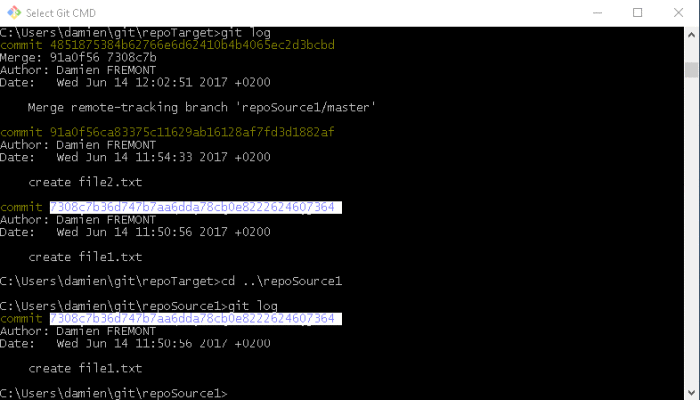
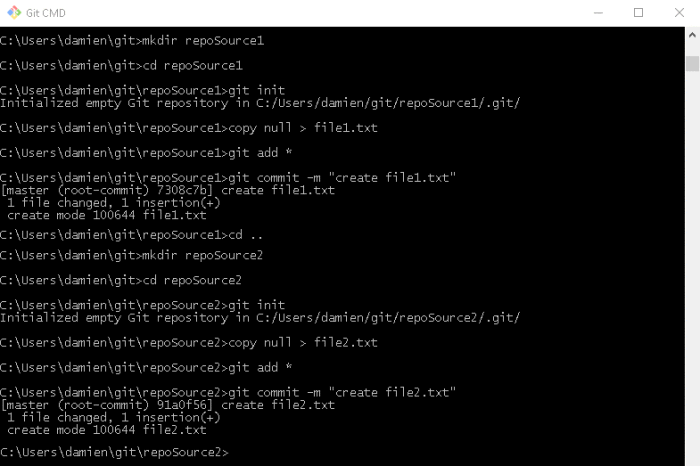
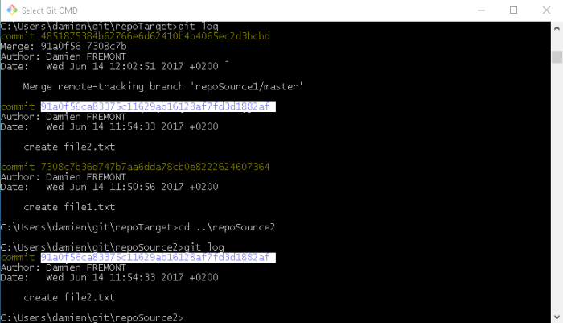

Git – Merge Repositories Without Losing Commit History
======
 

 
Sometimes, you need to merge multiples repos, but you don’t want to loose your commit history. In this tutorial, it’s basically repoSource1 + repoSource2 = repoTarget.
 

 
 
 

 

 
## Steps
 
* Create source repoSource1, 2 (optionnal)
* Check existing history on repoSource1, 2
* Merge repoSource1, 2, to repoTarget
* Check history on repoTarget
 
## 1. Create repos 1, 2 (optionnal)
 
In GIT command line > create repo : create folder > init git > add commit: create file > add to git > commit.
 
```
cd git
mkdir repoSource1
cd repoSource1
git init
copy null > file1.txt
git add *
git commit -m "create file1.txt"
```
 
```
cd git
mkdir repoSource2
cd repoSource2
git init
copy null > file2.txt
git add *
git commit -m "create file2.txt"
```
 
 
 
 
 

 

 
## 2. Check histories on existing repos
 
In GIT command line > repo 1 > git log > repo 2 > git log.
 
```
cd git/repoSource1
git log
```
 
```
cd git/repoSource2
git log
```
 

 

 
## 3. Merge repos 1, 2, to repo 3
 
In GIT command line > create target repo > add remote repo > merge > repeat…
 
```
cd git
mkdir repoTarget
cd repoTarget
git init
 
git remote add repoSource2 ..\repoSource2
git fetch repoSource2
git merge repoSource2/master --allow-unrelated-histories
 
git log
 
git remote add repoSource1 ..\repoSource1
git fetch repoSource1
git merge repoSource1/master --allow-unrelated-histories
 
git log
```
 

 

 
## 4. Compare histories between repos
 
In GIT command line > for each repo: > git log > compare commit hash code and date
 
```
cd git\repoTarget
git log
 
cd ..\repoSource1
git log
 
cd ..\repoSource2
git log
```
 

 

 

 

 
## Conclusion
 
With this method, commit history and order (by date) is preserved.
 
## Source
 
[https://github.com/DamienFremont/blog/tree/master/20170614-git-merge-repositories-without-losing-commit-history](https://github.com/DamienFremont/blog/tree/master/20170614-git-merge-repositories-without-losing-commit-history)
https://github.com/DamienFremont/blog/tree/master/20170614-git-merge-repositories-without-losing-commit-history
 
## References
 
[Merging Two Git Repositories Into One Repository Without Losing File History](https://saintgimp.org/2013/01/22/merging-two-git-repositories-into-one-repository-without-losing-file-history/)
Merging Two Git Repositories Into One Repository Without Losing File History
 
[http://stackoverflow.com/questions/26502970/merge-multiple-git-repositories-into-one-keeping-branches-history](http://stackoverflow.com/questions/26502970/merge-multiple-git-repositories-into-one-keeping-branches-history)
http://stackoverflow.com/questions/26502970/merge-multiple-git-repositories-into-one-keeping-branches-history
 
 
## Origin
[https://damienfremont.com/2017/06/14/git-merge-repositories-without-losing-commit-history/](https://damienfremont.com/2017/06/14/git-merge-repositories-without-losing-commit-history/)
 
