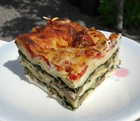

Food - Lasagnes végétariennes (rapide et allégé)
======
 

 

Lasagnes légères aux champignons, épinards et emmental.

Pour 8 personnes, Très facile, Bon marché, Préparation 15 min, Cuisson 40 min

---

## Ingrédients (8 personnes)

- 20 feuilles de lasagnes (1 boite)
- 800g champignons eminces (2 conserves 800g)
- 600g épinards hachés (1 boite surgelée)
- 400g gruyère  (2 sachets)
- 500g fromage blanc (1/2 pot)
- 50g farine
- 3 tomates
- Poivre (1/2 cuillère café)
- Ail en poudre (1 cuillère café)
- Sel (1/4 cuillère café)

---

## Préparation

### Etape 1: Préparation

Pour les épinards: lancer la décongélation (8 minutes). 
Pour les champignons: égoutter (entrouvrir puis retourner la boite de conserve). 
Pour la cuisson (si four): préchauffage à 180°C

### Etape 2: Préparation Sauce

Pour la béchamel : verser fromage blanc dans saladier/bol, ajouter la farine, poivrer (1/4 cuillère café), ajouter 1/2 verre eau pour consistance crème

### Etape 3: Préparation Légumes

Pour les champignons: disposer dans une assiette, mettre l'ail en poudre, poivrer (1/4 cuillère café), melanger
Pour les tomates: couper en petits morceaux (2 cm)

### Etape 4: 1ère couche du plat

Disposer dans l'ordre: beurrer/huiler le plat (optionnel), béchamel  (1/5 du total)

### Etape 5: Couches intermédiaires

Disposer dans l'ordre et aplanir avec une fourchette: feuilles de lasagnes (2 couches), béchamel  (1/5 du total), champignons (1/3 du total), épinards (1/3 du total), emmental (1/4 du total)
Répéter 3 fois.

### Etape 6: Dernière couche

Disposer dans l'ordre et finir: béchamel, tomates, emmental

### Etape 7: Cuire

AU micro-onde/grill: puissance 60% + grill, 35 minutes ...ou au four: 180°C + grill haut, 40 minutes

---

## Remarques

Vérifier la cuisson en plantant un couteau propre dans le plat. Servir si le couteau ressort sec et que la pate est tendre.

## Boisson conseillée

Vin blanc sec (Entre-deux-mer, Côtes du Rhône blanc, Chinon blanc, Chablis, Anjou blanc)
 
---

## Origin

http://www.750g.com/lasagnes-vegetariennes-rapide-et-allege-r202828.htm

https://github.com/DamienFremont/blog/tree/master/20170820-food-lasagnes_vegetariennes_rapide_et_allege

http://damienfremont.com/2017/08/20/food-lasagnes-vegetariennes-rapide-et-allege/