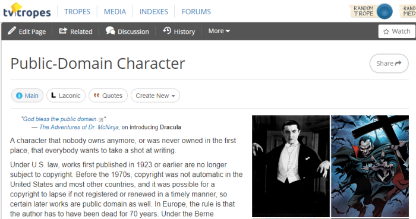
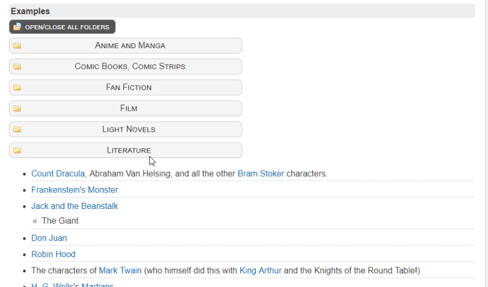
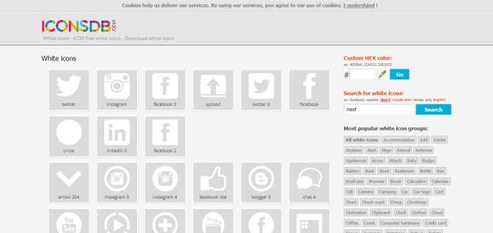
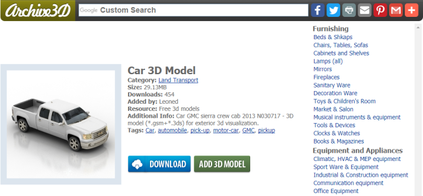
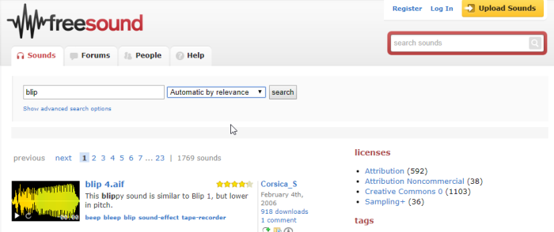
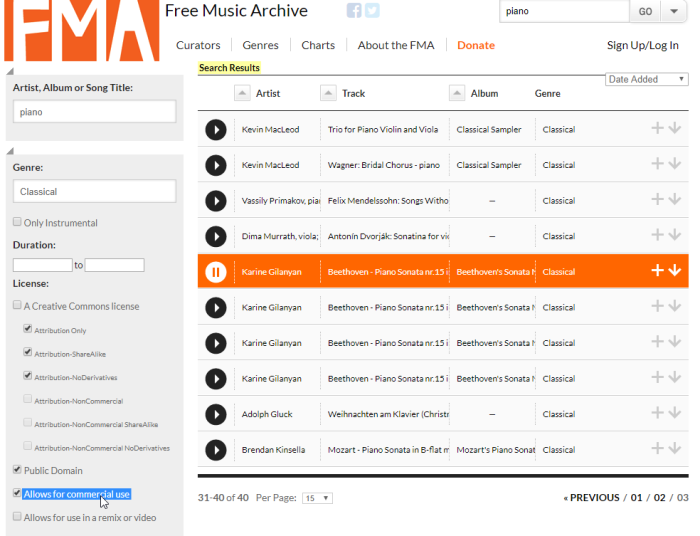

IndieGame – Free Resources and Materials
======
 

 
Here are some search engines and archive websites to get free, Unity3d-ready, resources.
 
* Universe/Charcaters
* Icons
* Pictures
* 3D Models
* Sound
* Music
* Softwares
 
## Universe/Characters
 
Get free characters and stories from public domain (yes it’s old stuff, like more than 100 years ago) …don’t forget to check the list at the bottom of the page.
 
[http://tvtropes.org/pmwiki/pmwiki.php/Main/PublicDomainCharacter](http://tvtropes.org/pmwiki/pmwiki.php/Main/PublicDomainCharacter)
http://tvtropes.org/pmwiki/pmwiki.php/Main/PublicDomainCharacter
 

 

 

 

 
## Icons
 
Use the white ones to be able to change their color in Unity3D.
 
[http://www.iconsdb.com/white-icons/](http://www.iconsdb.com/white-icons/)
http://www.iconsdb.com/white-icons/
 

 

 
## Pictures
 
[https://www.pexels.com/public-domain-images/](https://www.pexels.com/public-domain-images/)
https://www.pexels.com/public-domain-images/
 

 

 
## 3D Models
 
[https://archive3d.net/](https://archive3d.net/)
https://archive3d.net/
 

 

 
## Sounds
 
[https://freesound.org/browse/tags/sound-effects/](https://freesound.org/browse/tags/sound-effects/)
https://freesound.org/browse/tags/sound-effects/
 

 

 
## Music
 
Use only “Commercial Use”.
 
[http://freemusicarchive.org/search/](http://freemusicarchive.org/search/)
http://freemusicarchive.org/search/
 

 

 
## Softwares
 
To make the stuff you can’t found free!
 
* GameEngine: Unity3D
* Icon: InkSkape
* Pictures: Gimp, MagicaVoxel
* 3D Models: Blender
* Sound: Audacity
* Music: Reaper
 
## Source
 
[https://github.com/DamienFremont/blog/tree/master/20170927-indiegame-free-resources-and-materials](https://github.com/DamienFremont/blog/tree/master/20170927-indiegame-free-resources-and-materials)
https://github.com/DamienFremont/blog/tree/master/20170927-indiegame-free-resources-and-materials
 
 
## Origin
[https://damienfremont.com/2017/09/27/indiegame-free-resources-and-materials/](https://damienfremont.com/2017/09/27/indiegame-free-resources-and-materials/)
 
