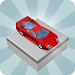
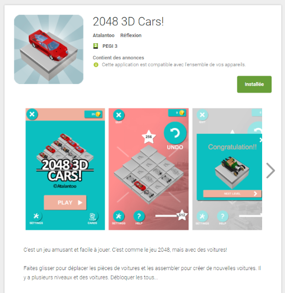
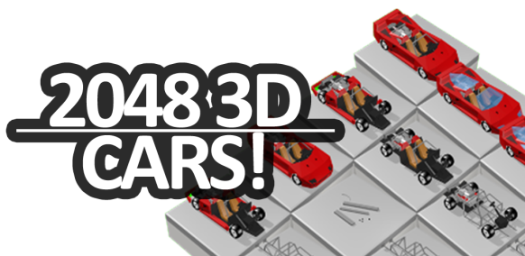
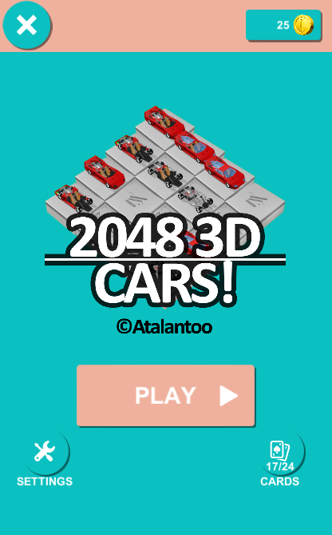
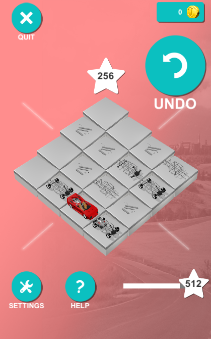
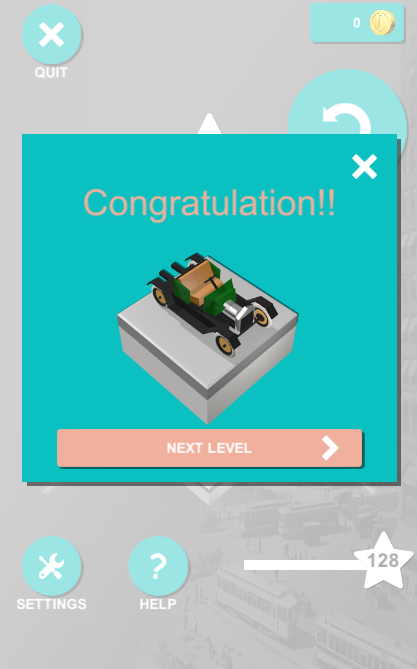
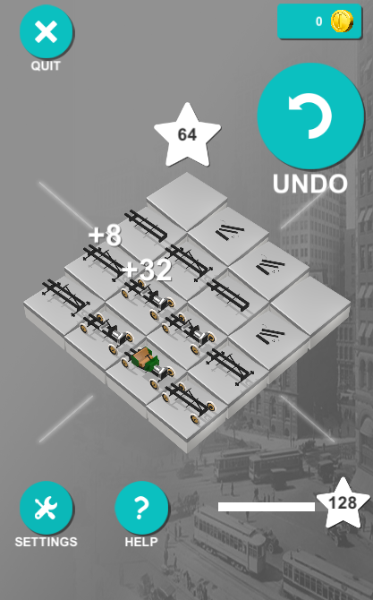

New App – 2048 3D Cars!
======
 
[GooglePlay](https://play.google.com/store/apps/details?id=com.atalantoo.game20483dcars)
[GooglePlay link here](https://play.google.com/store/apps/details?id=com.atalantoo.game20483dcars)
Hello, my new puzzle game ‘2048 3D Cars!’ is out now on GooglePlay! #indiegame #madewithunity (GooglePlay link here).
 

 

 

 
 
 
2048 3D Cars! is a fun and easy to play puzzle game. It’s like the 2048 game, but with cars!
 
This game was created because 2048 is awesome, but numbers are a little boring.
 
* Swipe to move the cars parts and assemble them to create new cars.
* There are multiple levels and cars. Unlock them all…
 

 

 
## Links
 
[https://play.google.com/store/apps/details?id=com.atalantoo.game20483dcars](https://play.google.com/store/apps/details?id=com.atalantoo.game20483dcars)
https://play.google.com/store/apps/details?id=com.atalantoo.game20483dcars
 
[http://atalantoo.com/2048-3d-cars/](http://atalantoo.com/2048-3d-cars/)
http://atalantoo.com/2048-3d-cars/
 
[https://connect.unity.com/p/2048-3d-cars](https://connect.unity.com/p/2048-3d-cars)
https://connect.unity.com/p/2048-3d-cars
 
## Screenshots
 

 

 

 

 

 

 

 
 
 
## Source
 
[https://github.com/DamienFremont/blog/tree/master/20171002-new-app-2048-3d-cars](https://github.com/DamienFremont/blog/tree/master/20171002-new-app-2048-3d-cars)
https://github.com/DamienFremont/blog/tree/master/20171002-new-app-2048-3d-cars
 
 
## Origin
[https://damienfremont.com/2017/10/02/new-app-2048-3d-cars/](https://damienfremont.com/2017/10/02/new-app-2048-3d-cars/)
 
